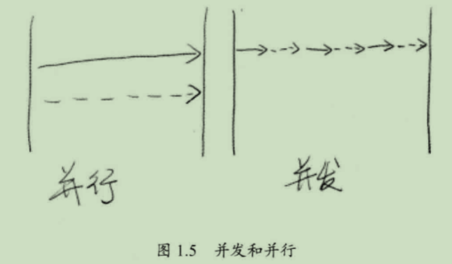

# Java 并发编程

---

# 第1章 引入

## 1.1 基本概念

### 1.1.1 同步与异步

同步（Synchronous）和异步（Asynchronous）通常用来形容一次方法调用。

| Synchronous                                                  | Asynchronous                                                 |
| ------------------------------------------------------------ | ------------------------------------------------------------ |
| 同步方法调用后，调用者必须等到方法的返回结果，才能进行后续的工作。 | 异步方法调用后，调用者无需等待方法返回结果，只要通知到尾，马上进行后续的工作。 |

异步方法更像是一种消息传递，异步方法通常会由另外一个线程执行，整个过程不会阻塞调用者的工作。

个人理解：

-   同步方法调用：食堂打包（点餐后等待食堂阿姨完成打包工作）
-   异步方法调用：外卖（点餐后该干嘛干嘛，最后外卖小哥会电话通知）

### 1.1.2 并发与并行

并发（Concurrency）和并行（Parallelism）都可以用来表述多个任务的执行，但侧重点略有不同：

-   并发：侧重多个任务交替执行，可能是串行执行。
-   并行：真正意义上的“同时执行”，真实的并行只存在于多核系统。

由于并发和并行的最终效果可能是一样的（单核系统），所以如非必要，不用特别强调2者的区别。

### 1.1.3 临界区

临界区是对某种特定共享资源的表示——所有线程都有权力使用临界区资源，但一次只能提供给一个线程使用。临界区资源被占用的时候，其他想用的线程要么等待，要么放弃（就像公共厕所）。

### 1.1.4 阻塞与非阻塞

阻塞：不达目的不罢休、不撞南墙不回头

非阻塞：浅尝则止

### 1.1.5 死锁、饥饿、活锁

死锁、饥饿、活锁都属于多线程的活跃性问题。如果发现上述情况，说明相关线程可能不再活跃，也就是说线程很难再继续进行下去。

-   死锁：仅容1人通过的通道从两端进来了A和B，两人互不退让，站死在里面。

-   饥饿：体弱，抢到资源的概率低

-   活锁：你和行人的默契——你往左移，他往右移；你往又移，他往左移……都想让步，但依然冲突

## 1.2 并发等级

### 1.2.1 阻塞

### 1.2.2 无饥饿

### 1.2.3 无障碍

### 1.2.4 无锁

### 1.2.5 无等待

## 1.3 JMM

### 1.3.1 原子性

### 1.3.2 可见性

### 1.3.3 有序性

### 1.3.4 那些指令不能重排：Happen-Before原则

# 第2章 Java 并发编程基础

## 2.1 基础

### 2.1.1 进程与线程

### 2.1.2 Thread.State

## 2.2 线程的基本操作

### 2.2.1 新建线程

### 2.2.2 终止线程

### 2.2.3 中断线程

### 2.2.4 等待和通知

### 2.2.5 挂起和继续

### 2.2.6 等待线程结束和谦让

## 2.3 volatile 和 JMM

## 2.4 分门别类的管理线程：线程组

## 2.5 驻守后台：守护线程

## 2.6 线程优先级

## 2.7 线程安全概念与synchronized

## 2.8 隐蔽的错误

# 第3章 JDK 并发包

## 3.1 线程协作：同步控制

### 3.1.1 synchronized的功能拓展：重入锁

### 3.1.2 重入锁的好搭档：Condition条件

### 3.1.3 允许多个线程同时访问：信号量

### 3.1.4 读写锁：ReadWriteLock

### 3.1.5 倒计时器：CountDownLatch

### 3.1.6 循环栅栏：CyclicBarrier

### 3.1.7 线程阻塞工具类：LockSupport

## 3.2 线程复用：线程池

### 3.2.1 什么是线程池

### 3.2.2 线程轮子：JDK对线程池的支持

### 3.2.3 刨根究底：核心线程池的内部实现

### 3.2.4 超负载了怎么办：拒绝策略

### 3.2.5 自定义线程创建：ThreadFactory

### 3.2.6 我的应用我做主：扩展线程池

### 3.2.7 合理的选择：优化线程池线程数量

### 3.2.8 堆栈去哪了：在线程池中寻找堆栈

### 3.2.9 分而治之：Fork/Join框架

## 3.3 现成轮子：JDK的并发容器

### 3.3.1 超好用的工具类：并发集合简介

### 3.3.2 线程安全的HashMap

### 3.3.3 有关List的线程安全

### 3.3.4 高效读写的队列：深度剖析ConcurrentLinkedQueue

### 3.3.5 高效读取：不变模式下的CopyOnWriteArrayList

### 3.3.6 数据共享通道：BlockingQueue

### 3.3.7 随机数据结构：跳表（SkipList）

# 第4章 锁的优化及注意事项

## 4.1 有助于提高“锁”性能的几点建议

### 4.1.1 减小锁的持有时间

### 4.1.2 减小锁的粒度

### 4.1.3 用读写分离锁替换独占锁

### 4.1.4 读分离

### 4.1.5 锁粗化

## 4.2 Java虚拟机对锁优化所做的努力

### 4.2.1 锁偏向

### 4.2.2 轻量级锁

### 4.2.3 自旋锁

### 4.2.4 锁消除

## 4.3 人手一支笔：ThreadLocal

### 4.3.1 简单使用

### 4.3.2 实现原理

### 4.3.3 对性能有何帮助？

## 4.4 无锁

### 4.4.1 与众不同的并发策略：比较交换（CAS）

### 4.4.2 无锁的线程安全整数：AtomicInteger

### 4.4.3 Java中的指针：Unsafe类

### 4.4.4 无锁的对象引用：AtomicReference

### 4.4.5 带有时间戳的对象引用：AtomicStampedReference

### 4.4.6 数组也能无锁：AtomicIntegerArray

### 4.4.7 让普通变量也能享受原子操作：AtomicIntegerFieldUpdater

### 4.4.8 挑战无锁算法：无锁的Vector实现

### 4.4.9 让线程之间互相帮助：细看SynchronousQueue的实现

## 4.5 有关死锁的问题

# 第5章 并发模式与算法

# 第6章 Java 8 与并发

