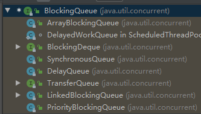
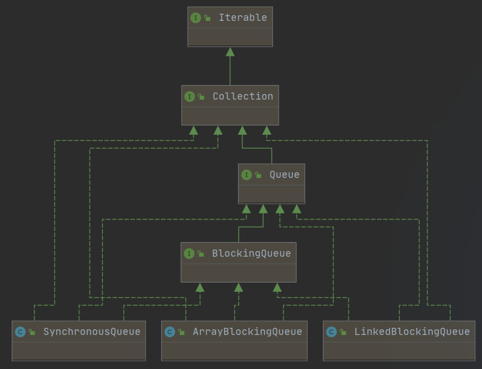

# 线程池配置

[toc]


## 一、ThreadPoolExecutor 构造方法

```java
public ThreadPoolExecutor(int corePoolSize,
                          int maximumPoolSize,
                          long keepAliveTime,
                          TimeUnit unit,
                          BlockingQueue<Runnable> workQueue,
                          ThreadFactory threadFactory,
                          RejectedExecutionHandler handler) {...}
```


## 二、ThreadPoolExecutor 重要参数

### 1、corePoolSize

`corePoolSize` 表示线程池在空闲时间将保留多少个线程

-   一般情况下，如果线程数 <= `corePoolSize`，那么即使线程是空闲的，线程池也不会销毁线程

-   如果线程数 < `corePoolSize`，即使存在空闲的线程，线程池也会优先创建新的线程来执行任务

>   PS： 把线程池看作一个事业单位，`corePoolSize` 相当于编制数 —— 即使没事干也不能随便开除


### 2、maximumPoolSize

`maximumPoolSize` 表示线程池中允许存在的最大线程数

-   当 `workQueue` 已满，且当前线程数 < `maximumPoolSize`：线程池创建新线程来处理任务

-   当 `workQueue` 已满，且当前线程数 = `maximumPoolSize`：线程池执行配置的 `handler`

>   PS：把线程池看作一个事业单位，`maximumPoolSize` 相当于允许的最大人员数 —— 允许扩充 (`maximumPoolSize` - `corePoolSize`) 个外包人员，一旦没事干了就裁掉……


### 3、workQueue

如果当前线程数 > `corePoolSize`，新提交的任务将被暂存到 `workQueue`


### 4、keepAliveTime & unit

`keepAliveTime`表示允许线程空闲的最大时间，`unit`表示时间的单位（毫秒、秒…）

-   如果当前线程数 > `corePoolSize`，线程池会将空闲时间超过 `keepAliveTime` 的空闲线程销毁，直到池中线程数等于 `corePoolSise`
-   如果 `allowCoreThreadTimeout` 参数被设置为 true（默认为 false），线程池将无视 `corePoolSize`，销毁所有长时间空闲的线程。


### 5、threadFactory

`ThreadFactory` 是一个 `FunctionalInterface`，线程池调用其 newThread 方法来创建线程

```java
@FunctionalInterface
public interface ThreadFactory {
    Thread newThread(Runnable r);
}
```

-   Executors 工具类中提供了一些实现好的 ThreadFactory，可以直接使用

    

-   也可以自己实现 ThreadFactory 来定制一些功能，例如日志


### 6、handler

当 `workQueue` 已满，且线程数 = `maximumPoolSize`，此时线程池调用配置的 `hadler` 进行处理。

-   `RejectedExecutionHandler` 是一个 `FunctionalInterface`：

    ```java
    @FunctionalInterface
    public interface RejectedExecutionHandler {
        void rejectedExecution(Runnable r, ThreadPoolExecutor executor);
    }
    ```

-   `ThreadPoolExecutor` 中内置了几种实现：

    


## 三、ThreadPoolExecutor 配置指南

### 1、线程池大小 - corePoolSize & maximumPoolSize

#### 1.1 粗略配置

通常情况下，线程池的配置是一个复杂的工作，想要合理的配置线程池，应该从多个角度对任务进行分析：

1.  任务的性质：CPU密集型、IO密集型、混合型
2.  任务的优先级：高、中、低
3.  任务的执行时间：长、中、短
4.  任务的依赖性：是否依赖其他系统资源，例如数据库连接

对于性质不同的任务，可以使用不同规模的线程池分开处理：

-   CPU密集型任务：配置尽可能少的线程，如（CPU数 + 1）
-   IO密集型任务：配置尽可能多的线程，如（2 * CPU数）
-   混合型任务：如果可以拆分，则将其拆分成一个CPU密集型任务和一个IO密集型任务，只要这两个任务执行的时间相差不是太大，那么分解后执行的吞吐率要高于串行执行的吞吐率，如果这两个任务执行时间相差太大，则没必要进行分解。

>   Note：如果获得当前设备的CPU数？
>
>   ```java
>   Runtime.getRuntime().availableProcessors()
>   ```

对于执行时间不同的任务，可以使用不同规模的线程池分开处理，或者也可以使用优先级队列，让执行时间短的任务先执行。

对于依赖其他系统资源的任务，需要视情况决定，例如，依赖数据库连接池的任务，由于线程提交 SQL 后需要等待数据库处理 SQL 并返回结果，等待的时间越长 CPU 空闲的时间越长，那么线程数就应该设置大一些，这样才能充分利用 CPU

通常，上述配置方式是比较粗略的，如果需要更加精确的进行配置，可以参照 Little 法则。

#### 1.2 精确配置 - Little 法则

参考文章：http://www.infoq.com/cn/articles/Java-Thread-Pool-Performance-Tuning

#### 1.3 配置文件

线程池的配置与系统资源息息相关，在A设备上的最优配置到了B设备设备就不见得还是最优配置，因此，比较好的处理方式是将配置信息外移到配置文件，这样可以根据设备情况灵活的调整配置。

### 2、工作队列 - workQueue


workQueue 用于转移和暂存提交的任务，workQueue 依据 corePoolSize 和 maximumPoolSize 进行工作：

1.  当池中线程数小于 corePoolSize，线程池直接创建新线程处理任务
2.  当池中线程数大等于 corePoolsize，而 workQueue 还未满，则先将任务暂存到 workQueue，一旦出现空闲的线程，就会把 workQueue 中的任务拿出来处理
3.  当 workQueue 已经装满未处理的任务，如果此时池中线程数小于 maxPoolSize，线程池直接创建新线程处理新提交的任务；如果此时池中线程数等于 maxPoolSize，线程池根据 handle 处理新提交的任务


JDK 提供的多种队列：



常用的任务队列：



-   直接队列 -`SynchronousQueue`

    SynchronousQueue 是一种特殊的队列，它的特别之处在于它的内部没有容器，换句话说，<u>它从一开始就是满的</u>。如果选择了 SynchronoutQueue ，线程池实际上相当于没有地方暂存任务，一旦线程数达到 corePoolsize，如果再接收到新任务只能马上创建新线程处理（假设当前没有空闲线程，且线程数小于 maximumPoolSize）


-   有界队列 - `ArrayBlockingQueue`

    从名字可以看出，ArrayBlockingQueue 是基于数组实现的，因此它的容量是有限的，换句话说 ArrayBlockingQueue 是会被填满的。当 ArrayBlockingQueue 被填满，且池中线程数达到 maximumPoolsize，此时在收到新提交的任务线程池将执行 handle


-   无界队列 -`LinkedBlockingQueue`

    从名字可以看出，LinkedBlockingQueue 是基于链表实现的，因此它的容量是“无限”的，因此可能导致<font color  = red>内存溢出</font>

    >   Note：理论上是无限的，但由于记录队列长度使用的是 Int，所以最大长度应该是 Integer.MAX_VALUE

### 3、饱和策略 - handler

JDK 自带的饱和策略：

-   ThreadPoolExecutor.AbortPolicy

    丢弃任务，并抛出异常（RejectedExecutionException ）。必须处理好抛出的异常，否则会打断当前的执行流程，影响后续的任务执行

    

-   ThreadPoolExecutor.CallerRunsPolicy

    如果线程池没有关闭，则使用调用线程直接运行任务。一般并发比较小，性能要求不高，不允许失败。但是，由于调用者自己运行任务，如果任务提交速度过快，可能导致程序阻塞，性能效率上必然的损失较大

    

-   ThreadPoolExecutor.DiscardPolicy

    直接丢弃任务，不声不响（连异常都不抛）

    

-   ThreadPoolExecutor.DiscardOldestPolicy

    如果线程池没有关闭的话，则丢弃阻塞队列 workQueue 中最老的一个任务，然后将新任务暂存到 workQueue

## 四、ThreadPoolExecutor 使用建议

开发环境不要使用 Executors 中提供的线程，因为可能因为各种原因导致内存溢出：

1.  maxPoolSize = Integer.MAX_VALUE，创建非常非常多的线程，榨干系统资源
2.  使用无界队列，队列可能变得非常非常长，暂存的任务可能非常非常多，榨干系统资源
3.  keepAliveTime 非常大，导致空闲线程不被回收，浪费系统资源 