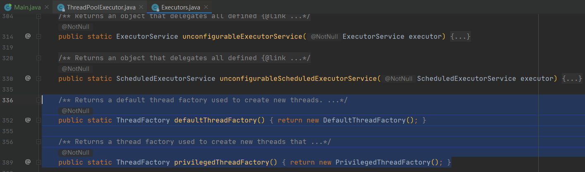
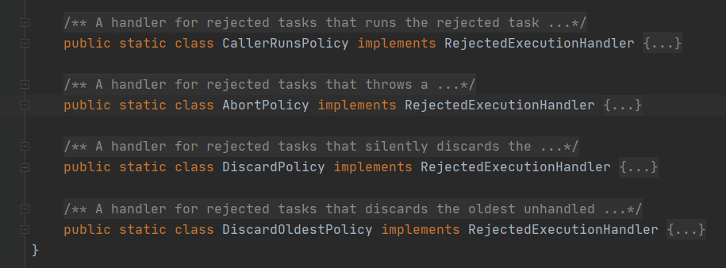

# 线程池配置

[toc]


## ThreadPoolExecutor 构造方法

```java
public ThreadPoolExecutor(int corePoolSize,
                          int maximumPoolSize,
                          long keepAliveTime,
                          TimeUnit unit,
                          BlockingQueue<Runnable> workQueue,
                          ThreadFactory threadFactory,
                          RejectedExecutionHandler handler) {...}
```


## ThreadPoolExecutor 重要参数

### 1、corePoolSize

`corePoolSize` 表示线程池在空闲时间将保留多少个线程

-   一般情况下，如果线程数 <= `corePoolSize`，那么即使线程是空闲的，线程池也不会销毁线程

-   如果线程数 < `corePoolSize`，即使存在空闲的线程，线程池也会优先创建新的线程来执行任务

>   PS： 把线程池看作一个事业单位，`corePoolSize` 相当于编制数 —— 即使没事干也不能随便开除


### 2、maximumPoolSize

`maximumPoolSize` 表示线程池中允许存在的最大线程数

-   当 `workQueue` 已满，且当前线程数 < `maximumPoolSize`：线程池创建新线程来处理任务

-   当 `workQueue` 已满，且当前线程数 = `maximumPoolSize`：线程池执行配置的 `handler`

>   PS：把线程池看作一个事业单位，`maximumPoolSize` 相当于允许的最大人员数 —— 允许扩充 (`maximumPoolSize` - `corePoolSize`) 个外包人员，一旦没事干了就裁掉……


### 3、workQueue

如果当前线程数 > `corePoolSize`，新提交的任务将被暂存到 `workQueue`


### 4、keepAliveTime & unit

`keepAliveTime`表示允许线程空闲的最大时间，`unit`表示时间的单位（毫秒、秒…）

-   如果当前线程数 > `corePoolSize`，线程池会将空闲时间超过 `keepAliveTime` 的空闲线程销毁，直到池中线程数等于 `corePoolSise`
-   如果 `allowCoreThreadTimeout` 参数被设置为 true（默认为 false），线程池将无视 `corePoolSize`，销毁所有长时间空闲的线程。


### 5、threadFactory

`ThreadFactory` 是一个 `FunctionalInterface`，线程池调用其 newThread 方法来创建线程

```java
@FunctionalInterface
public interface ThreadFactory {
    Thread newThread(Runnable r);
}
```

-   Executors 工具类中提供了一些实现好的 ThreadFactory，可以直接使用

    

-   也可以自己实现 ThreadFactory 来定制特定的功能，例如日志


### 6、handler

当 `workQueue` 已满，且线程数 = `maximumPoolSize`，此时线程池调用配置的 `hadler` 进行处理。

-   `RejectedExecutionHandler` 是一个 `FunctionalInterface`：

    ```java
    @FunctionalInterface
    public interface RejectedExecutionHandler {
        void rejectedExecution(Runnable r, ThreadPoolExecutor executor);
    }
    ```

-   `ThreadPoolExecutor` 中内置了几种实现：

    


## ThreadPoolExecutor 配置陷阱 ⚠


## ThreadPoolExecutor 配置指南

