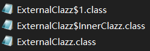
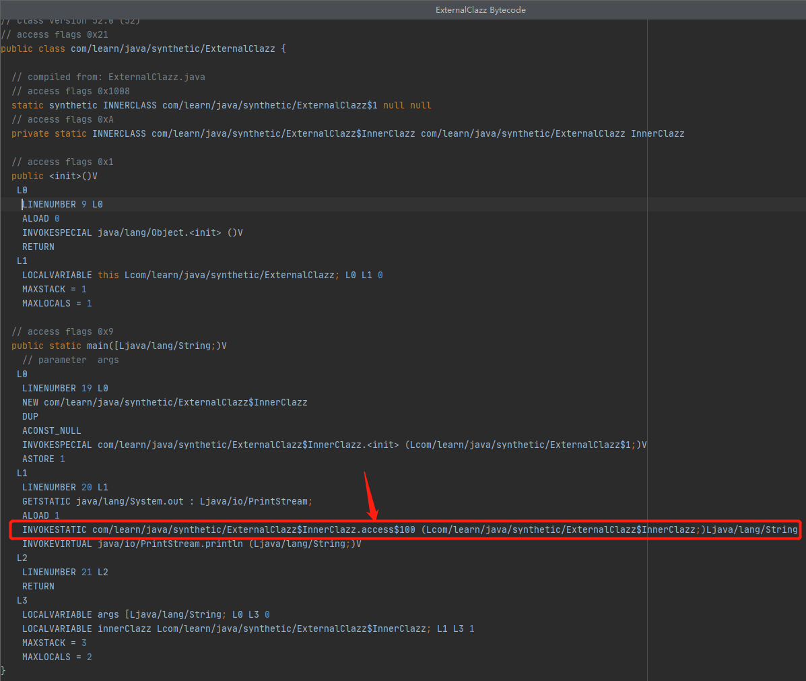

# synthetic 关键字

参考文章：[Java 中冷门的 synthetic 关键字原理解读](https://www.cnblogs.com/szwh/p/7777334.html)


## 1. 定义

Any constructs introduced by a Java compiler that do not have a  corresponding construct in the source code must be marked as synthetic,  except for default constructors, the class initialization method, and  the values and valueOf methods of the Enum class. 

大概的意思就是，synthetic 关键字用于标识由编译器生成的类和方法。


## 2. 实例

既然知道synthetic方法和synthetic类是由编译器生成的，那到底编译器在什么情况下会生成这些东西呢？

```java
/**
 * 外部类
 */
public class ExternalClazz {

    /**
     * 内部类
     */
    private static class InnerClazz {
        private String highlyConfidential = "Don't tell anyone about me";
    }

    public static void main(String[] args) {
        InnerClazz innerClazz = new InnerClazz();
        System.out.println(innerClazz.highlyConfidential);
    }
}
```

上面的代码编译生成了3个字节码文件：



使用CFR反编译字节码文件：

-   ExternalClazz

    ```shell
    > java -jar .\cfr-0.149.jar '.\ExternalClazz.class' --removeinnerclasssynthetics false
    ```

    

    ```java
    /*
     * Decompiled with CFR 0.149.
     */
    package com.learn.java.synthetic;
    
    public class ExternalClazz {
        public static void main(String[] args) {
            InnerClazz innerClazz = new InnerClazz(null);
            System.out.println(InnerClazz.access$100(innerClazz));
        }
    
        private static class InnerClazz {
            private String highlyConfidential = "Don't tell anyone about me";
    
            private InnerClazz() {
            }
    
            /* synthetic */ InnerClazz(1x0) {
                this();
            }
    
            static /* synthetic */ String access$100(InnerClazz x0) {
                return x0.highlyConfidential;
            }
        }
    }
    ```

    

-   ExternalClazz$InnerClazz

    ```shell
    > java -jar .\cfr-0.149.jar '.\ExternalClazz$InnerClazz.class'
    ```

    ```java
    /*
     * Decompiled with CFR 0.149.
     */
    package com.learn.java.synthetic;
    
    private static class ExternalClazz.InnerClazz {
        private String highlyConfidential = "Don't tell anyone about me";
    
        private ExternalClazz.InnerClazz() {
        }
        
        public /* synthetic */ ExternalClazz.InnerClazz(ExternalClazz.1 x0){
        }
        
        static /* synthetic */ String access$100(ExternalClazz.InnerClazz x0) {
            return x0.highlyConfidential;
        }
    }
    ```

    

-   ExternalClazz$1

    ```shell
    > java -jar .\cfr-0.149.jar '.\ExternalClazz$1.class'
    ```

    ```java
    /*
     * Decompiled with CFR 0.149.
     */
    package com.learn.java.synthetic;
    
    static class ExternalClazz.1 {
    }
    ```

### 2.1 synthetic 方法

在内部类`InnerClazz`中，`highlyConfidential`是一个私有属性，而外部类`ExternalClazz`直接访问了这个属性。作为一个内部类，所有属性被外部类直接访问，在语义上毫无问题，但是这却苦了编译器。

为了让私有属性能够被外部类直接访问，编译器生成了一个`package scope`的`access`方法，并将外部类对私有属性的直接访问修改为对`access`方法的调用。

```java
static /* synthetic */ String access$100(ExternalClazz.InnerClazz x0) {
    return x0.highlyConfidential;
}
```

```java
public static void main(String[] args) {
    InnerClazz innerClazz = new InnerClazz(null);
    // 直接访问内部类私有属性：System.out.println(innerClazz.highlyConfidential);
    // 通过access方法访问内部类私有属性：
    System.out.println(InnerClazz.access$100(innerClazz));
}
```



### 2.2 synthetic 类

作为一个内部类，InnerClass的构造方法默认也是private的：

```java
private ExternalClazz.InnerClazz() {}
```

因此，外部类没有办法利用这个默认的构造方法New出对象，所以，编译器悄悄生成了一个public的构造方法：

```java
public /* synthetic */ ExternalClazz.InnerClazz(ExternalClazz.1 x0){}
```

参数列表中声明的ExternalClazz.1参数并没有实际的使用意义，仅仅是为了方便编译器重载方法，因此，从上文的编译结果可以看出，ExternalClazz.1的内部其实啥也没有。

## 3. 总结

编译器通过生成一些在源代码中不存在的synthetic方法和类的方式，实现了对private级别的字段和类的访问，从而绕开了语言限制，这可以算是一种trick。

在实际生产和应用中，基本不存在程序员需要考虑synthetic的地方。