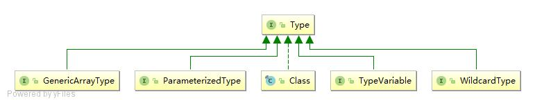

# JDK 泛型之 Type

原文：https://www.cnblogs.com/binarylei/p/8485609.html

[TOC]

---

JDK 1.5 引入 Type，主要是为了泛型，没有泛型的之前，只有所谓的原始类型。此时，所有的原始类型都通过字节码文件类 Class 类进行抽象。Class 类的一个具体对象就代表一个指定的原始类型。

泛型出现后扩充了数据类型，从只有原始类型扩充了参数化类型、类型变量类型、泛型数组类型。Type 的子接口有：ParameterizedType、TypeVariable、GenericArrayType、WildcardType，实现类有 Class。



Type 体系中类型的包括：原始类型(Class)、基本类型(Class)、类型变量(TypeVariable)、参数化类型(ParameterizedType)、数组类型(GenericArrayType)。

-   原始类型(Class)：不仅仅包含我们平常所指的类，还包括枚举、数组、注解等；
-   基本类型(Class)：也就是我们所说的 java 的基本类型，即 int, float, double 等；
-   类型变量(TypeVariable)：各种类型变量的公共父接口，就是泛型里面的类似 T、E，即泛型变量；
-   参数化类型(ParameterizedType)：就是我们平常所用到的泛型 List、Map；
-   数组类型(GenericArrayType)：并不是我们工作中所使用的数组 String[] 、byte[]，而是泛型数组 T[] ；

```
// 1. 原始类型(Class)
Set set;
List aList;
String[] arr;

// 2. 参数化类型(ParameterizedType)
Map<String, Person> map;
Set<String> set;
Class<?> clazz;
List<String> list;

// 3. 类型变量(TypeVariable)
T t;

// 4. 数组类型(GenericArrayType)
Class<?>[] clazz;
Map<String, Person>[] clazz;

```

## ParameterizedType(参数化类型)

ParameterizedType，参数化类型，形如：Object<T, K>，即常说的泛型，是 Type 的子接口。

```java
public interface ParameterizedType extends Type {
    // 1. 获得<>中实际类型
    Type[] getActualTypeArguments();

    // 2. 获得 <> 前面实际类型
    Type getRawType();

    // 3. 如果这个类型是某个类型所属，获得这个所有者类型，否则返回 null
    Type getOwnerType();
}
```

### (1) getActualTypeArguments

返回这个 Type 类型的参数的实际类型数组，即 <> 里的类型参数的类型，因为可能有多个类型参数，例如 Map<K, V>，所以返回的是一个 Type[] 数组。

【注意】无论 <> 中有几层 <> 嵌套，这个方法仅仅脱去最外层的 <>，之后剩下的内容就作为这个方法的返回值，所以其返回值类型不一定。

```java
public class ParameterizedTypeTest<T> {
    List<Set> a1;           // 返回 Set，Class 类型
    List<Set<String>> a2;   // 返回 Set<String>，ParameterizedType 类型
    List<T> a3;             // 返回 T，TypeVariable 类型
    List<? extends Set> a4; // 返回 WildcardType 类型
    List<Set<String>[]> a5; // 返回 GenericArrayType 类型

    @Test
    public void test1() throws Exception {
        Method method = getClass().getMethod("test", List.class);
        Type[] types = method.getGenericParameterTypes();
        ParameterizedType pType = (ParameterizedType) types[0];
        Type[] type = pType.getActualTypeArguments();
        // sun.reflect.generics.reflectiveObjects.GenericArrayTypeImpl
        System.out.println(type[0].getClass().getName());
    }

    public void test(List<ArrayList<String>[]> a) {
    }
}
```

### (2) getRawType

返回的是当前这个 ParameterizedType 的类型，即最外层 <> 前面那个类型，如 Map<K ,V> 的 Map

```java
Map.Entry<String, Integer> me;
@Test
public void rawTypeTest() throws Exception {
    Field field = getClass().getDeclaredField("me");
    ParameterizedType type = (ParameterizedType) field.getGenericType();
    // java.util.Map$Entry
    System.out.println(type.getRawType());
}
```

### (3) getOwnerType

返回的是这个 ParameterizedType 所在的类的 Type

```java
Map.Entry<String, Integer> me;
@Test
public void ownerTypeTest() throws Exception {
    Field field = getClass().getDeclaredField("me");
    ParameterizedType type = (ParameterizedType) field.getGenericType();
    // java.util.Map
    System.out.println(type.getOwnerType());
}
```

## TypeVariable(类型变量)

typeVariable 描述所谓泛型变量，也就是下面的 D：

```java
public interface TypeVariable<D extends GenericDeclaration> extends Type, AnnotatedElement {
    // 变量上边界数组，没有指定的话是 Object
    Type[] getBounds();

    // 获取变量被定义在什么 GenericDeclaration 上
    D getGenericDeclaration();

    // 获取变量名字
    String getName();

    // jdk 1.8
    AnnotatedType[] getAnnotatedBounds();
}
```

-   `getBounds` 得到上边界的 Type 数组，如 K 的上边界数组是 InputStream 和 Serializable。V 没有指定的话，上边界是 Object
-   `getGenericDeclaration` 返回的是声明这个 Type 所在的类 的 Type
-   `getName` 返回的是这个 type variable 的名称

### (1) getBounds

获取泛型变量的上边界的 Type 数组，如果没有指定则是 Object。

```java
@Test
public void test() {
    // 1. 获取类上声明的泛型变量 getTypeParameters
    TypeVariable<Class<TypeVariable>> typeVariable = TypeVariable.class.getTypeParameters()[0];
    // 2. 获取泛型变量的上边界 java.lang.reflect.GenericDeclaration
    System.out.println(Arrays.toString(typeVariable.getBounds()));
}
```

### (2) getGenericDeclaration

GenericDeclaration 该接口用来定义哪些对象上是可以声明泛型变量，目前实现 GenericDeclaration 接口的类包括 Class、Method、Constructor，也就是说只能在这几种对象上进行泛型变量的声明（定义）。

```java
public class TypeVariableTest<E> {
    @Test
    public void getGenericDeclarationTest() {
        // 1. 类上声明泛型
        TypeVariable<Class<TypeVariableTest>> classType = TypeVariableTest.class.getTypeParameters()[0];
        Class<TypeVariableTest> clazzDeclaration = classType.getGenericDeclaration();
        // class com.github.binarylei.spring01.day0728.test.TypeVariableTest
        System.out.println(clazzDeclaration);

        // 2. 方法上声明泛型
        Method[] methods = TypeVariableTest.class.getMethods();
        Method method = Arrays.stream(methods)
                .filter(m -> m.getName().equals("test"))
                .collect(Collectors.toList())
                .get(0);
        TypeVariable methodType = (TypeVariable) method.getGenericParameterTypes()[0];
        GenericDeclaration methodDeclaration = methodType.getGenericDeclaration();
        // public void com.github.binarylei.TypeVariableTest.test(java.lang.Object)
        System.out.println(methodDeclaration);

        // 3. 构造器上声明泛型
    }

    public <T> void test(T t) {
    }
}
```

## GenericArrayType(数组类型)

泛型数组，组成数组的元素中有泛型则实现了该接口；它的组成元素是 ParameterizedType 或 TypeVariable 类型

```java
public interface GenericArrayType extends Type {
    // 获得这个数组元素类型，即获得：A<T>（A<T>[]）或T（T[]）
    Type getGenericComponentType();
}
```

下面我们一起来看一下例子：

```java
classA<K>[][] key;

Type type = Main.class.getDeclaredField("key").getGenericType();
// com.github.binarylei..classA<K>[]
System.out.println(((GenericArrayType)type).getGenericComponentType());
```

## WildcardType(通配符的类型)

WildcardType，通配符表达式，Type 子接口，但是在 Java 中并没有 WildcardType 类型。extends 用来指定上边界，没有指定的话上边界默认是 Object，super 用来指定下边界，没有指定的话为 null。

几个主要方法介绍：

```java
public interface WildcardType extends Type {
    Type[] getUpperBounds();
    Type[] getLowerBounds();
}
```

-   `getLowerBounds` 得到上边界 Type 的数组
-   `getUpperBounds` 得到下边界 Type 的数组

下面一起来看一下例子：

```java
public class WildcardTypeTest {

    // 指定上界 Number，下边界默认为 []
    private List<? extends Number> a;
    // 指定下界 String，上边界默认是 Object
    private List<? super String> b;
    // 上界和下界都不指定，上边界默认是 Object，下边界默认为 []
    private Class<?> clazz;

    // 没有通配符，不是 WildcardType
    private List<String> c;

    @Test
    public void test() throws Exception {
        Field[] fields = WildcardTypeTest.class.getDeclaredFields();
        for (int i = 0; i < fields.length; i++) {
            Field field = fields[i];
            Type type = field.getGenericType();
            String nameString = field.getName();
            //1. 先拿到范型类型
            if (!(type instanceof ParameterizedType)) {
                continue;
            }

            //2. 再从范型里拿到通配符类型
            ParameterizedType parameterizedType = (ParameterizedType) type;
            type = parameterizedType.getActualTypeArguments()[0];
            if (!(type instanceof WildcardType)) {
                continue;
            }

            System.out.println("-------------" + nameString + "--------------");
            WildcardType wildcardType = (WildcardType) type;
            Type[] lowerTypes = wildcardType.getLowerBounds();
            if (lowerTypes != null) {
                System.out.println("下边界：" + Arrays.toString(lowerTypes));
            }
            Type[] upTypes = wildcardType.getUpperBounds();
            if (upTypes != null) {
                System.out.println("上边界：" + Arrays.toString(upTypes));
            }
        }
    }
}
```

## GenericDeclaration

GenericDeclaration 该接口用来定义哪些对象上是可以声明范型变量，目前实现 GenericDeclaration 接口的类包括 Class、Method、Constructor，也就是说只能在这几种对象上进行范型变量的声明（定义）。

GenericDeclaration 的接口方法 getTypeParameters 用来逐个获取该 GenericDeclaration 的范型变量声明。

```java
public interface GenericDeclaration extends AnnotatedElement {
    // 用来获取该GenericDeclaration的范型变量声明
    public TypeVariable<?>[] getTypeParameters();
}
```

### (1) 泛型的声明

```java
//1. 在类(Class)上声明
class A<T> { T a; }

// 2. 在方法上声明
//   类型变量声明不是在参数里边，而且必须在返回值之前，static 等修饰后
public <E> void test(E e) {}

// 3. 在构造器上声明
public <K> A(K k) {}
```

【注意】类型变量声明（定义）的时候不能有下限（既不能有 super），否则编译报错。为什么？T extends classA  表示泛型有上限 classA，当然可以，因为这样，每一个传进来的类型必定是 classA（具有 classA 的一切属性和方法），但若是 T  super classA，传进来的类型不一定具有 classA 的属性和方法，当然就不适用于泛型，说的具体点：

```java
class A<T super classA>{
    T t;
    public void test(){
        // t 的子类是 classA，我们还是不知道 t 到底是什么类型，不知道 t 有那些方法
    }
}
```