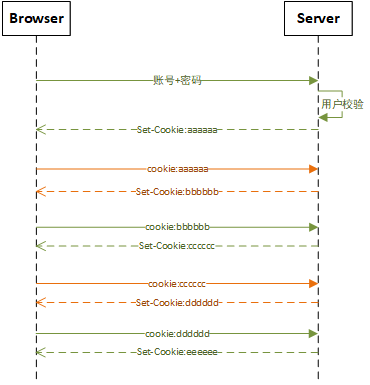

# Set-Cookie

>   参考资料：
>
>   1.   英文：https://developer.mozilla.org/en-US/docs/Web/HTTP/Headers/Set-Cookie
>   2.   中文：https://developer.mozilla.org/zh-CN/docs/web/http/headers/set-cookie


## What ？

“The **`Set-Cookie`** HTTP response header is  used to send a cookie from the server to the user agent, so that the  user agent can send it back to the server later.”




经典的应用场景：基于 Token 的权限验证机制

1.   登录：客户端发起登录请求，将账号、密码传递到服务端。服务端校验账号、密码，校验通过后生成 Token，使用 Set-Cookie 将 Token 返回。(Token 中封装有这个 Token 的**签发时间**)
2.   请求：登录成功后，客户端发送请求时会自动携带服务端返回的 Token。服务端收到请求时会解析、验证请求头中携带的 Token：Token 是否为服务端签发、Token 是否过期。验证通过后处理客户端请求，并且生成一个新的 Token，再次通过 Set-Cookie 返回。


## How ？

```
Set-Cookie: <cookie-name>=<cookie-value>
Set-Cookie: <cookie-name>=<cookie-value>; Expires=<date>
Set-Cookie: <cookie-name>=<cookie-value>; Max-Age=<number>
Set-Cookie: <cookie-name>=<cookie-value>; Domain=<domain-value>
Set-Cookie: <cookie-name>=<cookie-value>; Path=<path-value>
Set-Cookie: <cookie-name>=<cookie-value>; Secure
Set-Cookie: <cookie-name>=<cookie-value>; HttpOnly

Set-Cookie: <cookie-name>=<cookie-value>; SameSite=Strict
Set-Cookie: <cookie-name>=<cookie-value>; SameSite=Lax
Set-Cookie: <cookie-name>=<cookie-value>; SameSite=None; Secure

// Multiple attributes are also possible, for example:
Set-Cookie: <cookie-name>=<cookie-value>; Domain=<domain-value>; Secure; HttpOnly

```

（关于参数说明，已经使用Demo，见：https://developer.mozilla.org/en-US/docs/Web/HTTP/Headers/Set-Cookie）


## Warning ⚠

 **根据 Fetch 规范，浏览器禁止 JavaScript 访问 set-cookie**