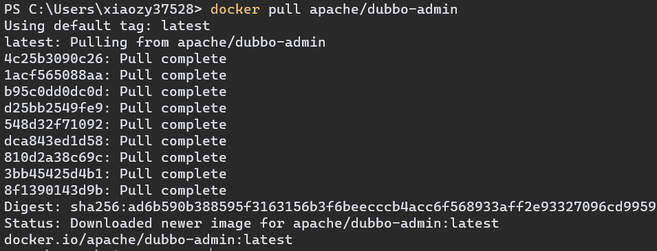

# Dubbo-Admin 安装

## 一、Linux

## 二、Win10

## 三、Win10 + Docker

1.   到仓库搜索镜像

     ```dockerfile
     docker search dubbo-admin
     ```

     

     

2.   从仓库拉取镜像（直接拉取最新版）

     ```dockerfile
     docker pull apache/dubbo-admin
     ```

     

     

3.   创建并运行容器

     ```dockerfile
     docker run -itd --name myDubboAdmin -p 8888:8080 --link myZookeeper apache/bubbo-admin
     ```

     -   –link myZookeeper：建立与myZookeeper容器间的通讯

4.   检查容器运行状况

     ```dockerfile
     docker container ls 
     ```

     

5.   访问 Dubbo-Admin

     ```
     http://localhost:8888
     ```

     account/password = root/root

