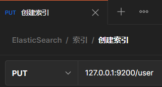
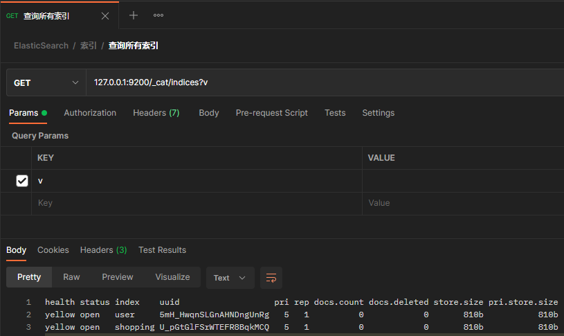
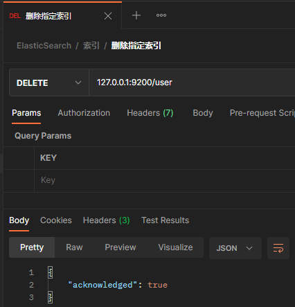
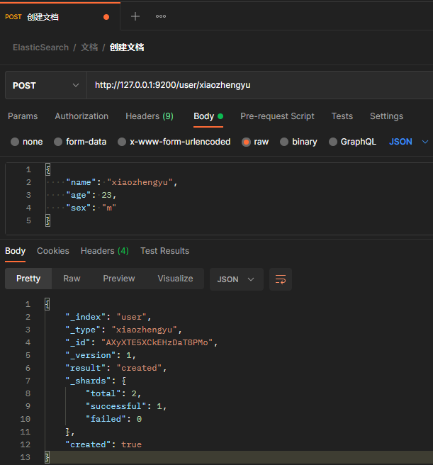
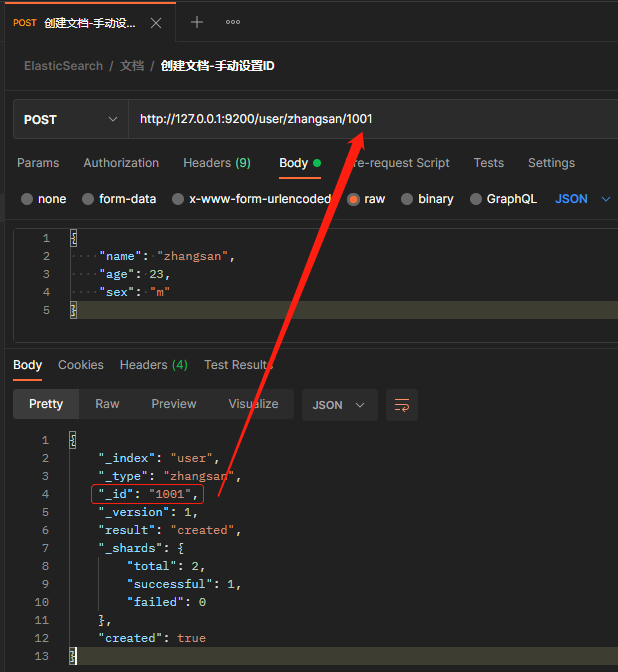
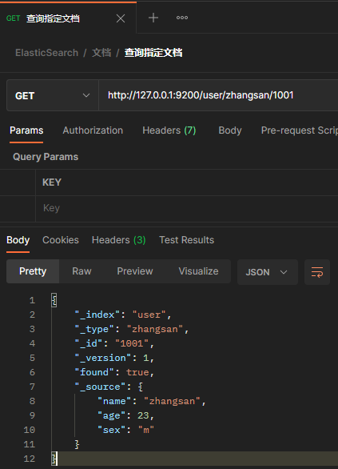
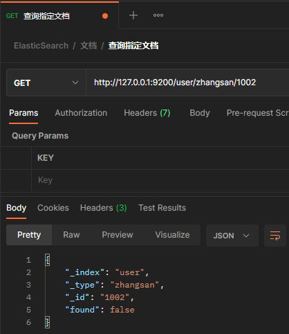
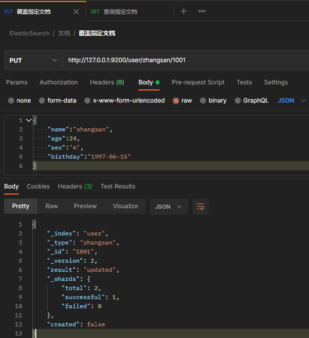
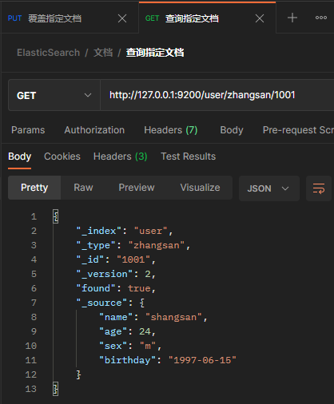

# ElasticSearch

## 一、ElasticSearch 概述

### Lucene

Lucene是apache软件基金会 jakarta项目组的一个子项目，是一个开放源码的全文检索引擎工具包，但它不是一个完整的全文检索引擎，而是一个全文检索引擎的架构。Lucene的目的是为软件开发人员提供一个简单易用的工具包，以方便的在目标系统中实现全文检索的功能，或者是以此为基础建立起完整的全文检索引擎。Lucene是用Java实现的。

### ElasticSearch

Elasticsearch是基于Lucene实现的搜索服务器。根据DB-Engines的排名显示，Elasticsearch是最受欢迎的企业搜索引擎，其次是Apache Solr（也是基于Lucene）。ElasticSearch是用Java实现的。

Elasticsearch 是一个开源、分布式、高扩展、高实时的<u>全文搜索与数据分析</u>引擎。

>   ElasticSearch的应用情况
>
>   -   Github：2013年初，抛弃Solr改用ES来作PB级别的搜搜。Github适应ES来搜索20TM的数据，包括13亿的文件和1300亿行的代码
>   -   维基百科：启用以ES为基础的核心搜索架构
>   -   百度：目前广泛使用ES进行文本数据分析
>   -   新浪：使用ES分析处理32亿条实时日志
>   -   阿里：使用ES构建日志采集和分析体系
>   -   …

### 结构化数据、非结构化数据、半结构化数据

-   结构化数据：具有严格的结构，主要通过关系型数据库进行存储和管理。内容检索比较容易，但不易调整结构

-   非结构化数据：没有结构，难以用关系型数据库存储，如：图片、音频、视频。数据维度广，数据量大，内容检索和分析比较难，一般存储在NoSQL数据库

-   半结构化数据：具有一定的结构，但是不固定，例如：XML、JSON、HTML。数据的内容和结构混合在一起，或者说数据具有自描述性。内容检索和分析比较难，一般存储在NoSQL数据库


## 二、ElasticSearch 入门

### Elastic安装

[ElasticSearch安装（基于Docker）.md](.\实战\ElasticSearch安装（基于Docker）.md)


### 数据格式

ElasticSearch是面向文档型数据库，一条数据在这里就是一个文档。问了方便理解，将ElasticSearch里面存储文档数据和关系型数据库MySQL存储数据的概念进行一个类比：

| MySQL              | ElasticSearch     |
| ------------------ | ----------------- |
| Database（数据库） | Index（索引）     |
| Table（表）        | Types（类型）     |
| Row（行）          | Documents（文档） |
| Column（列）       | Fields（字段）    |

Types的概念已经被逐渐弱化，在ElasticSearch 6.x 中，一个Index下已经只能包含一个Type；从ElasticSearch 7.x 开始，Type的概念被彻底删除。

>   [Elasticsearch6.0以后为什么要删除Type的概念？](https://zhuanlan.zhihu.com/p/66716868)
>
>   一开始，我们我们谈到 一个 ES的索引类似于关系型数据库中的数据库，一个映射类型则相当于关系型数据库中的一张表。这是一个错误的类比，导致了错误的假设。在一个关系型数据库中，表之间是相互独立的。一个表中的列与另一个表中同名的列没有关系。然而在映射类型中却不是这样的。
>
>   在一个Elasticsearch的索引中，有相同名称字段的不同映射类型在Lucene内部是由同一个字段支持的。换言之，看下面的这个例子，user 类型中的  user_name字段和tweet类型中的user_name字段实际上是被存储在同一个字段中，而且两个user_name字段在这两种映射类型中都有相同的定义（如类型都是 text或者都是date）。
>
>   这会导致一些问题，比如，当你希望在一个索引中的两个映射类型，一个映射类型中的 deleted 字段映射为一个日期数据类型的字段，而在另一个映射类型中的deleted字段映射为一个布尔数据类型的字段，这就会失败。最重要的是，在一个索引中存储那些有很少或没有相同字段的实体会导致稀疏数据，并且干扰Lucene有效压缩文档的能力。


### 基本操作

#### 索引

##### 1. 创建索引

类比关系型数据库，创建索引相当于创建数据库。向ES发送<font color = red>PUT</font>请求：http://127.0.0.1:9200/{index_name}



如果索引尚未创建：

```json
{
    "acknowledged": true,
    "shards_acknowledged": true,
    "index": "user"
}
```

如果索引已经存在：

```json
{
    "error": {
        "root_cause": [
            {
                "type": "index_already_exists_exception",
                "reason": "index [user/5mH_HwqnSLGnAHNDngUnRg] already exists",
                "index_uuid": "5mH_HwqnSLGnAHNDngUnRg",
                "index": "user"
            }
        ],
        "type": "index_already_exists_exception",
        "reason": "index [user/5mH_HwqnSLGnAHNDngUnRg] already exists",
        "index_uuid": "5mH_HwqnSLGnAHNDngUnRg",
        "index": "user"
    },
    "status": 400
}
```


##### 2. 查询指定索引

向ES发送<font color = red>GET</font>请求：http://127.0.0.1:9200/{index_name}


如果索引存在：

```json
{
    "user": {
        "aliases": {},
        "mappings": {},
        "settings": {
            "index": {
                "creation_date": "1634624786446",
                "number_of_shards": "5",
                "number_of_replicas": "1",
                "uuid": "5mH_HwqnSLGnAHNDngUnRg",
                "version": {
                    "created": "5061299"
                },
                "provided_name": "user"
            }
        }
    }
}
```

如果索引不存在：

```json
{
    "error": {
        "root_cause": [
            {
                "type": "index_not_found_exception",
                "reason": "no such index",
                "resource.type": "index_or_alias",
                "resource.id": "user123",
                "index_uuid": "_na_",
                "index": "user123"
            }
        ],
        "type": "index_not_found_exception",
        "reason": "no such index",
        "resource.type": "index_or_alias",
        "resource.id": "user123",
        "index_uuid": "_na_",
        "index": "user123"
    },
    "status": 404
}
```


##### 3. 查询所有索引

向ES发送<font color = red>GET</font>请求：http://127.0.0.1:9200/_cat/indices?v




##### 4. 删除索引

向ES发送<font color = red>DELETE</font>请求：http://127.0.0.1:9200/{index_name}




#### 文档

##### 1. 创建文档

###### 随机生成ID

在指定索引下创建文档。向ES发送<font color = red>POST</font>请求：http://127.0.0.1:9200/{index_name}/{document_name}



###### 手动设置ID

随生成的ID不容易记忆，可以手动设置ID。向ES发送<font color = red>POST</font>请求：http://127.0.0.1:9200/{index_name}/{document_name}/{document_id}



##### 2. 查询指定文档

向ES发送<font color = red>GET</font>请求：http://127.0.0.1:9200/{index_name}/{document_name}/{document_id}

查询的数据存在：



查询的数据不存在：



##### 3. 查询指定索引包含的所有文档

向ES发送<font color = red>GET</font>请求：http://127.0.0.1:9200/{index_name}/_search


```json
{
    "took": 0,
    "timed_out": false,
    "_shards": {
        "total": 5,
        "successful": 5,
        "skipped": 0,
        "failed": 0
    },
    "hits": {
        "total": 3,
        "max_score": 1.0,
        "hits": [
            {
                "_index": "user",
                "_type": "zhangsan",
                "_id": "1001",
                "_score": 1.0,
                "_source": {
                    "name": "zhangsan",
                    "age": 23,
                    "sex": "m"
                }
            },
            {
                "_index": "user",
                "_type": "xiaozhengyu",
                "_id": "AXyXXAaiCkEHzDaT8PMr",
                "_score": 1.0,
                "_source": {
                    "name": "xiaozhengyu",
                    "age": 23,
                    "sex": "m"
                }
            },
            {
                "_index": "user",
                "_type": "xiaozhengyu",
                "_id": "AXyXTE5XCkEHzDaT8PMo",
                "_score": 1.0,
                "_source": {
                    "name": "xiaozhengyu",
                    "age": 23,
                    "sex": "m"
                }
            }
        ]
    }
}
```

##### 4. 覆盖指定文档

向ES发送<font color = red>PUT</font>请求：http://127.0.0.1:9200/{index_name}/{document_name}/{document_id}





注意上图返回数据中的“_version”，它的数值等于2，表明这个文档被修改了2次。

##### 5. 

## 三、ElasticSearch 环境

## 四、ElasticSearch 进阶

## 五、ElasticSearch 集成

## 六、ElasticSearch 优化

## 七、ElasticSearch 面试题