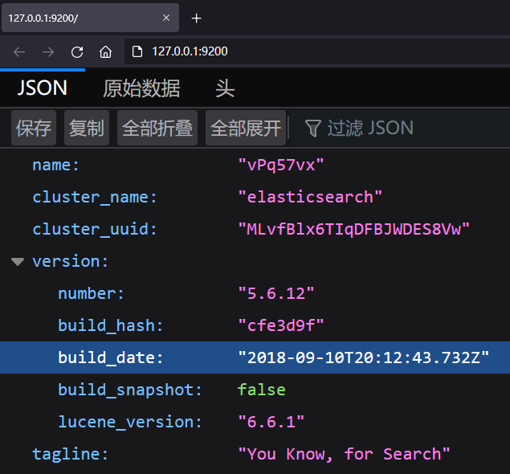

# ElasticSearch安装（基于Docker）

---

>ElasticSearch端口：
>
>-   9200：ES节点和外部通讯使用
>-   9300：ES节点之间的通讯使用


1.   拉取镜像

     ```
     # 拉取最高版本的镜像
     docker pull elasticsearch
     
     # 拉取指定版本的镜像
     docker pull elasticsearch:xxx
     ```

     

2.   创建并运行容器

     ```
     docker 
         run 
             -d 
             -p 9200:9200 
             -p 9300:9300 
             -v /opt/myapp/elasticsearch/config/elasticsearch.yml:/usr/share/elasticsearch/config/elasticsearch.yml 
             -v  /opt/myapp/elasticsearch/config/jvm.options:/usr/share/elasticsearch/config/jvm.options 
             --name elasticsearch 
         elasticsearch
     ```

     -   -p：将docker镜像中的端口号映射宿主机器端口号，`宿主机器端口号:docker容器端口号` ，可写多个，如果多个端口号是连续的，可以直接用-连接，如：4560-4600:4560-4600
     -   -v：将docker镜像中的文件映射到宿主机器指定的文件，可以是文件夹，`-v 宿主机文件:容器文件`映射后可直接修改宿主机上的文件就可以改变docker中的配置，也可写多个。docker镜像中软件的配置文档默认在`/usr/share”/{软件名}`下
     -   –name：指定镜像名称,`--name 容器名称`

3.   验证

     
