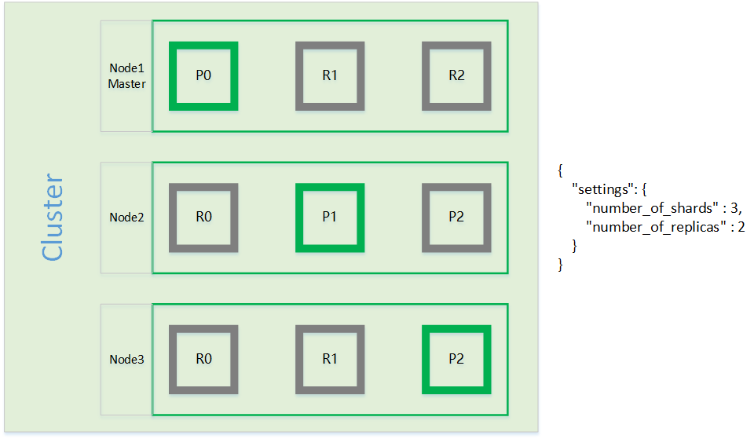
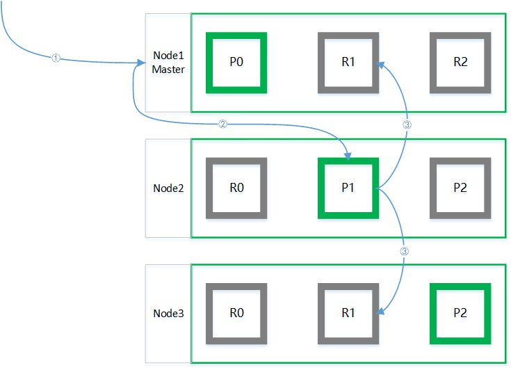
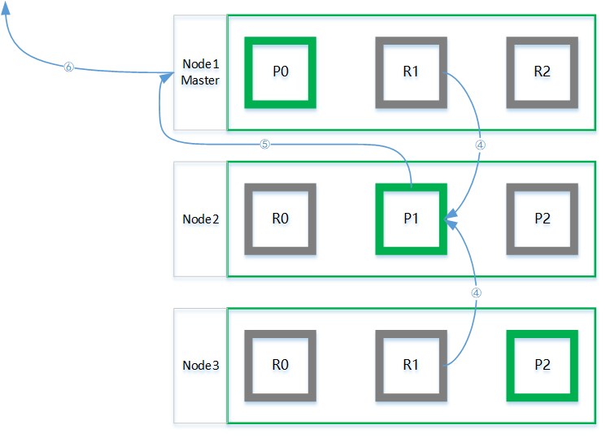
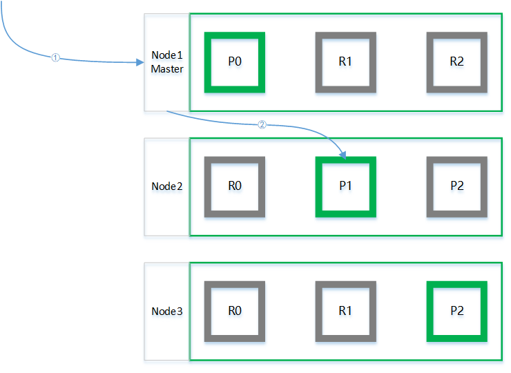
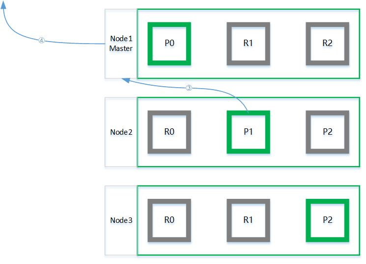

# 为什么索引的主分片数设置后不允许修改？

---

Es存储和检索文档的实现机制决定了主分片一旦设置就不能被修改。

## 存储文档

1.   客户端向集群中的任一节点（协调节点）发送文档新增请求

2.   协调节点通过结算得出文档应该存在在哪个主分片：P1

     
shard = hash(routing) % number_of_primary_shards

     协调节点将请求转发到主分片所在的节点：Node2

3.   P1接收并处理新增请求，然后将处理结果同步发送到复制分片

4.   复制分片接收并处理请求，然后通知P2请求已经处理完毕

5.   P1等待并接收到复制分片的响应，然后通知协调节点请求已经处理完毕

6.   协调节点等待并接收P2的响应，然后通知客户端请求已经处理完毕

## 检索文档

1.   客户端向集群中的任一节点（协调节点）发送文档查询请求

2.   协调节点通过结算得出文档应该存在在哪个分片：分片1

     
shard = hash(routing) % number_of_primary_shards

     协调节点将请求转发到任一存在分片1的结点：Node2

3.   Node2完成文档的查询并向协调节点返回查询结果

4.   协调节点将Node2返回的查询结果返回给客户端

---

比较上述的两个流程可以发现，无论是存储文档还是查询文档，都涉及到一个关键的操作——计算应该存储的分片：

shard = hash(routing) % number_of_primary_shards

从公式可以看出，分片数量（number_of_primary_shards）决定了文档存储的位置。如果在存储了若干文档后改变分片数量，将导致后续其他操作无法正确计算到文档的位置。

