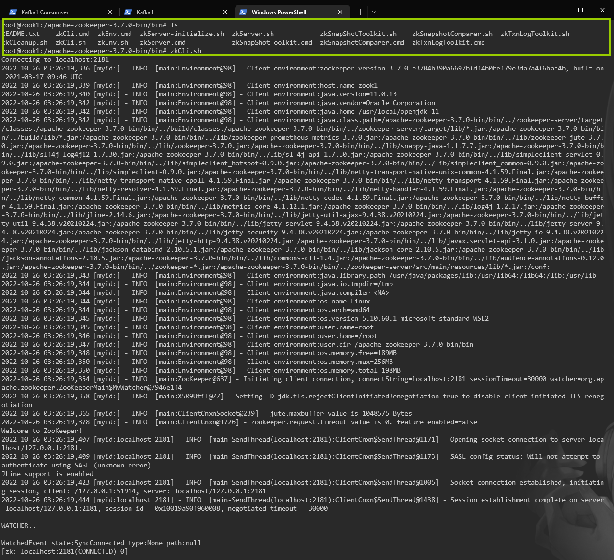

# Zookeeper 信息查看


1.   使用 ZK 客户端连接 ZK

     ```shell
     zkCli.sh
     ```

     

     

2.   查看信息

     ```
     [zk: localhost:2181(CONNECTED) 0] ls /
     [admin, brokers, cluster, config, consumers, controller, controller_epoch, feature, isr_change_notification, latest_producer_id_block, log_dir_event_notification, zookeeper]
     [zk: localhost:2181(CONNECTED) 1] ls /brokers
     [ids, seqid, topics]
     [zk: localhost:2181(CONNECTED) 2] ls /brokers/topics
     [__consumer_offsets, __transaction_state, myTopic123]
     [zk: localhost:2181(CONNECTED) 3] ls /brokers/topics/myTopic123
     [partitions]
     [zk: localhost:2181(CONNECTED) 4] ls /brokers/topics/myTopic123/partitions
     [0, 1, 2]
     [zk: localhost:2181(CONNECTED) 5] ls /brokers/topics/myTopic123/partitions/0
     [state]
     [zk: localhost:2181(CONNECTED) 6] get /brokers/topics/myTopic123/partitions/0/state
     {"controller_epoch":1,"leader":2,"version":1,"leader_epoch":0,"isr":[2,3,1]}
     [zk: localhost:2181(CONNECTED) 7]
     ```

