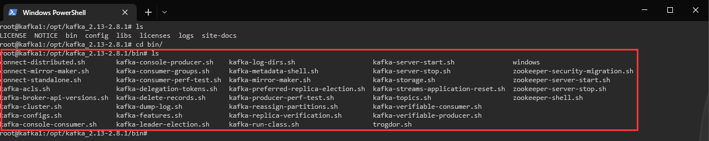
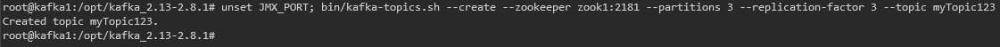
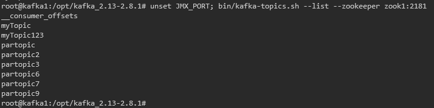
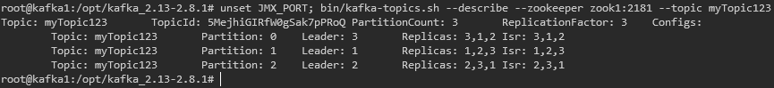
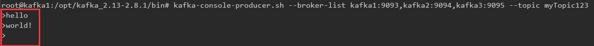
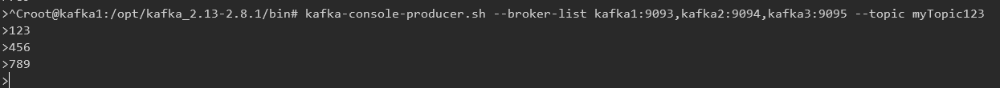
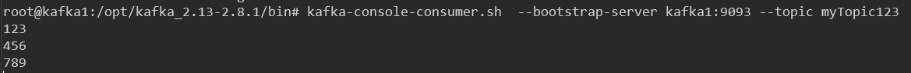

# Kafka 命令行

---

[TOC]


Kafka 的命令行实际由 /bin 目录下的各个脚本提供：




## 一、Topic 相关

Topc 相关的命令行由 kafka-topic.sh 提供，直接执行该脚本会在控制台输出提示信息：

```
root@kafka1:/opt/kafka_2.13-2.8.1/bin# kafka-topics.sh
Create, delete, describe, or change a topic.
Option                                   Description
------                                   -----------
--alter                                  Alter the number of partitions,
                                           replica assignment, and/or
                                           configuration for the topic.
--at-min-isr-partitions                  if set when describing topics, only
                                           show partitions whose isr count is
                                           equal to the configured minimum. Not
                                           supported with the --zookeeper
                                           option.
--bootstrap-server <String: server to    REQUIRED: The Kafka server to connect
  connect to>                              to. In case of providing this, a
                                           direct Zookeeper connection won't be
                                           required.
--command-config <String: command        Property file containing configs to be
  config property file>                    passed to Admin Client. This is used
                                           only with --bootstrap-server option
                                           for describing and altering broker
                                           configs.
--config <String: name=value>            A topic configuration override for the
                                           topic being created or altered. The
                                           following is a list of valid
                                           configurations:
                                                cleanup.policy
                                                compression.type
                                                delete.retention.ms
                                                file.delete.delay.ms
                                                flush.messages
                                                flush.ms
                                                follower.replication.throttled.
                                           replicas
                                                index.interval.bytes
                                                leader.replication.throttled.replicas
                                                max.compaction.lag.ms
                                                max.message.bytes
                                                message.downconversion.enable
                                                message.format.version
                                                message.timestamp.difference.max.ms
                                                message.timestamp.type
                                                min.cleanable.dirty.ratio
                                                min.compaction.lag.ms
                                                min.insync.replicas
                                                preallocate
                                                retention.bytes
                                                retention.ms
                                                segment.bytes
                                                segment.index.bytes
                                                segment.jitter.ms
                                                segment.ms
                                                unclean.leader.election.enable
                                         See the Kafka documentation for full
                                           details on the topic configs. It is
                                           supported only in combination with --
                                           create if --bootstrap-server option
                                           is used (the kafka-configs CLI
                                           supports altering topic configs with
                                           a --bootstrap-server option).
--create                                 Create a new topic.
--delete                                 Delete a topic
--delete-config <String: name>           A topic configuration override to be
                                           removed for an existing topic (see
                                           the list of configurations under the
                                           --config option). Not supported with
                                           the --bootstrap-server option.
--describe                               List details for the given topics.
--disable-rack-aware                     Disable rack aware replica assignment
--exclude-internal                       exclude internal topics when running
                                           list or describe command. The
                                           internal topics will be listed by
                                           default
--force                                  Suppress console prompts
--help                                   Print usage information.
--if-exists                              if set when altering or deleting or
                                           describing topics, the action will
                                           only execute if the topic exists.
--if-not-exists                          if set when creating topics, the
                                           action will only execute if the
                                           topic does not already exist.
--list                                   List all available topics.
--partitions <Integer: # of partitions>  The number of partitions for the topic
                                           being created or altered (WARNING:
                                           If partitions are increased for a
                                           topic that has a key, the partition
                                           logic or ordering of the messages
                                           will be affected). If not supplied
                                           for create, defaults to the cluster
                                           default.
--replica-assignment <String:            A list of manual partition-to-broker
  broker_id_for_part1_replica1 :           assignments for the topic being
  broker_id_for_part1_replica2 ,           created or altered.
  broker_id_for_part2_replica1 :
  broker_id_for_part2_replica2 , ...>
--replication-factor <Integer:           The replication factor for each
  replication factor>                      partition in the topic being
                                           created. If not supplied, defaults
                                           to the cluster default.
--topic <String: topic>                  The topic to create, alter, describe
                                           or delete. It also accepts a regular
                                           expression, except for --create
                                           option. Put topic name in double
                                           quotes and use the '\' prefix to
                                           escape regular expression symbols; e.
                                           g. "test\.topic".
--topics-with-overrides                  if set when describing topics, only
                                           show topics that have overridden
                                           configs
--unavailable-partitions                 if set when describing topics, only
                                           show partitions whose leader is not
                                           available
--under-min-isr-partitions               if set when describing topics, only
                                           show partitions whose isr count is
                                           less than the configured minimum.
                                           Not supported with the --zookeeper
                                           option.
--under-replicated-partitions            if set when describing topics, only
                                           show under replicated partitions
--version                                Display Kafka version.
--zookeeper <String: hosts>              DEPRECATED, The connection string for
                                           the zookeeper connection in the form
                                           host:port. Multiple hosts can be
                                           given to allow fail-over.
root@kafka1:/opt/kafka_2.13-2.8.1/bin#
```


#### 创建 Topic

命令行：

```shell
kafka-topics.sh --create --zookeeper zook1:2181 --partitions 3 --replication-factor 3 --topic myTopic123
```

执行结果：



说明：

-   `--partitions`：Topic 的数据要拆成几个分区进行存储
-   `--replication-factor`：每个分区的数据要存几份
-   `--topic`：Topic 的名称


#### 罗列 Topic

命令行：

```shell
kafka-topics.sh --list --zookeeper zook1:2181
```

执行结果：




#### Topic 详情

命令行：

```shell
kafka-topics.sh --describe --zookeeper zook1:2181 --topic myTopic123
```

执行结果：




#### 删除 Topic

命令行：

```shell
kafka-topics.sh --describe --zookeeper zook1:2181 --topic myTopic123 --delete
```


#### 修改分区数

```shell
kafka-topics.sh --alter --zookeeper zook1:2181 --topic myTopic123 --partitions 5
```

>   Note：分区数只能增加不能减少，且分区数不能超过 Brocker 数


## 二、Producer 相关

Producer 相关的命令行由 kafka-console-producer.sh 提供，直接执行该脚本会在控制台输出提示信息：

```
root@kafka1:/opt/kafka_2.13-2.8.1/bin# kafka-console-producer.sh
Missing required option(s) [bootstrap-server]
Option                                   Description
------                                   -----------
--batch-size <Integer: size>             Number of messages to send in a single
                                           batch if they are not being sent
                                           synchronously. (default: 200)
--bootstrap-server <String: server to    REQUIRED unless --broker-list
  connect to>                              (deprecated) is specified. The server
                                           (s) to connect to. The broker list
                                           string in the form HOST1:PORT1,HOST2:
                                           PORT2.
--broker-list <String: broker-list>      DEPRECATED, use --bootstrap-server
                                           instead; ignored if --bootstrap-
                                           server is specified.  The broker
                                           list string in the form HOST1:PORT1,
                                           HOST2:PORT2.
--compression-codec [String:             The compression codec: either 'none',
  compression-codec]                       'gzip', 'snappy', 'lz4', or 'zstd'.
                                           If specified without value, then it
                                           defaults to 'gzip'
--help                                   Print usage information.
--line-reader <String: reader_class>     The class name of the class to use for
                                           reading lines from standard in. By
                                           default each line is read as a
                                           separate message. (default: kafka.
                                           tools.
                                           ConsoleProducer$LineMessageReader)
--max-block-ms <Long: max block on       The max time that the producer will
  send>                                    block for during a send request
                                           (default: 60000)
--max-memory-bytes <Long: total memory   The total memory used by the producer
  in bytes>                                to buffer records waiting to be sent
                                           to the server. (default: 33554432)
--max-partition-memory-bytes <Long:      The buffer size allocated for a
  memory in bytes per partition>           partition. When records are received
                                           which are smaller than this size the
                                           producer will attempt to
                                           optimistically group them together
                                           until this size is reached.
                                           (default: 16384)
--message-send-max-retries <Integer>     Brokers can fail receiving the message
                                           for multiple reasons, and being
                                           unavailable transiently is just one
                                           of them. This property specifies the
                                           number of retries before the
                                           producer give up and drop this
                                           message. (default: 3)
--metadata-expiry-ms <Long: metadata     The period of time in milliseconds
  expiration interval>                     after which we force a refresh of
                                           metadata even if we haven't seen any
                                           leadership changes. (default: 300000)
--producer-property <String:             A mechanism to pass user-defined
  producer_prop>                           properties in the form key=value to
                                           the producer.
--producer.config <String: config file>  Producer config properties file. Note
                                           that [producer-property] takes
                                           precedence over this config.
--property <String: prop>                A mechanism to pass user-defined
                                           properties in the form key=value to
                                           the message reader. This allows
                                           custom configuration for a user-
                                           defined message reader. Default
                                           properties include:
                                                parse.key=true|false
                                                key.separator=<key.separator>
                                                ignore.error=true|false
--request-required-acks <String:         The required acks of the producer
  request required acks>                   requests (default: 1)
--request-timeout-ms <Integer: request   The ack timeout of the producer
  timeout ms>                              requests. Value must be non-negative
                                           and non-zero (default: 1500)
--retry-backoff-ms <Integer>             Before each retry, the producer
                                           refreshes the metadata of relevant
                                           topics. Since leader election takes
                                           a bit of time, this property
                                           specifies the amount of time that
                                           the producer waits before refreshing
                                           the metadata. (default: 100)
--socket-buffer-size <Integer: size>     The size of the tcp RECV size.
                                           (default: 102400)
--sync                                   If set message send requests to the
                                           brokers are synchronously, one at a
                                           time as they arrive.
--timeout <Integer: timeout_ms>          If set and the producer is running in
                                           asynchronous mode, this gives the
                                           maximum amount of time a message
                                           will queue awaiting sufficient batch
                                           size. The value is given in ms.
                                           (default: 1000)
--topic <String: topic>                  REQUIRED: The topic id to produce
                                           messages to.
--version                                Display Kafka version.
root@kafka1:/opt/kafka_2.13-2.8.1/bin#
```


#### 生产消息

命令行：

```shell
kafka-console-producer.sh --broker-list kafka1:9093,kafka2:9094,kafka3:9095 --topic myTopic123
```

执行结果：



说明：

-   `--broker-list`：向哪些 Brocker 发送消息
-   `--topic`：想哪个 Topic 发送消息

## 三、Consumer 相关

Producer 相关的命令行由 kafka-console-consumer.sh 提供，直接执行该脚本会在控制台输出提示信息：

```
root@kafka1:/opt/kafka_2.13-2.8.1# bin/kafka-console-consumer.sh
This tool helps to read data from Kafka topics and outputs it to standard output.
Option                                   Description
------                                   -----------
--bootstrap-server <String: server to    REQUIRED: The server(s) to connect to.
  connect to>
--consumer-property <String:             A mechanism to pass user-defined
  consumer_prop>                           properties in the form key=value to
                                           the consumer.
--consumer.config <String: config file>  Consumer config properties file. Note
                                           that [consumer-property] takes
                                           precedence over this config.
--enable-systest-events                  Log lifecycle events of the consumer
                                           in addition to logging consumed
                                           messages. (This is specific for
                                           system tests.)
--formatter <String: class>              The name of a class to use for
                                           formatting kafka messages for
                                           display. (default: kafka.tools.
                                           DefaultMessageFormatter)
--from-beginning                         If the consumer does not already have
                                           an established offset to consume
                                           from, start with the earliest
                                           message present in the log rather
                                           than the latest message.
--group <String: consumer group id>      The consumer group id of the consumer.
--help                                   Print usage information.
--isolation-level <String>               Set to read_committed in order to
                                           filter out transactional messages
                                           which are not committed. Set to
                                           read_uncommitted to read all
                                           messages. (default: read_uncommitted)
--key-deserializer <String:
  deserializer for key>
--max-messages <Integer: num_messages>   The maximum number of messages to
                                           consume before exiting. If not set,
                                           consumption is continual.
--offset <String: consume offset>        The offset id to consume from (a non-
                                           negative number), or 'earliest'
                                           which means from beginning, or
                                           'latest' which means from end
                                           (default: latest)
--partition <Integer: partition>         The partition to consume from.
                                           Consumption starts from the end of
                                           the partition unless '--offset' is
                                           specified.
--property <String: prop>                The properties to initialize the
                                           message formatter. Default
                                           properties include:
                                          print.timestamp=true|false
                                          print.key=true|false
                                          print.offset=true|false
                                          print.partition=true|false
                                          print.headers=true|false
                                          print.value=true|false
                                          key.separator=<key.separator>
                                          line.separator=<line.separator>
                                          headers.separator=<line.separator>
                                          null.literal=<null.literal>
                                          key.deserializer=<key.deserializer>
                                          value.deserializer=<value.
                                           deserializer>
                                          header.deserializer=<header.
                                           deserializer>
                                         Users can also pass in customized
                                           properties for their formatter; more
                                           specifically, users can pass in
                                           properties keyed with 'key.
                                           deserializer.', 'value.
                                           deserializer.' and 'headers.
                                           deserializer.' prefixes to configure
                                           their deserializers.
--skip-message-on-error                  If there is an error when processing a
                                           message, skip it instead of halt.
--timeout-ms <Integer: timeout_ms>       If specified, exit if no message is
                                           available for consumption for the
                                           specified interval.
--topic <String: topic>                  The topic id to consume on.
--value-deserializer <String:
  deserializer for values>
--version                                Display Kafka version.
--whitelist <String: whitelist>          Regular expression specifying
                                           whitelist of topics to include for
                                           consumption.
```


#### 消费消息

命令行：

```shell
kafka-console-consumer.sh  --bootstrap-server kafka1:9093 --topic myTopic123
```

执行结果：

1.   开始监听消息

     

2.   生产消息

     

3.   收到消息

     

说明：

-   使用上面的命令行 Consumer 无法接受 Producer 在 Consumer 启动之前发送过的消息，如需接受历史数据需要添加参数： `--from-beginning`