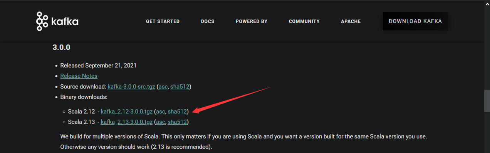
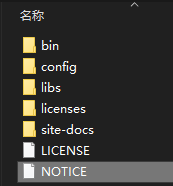
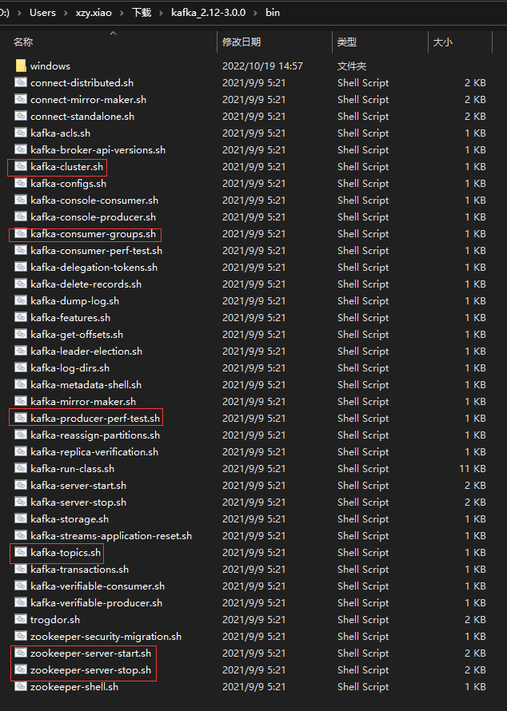
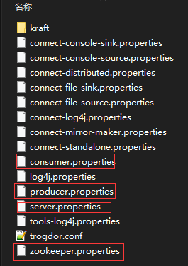

# 安装部署

---

#### 1、下载压缩包

官网地址：https://kafka.apache.org/downloads




>   目录说明：
>
>   
>
>   -   bin：存储 Kafka 命令行相关的脚本
>
>       
>
>   -   confg：存储 Kafka 配置文件
>
>       
>
>   -   libs：依赖的第三方工具包


#### 2、修改配置

server.properties

>   修改前：
>
>   ```properties
>   ############################# Server Basics #############################
>   
>   # The id of the broker. This must be set to a unique integer for each broker.
>   broker.id=0
>   
>   
>   ############################# Log Basics #############################
>   
>   # A comma separated list of directories under which to store log files
>   log.dirs=/tmp/kafka-logs
>   
>   ############################# Zookeeper #############################
>   
>   # Zookeeper connection string (see zookeeper docs for details).
>   # This is a comma separated host:port pairs, each corresponding to a zk
>   # server. e.g. "127.0.0.1:3000,127.0.0.1:3001,127.0.0.1:3002".
>   # You can also append an optional chroot string to the urls to specify the
>   # root directory for all kafka znodes.
>   zookeeper.connect=localhost:2181
>   ```
>
>   修改后：
>
>   ```properties
>   broker.id=0
>   log.dirs=/opt/module/kafka/datas
>   zookeeper.connect=node1:2181,node2:2181,node3:2181/kafka
>   ```
>
>   -   broker.id：broker 的唯一标识，要求全局唯一（记得修改每个节点的broker的id）
>   -   log.dirs：存储 Kafka 数据的目录（一定要改，tmp 是存储临时数据的目录，里面的数据会定期清除）
>   -   zookeeper.connect：Zookeeper 存储 Kafka 信息的位置（默认存在 ZK 的根目录）


#### 3、启动

使用 bin 目录下的 kafka-server-start.sh 脚本

```shell
bin/kafka-server-start.sh -daemon /config/server.properties
```