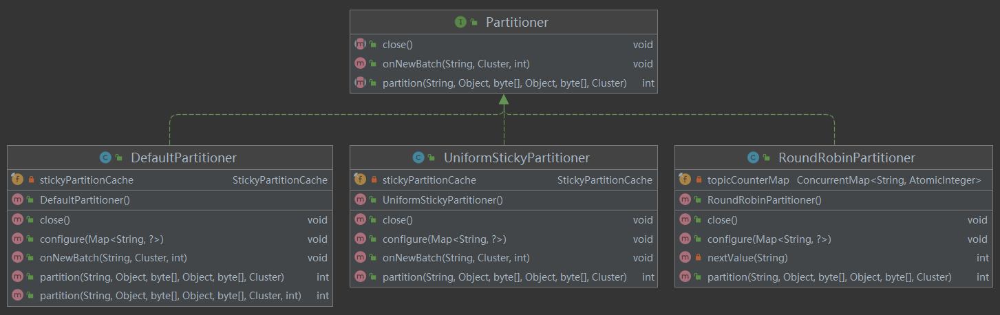
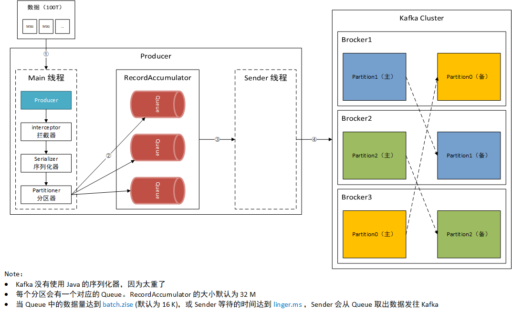

# 生产者 - 分区器

---


## 一、自带的分区器



### 1.1 DefaultPartitioner

>   The default partitioning strategy:
>
>   -   If a partition is specified in the record, use it
>   -   If no partition is specified but a key is present choose a partition based on a hash of the key
>   -   If no partition or key is present choose the sticky partition that changes when the batch is full. See KIP-480 for details about sticky partitioning.

-   如果指定了分区，直接发往这个分区
-   如果没有指定分区但是指定了 Key，基于这个 Key 的哈希值决定发往哪个分区（哈希值 % 分区数 = 目标分区）
-   如果分区和 Key  都没有指定，采用 Stick-Partition （黏性分区器）—— 随机选择一个分区，并尽可能一直使用该分区。待该分区对应的 Queue 中的数据量达到 batch.size 或 Sender 的等待时间达到 linger.ms，再<u>随机挑选</u>一个<u>其他分区</u>…





### 1.2 UniformStickyPartitioner

>   The partitioning strategy:
>
>   -   If a partition is specified in the record, use it
>   -   Otherwise choose the sticky partition that changes when the batch is full. NOTE: In constrast to the DefaultPartitioner, the record key is NOT used as part of the partitioning strategy in this partitioner. Records with the same key are not guaranteed to be sent to the same partition. See KIP-480 for details about sticky partitioning.

-   如果指定了分区，直接发往这个分区

-   如果没有指定分区，则采用 Stick-Partition （黏性分区器）

    注意：与 DefaultPartitioner 不同，Key 不会影响 UniformStickyPartitioner 的决策


### 1.3 RoundRobinPartitioner

>   The "Round-Robin" partitioner This partitioning strategy can be used when user wants to distribute the writes to all partitions equally. This is the behaviour regardless of record key hash.

-   将消息均匀的发往各个分区


## 二、自定义分区器

实现 Partitioner 接口即可创建自定义的分区器，例：

```java
public class CustomPartitioner implements Partitioner {

    private final Logger logger = LoggerFactory.getLogger(CustomPartitioner.class);

    /**
     * Compute the partition for the given record.
     *
     * @param topic      The topic name
     * @param key        The key to partition on (or null if no key)
     * @param keyBytes   The serialized key to partition on( or null if no key)
     * @param value      The value to partition on or null
     * @param valueBytes The serialized value to partition on or null
     * @param cluster    The current cluster metadata
     */
    @Override
    public int partition(String topic, Object key, byte[] keyBytes, Object value, byte[] valueBytes, Cluster cluster) {
        logger.info("topic:{},key:{},value:{}", topic, key, value);
        // 发送的字符串里面带有0的全部发完分区0，其他发完分区1
        if (value instanceof String && (((String) value).contains("0"))) {
            return 0;
        } else {
            return 1;
        }
    }

    @Override
    public void close() {

    }

    @Override
    public void configure(Map<String, ?> configs) {

    }
}
```


## 三、测试

### 3.1 自带的分区器

以 DefaultPartitioner 为例：

```java
private static void defaultPartitionerTest() throws ExecutionException, InterruptedException {
    // 1.配置 Producer
    Properties properties = new Properties();
    properties.put(ProducerConfig.BOOTSTRAP_SERVERS_CONFIG, "kafka1:9093,kafka2:9094,kafka3:9095");
    properties.put(ProducerConfig.KEY_SERIALIZER_CLASS_CONFIG, StringSerializer.class);
    properties.put(ProducerConfig.VALUE_SERIALIZER_CLASS_CONFIG, StringSerializer.class);
    properties.put(ProducerConfig.PARTITIONER_CLASS_CONFIG, "org.apache.kafka.clients.producer.internals.DefaultPartitioner"); // 不设置也可以，因为默认就是这个值
    KafkaProducer<Object, Object> producer = new KafkaProducer<>(properties);

    // 2.只指定分区
    for (int partition = 0; partition < 3; partition++) {
        for (int j = 0; j < 3; j++) {
            String key = "";
            producer.send(new ProducerRecord<>("myTopic123", partition, key, "hello world!"), (recordMetadata, e) -> {
                if (e == null) {
                    LOGGER.info("Test1. 发送成功. 主题：{} 分区：{}", recordMetadata.topic(), recordMetadata.partition());
                }
            }).get();
        }
    }

    // 3.只指定key
    for (int i = 0; i < 10; i++) {
        for (int j = 0; j < 2; j++) {
            String key = String.valueOf(i);
            producer.send(new ProducerRecord<>("myTopic123", key, "hello world!"), (recordMetadata, e) -> {
                if (e == null) {
                    LOGGER.info("Test2. 发送成功. 主题：{} 分区：{}", recordMetadata.topic(), recordMetadata.partition());
                }
            }).get();

        }
    }

    // 4.啥都不指定
    for (int i = 0; i < 30; i++) {
        producer.send(new ProducerRecord<>("myTopic123", "hello world!"), (recordMetadata, e) -> {
            if (e == null) {
                LOGGER.info("Test3. 发送成功. 主题：{} 分区：{}", recordMetadata.topic(), recordMetadata.partition());
            }
        }).get();
    }

}
```

结果：

```
[kafka-producer-network-thread | producer-1] INFO com.xzy.producer.b.SystemPartitionerProducer - Test1. 发送成功. 主题：myTopic123 分区：0
[kafka-producer-network-thread | producer-1] INFO com.xzy.producer.b.SystemPartitionerProducer - Test1. 发送成功. 主题：myTopic123 分区：0
[kafka-producer-network-thread | producer-1] INFO com.xzy.producer.b.SystemPartitionerProducer - Test1. 发送成功. 主题：myTopic123 分区：0
[kafka-producer-network-thread | producer-1] INFO com.xzy.producer.b.SystemPartitionerProducer - Test1. 发送成功. 主题：myTopic123 分区：1
[kafka-producer-network-thread | producer-1] INFO com.xzy.producer.b.SystemPartitionerProducer - Test1. 发送成功. 主题：myTopic123 分区：1
[kafka-producer-network-thread | producer-1] INFO com.xzy.producer.b.SystemPartitionerProducer - Test1. 发送成功. 主题：myTopic123 分区：1
[kafka-producer-network-thread | producer-1] INFO com.xzy.producer.b.SystemPartitionerProducer - Test1. 发送成功. 主题：myTopic123 分区：2
[kafka-producer-network-thread | producer-1] INFO com.xzy.producer.b.SystemPartitionerProducer - Test1. 发送成功. 主题：myTopic123 分区：2
[kafka-producer-network-thread | producer-1] INFO com.xzy.producer.b.SystemPartitionerProducer - Test1. 发送成功. 主题：myTopic123 分区：2

[kafka-producer-network-thread | producer-1] INFO com.xzy.producer.b.SystemPartitionerProducer - Test2. 发送成功. 主题：myTopic123 分区：2
[kafka-producer-network-thread | producer-1] INFO com.xzy.producer.b.SystemPartitionerProducer - Test2. 发送成功. 主题：myTopic123 分区：2
[kafka-producer-network-thread | producer-1] INFO com.xzy.producer.b.SystemPartitionerProducer - Test2. 发送成功. 主题：myTopic123 分区：0
[kafka-producer-network-thread | producer-1] INFO com.xzy.producer.b.SystemPartitionerProducer - Test2. 发送成功. 主题：myTopic123 分区：0
[kafka-producer-network-thread | producer-1] INFO com.xzy.producer.b.SystemPartitionerProducer - Test2. 发送成功. 主题：myTopic123 分区：2
[kafka-producer-network-thread | producer-1] INFO com.xzy.producer.b.SystemPartitionerProducer - Test2. 发送成功. 主题：myTopic123 分区：2
[kafka-producer-network-thread | producer-1] INFO com.xzy.producer.b.SystemPartitionerProducer - Test2. 发送成功. 主题：myTopic123 分区：2
[kafka-producer-network-thread | producer-1] INFO com.xzy.producer.b.SystemPartitionerProducer - Test2. 发送成功. 主题：myTopic123 分区：2
[kafka-producer-network-thread | producer-1] INFO com.xzy.producer.b.SystemPartitionerProducer - Test2. 发送成功. 主题：myTopic123 分区：1
[kafka-producer-network-thread | producer-1] INFO com.xzy.producer.b.SystemPartitionerProducer - Test2. 发送成功. 主题：myTopic123 分区：1
[kafka-producer-network-thread | producer-1] INFO com.xzy.producer.b.SystemPartitionerProducer - Test2. 发送成功. 主题：myTopic123 分区：0
[kafka-producer-network-thread | producer-1] INFO com.xzy.producer.b.SystemPartitionerProducer - Test2. 发送成功. 主题：myTopic123 分区：0
[kafka-producer-network-thread | producer-1] INFO com.xzy.producer.b.SystemPartitionerProducer - Test2. 发送成功. 主题：myTopic123 分区：1
[kafka-producer-network-thread | producer-1] INFO com.xzy.producer.b.SystemPartitionerProducer - Test2. 发送成功. 主题：myTopic123 分区：1
[kafka-producer-network-thread | producer-1] INFO com.xzy.producer.b.SystemPartitionerProducer - Test2. 发送成功. 主题：myTopic123 分区：0
[kafka-producer-network-thread | producer-1] INFO com.xzy.producer.b.SystemPartitionerProducer - Test2. 发送成功. 主题：myTopic123 分区：0
[kafka-producer-network-thread | producer-1] INFO com.xzy.producer.b.SystemPartitionerProducer - Test2. 发送成功. 主题：myTopic123 分区：0
[kafka-producer-network-thread | producer-1] INFO com.xzy.producer.b.SystemPartitionerProducer - Test2. 发送成功. 主题：myTopic123 分区：0
[kafka-producer-network-thread | producer-1] INFO com.xzy.producer.b.SystemPartitionerProducer - Test2. 发送成功. 主题：myTopic123 分区：2
[kafka-producer-network-thread | producer-1] INFO com.xzy.producer.b.SystemPartitionerProducer - Test2. 发送成功. 主题：myTopic123 分区：2

[kafka-producer-network-thread | producer-1] INFO com.xzy.producer.b.SystemPartitionerProducer - Test3. 发送成功. 主题：myTopic123 分区：2
[kafka-producer-network-thread | producer-1] INFO com.xzy.producer.b.SystemPartitionerProducer - Test3. 发送成功. 主题：myTopic123 分区：0
[kafka-producer-network-thread | producer-1] INFO com.xzy.producer.b.SystemPartitionerProducer - Test3. 发送成功. 主题：myTopic123 分区：2
[kafka-producer-network-thread | producer-1] INFO com.xzy.producer.b.SystemPartitionerProducer - Test3. 发送成功. 主题：myTopic123 分区：1
[kafka-producer-network-thread | producer-1] INFO com.xzy.producer.b.SystemPartitionerProducer - Test3. 发送成功. 主题：myTopic123 分区：0
[kafka-producer-network-thread | producer-1] INFO com.xzy.producer.b.SystemPartitionerProducer - Test3. 发送成功. 主题：myTopic123 分区：1
[kafka-producer-network-thread | producer-1] INFO com.xzy.producer.b.SystemPartitionerProducer - Test3. 发送成功. 主题：myTopic123 分区：0
[kafka-producer-network-thread | producer-1] INFO com.xzy.producer.b.SystemPartitionerProducer - Test3. 发送成功. 主题：myTopic123 分区：2
[kafka-producer-network-thread | producer-1] INFO com.xzy.producer.b.SystemPartitionerProducer - Test3. 发送成功. 主题：myTopic123 分区：0
[kafka-producer-network-thread | producer-1] INFO com.xzy.producer.b.SystemPartitionerProducer - Test3. 发送成功. 主题：myTopic123 分区：1
[kafka-producer-network-thread | producer-1] INFO com.xzy.producer.b.SystemPartitionerProducer - Test3. 发送成功. 主题：myTopic123 分区：0
[kafka-producer-network-thread | producer-1] INFO com.xzy.producer.b.SystemPartitionerProducer - Test3. 发送成功. 主题：myTopic123 分区：1
[kafka-producer-network-thread | producer-1] INFO com.xzy.producer.b.SystemPartitionerProducer - Test3. 发送成功. 主题：myTopic123 分区：0
[kafka-producer-network-thread | producer-1] INFO com.xzy.producer.b.SystemPartitionerProducer - Test3. 发送成功. 主题：myTopic123 分区：1
[kafka-producer-network-thread | producer-1] INFO com.xzy.producer.b.SystemPartitionerProducer - Test3. 发送成功. 主题：myTopic123 分区：0
[kafka-producer-network-thread | producer-1] INFO com.xzy.producer.b.SystemPartitionerProducer - Test3. 发送成功. 主题：myTopic123 分区：1
[kafka-producer-network-thread | producer-1] INFO com.xzy.producer.b.SystemPartitionerProducer - Test3. 发送成功. 主题：myTopic123 分区：2
[kafka-producer-network-thread | producer-1] INFO com.xzy.producer.b.SystemPartitionerProducer - Test3. 发送成功. 主题：myTopic123 分区：0
[kafka-producer-network-thread | producer-1] INFO com.xzy.producer.b.SystemPartitionerProducer - Test3. 发送成功. 主题：myTopic123 分区：1
[kafka-producer-network-thread | producer-1] INFO com.xzy.producer.b.SystemPartitionerProducer - Test3. 发送成功. 主题：myTopic123 分区：2
[kafka-producer-network-thread | producer-1] INFO com.xzy.producer.b.SystemPartitionerProducer - Test3. 发送成功. 主题：myTopic123 分区：0
[kafka-producer-network-thread | producer-1] INFO com.xzy.producer.b.SystemPartitionerProducer - Test3. 发送成功. 主题：myTopic123 分区：2
[kafka-producer-network-thread | producer-1] INFO com.xzy.producer.b.SystemPartitionerProducer - Test3. 发送成功. 主题：myTopic123 分区：1
[kafka-producer-network-thread | producer-1] INFO com.xzy.producer.b.SystemPartitionerProducer - Test3. 发送成功. 主题：myTopic123 分区：0
[kafka-producer-network-thread | producer-1] INFO com.xzy.producer.b.SystemPartitionerProducer - Test3. 发送成功. 主题：myTopic123 分区：1
[kafka-producer-network-thread | producer-1] INFO com.xzy.producer.b.SystemPartitionerProducer - Test3. 发送成功. 主题：myTopic123 分区：0
[kafka-producer-network-thread | producer-1] INFO com.xzy.producer.b.SystemPartitionerProducer - Test3. 发送成功. 主题：myTopic123 分区：2
[kafka-producer-network-thread | producer-1] INFO com.xzy.producer.b.SystemPartitionerProducer - Test3. 发送成功. 主题：myTopic123 分区：0
[kafka-producer-network-thread | producer-1] INFO com.xzy.producer.b.SystemPartitionerProducer - Test3. 发送成功. 主题：myTopic123 分区：1
[kafka-producer-network-thread | producer-1] INFO com.xzy.producer.b.SystemPartitionerProducer - Test3. 发送成功. 主题：myTopic123 分区：2
```

### 3.2 自定义分区器

```java
private static void customPartitionerTest() throws ExecutionException, InterruptedException {
    // 1.配置 Producer
    Properties properties = new Properties();
    properties.put(ProducerConfig.BOOTSTRAP_SERVERS_CONFIG, "kafka1:9093,kafka2:9094,kafka3:9095");
    properties.put(ProducerConfig.KEY_SERIALIZER_CLASS_CONFIG, StringSerializer.class);
    properties.put(ProducerConfig.VALUE_SERIALIZER_CLASS_CONFIG, StringSerializer.class);
    properties.put(ProducerConfig.PARTITIONER_CLASS_CONFIG, "com.xzy.producer.b.CustomPartitioner"); // 指定自定义的分区器
    KafkaProducer<Object, Object> producer = new KafkaProducer<>(properties);

    // 2.发送消息
    for (int i = 0; i < 30; i++) {
        String msg = "hello world!" + i;
        producer.send(new ProducerRecord<>("myTopic123", msg), (recordMetadata, e) -> {
            if (e == null) {
                LOGGER.info("发送成功. MSG:{} 分区：{}", msg, recordMetadata.partition());
            }
        }).get();
    }
}
```

结果：

```
[main] INFO com.xzy.producer.b.CustomPartitioner - topic:myTopic123,key:null,value:hello world!0
[main] INFO com.xzy.producer.b.CustomPartitioner - topic:myTopic123,key:null,value:hello world!0
[kafka-producer-network-thread | producer-1] INFO com.xzy.producer.b.CustomPartitionerProducer - 发送成功. MSG：hello world!0 分区：0
[main] INFO com.xzy.producer.b.CustomPartitioner - topic:myTopic123,key:null,value:hello world!1
[main] INFO com.xzy.producer.b.CustomPartitioner - topic:myTopic123,key:null,value:hello world!1
[kafka-producer-network-thread | producer-1] INFO com.xzy.producer.b.CustomPartitionerProducer - 发送成功. MSG：hello world!1 分区：1
[main] INFO com.xzy.producer.b.CustomPartitioner - topic:myTopic123,key:null,value:hello world!2
[main] INFO com.xzy.producer.b.CustomPartitioner - topic:myTopic123,key:null,value:hello world!2
[kafka-producer-network-thread | producer-1] INFO com.xzy.producer.b.CustomPartitionerProducer - 发送成功. MSG：hello world!2 分区：1
[main] INFO com.xzy.producer.b.CustomPartitioner - topic:myTopic123,key:null,value:hello world!3
[main] INFO com.xzy.producer.b.CustomPartitioner - topic:myTopic123,key:null,value:hello world!3
[kafka-producer-network-thread | producer-1] INFO com.xzy.producer.b.CustomPartitionerProducer - 发送成功. MSG：hello world!3 分区：1
[main] INFO com.xzy.producer.b.CustomPartitioner - topic:myTopic123,key:null,value:hello world!4
[main] INFO com.xzy.producer.b.CustomPartitioner - topic:myTopic123,key:null,value:hello world!4
[kafka-producer-network-thread | producer-1] INFO com.xzy.producer.b.CustomPartitionerProducer - 发送成功. MSG：hello world!4 分区：1
[main] INFO com.xzy.producer.b.CustomPartitioner - topic:myTopic123,key:null,value:hello world!5
[main] INFO com.xzy.producer.b.CustomPartitioner - topic:myTopic123,key:null,value:hello world!5
[kafka-producer-network-thread | producer-1] INFO com.xzy.producer.b.CustomPartitionerProducer - 发送成功. MSG：hello world!5 分区：1
[main] INFO com.xzy.producer.b.CustomPartitioner - topic:myTopic123,key:null,value:hello world!6
[main] INFO com.xzy.producer.b.CustomPartitioner - topic:myTopic123,key:null,value:hello world!6
[kafka-producer-network-thread | producer-1] INFO com.xzy.producer.b.CustomPartitionerProducer - 发送成功. MSG：hello world!6 分区：1
[main] INFO com.xzy.producer.b.CustomPartitioner - topic:myTopic123,key:null,value:hello world!7
[main] INFO com.xzy.producer.b.CustomPartitioner - topic:myTopic123,key:null,value:hello world!7
[kafka-producer-network-thread | producer-1] INFO com.xzy.producer.b.CustomPartitionerProducer - 发送成功. MSG：hello world!7 分区：1
[main] INFO com.xzy.producer.b.CustomPartitioner - topic:myTopic123,key:null,value:hello world!8
[main] INFO com.xzy.producer.b.CustomPartitioner - topic:myTopic123,key:null,value:hello world!8
[kafka-producer-network-thread | producer-1] INFO com.xzy.producer.b.CustomPartitionerProducer - 发送成功. MSG：hello world!8 分区：1
[main] INFO com.xzy.producer.b.CustomPartitioner - topic:myTopic123,key:null,value:hello world!9
[main] INFO com.xzy.producer.b.CustomPartitioner - topic:myTopic123,key:null,value:hello world!9
[kafka-producer-network-thread | producer-1] INFO com.xzy.producer.b.CustomPartitionerProducer - 发送成功. MSG：hello world!9 分区：1
[main] INFO com.xzy.producer.b.CustomPartitioner - topic:myTopic123,key:null,value:hello world!10
[main] INFO com.xzy.producer.b.CustomPartitioner - topic:myTopic123,key:null,value:hello world!10
[kafka-producer-network-thread | producer-1] INFO com.xzy.producer.b.CustomPartitionerProducer - 发送成功. MSG：hello world!10 分区：0
[main] INFO com.xzy.producer.b.CustomPartitioner - topic:myTopic123,key:null,value:hello world!11
[main] INFO com.xzy.producer.b.CustomPartitioner - topic:myTopic123,key:null,value:hello world!11
[kafka-producer-network-thread | producer-1] INFO com.xzy.producer.b.CustomPartitionerProducer - 发送成功. MSG：hello world!11 分区：1
[main] INFO com.xzy.producer.b.CustomPartitioner - topic:myTopic123,key:null,value:hello world!12
[main] INFO com.xzy.producer.b.CustomPartitioner - topic:myTopic123,key:null,value:hello world!12
[kafka-producer-network-thread | producer-1] INFO com.xzy.producer.b.CustomPartitionerProducer - 发送成功. MSG：hello world!12 分区：1
[main] INFO com.xzy.producer.b.CustomPartitioner - topic:myTopic123,key:null,value:hello world!13
[main] INFO com.xzy.producer.b.CustomPartitioner - topic:myTopic123,key:null,value:hello world!13
[kafka-producer-network-thread | producer-1] INFO com.xzy.producer.b.CustomPartitionerProducer - 发送成功. MSG：hello world!13 分区：1
[main] INFO com.xzy.producer.b.CustomPartitioner - topic:myTopic123,key:null,value:hello world!14
[main] INFO com.xzy.producer.b.CustomPartitioner - topic:myTopic123,key:null,value:hello world!14
[kafka-producer-network-thread | producer-1] INFO com.xzy.producer.b.CustomPartitionerProducer - 发送成功. MSG：hello world!14 分区：1
[main] INFO com.xzy.producer.b.CustomPartitioner - topic:myTopic123,key:null,value:hello world!15
[main] INFO com.xzy.producer.b.CustomPartitioner - topic:myTopic123,key:null,value:hello world!15
[kafka-producer-network-thread | producer-1] INFO com.xzy.producer.b.CustomPartitionerProducer - 发送成功. MSG：hello world!15 分区：1
[main] INFO com.xzy.producer.b.CustomPartitioner - topic:myTopic123,key:null,value:hello world!16
[main] INFO com.xzy.producer.b.CustomPartitioner - topic:myTopic123,key:null,value:hello world!16
[kafka-producer-network-thread | producer-1] INFO com.xzy.producer.b.CustomPartitionerProducer - 发送成功. MSG：hello world!16 分区：1
[main] INFO com.xzy.producer.b.CustomPartitioner - topic:myTopic123,key:null,value:hello world!17
[main] INFO com.xzy.producer.b.CustomPartitioner - topic:myTopic123,key:null,value:hello world!17
[kafka-producer-network-thread | producer-1] INFO com.xzy.producer.b.CustomPartitionerProducer - 发送成功. MSG：hello world!17 分区：1
[main] INFO com.xzy.producer.b.CustomPartitioner - topic:myTopic123,key:null,value:hello world!18
[main] INFO com.xzy.producer.b.CustomPartitioner - topic:myTopic123,key:null,value:hello world!18
[kafka-producer-network-thread | producer-1] INFO com.xzy.producer.b.CustomPartitionerProducer - 发送成功. MSG：hello world!18 分区：1
[main] INFO com.xzy.producer.b.CustomPartitioner - topic:myTopic123,key:null,value:hello world!19
[main] INFO com.xzy.producer.b.CustomPartitioner - topic:myTopic123,key:null,value:hello world!19
[kafka-producer-network-thread | producer-1] INFO com.xzy.producer.b.CustomPartitionerProducer - 发送成功. MSG：hello world!19 分区：1
[main] INFO com.xzy.producer.b.CustomPartitioner - topic:myTopic123,key:null,value:hello world!20
[main] INFO com.xzy.producer.b.CustomPartitioner - topic:myTopic123,key:null,value:hello world!20
[kafka-producer-network-thread | producer-1] INFO com.xzy.producer.b.CustomPartitionerProducer - 发送成功. MSG：hello world!20 分区：0
[main] INFO com.xzy.producer.b.CustomPartitioner - topic:myTopic123,key:null,value:hello world!21
[main] INFO com.xzy.producer.b.CustomPartitioner - topic:myTopic123,key:null,value:hello world!21
[kafka-producer-network-thread | producer-1] INFO com.xzy.producer.b.CustomPartitionerProducer - 发送成功. MSG：hello world!21 分区：1
[main] INFO com.xzy.producer.b.CustomPartitioner - topic:myTopic123,key:null,value:hello world!22
[main] INFO com.xzy.producer.b.CustomPartitioner - topic:myTopic123,key:null,value:hello world!22
[kafka-producer-network-thread | producer-1] INFO com.xzy.producer.b.CustomPartitionerProducer - 发送成功. MSG：hello world!22 分区：1
[main] INFO com.xzy.producer.b.CustomPartitioner - topic:myTopic123,key:null,value:hello world!23
[main] INFO com.xzy.producer.b.CustomPartitioner - topic:myTopic123,key:null,value:hello world!23
[kafka-producer-network-thread | producer-1] INFO com.xzy.producer.b.CustomPartitionerProducer - 发送成功. MSG：hello world!23 分区：1
[main] INFO com.xzy.producer.b.CustomPartitioner - topic:myTopic123,key:null,value:hello world!24
[main] INFO com.xzy.producer.b.CustomPartitioner - topic:myTopic123,key:null,value:hello world!24
[kafka-producer-network-thread | producer-1] INFO com.xzy.producer.b.CustomPartitionerProducer - 发送成功. MSG：hello world!24 分区：1
[main] INFO com.xzy.producer.b.CustomPartitioner - topic:myTopic123,key:null,value:hello world!25
[main] INFO com.xzy.producer.b.CustomPartitioner - topic:myTopic123,key:null,value:hello world!25
[kafka-producer-network-thread | producer-1] INFO com.xzy.producer.b.CustomPartitionerProducer - 发送成功. MSG：hello world!25 分区：1
[main] INFO com.xzy.producer.b.CustomPartitioner - topic:myTopic123,key:null,value:hello world!26
[main] INFO com.xzy.producer.b.CustomPartitioner - topic:myTopic123,key:null,value:hello world!26
[kafka-producer-network-thread | producer-1] INFO com.xzy.producer.b.CustomPartitionerProducer - 发送成功. MSG：hello world!26 分区：1
[main] INFO com.xzy.producer.b.CustomPartitioner - topic:myTopic123,key:null,value:hello world!27
[main] INFO com.xzy.producer.b.CustomPartitioner - topic:myTopic123,key:null,value:hello world!27
[kafka-producer-network-thread | producer-1] INFO com.xzy.producer.b.CustomPartitionerProducer - 发送成功. MSG：hello world!27 分区：1
[main] INFO com.xzy.producer.b.CustomPartitioner - topic:myTopic123,key:null,value:hello world!28
[main] INFO com.xzy.producer.b.CustomPartitioner - topic:myTopic123,key:null,value:hello world!28
[kafka-producer-network-thread | producer-1] INFO com.xzy.producer.b.CustomPartitionerProducer - 发送成功. MSG：hello world!28 分区：1
[main] INFO com.xzy.producer.b.CustomPartitioner - topic:myTopic123,key:null,value:hello world!29
[main] INFO com.xzy.producer.b.CustomPartitioner - topic:myTopic123,key:null,value:hello world!29
[kafka-producer-network-thread | producer-1] INFO com.xzy.producer.b.CustomPartitionerProducer - 发送成功. MSG：hello world!29 分区：1

Process finished with exit code 0
```

