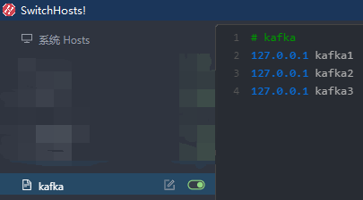
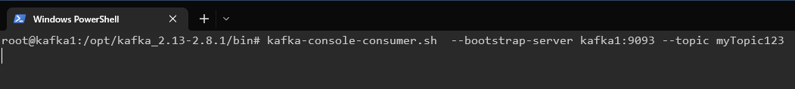
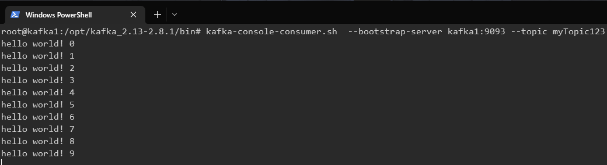
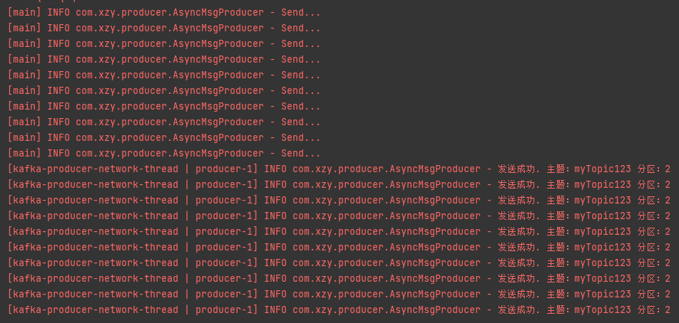

# 发送消息

---

运行环境说明：





## 一、异步发送 API


### 1.1 简单的异步发送

#### 代码：

maven：

```xml
<?xml version="1.0" encoding="UTF-8"?>
<project xmlns = "http://maven.apache.org/POM/4.0.0"
         xmlns:xsi = "http://www.w3.org/2001/XMLSchema-instance"
         xsi:schemaLocation = "http://maven.apache.org/POM/4.0.0 http://maven.apache.org/xsd/maven-4.0.0.xsd">
...
    
    <dependencies>
...
        <!--kafka-clients-->
        <dependency>
            <groupId>org.apache.kafka</groupId>
            <artifactId>kafka-clients</artifactId>
            <version>3.0.0</version>
        </dependency>
...
    </dependencies>
    
...
</project>
```

java：

```java
package com.xzy.producer;

import org.apache.kafka.clients.producer.KafkaProducer;
import org.apache.kafka.clients.producer.ProducerConfig;
import org.apache.kafka.clients.producer.ProducerRecord;
import org.apache.kafka.common.serialization.StringSerializer;

import java.util.Properties;

public class StringMsgProducer {
    public static void main(String[] args) throws InterruptedException {
        asyncSend();
        
        // 避免消息还没发完程序就结束
        Thread.sleep(3000);
    }

    /**
     * 普通异步发送
     *
     */
    private static void asyncSend() {
        KafkaProducer<String, String> stringKafkaProducer = buildStringKafkaProducer();
        for (int i = 0; i < 10; i++) {
            stringKafkaProducer.send(new ProducerRecord<>("myTopic123", "hello world! " + i));
        }

    }

    private static KafkaProducer<String, String> buildStringKafkaProducer() {
        Properties properties = new Properties();
        properties.put(ProducerConfig.BOOTSTRAP_SERVERS_CONFIG, "kafka1:9093,kafka2:9094,kafka3:9095");
        properties.put(ProducerConfig.KEY_SERIALIZER_CLASS_CONFIG, StringSerializer.class);
        properties.put(ProducerConfig.VALUE_SERIALIZER_CLASS_CONFIG, StringSerializer.class);

        return new KafkaProducer<>(properties);
    }
}
```

#### 测试：

使用 kafka-console-consumer.sh 脚本启动一个消费者：



启动 Java 程序，消费者接收到消息：




### 1.2 带回调的异步发送

#### 代码：

```java
    /**
     * 带回调的异步发送
     */
    private static void asyncSendWithCallback() {
        KafkaProducer<String, String> stringKafkaProducer = buildStringKafkaProducer();
        for (int i = 0; i < 10; i++) {
            stringKafkaProducer.send(new ProducerRecord<>("myTopic123", "hello world! " + i), new Callback() {
                @Override
                public void onCompletion(RecordMetadata recordMetadata, Exception e) {
                    if (e != null) {
                        logger.error("发送失败.");
                    } else {
                        logger.info("发送成功. 主题：{} 分区：{}", recordMetadata.topic(), recordMetadata.partition());
                    }
                }
            });
            logger.info("Send...");
        }
    }
```

#### 测试：




## 二、同步发送 API

#### 代码：

```java
/**
 * 异步发送
 */
private static void asyncSend() {
    KafkaProducer<String, String> stringKafkaProducer = buildStringKafkaProducer();
    for (int i = 0; i < 10; i++) {
        stringKafkaProducer.send(new ProducerRecord<>("myTopic123", "hello world! " + i), new Callback() {
            @Override
            public void onCompletion(RecordMetadata recordMetadata, Exception e) {
                if (e != null) {
                    logger.error("发送失败.");
                } else {
                    logger.info("发送成功. 主题：{} 分区：{}", recordMetadata.topic(), recordMetadata.partition());
                }
            }
        });
        logger.info("发送...");
    }
}

/**
 * 同步发送
 */
private static void syncSend() throws ExecutionException, InterruptedException {
    KafkaProducer<String, String> stringKafkaProducer = buildStringKafkaProducer();
    for (int i = 0; i < 10; i++) {
        RecordMetadata recordMetadata = stringKafkaProducer.send(new ProducerRecord<>("myTopic123", "hello world! " + i), new Callback() {
            @Override
            public void onCompletion(RecordMetadata recordMetadata, Exception e) {
                if (e != null) {
                    logger.error("发送失败.");
                } else {
                    logger.info("发送成功. 主题：{} 分区：{}", recordMetadata.topic(), recordMetadata.partition());
                }
            }
        }).get(); // 加上一个 get 操作，底层就是同步操作
        logger.info("发送...");
    }
}
```

#### 测试：

异步发送：

```
[main] INFO com.xzy.producer.SyncMsgProducer - 发送...
[main] INFO com.xzy.producer.SyncMsgProducer - 发送...
[main] INFO com.xzy.producer.SyncMsgProducer - 发送...
[main] INFO com.xzy.producer.SyncMsgProducer - 发送...
[main] INFO com.xzy.producer.SyncMsgProducer - 发送...
[main] INFO com.xzy.producer.SyncMsgProducer - 发送...
[main] INFO com.xzy.producer.SyncMsgProducer - 发送...
[main] INFO com.xzy.producer.SyncMsgProducer - 发送...
[main] INFO com.xzy.producer.SyncMsgProducer - 发送...
[main] INFO com.xzy.producer.SyncMsgProducer - 发送...
...
[kafka-producer-network-thread | producer-1] INFO com.xzy.producer.SyncMsgProducer - 发送成功. 主题：myTopic123 分区：2
[kafka-producer-network-thread | producer-1] INFO com.xzy.producer.SyncMsgProducer - 发送成功. 主题：myTopic123 分区：2
[kafka-producer-network-thread | producer-1] INFO com.xzy.producer.SyncMsgProducer - 发送成功. 主题：myTopic123 分区：2
[kafka-producer-network-thread | producer-1] INFO com.xzy.producer.SyncMsgProducer - 发送成功. 主题：myTopic123 分区：2
[kafka-producer-network-thread | producer-1] INFO com.xzy.producer.SyncMsgProducer - 发送成功. 主题：myTopic123 分区：2
[kafka-producer-network-thread | producer-1] INFO com.xzy.producer.SyncMsgProducer - 发送成功. 主题：myTopic123 分区：2
[kafka-producer-network-thread | producer-1] INFO com.xzy.producer.SyncMsgProducer - 发送成功. 主题：myTopic123 分区：2
[kafka-producer-network-thread | producer-1] INFO com.xzy.producer.SyncMsgProducer - 发送成功. 主题：myTopic123 分区：2
[kafka-producer-network-thread | producer-1] INFO com.xzy.producer.SyncMsgProducer - 发送成功. 主题：myTopic123 分区：2
[kafka-producer-network-thread | producer-1] INFO com.xzy.producer.SyncMsgProducer - 发送成功. 主题：myTopic123 分区：2
[kafka-producer-network-thread | producer-2] INFO com.xzy.producer.SyncMsgProducer - 发送成功. 主题：myTopic123 分区：2
```

同步发送：

```
[main] INFO com.xzy.producer.SyncMsgProducer - 发送...
[kafka-producer-network-thread | producer-2] INFO com.xzy.producer.SyncMsgProducer - 发送成功. 主题：myTopic123 分区：1
[main] INFO com.xzy.producer.SyncMsgProducer - 发送...
[kafka-producer-network-thread | producer-2] INFO com.xzy.producer.SyncMsgProducer - 发送成功. 主题：myTopic123 分区：2
[main] INFO com.xzy.producer.SyncMsgProducer - 发送...
[kafka-producer-network-thread | producer-2] INFO com.xzy.producer.SyncMsgProducer - 发送成功. 主题：myTopic123 分区：1
[main] INFO com.xzy.producer.SyncMsgProducer - 发送...
[kafka-producer-network-thread | producer-2] INFO com.xzy.producer.SyncMsgProducer - 发送成功. 主题：myTopic123 分区：0
[main] INFO com.xzy.producer.SyncMsgProducer - 发送...
[kafka-producer-network-thread | producer-2] INFO com.xzy.producer.SyncMsgProducer - 发送成功. 主题：myTopic123 分区：2
[main] INFO com.xzy.producer.SyncMsgProducer - 发送...
[kafka-producer-network-thread | producer-2] INFO com.xzy.producer.SyncMsgProducer - 发送成功. 主题：myTopic123 分区：1
[main] INFO com.xzy.producer.SyncMsgProducer - 发送...
[kafka-producer-network-thread | producer-2] INFO com.xzy.producer.SyncMsgProducer - 发送成功. 主题：myTopic123 分区：2
[main] INFO com.xzy.producer.SyncMsgProducer - 发送...
[kafka-producer-network-thread | producer-2] INFO com.xzy.producer.SyncMsgProducer - 发送成功. 主题：myTopic123 分区：1
[main] INFO com.xzy.producer.SyncMsgProducer - 发送...
[kafka-producer-network-thread | producer-2] INFO com.xzy.producer.SyncMsgProducer - 发送成功. 主题：myTopic123 分区：2
[main] INFO com.xzy.producer.SyncMsgProducer - 发送...
```

