# 集群部署（Docker）

>   参考文章：https://blog.csdn.net/sinat_36053757/article/details/123724748

---

[TOC]

## 一、集群规划

### 1. 新建 Docker 网络

```shell
docker network create docker-net --subnet 172.20.10.0/16
```

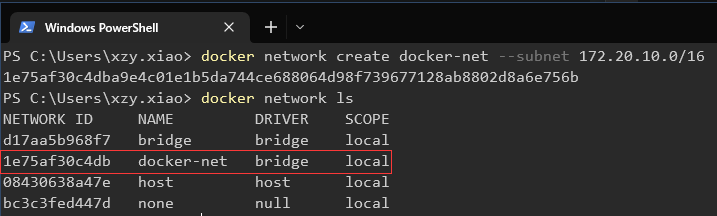

### 2. 集群规划

| hostname          | ip address   | port mapping                   | listener |
| ----------------- | ------------ | ------------------------------ | -------- |
| zook1             | 172.20.10.11 | 2184:2181                      |          |
| zook2             | 172.20.10.12 | 2185:2181                      |          |
| zook3             | 172.20.10.13 | 2186:2181                      |          |
| kafka1            | 172.20.10.14 | 内部 9093:9093, 外部 9193:9193 | kafka1   |
| kafka2            | 172.20.10.15 | 内部 9094:9094, 外部 9194:9194 | kafka2   |
| kafka3            | 172.20.10.16 | 内部 9095:9095, 外部 9195:9195 | kafka3   |
| 本机（宿主机Mbp） | 172.20.10.2  |                                |          |
| kafka manager     | 172.20.10.10 | 9000:9000                      |          |


## 二、构建 Zookeeper 集群

新建文件 zk-docker-compose.yml

```yaml
version: '1'

services:
  zook1:
    image: zookeeper:latest
    #restart: always #自动重新启动
    hostname: zook1
    container_name: zook1 #容器名称，方便在rancher中显示有意义的名称
    ports:
    - 2183:2181 #将本容器的zookeeper默认端口号映射出去
    volumes: # 挂载数据卷 前面是宿主机即本机的目录位置，后面是docker的目录
    - "/d/Docker/Mount/Zookeeper/zook1/data:/data"
    - "/d/Docker/Mount/Zookeeper/zook1/datalog:/datalog"
    - "/d/Docker/Mount/Zookeeper/zook1/logs:/logs"
    environment:
        ZOO_MY_ID: 1  #即是zookeeper的节点值，也是kafka的brokerid值
        ZOO_SERVERS: server.1=zook1:2888:3888;2181 server.2=zook2:2888:3888;2181 server.3=zook3:2888:3888;2181
    networks:
        docker-net:
            ipv4_address: 172.20.10.11

  zook2:   
    image: zookeeper:latest
    #restart: always #自动重新启动
    hostname: zook2
    container_name: zook2 #容器名称，方便在rancher中显示有意义的名称
    ports:
    - 2184:2181 #将本容器的zookeeper默认端口号映射出去
    volumes:
    - "/d/Docker/Mount/Zookeeper/zook2/data:/data"
    - "/d/Docker/Mount/Zookeeper/zook2/datalog:/datalog"
    - "/d/Docker/Mount/Zookeeper/zook2/logs:/logs"
    environment:
        ZOO_MY_ID: 2  #即是zookeeper的节点值，也是kafka的brokerid值
        ZOO_SERVERS: server.1=zook1:2888:3888;2181 server.2=zook2:2888:3888;2181 server.3=zook3:2888:3888;2181
    networks:
        docker-net:
            ipv4_address: 172.20.10.12
            
  zook3:   
    image: zookeeper:latest
    #restart: always #自动重新启动
    hostname: zook3
    container_name: zook3 #容器名称，方便在rancher中显示有意义的名称
    ports:
    - 2185:2181 #将本容器的zookeeper默认端口号映射出去
    volumes:
    - "/d/Docker/Mount/Zookeeper/zook3/data:/data"
    - "/d/Docker/Mount/Zookeeper/zook3/datalog:/datalog"
    - "/d/Docker/Mount/Zookeeper/zook3/logs:/logs"
    environment:
        ZOO_MY_ID: 3  #即是zookeeper的节点值，也是kafka的brokerid值
        ZOO_SERVERS: server.1=zook1:2888:3888;2181 server.2=zook2:2888:3888;2181 server.3=zook3:2888:3888;2181
    networks:
        docker-net:
            ipv4_address: 172.20.10.13
networks:
  docker-net:
      name: docker-net
```

执行脚本，构建 Zookeeper 集群：

```shell
docker compose -p zookeeper -f ./zk-docker-compose.yml up -d
```

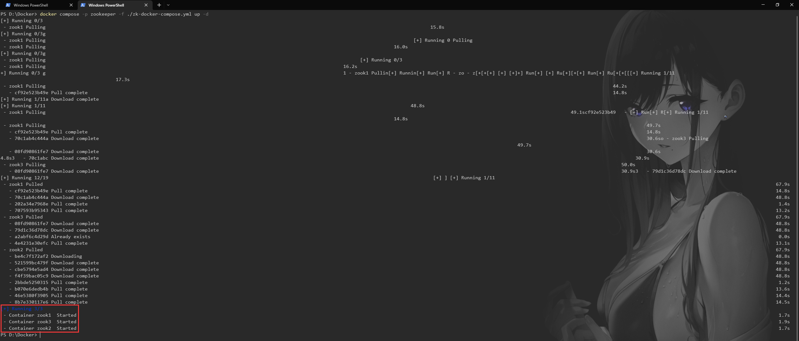

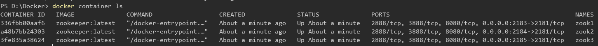

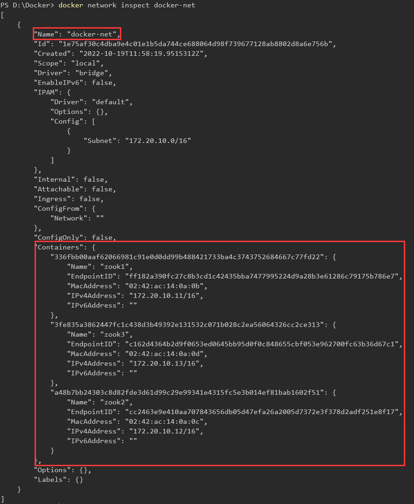


## 三、构建 Kafka 集群

新建文件 kafka-docker-compose.yml

```yaml
version: '2'

services:
  kafka1:
    image: docker.io/wurstmeister/kafka
    #restart: always #自动重新启动
    hostname: kafka1
    container_name: kafka1
    ports:
      - 9093:9093
      - 9193:9193
    environment:
      KAFKA_BROKER_ID: 1
      KAFKA_LISTENERS: INSIDE://:9093,OUTSIDE://:9193
      #KAFKA_ADVERTISED_LISTENERS=INSIDE://<container>:9092,OUTSIDE://<host>:9094
      SKAFKA_ADVERTISED_LISTENERS: INSIDE://kafka1:9093,OUTSIDE://localhost:9193
      KAFKA_LISTENER_SECURITY_PROTOCOL_MAP: INSIDE:PLAINTEXT,OUTSIDE:PLAINTEXT
      KAFKA_INTER_BROKER_LISTENER_NAME: INSIDE
      KAFKA_ZOOKEEPER_CONNECT: zook1:2181,zook2:2181,zook3:2181
      ALLOW_PLAINTEXT_LISTENER : 'yes'
      JMX_PORT: 9999 #开放JMX监控端口，来监测集群数据
    volumes:
      - /d/Docker/Mount/Kafka/kafka1/wurstmeister/kafka:/wurstmeister/kafka
      - /d/Docker/Mount/Kafka/kafka1/kafka:/kafka
    external_links:
      - zook1
      - zook2
      - zook3
    networks:
      docker-net:
        ipv4_address: 172.20.10.14

  kafka2:
    image: docker.io/wurstmeister/kafka
    #restart: always #自动重新启动
    hostname: kafka2
    container_name: kafka2
    ports:
      - 9094:9094
      - 9194:9194
    environment:
      KAFKA_BROKER_ID: 2
      KAFKA_LISTENERS: INSIDE://:9094,OUTSIDE://:9194
      #KAFKA_ADVERTISED_LISTENERS=INSIDE://<container>:9092,OUTSIDE://<host>:9094
      KAFKA_ADVERTISED_LISTENERS: INSIDE://kafka2:9094,OUTSIDE://localhost:9194
      KAFKA_LISTENER_SECURITY_PROTOCOL_MAP: INSIDE:PLAINTEXT,OUTSIDE:PLAINTEXT
      KAFKA_INTER_BROKER_LISTENER_NAME: INSIDE
      KAFKA_ZOOKEEPER_CONNECT: zook1:2181,zook2:2181,zook3:2181
      ALLOW_PLAINTEXT_LISTENER : 'yes'
      JMX_PORT: 9999 #开放JMX监控端口，来监测集群数据
    volumes:
      - /d/Docker/Mount/Kafka/kafka2/wurstmeister/kafka:/wurstmeister/kafka
      - /d/Docker/Mount/Kafka/kafka2/kafka:/kafka
    external_links:
      - zook1
      - zook2
      - zook3
    networks:
      docker-net:
        ipv4_address: 172.20.10.15

  kafka3:
    image: docker.io/wurstmeister/kafka
    #restart: always #自动重新启动
    hostname: kafka3
    container_name: kafka3
    ports:
      - 9095:9095
      - 9195:9195
    environment:
      KAFKA_BROKER_ID: 3
      KAFKA_LISTENERS: INSIDE://:9095,OUTSIDE://:9195
      #KAFKA_ADVERTISED_LISTENERS=INSIDE://<container>:9092,OUTSIDE://<host>:9094
      KAFKA_ADVERTISED_LISTENERS: INSIDE://kafka3:9095,OUTSIDE://localhost:9195
      KAFKA_LISTENER_SECURITY_PROTOCOL_MAP: INSIDE:PLAINTEXT,OUTSIDE:PLAINTEXT
      KAFKA_INTER_BROKER_LISTENER_NAME: INSIDE
      KAFKA_ZOOKEEPER_CONNECT: zook1:2181,zook2:2181,zook3:2181
      ALLOW_PLAINTEXT_LISTENER : 'yes'
      JMX_PORT: 9999 #开放JMX监控端口，来监测集群数据
    volumes:
      - /d/Docker/Mount/Kafka/kafka3/wurstmeister/kafka:/wurstmeister/kafka
      - /d/Docker/Mount/Kafka/kafka3/kafka:/kafka
    external_links:
      - zook1
      - zook2
      - zook3
    networks:
      docker-net:
        ipv4_address: 172.20.10.16
networks:
  docker-net:
      name: docker-net

```

执行脚本，构建 Kafka 集群：

```shell
docker compose -f ./kafka-docker-compose.yml up -d
```

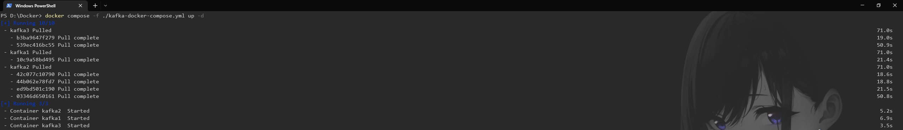

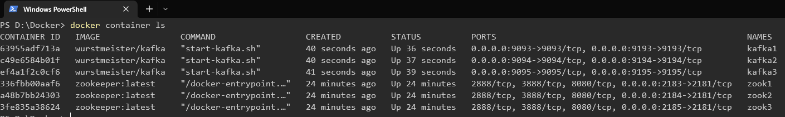

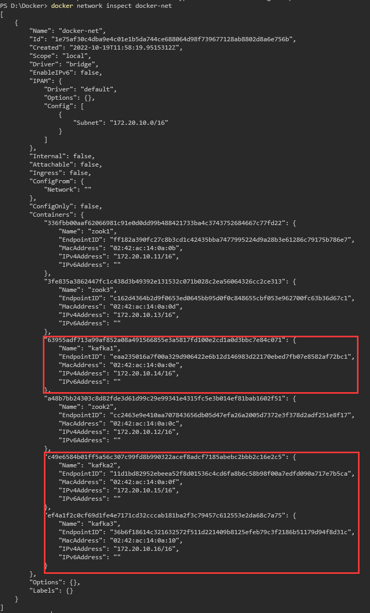


## 四、安装 Kafka Manager

新建文件 kafka-manager-docker-compose.yml

```yaml
version: '2'

services:
  kafka-manager:
    image: scjtqs/kafka-manager:latest
    restart: always
    hostname: kafka-manager
    container_name: kafka-manager
    ports:
      - 9000:9000
    external_links:  # 连接本compose文件以外的container
      - zook1
      - zook2
      - zook3
      - kafka1
      - kafka2
      - kafka3
    environment:
      ZK_HOSTS: zook1:2181,zook2:2181,zook3:2181
      KAFKA_BROKERS: kafka1:9093,kafka2:9094,kafka3:9095
      APPLICATION_SECRET: letmein
      KM_ARGS: -Djava.net.preferIPv4Stack=true
    networks:
      docker-net:
        ipv4_address: 172.20.10.10
networks:
  docker-net:
    external:
      name: docker-net

```

执行脚本，安装 Kafka Manager：

```shell
docker compose -f ./kafka-manager-docker-compose.yml up -d
```

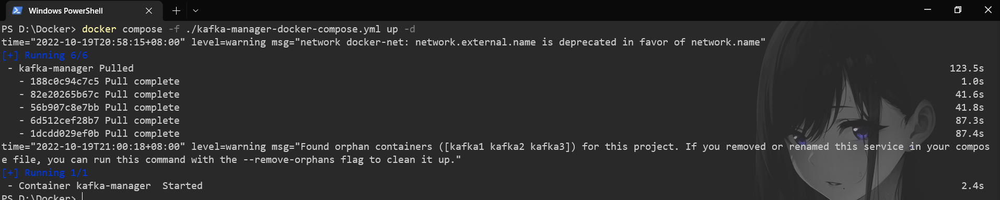

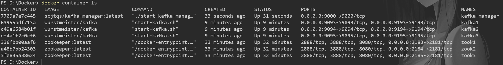

打开控制界面：http://127.0.0.1:9000/

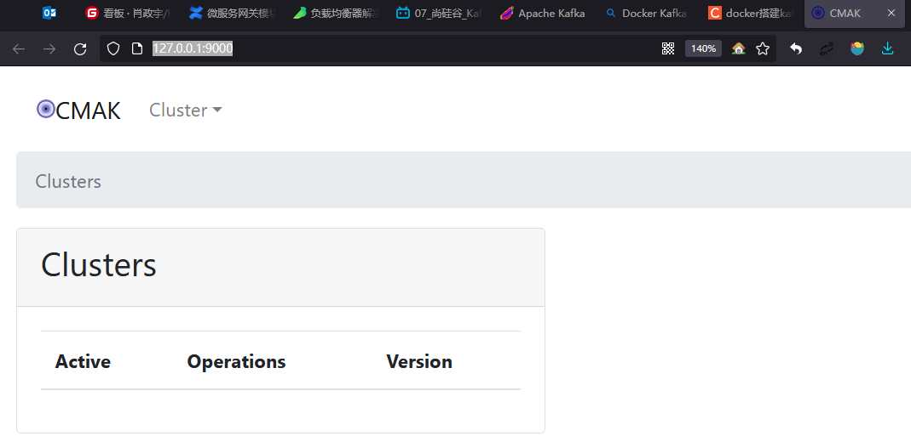

配置 Cluster：

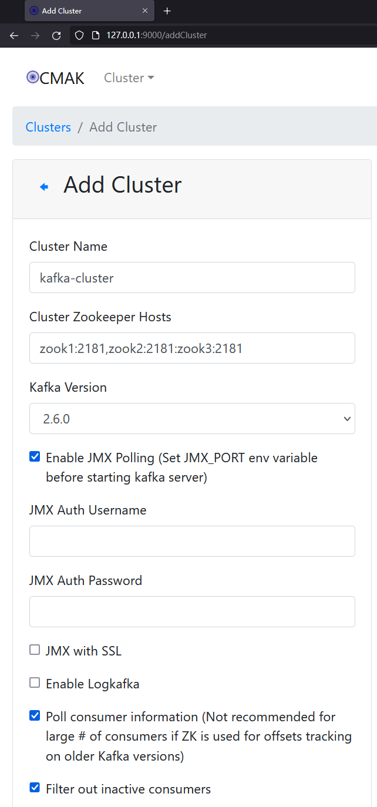

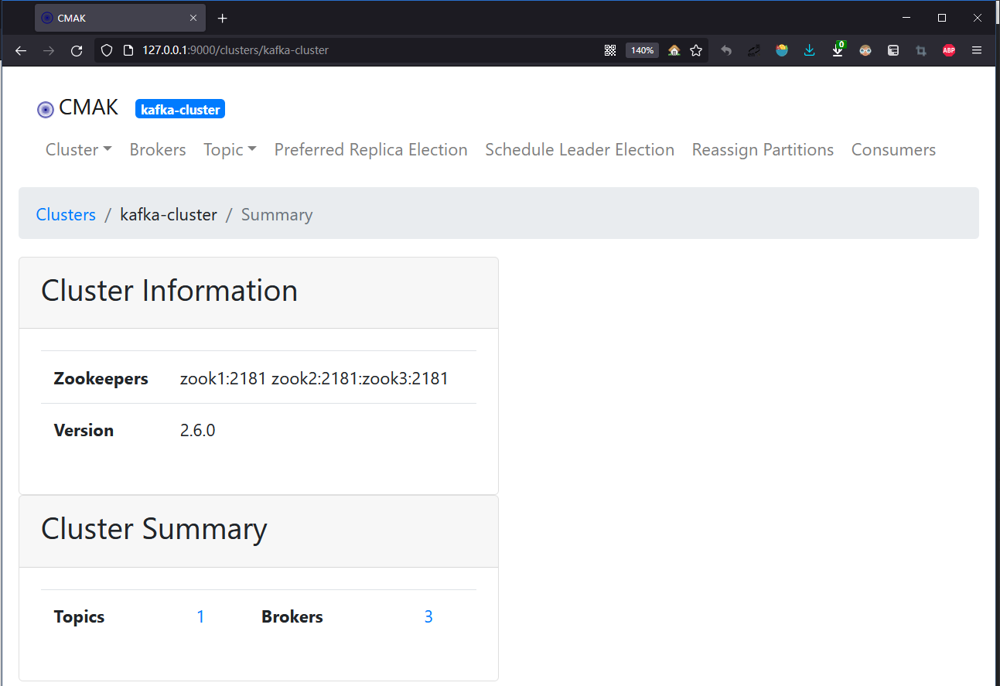


## 五、测试

进入 Kafka 容器：

```shell
docker exec -it kafka1 /bin/bash
```

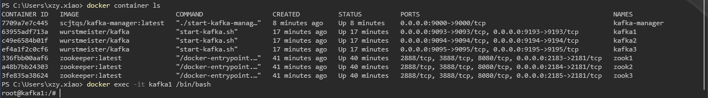

进入 Kafka 安装目录：

```
cd opt/kafka_2.13-2.8.1/
```

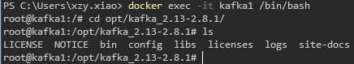

创建 Replication 为1，Partition 为3 的 Topic：

```shell
unset JMX_PORT; bin/kafka-topics.sh --create --zookeeper zook1:2181 --replication-factor 1 --partitions 3 --topic partopic
```


查看 Topic 状态：

```shell
bin/kafka-topics.sh --describe --zookeeper zook1:2181 --topic partopic
```


查看 Kafka Manager：

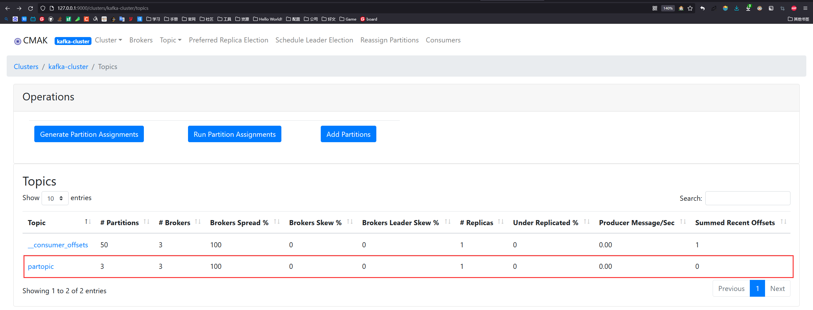

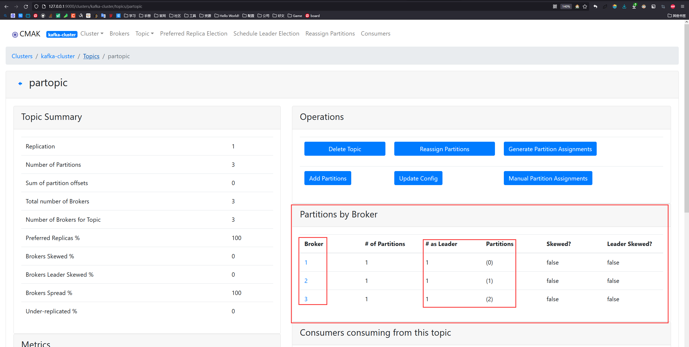

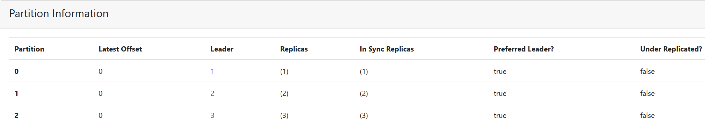


>   Note：关于 kafka-topic.sh
>
>   上文使用的命令中的 `replication-factor` 其实是让 Kafka 自动分配 Replication 的存储位置：
>
>   ```shell
>   unset JMX_PORT; bin/kafka-topics.sh --create --zookeeper zook1:2181 --replication-factor 1 --partitions 3 --topic partopic
>   ```
>
>   
>
>   
>
>   其实我们也可以使用 `replica-assignment` 自己指定 Replication 的存储位置：
>
>   ```shell
>   unset JMX_PORT; bin/kafka-topics.sh --create --zookeeper zook1:2181 --replica-assignment 0:1,1:2,2:0 --topic partopic2
>   ```
>
>   -   0:1,1:2,2:0 中的数字均为 broker.id：3个分区(逗号分隔)，每个分区有两个副本(副本所在的 broker 以冒号分割)