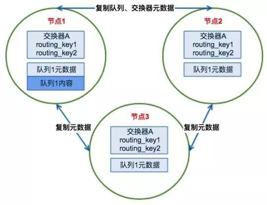

# RabbitMQ集群

---

## 普通模式

RabbitMQ是基于Erlang编写的，而Erlang语言天生具备分布式特性（通过同步Erlang集群各节点的 magic cookie 来实现），因此RabbitMQ天然支持Clustering。集群是提高系统可靠性的一种手段，同时，通过水平扩展还可以提高系统消息吞吐能力。

### RabbitMQ集群元数据同步

RabbitMQ集群的节点之间会相互同步4种类型的MQ元数据：

-   Queue元数据：队列名称、属性
-   Exchange元数据：交换机名称、类型、属性
-   Binding元数据：交换机与队列的绑定关系、binding_key
-   Vhost元数据：虚拟主机内部配置、属性

因此，用户从任意节点通过 rabbitmqctl 查询到的队列、交换机、虚拟主机等信息都是相同的。

⚠注意：<u>队列只会同步元数据信息，不会同步存储的消息——消息只会存储于创建该队列的节点，其他节点只知道这个队列的元数据信息以及拥有一个指向该队列的 owne_node 指针。</u>

>   **为何RabbitMQ集群采用元数据同步的方式？**
>
>   出于存储空间和性能的考虑：
>
>   -   存储空间：如果每个集群节点都拥有所有Queue的完全数据拷贝，那么每个节点的存储空间会非常大，集群的消息积压能力会非常弱（无法通过集群节点的扩容提高消息积压能力）
>   -   性能：消息的发布者需要将消息复制到每一个集群节点，对于持久化消息，网络和磁盘同步复制的开销都会明显增加

### RabbitMQ集群的基本原理

场景一、**客户端连接其他节点**

-   发布消息：如果客户端连接节点2、3，由于队列实际存在于节点1，此时节点2、3作为路由节点起到消息转发的作用——根据节点中存储的其他节点的元数据（上文提到的owner_node指针），将消息转发到节点1，最终消息被存储到节点1的队列1上
-   消费消息：如果客户端连接节点2、3，由于队列实际存在于节点1，此时节点2、3作为路由节点起到消息转发的作用——从节点1的队列1拉取数据进行消息

场景二、**客户端直接连接队列所在节点**

-   发布消息：消息直接被发送到节点1
-   消费消息：消息直接从节点1拉取

由于节点之间存在路由转发的情况，所以对于RabbitMQ集群最好是在一个局域网。

## 镜像模式

