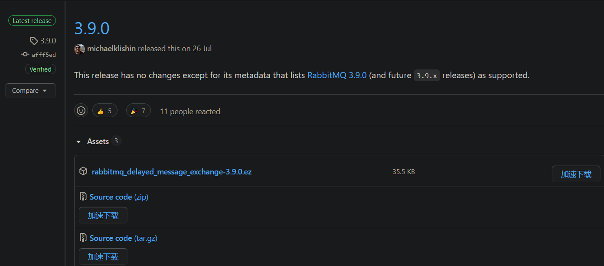
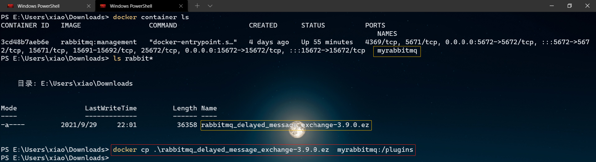
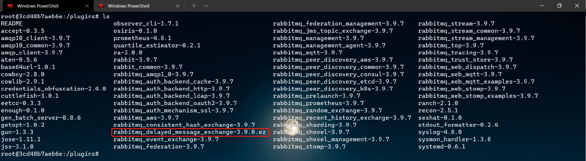
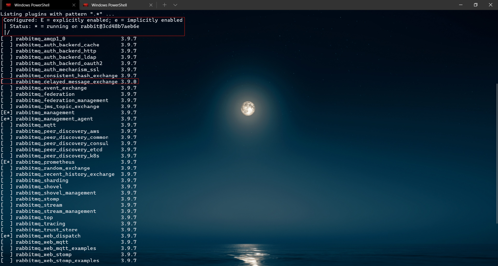
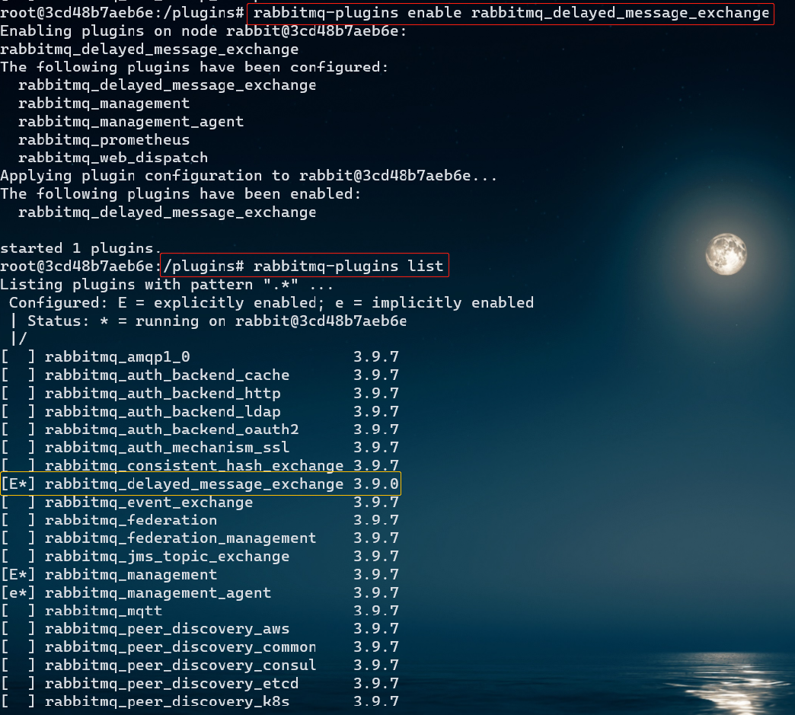
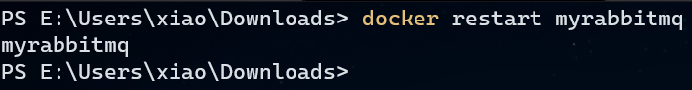
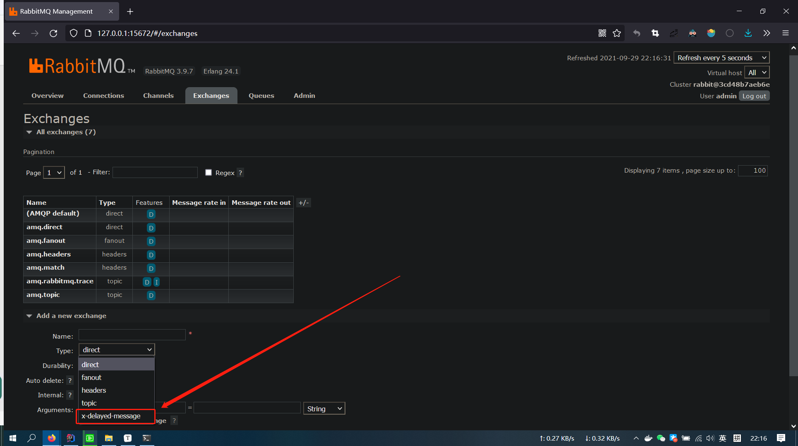

# Docker + RabbitMQ + 延迟队列插件

---

## 1. 获取Docker容器

详见[RabbitMQ安装与使用.md](./RabbitMQ安装与使用.md)


## 2. 安装延迟队列插件

### 2.1 确认RabbitMQ版本


### 2.2 下载插件

下载与安装的RabbitMQ匹配的插件：[rabbitmq-delayed-message-exchange](https://github.com/rabbitmq/rabbitmq-delayed-message-exchange/releases)



### 2.3 安装插件

#### 2.3.1 将插件从宿主机拷贝至容器

```bash
docker cp 宿主机文件 容器名称或ID:容器目录
```




#### 2.3.2 进入容器

```bash
 docker exec -it 容器名称或ID /bin/bash
```



可以看到插件已经成功拷贝到容器的指定目录


#### 2.3.3 查看插件列表

```bash
rabbitmq-plugins list
```




#### 2.3.4 启用插件

```bash
rabbitmq-plugins enable rabbitmq_delayed_message_exchange
```




#### 2.3.5 重启容器

```
docker restart 容器名称或ID
```




#### 2.3.6 验证结果



