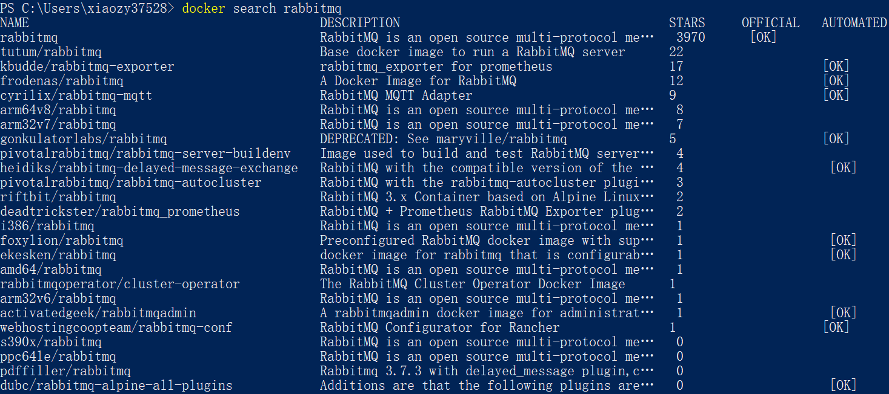
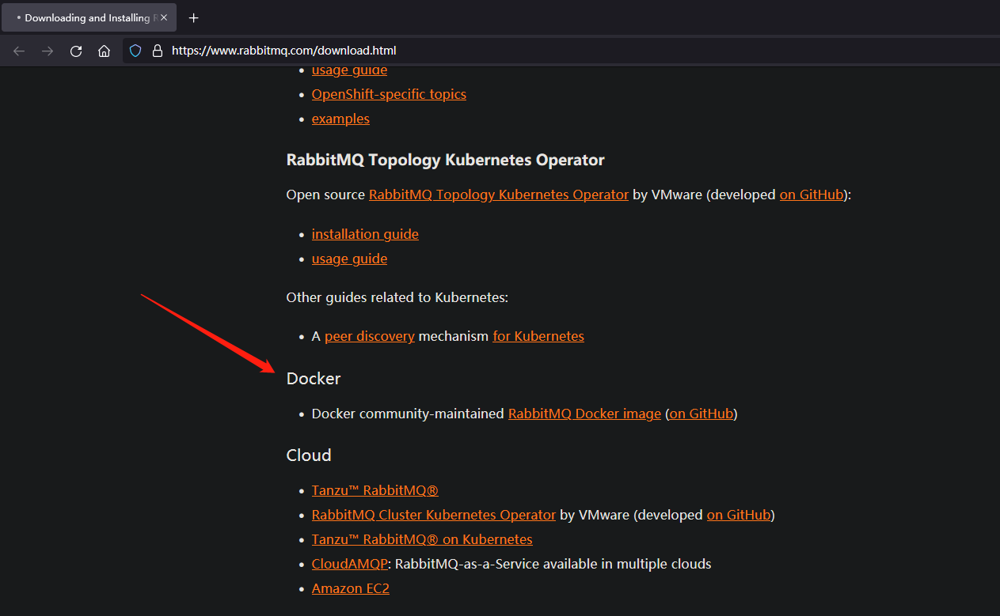
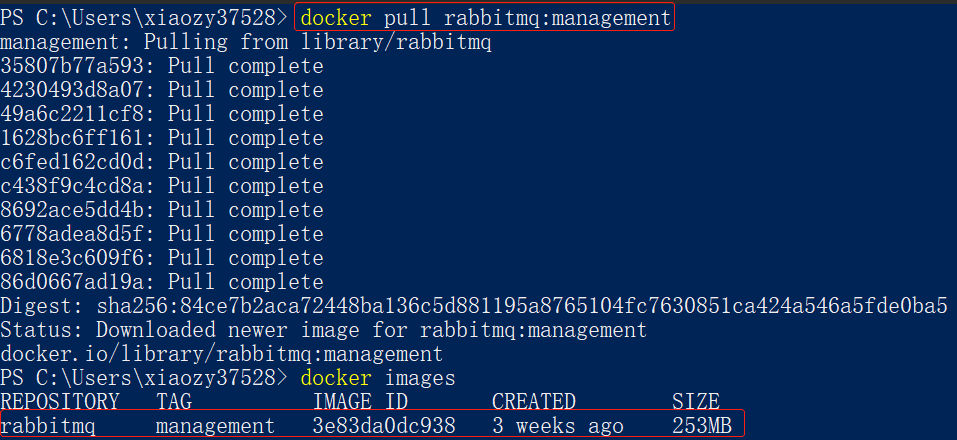
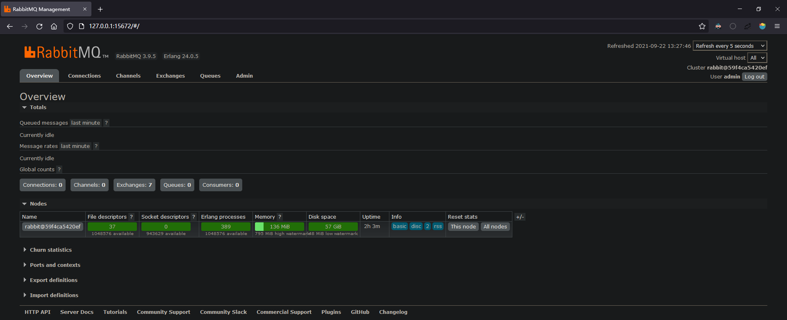

# RabbitMQ安装与使用

---

## 一、RabbitMQ + Linux


## 二、RabbitMQ + Docker

参考文章：https://www.cnblogs.com/yy-cola/p/11089800.html

### 1. 查找镜像

查找镜像有两种方式：

1.   docker search命令

     

2.   [RabbitMQ官网](https://www.rabbitmq.com/download.html)、相关镜像仓库查找

     

### 2. 下载镜像

```shell
# 注意：默认下载tag为latest的镜像，无法打开web管理页面。如果需要访问web管理页面，下载tag为management的镜像。
docker pull rabbitmq:management
```



### 3. 创建、运行容器

```shell
docker run -itd --name MyRabbitMQ -e RABBITMQ_DEFAULT_USER=admin -e RABBITMQ_DEFAULT_PASS=admin -p 15672:15672 -p 5672:5672 rabbitmq:management
```

参数说明：

```
docker 
    run 
        -i                               # 以交互模式运行容器，通常与 -t 同时使用
        -t                               # 为容器重新分配一个伪输入终端，通常与 -i 同时使用
        -d                               # 后台运行容器，并返回容器ID
        --name MyRabbitMQ                # 容器名称
        -e RABBITMQ_DEFAULT_USER=admin   # 管理系统用户名
        -e RABBITMQ_DEFAULT_PASS=admin   # 管理系统密码
        -p 15672:15672                   # Web管理页面访问端口
        -p 5672:5672                     # RabbitMQ服务端口
    rabbitmq:management
```

Web管理页面：127.0.0.1:15672

