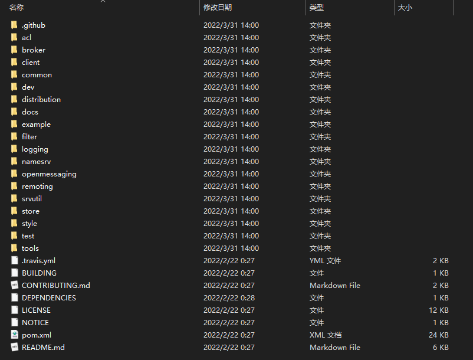
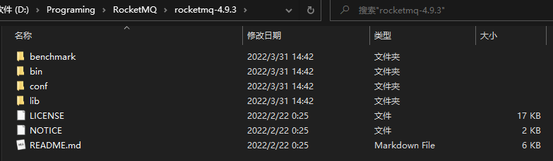
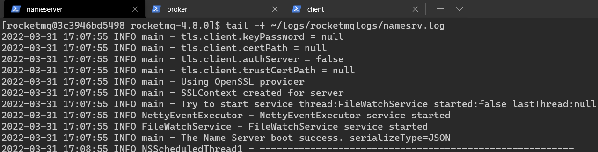
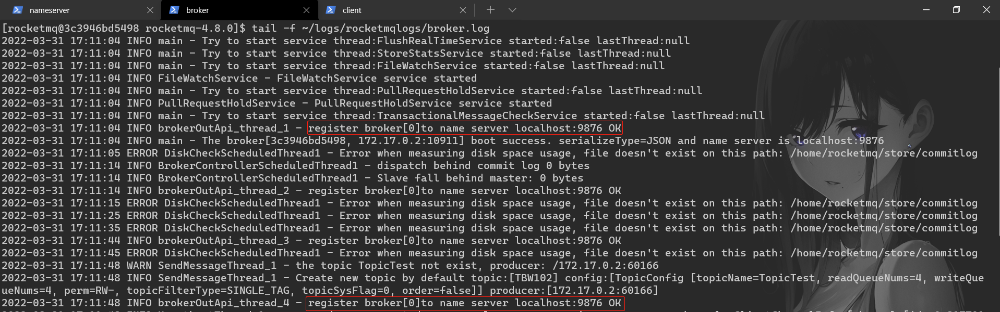
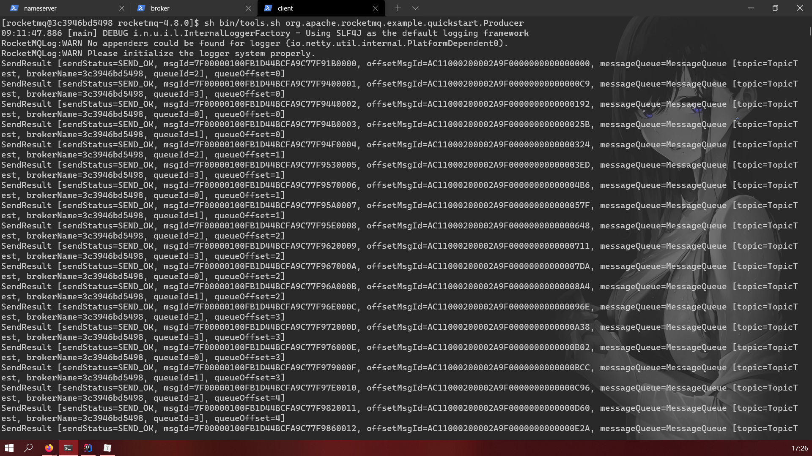
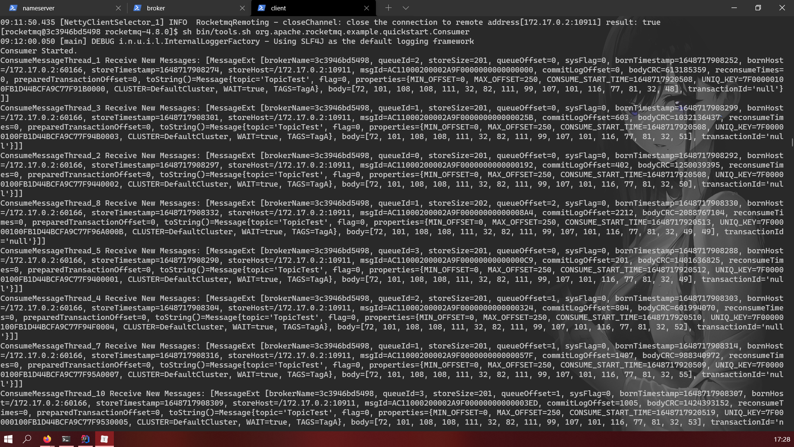

# RocketMQ 安装

<(￣︶￣)↗[官网文档：Quick Start](https://rocketmq.apache.org/docs/quick-start/)

[toc]


## 一、准备运行环境

-   64位操作系统，推荐 Linux、Unix、Mac
-   64位 JDK 1.8 +
-   Maven 3.2.x
-   Git
-   4G 以上的内存空间


## 二、获取 RocketMQ 运行文件

Click [here](https://www.apache.org/dyn/closer.cgi?path=rocketmq/4.9.3/rocketmq-all-4.9.3-source-release.zip) to download the 4.9.3 source release. Also you could download a binary release from [here](https://www.apache.org/dyn/closer.cgi?path=rocketmq/4.9.3/rocketmq-all-4.9.3-bin-release.zip).

1.  解压文件

    Linux 环境下可以使用 unzip 命令，Window 环境下可以使用解压软件

    ```shell
    > unzip rocketmq-all-4.9.3-source-release.zip
    ```

    

2.  使用 Mavan 构建二进制文件

```shell
> cd rocketmq-all-4.9.3/
> mvn -Prelease-all -DskipTests clean install -U
> cd distribution/target/rocketmq-4.9.3/rocketmq-4.9.3
```


>   PS：自己构建二进制文件可能会失败，可以选择直接下载二进制文件
>
>   


## 三、安装与测试

### Linux 环境

#### 1、启动 Name Server

```shell
> nohup sh bin/mqnamesrv &
> tail -f ~/logs/rocketmqlogs/namesrv.log
The Name Server boot success...
```

#### 2、启动 Broker

```shell
> nohup sh bin/mqbroker -n localhost:9876 &
> tail -f ~/logs/rocketmqlogs/broker.log 
The broker[%s, 172.30.30.233:10911] boot success...
```

>   Note：tail 命令可用于查看文件的内容，有一个常用的参数 -f 常用于查阅正在改变的日志文件。

#### 3、配置环境变量

生产/消费消息前，需要先告诉客户端 Name Server 的地址，最简单的方式就是配置环境变量

```shell
> export NAMESRV_ADDR=localhost:9876
```

#### 4、发送消息

```shell
> sh bin/tools.sh org.apache.rocketmq.example.quickstart.Producer
SendResult [sendStatus=SEND_OK, msgId= ...
...
```

#### 5、接收消息

```shell
> sh bin/tools.sh org.apache.rocketmq.example.quickstart.Consumer
ConsumeMessageThread_%d Receive New Messages: [MessageExt...
...
```

>   Note：大概描述一下 Name Server 的作用
>
>   -   Broker 启动后会到 Name Server 登记自己的信息
>   -   Client 到 Name Server 查询目标 Broker 的信息，然后向目标 Broker 发送/获取消息

#### 6、关闭 Name Server

```shell
> sh bin/mqshutdown broker
The mqbroker(36695) is running...
Send shutdown request to mqbroker(36695) OK
```

#### 7、关闭 Broker

```shell
> sh bin/mqshutdown namesrv
The mqnamesrv(36664) is running...
Send shutdown request to mqnamesrv(36664) OK
```


### Windows 环境

#### 1、配置环境变量

```
ROCKETMQ_HOME="D:\Programing\RocketMQ\rocketmq-4.9.3"
NAMESRV_ADDR="localhost:9876"
```

#### 2、启动 Name Server

```shell
.\bin\mqnamesrv.cmd
```

#### 3、启动 Broker

```shell
.\bin\mqbroker.cmd -n localhost:9876 autoCreateTopicEnable=true
```

#### 4、发送消息

```shell
.\bin\tools.cmd  org.apache.rocketmq.example.quickstart.Producer
```

#### 5、接收消息

```shell
.\bin\tools.cmd  org.apache.rocketmq.example.quickstart.Consumer
```

#### 6、关闭

Normally, you can just closed these powershell windows. (Do not do it at production environment)


### Docker 环境

#### 1、拉取镜像

```bash
docker pull foxiswho/rocketmq:4.8.0
```

#### 2、创建实例

```shell
docker run -itd --name myRocketMQ foxiswho/rocketmq:4.8.0
```

#### 3、进入实例

```shell
docker exec -it myRocketMQ /bin/bash
```

#### 4、启动 Name Server

```shell
 nohup sh bin/mqnamesrv &
```

>   查看日志信息：
>
>   ```shell
>   tail -f ~/logs/rocketmqlogs/namesrv.log
>   ```
>
>   

#### 5、启动 Broker

```shell
nohup sh bin/mqbroker -n localhost:9876 &
```

>   查看日志信息：
>
>   ```shell
>   tail -f ~/logs/rocketmqlogs/broker.log
>   ```
>
>   

#### 6、生产消息

```shell
sh bin/tools.sh org.apache.rocketmq.example.quickstart.Producer
```



#### 7、消费消息

```shell
sh bin/tools.sh org.apache.rocketmq.example.quickstart.Consumer
```

