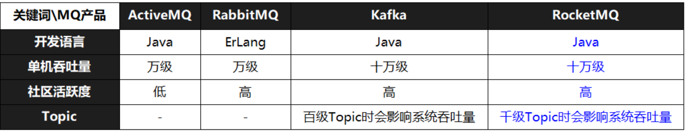
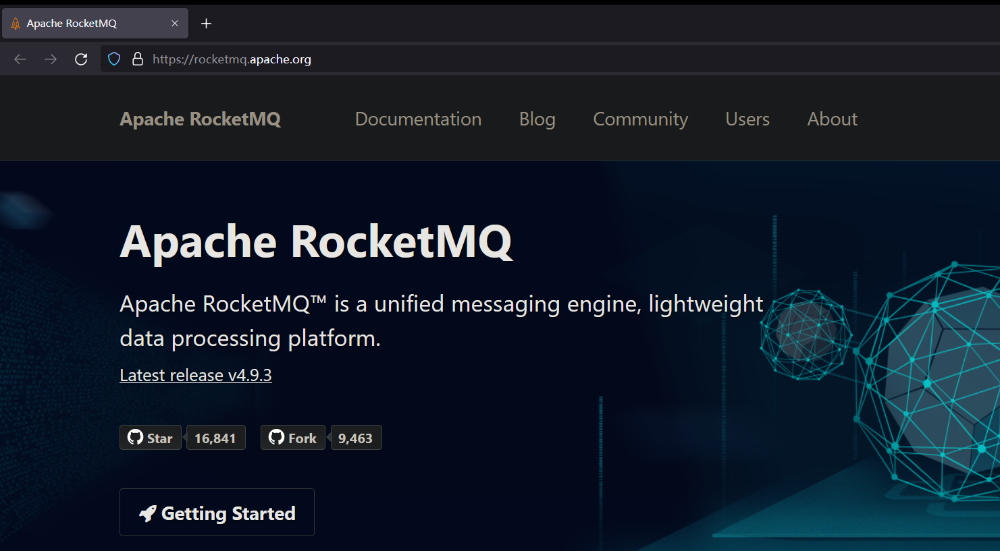

# RocketMQ

[toc]


## 第1章 基础知识

### 一、MQ 概述

#### 1、MQ 的含义

队列（Queue）是基础数据结构中一种具有==“先进先出”==特点的数据结构。消息队列（Message  Queue）即专门存储消息的队列。

#### 2、MQ 的作用

消息队列是分布式系统中非常重要的中间件，主要用于实现应用解耦、异步通讯、流量削峰，最终保障系统的高性能、高可用、可伸缩、最终一致性。

-   **解耦**

    假设有 A，B1，B2，B3 系统，A 系统负责生产消息，B1、B2、B3 系统负责消费消息。

    <u>耦合的情况</u>：A 系统需要记录 B1、B2、B3 系统的地址，将生产好的消息直接向 B1、B2、B3系统发送。此时如果 B2 系统不再需要接收消息，或者临时新增了一个 B4 系统也要接收消息，那么 A 系统就不得不删除 B2 系统的地址，或者新增 B4 系统的地址。在这种情况下，A 系统除了要负责生产消息，还需要关心消息的消费，也就是说 AB 系统是强耦合的。

    ```mermaid
    graph TB
    A-->B
    A-->C
    A-->D
    ```

    

    <u>解耦的情况</u>：引入一个第三方 —— MQ，A 系统将生产好的消息存到 MQ，其他系统按需到 MQ 获取消息。至于到底是哪些系统去获取消息？到底有没有系统去消费消息？什么时候获取的消息？A 系统完全不关心，也就是说 AB 系统是解耦的。

    ```mermaid
    graph TB
    A-->MQ
    MQ-->B
    MQ-->C
    MQ-->D
    ```

-   **异步**

    <u>AB 系统同步通讯</u>：A 系统需要等待 B 系统将消息消费，只有收到 B 系统的响应信息才能继续干其他使用

    ```mermaid
    graph LR
    A-->B
    B-->A
    ```

    ```sequence
    A->B:发送消息
    B->B:消费消息
    B->A:响应
    A->Other:干其他事情
    ```

    

    <u>AB 系统异步通讯</u>：A 系统把生产好的消息保存到 MQ，然后直接去做其他事情；B 系统从 MQ 获取消息，消费消息

    ```mermaid
    graph LR
    A-->MQ
    MQ-->A
    B-->MQ
    MQ-->B
    ```

    ```sequence
    A->MQ: 发送消息
    A->Other: 干其他事情
    B->MQ: 请求消息
    MQ->B: 获取消息
    B->B: 消费消息
    ```

    >   Note：同步通讯 = 语音/视频聊天，异步通讯 = 文字聊天（有空了再回消息）

-   **削峰**

    每天 0:00 到 12:00，A 系统风平浪静，每秒并发请求数量就 50 个。结果每次一到 12:00 ~ 13:00 ，每秒并发请求数量突然会暴增到 5k+ 条。但是系统是直接基于 MySQL 的，大量的请求涌入 MySQL，每秒钟对 MySQL 执行约 5k 条 SQL。

    一般的 MySQL，扛到每秒 2k 个请求就差不多了，如果每秒请求到 5k 的话，可能就直接把 MySQL 给打死了，导致系统崩溃，用户也就没法再使用系统了。

    但是高峰期一过，到了下午的时候，就成了低峰期，可能也就 1w 的用户同时在网站上操作，每秒中的请求数量可能也就 50 个请求，对整个系统几乎没有任何的压力。

    

    如果使用 MQ，每秒 5k 个请求写入 MQ，A 系统每秒钟最多处理 2k 个请求，因为 MySQL 每秒钟最多处理 2k 个。A 系统从 MQ 中慢慢拉取请求，每秒钟就拉取 2k 个请求，不要超过自己每秒能处理的最大请求数量就 ok，这样下来，哪怕是高峰期的时候，A 系统也绝对不会挂掉。而 MQ 每秒钟 5k 个请求进来，就 2k 个请求出去，结果就导致在中午高峰期（1 个小时），可能有几十万甚至几百万的请求积压在 MQ 中。

    这个短暂的高峰期积压是 ok 的，因为高峰期过了之后，每秒钟就 50 个请求进 MQ，但是 A 系统依然会按照每秒 2k 个请求的速度在处理。所以说，只要高峰期一过，A 系统就会快速将积压的消息给解决掉。

    >   Note：
    >
    >   -   如果观看抽奖或秒杀系统的请求监控曲线，你就会发现这类系统在活动开放的时间段内会出现一个波峰，而在活动未开放时，系统的请求量、机器负载一般都是比较平稳的。==为了节省机器资源，我们不可能时时都提供最大化的资源能力来支持短时间的高峰请求。==所以需要使用一些技术手段，来削弱瞬时的请求高峰，让系统吞吐量在高峰请求下保持可控。
    >
    >   -   水库的一个重要作用：洪峰控制
    >
    >       


#### 3、MQ 的缺点

1.   **系统可用性降低**

     系统引入的外部依赖越多，越容易挂掉。本来你就是 A 系统调用 BCD 三个系统的接口就好了，人 ABCD 四个系统好好的，没啥问题，你偏加个 MQ 进来，万一 MQ 挂了咋整，MQ 一挂，整套系统崩溃的，你不就完了？

2.   **系统复杂度提高**

     硬生生加个 MQ 进来，你怎么保证消息没有重复消费？怎么处理消息丢失的情况？怎么保证消息传递的顺序性？

3.   **数据一致性问题**

     A 系统处理完了直接返回成功了，人都以为你这个请求就成功了；但是问题是，要是 BCD 三个系统那里，BD 两个系统写库成功了，结果 C 系统写库失败了，咋整？你这数据就不一致了。

所以消息队列实际是一种非常复杂的架构，你引入它有很多好处，但是也得针对它带来的坏处做各种额外的技术方案和架构来规避掉，做好之后，你会发现，妈呀，系统复杂度提升了一个数量级，也许是复杂了 10 倍。但是关键时刻，用，还是得用的。

#### 4、MQ 常见产品

**ActiveMQ**

ActiveMQ 是使用Java语言开发一款 MQ 产品。早期很多公司与项目中都在使用，但现在的社区活跃度已经很低。现在的项目中已经很少使用了。


**RabbitMQ**

RabbitMQ 是使用 ErLang 语言开发的一款 MQ 产品。其吞吐量较 Kafka 与 RocketMQ 要低，且由于其不是 Java 语言开发，所以公司内部对其实现定制化开发难度较大。


**Kafka**

Kafka 是使用 Scala/Java 语言开发的一款 MQ 产品。其最大的特点就是高吞吐率，常用于大数据领域的实时计算、日志采集等场景。其没有遵循任何常见的 MQ 协议，而是使用自研协议。


**RocketMQ**

RocketMQ 是使用 Java 语言开发的一款 MQ 产品。经过数年阿里双11的考验，性能与稳定性非常高。其没有遵循任何常见的 MQ 协议，而是使用自研协议。




#### 5、MQ 常见协议

**JMS**

JMS，Java Messaging Service（Java消息服务）。是 Java 平台上有关 MOM（Message Oriented Middleware，面向消息的中间件 PO/OO/AO）的技术规范，它便于消息系统中的 Java 应用程序进行消息交换，并且通过提供标准的产生、发送、接收消息的接口，简化企业应用的开发。<u>ActiveMQ 是该协议的典型实现。</u>


**STOMP**

STOMP，Streaming Text Orientated Message Protocol（面向流文本的消息协议），是一种 MOM 设计的简单文本协议。STOMP 提供一个可互操作的连接格式，允许客户端与任意 STOMP 消息代理（Broker）进行交互。<u>ActiveMQ 是该协议的典型实现，RabbitMQ 通过插件可以支持该协议</u>。


**AMQP**

AMQP，Advanced Message Queuing Protocol（高级消息队列协议），一个提供统一消息服务的应用层标准，是应用层协议的一个开放标准，是一种 MOM 设计。基于此协议的客户端与消息中间件可传递消息，并不受客户端/中间件不同产品，不同开发语言等条件的限制。 <u>RabbitMQ 是该协议的典型实现</u>。


**MQTT**

MQTT，Message Queuing Telemetry Transport（消息队列遥测传输），是IBM开发的一个即时通讯协议，是一种二进制协议，主要用于服务器和低功耗 IoT（物联网）设备间的通信。该协议支持所有平台，几乎可以把所有联网物品和外部连接起来，被用来当做传感器和致动器的通信协议。 <u>RabbitMQ通过插件可以支持该协议</u>。


### 二、RocketMQ 概述

官网地址：https://rocketmq.apache.org/

官方定义：统一的消息引擎、轻量级数据处理平台





发展历程：

-   2007年，阿里开始五彩石项目，Notify 作为项目中交易核心消息流转系统，应运而生。Notify 系统是 RocketMQ 的雏形
-   2010年，B2B 大规模使用 ActiveMQ 作为阿里的消息内核，阿里急需一个具有海量堆积能力的消息系统
-   2011年，年初，Kafka 开源，淘宝中间件团队在对 Kafka 进行了深入研究后，开发了一款新的 MQ —— MetaQ
-   2012年，MetaQ 发展到了 v3.0 版本，在它基础上进行了进一步的抽象，形成了 RocketMQ，然后就将其进行了开源
-   2015年，阿里在 RocketMQ 的基础上，又推出了一款专门针对阿里云上用户的消息系统 Aliware MQ
-   2016年，双十一，RocketMQ 承载了万亿级消息的流转，跨越了一个新的里程碑。11⽉28⽇，阿⾥巴巴向 Apache 软件基⾦会捐赠 RocketMQ
-   2017年，9⽉25⽇，Apache 宣布 RocketMQ 孵化成为 Apache 顶级项⽬（TLP ）


<(￣︶￣)↗[官文：为什么选择 RocketMQ？RocketMQ 与 ActiveMQ、Kafka 的比较](https://rocketmq.apache.org/docs/motivation/)


## 第2章 安装与使用


## 第3章 底层原理

