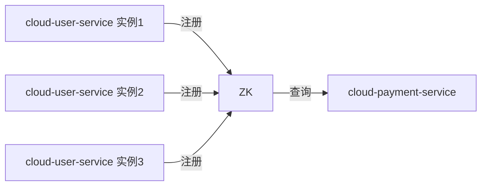
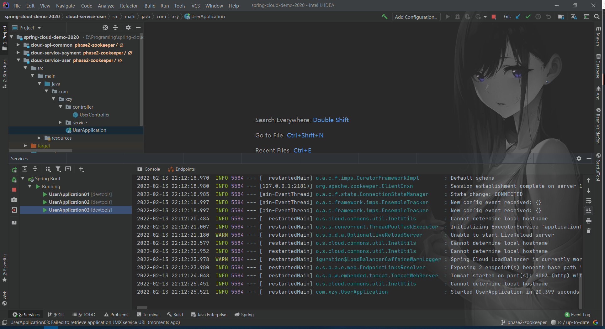
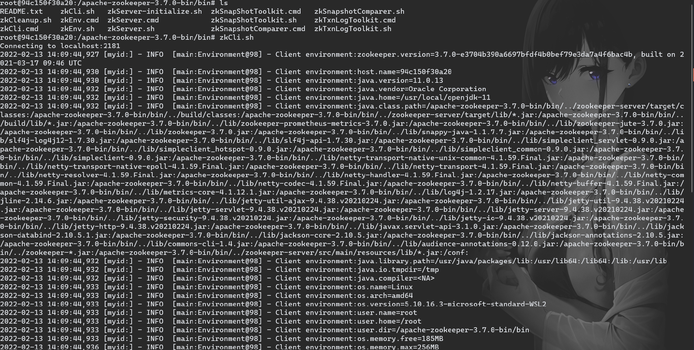
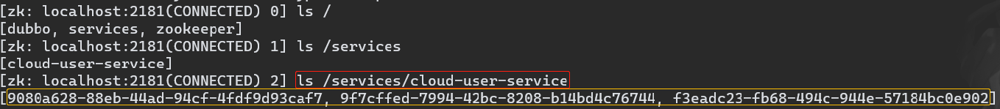
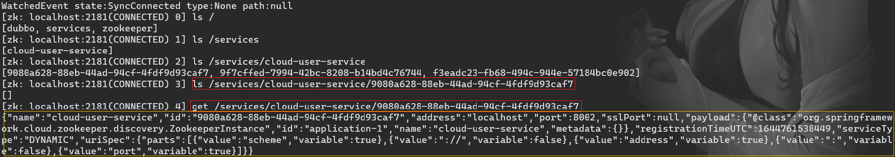
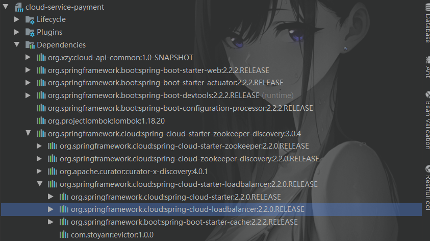

# 微服务注册中心

[toc]



## 1、注册中心

### 1.1 安装并运行 Zookeeper

### 1.2 关闭系统防火墙

## 2、服务提供者

### 2.1 依赖文件

```xml
<?xml version="1.0" encoding="UTF-8"?>
<project xmlns = "http://maven.apache.org/POM/4.0.0"
         xmlns:xsi = "http://www.w3.org/2001/XMLSchema-instance"
         xsi:schemaLocation = "http://maven.apache.org/POM/4.0.0 http://maven.apache.org/xsd/maven-4.0.0.xsd">
    <parent>
        <artifactId>spring-cloud-demo-2020</artifactId>
        <groupId>org.xzy</groupId>
        <version>1.0-SNAPSHOT</version>
    </parent>
    
    <modelVersion>4.0.0</modelVersion>
    <artifactId>cloud-service-user</artifactId>
    <description>用户服务</description>
    
    <dependencies>
        <!--other module-->
        <dependency>
            <groupId>org.xzy</groupId>
            <artifactId>cloud-api-common</artifactId>
            <version>1.0-SNAPSHOT</version>
        </dependency>
        <!--spring-->
        <dependency>
            <groupId>org.springframework.boot</groupId>
            <artifactId>spring-boot-starter-web</artifactId>
        </dependency>
        <dependency>
            <groupId>org.springframework.boot</groupId>
            <artifactId>spring-boot-starter-actuator</artifactId>
        </dependency>
        <!--spring-boot-tools-->
        <dependency>
            <groupId>org.springframework.boot</groupId>
            <artifactId>spring-boot-devtools</artifactId>
            <scope>runtime</scope>
            <optional>true</optional>
        </dependency>
        <!--spring-boot-configuration-processor-->
        <dependency>
            <groupId>org.springframework.boot</groupId>
            <artifactId>spring-boot-configuration-processor</artifactId>
        </dependency>
        <!--lombok-->
        <dependency>
            <groupId>org.projectlombok</groupId>
            <artifactId>lombok</artifactId>
        </dependency>
        <!--zookeeper-->
        <dependency>
            <groupId>org.springframework.cloud</groupId>
            <artifactId>spring-cloud-starter-zookeeper-discovery</artifactId>
        </dependency>
    </dependencies>

</project>
```

关键：spring-cloud-starter-zookeeper-discovery

### 2.2 配置文件

```
server:
  port: 8001

spring:
  application:
    name: cloud-user-service
  cloud:
    zookeeper:
      connect-string: 127.0.0.1:2181
```

### 2.3 主启动类

```java
@SpringBootApplication
@EnableDiscoveryClient
public class PaymentApplication {
    public static void main(String[] args) {
        SpringApplication.run(PaymentApplication.class, args);
    }
}
```

关键：@EnableDiscoveryClient

### 2.4 对外提供服务

```java
@RestController
@RequestMapping("/user/user")
@Slf4j
public class UserController {
    @Value("${server.port}")
    private String serverPort;

    private final UserService userService;

    @Autowired
    public UserController(UserService userService) {
        this.userService = userService;
    }

    /**
     * 根据主键查询用户信息
     *
     * @param id 主键
     * @return 用户信息
     */
    @GetMapping("/{id}")
    public MessageBox<UserEntity> findByPrimaryKey(@PathVariable("id") Long id) {
        String msg = "Server port：" + serverPort + "  UUID：" + UUID.randomUUID().toString();
        return MessageBox.ok(msg, userService.findByPrimaryKey(id));
    }
}
```

### 2.5 测试

1.   修改端口，启动多个实例

     

2.   打开 Zookeeper 客户端，查看实例信息是否成功保存到 Zookeeper

     a> 进入 Zookeeper 的 bin 路径，运行 zkCli.sh 脚本

     

     b> 查找实例节点

     

     c> 查看实例信息

     

     ```json
     {
       "name": "cloud-user-service",
       "id": "9080a628-88eb-44ad-94cf-4fdf9d93caf7",
       "address": "localhost", # 服务实例的IP地址
       "port": 8002, # 服务实例的端口号
       "sslPort": null,
       "payload": {
         "@class": "org.springframework.cloud.zookeeper.discovery.ZookeeperInstance",
         "id": "application-1",
         "name": "cloud-user-service",
         "metadata": {}
       },
       "registrationTimeUTC": 1644761538449,
       "serviceType": "DYNAMIC",
       "uriSpec": {
         "parts": [
           {
             "value": "scheme",
             "variable": true
           },
           {
             "value": "://",
             "variable": false
           },
           {
             "value": "address",
             "variable": true
           },
           {
             "value": ":",
             "variable": false
           },
           {
             "value": "port",
             "variable": true
           }
         ]
       }
     }
     ```

3.   通过 Postman 等工具测试对外服务接口是否正常

## 3、服务消费者

### 31 依赖文件

```xml
<?xml version="1.0" encoding="UTF-8"?>
<project xmlns="http://maven.apache.org/POM/4.0.0"
         xmlns:xsi="http://www.w3.org/2001/XMLSchema-instance"
         xsi:schemaLocation="http://maven.apache.org/POM/4.0.0 http://maven.apache.org/xsd/maven-4.0.0.xsd">
    <parent>
        <artifactId>spring-cloud-demo-2020</artifactId>
        <groupId>org.xzy</groupId>
        <version>1.0-SNAPSHOT</version>
    </parent>

    <modelVersion>4.0.0</modelVersion>
    <artifactId>cloud-service-payment</artifactId>
    <description>支付服务</description>

    <dependencies>
        <!--other module-->
        <dependency>
            <groupId>org.xzy</groupId>
            <artifactId>cloud-api-common</artifactId>
            <version>1.0-SNAPSHOT</version>
        </dependency>
        <!--spring-->
        <dependency>
            <groupId>org.springframework.boot</groupId>
            <artifactId>spring-boot-starter-web</artifactId>
        </dependency>
        <dependency>
            <groupId>org.springframework.boot</groupId>
            <artifactId>spring-boot-starter-actuator</artifactId>
        </dependency>
        <!--spring-boot-tools-->
        <dependency>
            <groupId>org.springframework.boot</groupId>
            <artifactId>spring-boot-devtools</artifactId>
            <scope>runtime</scope>
            <optional>true</optional>
        </dependency>
        <!--spring-boot-configuration-processor-->
        <dependency>
            <groupId>org.springframework.boot</groupId>
            <artifactId>spring-boot-configuration-processor</artifactId>
        </dependency>
        <!--lombok-->
        <dependency>
            <groupId>org.projectlombok</groupId>
            <artifactId>lombok</artifactId>
        </dependency>
        <!--zookeeper-->
        <dependency>
            <groupId>org.springframework.cloud</groupId>
            <artifactId>spring-cloud-starter-zookeeper-discovery</artifactId>
        </dependency>
    </dependencies>

</project>
```

关键：spring-cloud-starter-zookeeper-discovery

### 3.2 配置文件

```yaml
server:
  port: 7001

spring:
  application:
    name: cloud-payment-service
  cloud:
    zookeeper:
      connect-string: 127.0.0.1:2181
```

### 3.3 主启动类

```java
@SpringBootApplication
@EnableDiscoveryClient
public class PaymentApplication {
    public static void main(String[] args) {
        SpringApplication.run(PaymentApplication.class, args);
    }
    
    @Bean
    @LoadBalanced
    public RestTemplate restTemplate() {
        return new RestTemplate();
    }
}
```

关键：

1.   @EnableDiscoveryClient：开启实例服务注册与服务发现的功能

2.   @LoadBalanced：负载均衡

     spring-cloud-starter-zookeeper-discovery 整合了 spring-cloud-loadbalancer 以提供负载均衡的能力

     

### 3.4 调用远程服务

```java
@RestController
@RequestMapping(path = "/payment/payment")
public class PaymentController {
    public static final String INVOKE_URL = "http://cloud-user-service";

    private final RestTemplate restTemplate;

    @Autowired
    public PaymentController(RestTemplate restTemplate) {
        this.restTemplate = restTemplate;
    }

    @GetMapping("/get_user_info")
    public MessageBox<Object> getUserInfo(@RequestParam("user_id") Long userId) {
        
        return restTemplate.getForObject(INVOKE_URL + "/user/user/" + userId, MessageBox.class);
    }
}
```

注意：通过服务名称调用远程服务

### 3.6 测试

1.   启动服务

2.   连续调用接口多次

     返回信息：

     ```json
     {
       "status": 1,
       "message": "Server port：8001  UUID：f967a6fe-9cd4-4278-a426-cb69cc7db05a",
       "ok": true,
       "data": null,
       "fail": false
     }
     ```

     ```json
     {
       "status": 1,
       "message": "Server port：8002  UUID：02f82a36-4e60-480d-98bf-a98ad21140e1",
       "ok": true,
       "data": null,
       "fail": false
     }
     ```

     ```json
     {
       "status": 1,
       "message": "Server port：8003  UUID：b306796b-4e99-4ce8-b69b-50f02e2634c9",
       "ok": true,
       "data": null,
       "fail": false
     }
     ```

     ```json
     {
       "status": 1,
       "message": "Server port：8001  UUID：e50fa434-a726-4bb8-be92-dbc91d12edff",
       "ok": true,
       "data": null,
       "fail": false
     }
     ```

     …

     可以看到，请求被负载到了各个实例
