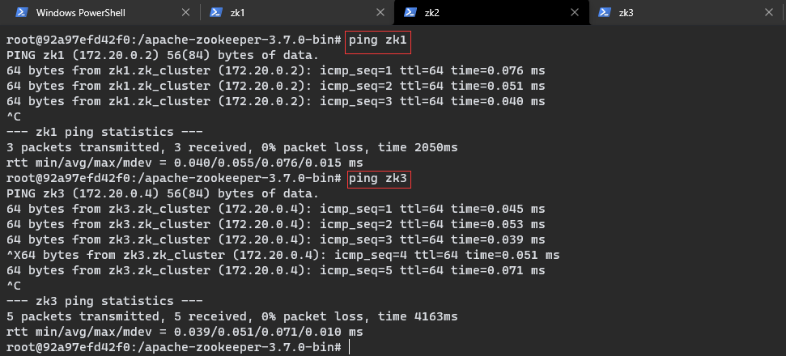

# Zookeeper 集群搭建

[toc]

## 1、Linux 环境

## 2、Win10 + Docker 环境

### 2.1 准备容器

参考 [Zookeeper 实战 - 安装配置.md](./Zookeeper 实战 - 安装配置.md) 准备 3个 Zookeeper 容器：

>   <font color = red>可以考虑从宿主机挂载配置文件，否则可能出现步骤 2.5 提到的问题</font>

```shell
PS C:\Users\xiaozy37528> docker run -itd --name zk1 -p 2181:2181 zookeeper
267eb9df388861236e8c7ed23cca9c0d14ae5e4ce3e29a3e3b90a67dfe28968c
PS C:\Users\xiaozy37528> docker run -itd --name zk2 -p 2182:2181 zookeeper
92a97efd42f0296437089ce1de24e99496fa5f6fa75fb9e3509caaa29f65e8cf
PS C:\Users\xiaozy37528> docker run -itd --name zk3 -p 2183:2181 zookeeper
fa80266ae8931ac09f8b666989cf1579bc716b9991ef066e803e3b1435cccb73
```


### 2.2 准备局域网

准备一个 Docker 局域网：

```shell
PS C:\Users\xiaozy37528> docker network --help

Usage:  docker network COMMAND

Manage networks

Commands:
  connect     Connect a container to a network
  create      Create a network
  disconnect  Disconnect a container from a network
  inspect     Display detailed information on one or more networks
  ls          List networks
  prune       Remove all unused networks
  rm          Remove one or more networks

Run 'docker network COMMAND --help' for more information on a command.
```

```shell
PS C:\Users\xiaozy37528> docker network create zk_cluster
b3a567eeca5a635df46607fa1b8d8cb38bb6472a058cd730a3ebdc625951b660
```


### 2.3 将容器加入局域网

将 3个 Zookeeper 容器加入局域网：

```
PS C:\Users\xiaozy37528> docker network connect zk_cluster zk1
PS C:\Users\xiaozy37528> docker network connect zk_cluster zk2
PS C:\Users\xiaozy37528> docker network connect zk_cluster zk3
```


### 2.4 确保容器能否相互 ping 通


>   可能出现：ping: command not found
>
>   
>
>   解决方案：
>
>   1.   apt-get update
>
>        
>
>   2.   apt-get install iputils-ping
>
>        

确保 3个 容器能否相互 ping 通：





### 2.5 修改 zoo.cfg 配置文件

>   容器中可能没有安装 vi 以及 vim，可以使用 apt-get 进行安装，但是由于众所周时的原因，apt-get 可能会很慢，虽然可以更换国内数据源，但是还是很麻烦，所以最省事的办法是创建容器的时候从宿主机挂载配置文件。
>
>   


Zookeeper 默认使用 3个 端口：

-   2181：用于服务器和客户端间的通信
-   2888：用于服务器间的通信
-   3888：用于服务器间选举 Leader


zoo.cfg 配置文件所在的位置：/conf


在配置文件中以下列格式添加集群配置信息：

```
server.A=B:C:D
# A：服务器编号
# B：服务器IP
# C：服务器间通信的端口
# D：服务器间选举Leader的端口
```


### 2.6 设置 myid

根据服务器编号和服务器IP的对应关系配置 myid：


```shell
vim /data/myid
```


### 2.7 启动集群

**启动 zk1：**会出现警告：“zk1 无法根据配置连接 zk2、zk3”，这是正常的，因为 zk2 和 zk3 还没有启动


**启动zk2：**会出现警告：“zk2 无法根据配置连接 zk3”，这是正常的，zk3 还没有启动


**启动zk3：**zk3 没有出现警告信息，因为它需要连接的 zk1、zk2 都已经启动。


**zk1、zk2、zk3 全部启动后，Leader 的选举正式开始：**

zk1输出信息：

```
15 03:13:35,560 [myid:1] - INFO [WorkerReceiver[myid=1]:FastLeaderElection$Messenger$WorkerReceiver@390] - Notification: my state:LOOKING; n.sid:2, n.state:LOOKING, n.leader:2, n.round:0x1, n.peerEpoch:0x0, n.zxid:0x0, message format version:0x2, n.config version:0x0
2022-02-15 03:13:35,561 [myid:1] - INFO [WorkerReceiver[myid=1]:FastLeaderElection$Messenger$WorkerReceiver@390] - Notification: my state:LOOKING; n.sid:1, n.state:LOOKING, n.leader:2, n.round:0x1, n.peerEpoch:0x0, n.zxid:0x0, message format version:0x2, n.config version:0x0
2022-02-15 03:13:35,762 [myid:1] - INFO [QuorumPeer[myid=1](plain=0.0.0.0:2181)(secure=disabled):QuorumPeer@901] - Peer state changed: following
2022-02-15 03:13:35,763 [myid:1] - INFO [QuorumPeer[myid=1](plain=0.0.0.0:2181)(secure=disabled):QuorumPeer@1512] - FOLLOWING
2022-02-15 03:13:35,767 [myid:1] - INFO [QuorumPeer[myid=1](plain=0.0.0.0:2181)(secure=disabled):Learner@127] - leaderConnectDelayDuringRetryMs: 100
2022-02-15 03:13:35,767 [myid:1] - INFO [QuorumPeer[myid=1](plain=0.0.0.0:2181)(secure=disabled):Learner@128] - TCP NoDelay set to: true
2022-02-15 03:13:35,768 [myid:1] - INFO [QuorumPeer[myid=1](plain=0.0.0.0:2181)(secure=disabled):Learner@129] - learner.asyncSending = false
2022-02-15 03:13:35,768 [myid:1] - INFO [QuorumPeer[myid=1](plain=0.0.0.0:2181)(secure=disabled):Learner@130] - learner.closeSocketAsync = false
2022-02-15 03:13:35,769 [myid:1] - INFO [QuorumPeer[myid=1](plain=0.0.0.0:2181)(secure=disabled):BlueThrottle@141] - Weighed connection throttling is disabled
2022-02-15 03:13:35,770 [myid:1] - INFO [QuorumPeer[myid=1](plain=0.0.0.0:2181)(secure=disabled):ZooKeeperServer@1300] - minSessionTimeout set to 4000
2022-02-15 03:13:35,770 [myid:1] - INFO [QuorumPeer[myid=1](plain=0.0.0.0:2181)(secure=disabled):ZooKeeperServer@1309] - maxSessionTimeout set to 40000
2022-02-15 03:13:35,771 [myid:1] - INFO [QuorumPeer[myid=1](plain=0.0.0.0:2181)(secure=disabled):ResponseCache@45] - getData response cache size is initialized with value 400.
2022-02-15 03:13:35,771 [myid:1] - INFO [QuorumPeer[myid=1](plain=0.0.0.0:2181)(secure=disabled):ResponseCache@45] - getChildren response cache size is initialized with value 400.
2022-02-15 03:13:35,772 [myid:1] - INFO [QuorumPeer[myid=1](plain=0.0.0.0:2181)(secure=disabled):RequestPathMetricsCollector@109] - zookeeper.pathStats.slotCapacity = 60
2022-02-15 03:13:35,773 [myid:1] - INFO [QuorumPeer[myid=1](plain=0.0.0.0:2181)(secure=disabled):RequestPathMetricsCollector@110] - zookeeper.pathStats.slotDuration = 15
2022-02-15 03:13:35,773 [myid:1] - INFO [QuorumPeer[myid=1](plain=0.0.0.0:2181)(secure=disabled):RequestPathMetricsCollector@111] - zookeeper.pathStats.maxDepth = 6
2022-02-15 03:13:35,773 [myid:1] - INFO [QuorumPeer[myid=1](plain=0.0.0.0:2181)(secure=disabled):RequestPathMetricsCollector@112] - zookeeper.pathStats.initialDelay = 5
2022-02-15 03:13:35,773 [myid:1] - INFO [QuorumPeer[myid=1](plain=0.0.0.0:2181)(secure=disabled):RequestPathMetricsCollector@113] - zookeeper.pathStats.delay = 5
2022-02-15 03:13:35,773 [myid:1] - INFO [QuorumPeer[myid=1](plain=0.0.0.0:2181)(secure=disabled):RequestPathMetricsCollector@114] - zookeeper.pathStats.enabled = false
2022-02-15 03:13:35,775 [myid:1] - INFO [QuorumPeer[myid=1](plain=0.0.0.0:2181)(secure=disabled):ZooKeeperServer@1536] - The max bytes for all large requests are set to 104857600
2022-02-15 03:13:35,775 [myid:1] - INFO [QuorumPeer[myid=1](plain=0.0.0.0:2181)(secure=disabled):ZooKeeperServer@1550] - The large request threshold is set to -1
2022-02-15 03:13:35,775 [myid:1] - INFO [QuorumPeer[myid=1](plain=0.0.0.0:2181)(secure=disabled):AuthenticationHelper@66] - zookeeper.enforce.auth.enabled = false
2022-02-15 03:13:35,775 [myid:1] - INFO [QuorumPeer[myid=1](plain=0.0.0.0:2181)(secure=disabled):AuthenticationHelper@67] - zookeeper.enforce.auth.schemes = []
2022-02-15 03:13:35,776 [myid:1] - INFO [QuorumPeer[myid=1](plain=0.0.0.0:2181)(secure=disabled):ZooKeeperServer@361] - Created server with tickTime 2000 minSessionTimeout 4000 maxSessionTimeout 40000 clientPortListenBacklog -1 datadir /datalog/version-2 snapdir /data/version-2
2022-02-15 03:13:35,776 [myid:1] - INFO [QuorumPeer[myid=1](plain=0.0.0.0:2181)(secure=disabled):Follower@77] - FOLLOWING - LEADER ELECTION TOOK - 14487 MS
2022-02-15 03:13:35,779 [myid:1] - INFO [QuorumPeer[myid=1](plain=0.0.0.0:2181)(secure=disabled):QuorumPeer@915] - Peer state changed: following - discovery
2022-02-15 03:13:35,783 [myid:1] - INFO [LeaderConnector-/172.20.0.3:2888:Learner$LeaderConnector@381] - Successfully connected to leader, using address: /172.20.0.3:2888
2022-02-15 03:13:35,808 [myid:1] - INFO [QuorumPeer[myid=1](plain=0.0.0.0:2181)(secure=disabled):QuorumPeer@915] - Peer state changed: following - synchronization
2022-02-15 03:13:35,817 [myid:1] - INFO [QuorumPeer[myid=1](plain=0.0.0.0:2181)(secure=disabled):Learner@562] - Getting a diff from the leader 0x0
2022-02-15 03:13:35,818 [myid:1] - INFO [QuorumPeer[myid=1](plain=0.0.0.0:2181)(secure=disabled):QuorumPeer@920] - Peer state changed: following - synchronization - diff
2022-02-15 03:13:35,821 [myid:1] - INFO [QuorumPeer[myid=1](plain=0.0.0.0:2181)(secure=disabled):Learner@734] - Learner received NEWLEADER message
2022-02-15 03:13:35,821 [myid:1] - INFO [QuorumPeer[myid=1](plain=0.0.0.0:2181)(secure=disabled):QuorumPeer@1867] - Dynamic reconfig is disabled, we don't store the last seen config.
2022-02-15 03:13:35,824 [myid:1] - INFO [QuorumPeer[myid=1](plain=0.0.0.0:2181)(secure=disabled):QuorumPeer@920] - Peer state changed: following - synchronization
2022-02-15 03:13:35,828 [myid:1] - INFO [QuorumPeer[myid=1](plain=0.0.0.0:2181)(secure=disabled):CommitProcessor@491] - Configuring CommitProcessor with readBatchSize -1 commitBatchSize 1
2022-02-15 03:13:35,828 [myid:1] - INFO [QuorumPeer[myid=1](plain=0.0.0.0:2181)(secure=disabled):CommitProcessor@452] - Configuring CommitProcessor with 8 worker threads.
2022-02-15 03:13:35,829 [myid:1] - INFO [QuorumPeer[myid=1](plain=0.0.0.0:2181)(secure=disabled):FollowerRequestProcessor@59] - Initialized FollowerRequestProcessor with zookeeper.follower.skipLearnerRequestToNextProcessor as false
2022-02-15 03:13:35,830 [myid:1] - INFO [QuorumPeer[myid=1](plain=0.0.0.0:2181)(secure=disabled):RequestThrottler@75] - zookeeper.request_throttler.shutdownTimeout = 10000
2022-02-15 03:13:35,856 [myid:1] - INFO [QuorumPeer[myid=1](plain=0.0.0.0:2181)(secure=disabled):Learner@718] - Learner received UPTODATE message
2022-02-15 03:13:35,856 [myid:1] - INFO [QuorumPeer[myid=1](plain=0.0.0.0:2181)(secure=disabled):QuorumPeer@915] - Peer state changed: following - broadcast
2022-02-15 03:13:36,986 [myid:1] - INFO [ListenerHandler-/172.20.0.2:3888:QuorumCnxManager$Listener$ListenerHandler@1071] - Received connection request from /172.20.0.4:53704
2022-02-15 03:13:36,987 [myid:1] - INFO [QuorumConnectionThread-[myid=1]-3:QuorumCnxManager@514] - Have smaller server identifier, so dropping the connection: (myId:1 --> sid:3)
2022-02-15 03:13:36,997 [myid:1] - INFO [WorkerReceiver[myid=1]:FastLeaderElection$Messenger$WorkerReceiver@390] - Notification: my state:FOLLOWING; n.sid:3, n.state:LOOKING, n.leader:3, n.round:0x1, n.peerEpoch:0x0, n.zxid:0x0, message format version:0x2, n.config version:0x0
```

zk2输出信息：

```
15 03:13:35,554 [myid:2] - INFO  [WorkerReceiver[myid=2]:FastLeaderElection$Messenger$WorkerReceiver@390] - Notification: my state:LOOKING; n.sid:2, n.state:LOOKING, n.leader:2, n.round:0x1, n.peerEpoch:0x0, n.zxid:0x0, message format version:0x2, n.config version:0x0

2022-02-15 03:13:35,560 [myid:2] - INFO  [WorkerReceiver[myid=2]:FastLeaderElection$Messenger$WorkerReceiver@390] - Notification: my state:LOOKING; n.sid:1, n.state:LOOKING, n.leader:1, n.round:0x1, n.peerEpoch:0x0, n.zxid:0x0, message format version:0x2, n.config version:0x0

2022-02-15 03:13:35,562 [myid:2] - INFO  [WorkerReceiver[myid=2]:FastLeaderElection$Messenger$WorkerReceiver@390] - Notification: my state:LOOKING; n.sid:1, n.state:LOOKING, n.leader:2, n.round:0x1, n.peerEpoch:0x0, n.zxid:0x0, message format version:0x2, n.config version:0x0

2022-02-15 03:13:35,763 [myid:2] - INFO  [QuorumPeer[myid=2](plain=0.0.0.0:2181)(secure=disabled):QuorumPeer@901] - Peer state changed: leading

2022-02-15 03:13:35,763 [myid:2] - INFO  [QuorumPeer[myid=2](plain=0.0.0.0:2181)(secure=disabled):QuorumPeer@1524] - LEADING

2022-02-15 03:13:35,768 [myid:2] - INFO  [QuorumPeer[myid=2](plain=0.0.0.0:2181)(secure=disabled):LearnerMaster@47] - zookeeper.leader.maxConcurrentSnapSyncs = 10

2022-02-15 03:13:35,768 [myid:2] - INFO  [QuorumPeer[myid=2](plain=0.0.0.0:2181)(secure=disabled):LearnerMaster@50] - zookeeper.leader.maxConcurrentDiffSyncs = 100

2022-02-15 03:13:35,768 [myid:2] - INFO  [QuorumPeer[myid=2](plain=0.0.0.0:2181)(secure=disabled):Leader@87] - TCP NoDelay set to: true

2022-02-15 03:13:35,768 [myid:2] - INFO  [QuorumPeer[myid=2](plain=0.0.0.0:2181)(secure=disabled):Leader@108] - zookeeper.leader.ackLoggingFrequency = 1000

2022-02-15 03:13:35,769 [myid:2] - INFO  [QuorumPeer[myid=2](plain=0.0.0.0:2181)(secure=disabled):Leader@1345] - zookeeper.leader.maxTimeToWaitForEpoch = -1ms

2022-02-15 03:13:35,771 [myid:2] - INFO  [QuorumPeer[myid=2](plain=0.0.0.0:2181)(secure=disabled):BlueThrottle@141] - Weighed connection throttling is disabled

2022-02-15 03:13:35,771 [myid:2] - INFO  [QuorumPeer[myid=2](plain=0.0.0.0:2181)(secure=disabled):ZooKeeperServer@1300] - minSessionTimeout set to 4000

2022-02-15 03:13:35,772 [myid:2] - INFO  [QuorumPeer[myid=2](plain=0.0.0.0:2181)(secure=disabled):ZooKeeperServer@1309] - maxSessionTimeout set to 40000

2022-02-15 03:13:35,773 [myid:2] - INFO  [QuorumPeer[myid=2](plain=0.0.0.0:2181)(secure=disabled):ResponseCache@45] - getData response cache size is initialized with value 400.

2022-02-15 03:13:35,773 [myid:2] - INFO  [QuorumPeer[myid=2](plain=0.0.0.0:2181)(secure=disabled):ResponseCache@45] - getChildren response cache size is initialized with value 400.

2022-02-15 03:13:35,774 [myid:2] - INFO  [QuorumPeer[myid=2](plain=0.0.0.0:2181)(secure=disabled):RequestPathMetricsCollector@109] - zookeeper.pathStats.slotCapacity = 60

2022-02-15 03:13:35,774 [myid:2] - INFO  [QuorumPeer[myid=2](plain=0.0.0.0:2181)(secure=disabled):RequestPathMetricsCollector@110] - zookeeper.pathStats.slotDuration = 15

2022-02-15 03:13:35,774 [myid:2] - INFO  [QuorumPeer[myid=2](plain=0.0.0.0:2181)(secure=disabled):RequestPathMetricsCollector@111] - zookeeper.pathStats.maxDepth = 6

2022-02-15 03:13:35,774 [myid:2] - INFO  [QuorumPeer[myid=2](plain=0.0.0.0:2181)(secure=disabled):RequestPathMetricsCollector@112] - zookeeper.pathStats.initialDelay = 5

2022-02-15 03:13:35,774 [myid:2] - INFO  [QuorumPeer[myid=2](plain=0.0.0.0:2181)(secure=disabled):RequestPathMetricsCollector@113] - zookeeper.pathStats.delay = 5

2022-02-15 03:13:35,774 [myid:2] - INFO  [QuorumPeer[myid=2](plain=0.0.0.0:2181)(secure=disabled):RequestPathMetricsCollector@114] - zookeeper.pathStats.enabled = false

2022-02-15 03:13:35,776 [myid:2] - INFO  [QuorumPeer[myid=2](plain=0.0.0.0:2181)(secure=disabled):ZooKeeperServer@1536] - The max bytes for all large requests are set to 104857600

2022-02-15 03:13:35,776 [myid:2] - INFO  [QuorumPeer[myid=2](plain=0.0.0.0:2181)(secure=disabled):ZooKeeperServer@1550] - The large request threshold is set to -1

2022-02-15 03:13:35,777 [myid:2] - INFO  [QuorumPeer[myid=2](plain=0.0.0.0:2181)(secure=disabled):AuthenticationHelper@66] - zookeeper.enforce.auth.enabled = false

2022-02-15 03:13:35,777 [myid:2] - INFO  [QuorumPeer[myid=2](plain=0.0.0.0:2181)(secure=disabled):AuthenticationHelper@67] - zookeeper.enforce.auth.schemes = []

2022-02-15 03:13:35,777 [myid:2] - INFO  [QuorumPeer[myid=2](plain=0.0.0.0:2181)(secure=disabled):ZooKeeperServer@361] - Created server with tickTime 2000 minSessionTimeout 4000 maxSessionTimeout 40000 clientPortListenBacklog -1 datadir /datalog/version-2 snapdir /data/version-2

2022-02-15 03:13:35,779 [myid:2] - INFO  [QuorumPeer[myid=2](plain=0.0.0.0:2181)(secure=disabled):Leader@584] - LEADING - LEADER ELECTION TOOK - 231 MS

2022-02-15 03:13:35,783 [myid:2] - INFO  [QuorumPeer[myid=2](plain=0.0.0.0:2181)(secure=disabled):QuorumPeer@915] - Peer state changed: leading - discovery

2022-02-15 03:13:35,784 [myid:2] - INFO  [QuorumPeer[myid=2](plain=0.0.0.0:2181)(secure=disabled):FileTxnSnapLog@479] - Snapshotting: 0x0 to /data/version-2/snapshot.0

2022-02-15 03:13:35,788 [myid:2] - INFO  [QuorumPeer[myid=2](plain=0.0.0.0:2181)(secure=disabled):ZooKeeperServer@543] - Snapshot taken in 4 ms

2022-02-15 03:13:35,793 [myid:2] - INFO  [LearnerCnxAcceptorHandler-/172.20.0.3:2888:LearnerHandler@72] - leader.closeSocketAsync = false

2022-02-15 03:13:35,797 [myid:2] - INFO  [LearnerHandler-/172.20.0.2:40466:LearnerHandler@506] - Follower sid: 1 : info : 172.20.0.2:2888:3888:participant

2022-02-15 03:13:35,803 [myid:2] - INFO  [QuorumPeer[myid=2](plain=0.0.0.0:2181)(secure=disabled):QuorumPeer@1867] - Dynamic reconfig is disabled, we don't store the last seen config.

2022-02-15 03:13:35,807 [myid:2] - INFO  [LearnerHandler-/172.20.0.2:40466:ZKDatabase@346] - On disk txn sync enabled with snapshotSizeFactor 0.33

2022-02-15 03:13:35,807 [myid:2] - INFO  [LearnerHandler-/172.20.0.2:40466:LearnerHandler@801] - Synchronizing with Learner sid: 1 maxCommittedLog=0x0 minCommittedLog=0x0 lastProcessedZxid=0x0 peerLastZxid=0x0

2022-02-15 03:13:35,808 [myid:2] - INFO  [LearnerHandler-/172.20.0.2:40466:LearnerHandler@846] - Sending DIFF zxid=0x0 for peer sid: 1

2022-02-15 03:13:35,818 [myid:2] - INFO  [QuorumPeer[myid=2](plain=0.0.0.0:2181)(secure=disabled):QuorumPeer@915] - Peer state changed: leading - synchronization

2022-02-15 03:13:35,837 [myid:2] - INFO  [QuorumPeer[myid=2](plain=0.0.0.0:2181)(secure=disabled):Leader@1495] - Have quorum of supporters, sids: [[1, 2]]; starting up and setting last processed zxid: 0x100000000

2022-02-15 03:13:35,837 [myid:2] - INFO  [QuorumPeer[myid=2](plain=0.0.0.0:2181)(secure=disabled):Leader@1517] - Dynamic reconfig feature is disabled, skip designatedLeader calculation and reconfig processing.

2022-02-15 03:13:35,841 [myid:2] - INFO  [QuorumPeer[myid=2](plain=0.0.0.0:2181)(secure=disabled):CommitProcessor@491] - Configuring CommitProcessor with readBatchSize -1 commitBatchSize 1

2022-02-15 03:13:35,842 [myid:2] - INFO  [QuorumPeer[myid=2](plain=0.0.0.0:2181)(secure=disabled):CommitProcessor@452] - Configuring CommitProcessor with 8 worker threads.

2022-02-15 03:13:35,843 [myid:2] - INFO  [QuorumPeer[myid=2](plain=0.0.0.0:2181)(secure=disabled):ProposalRequestProcessor@57] - zookeeper.forward_learner_requests_to_commit_processor_disabled = false

2022-02-15 03:13:35,847 [myid:2] - INFO  [ProcessThread(sid:2 cport:-1)::PrepRequestProcessor@137] - PrepRequestProcessor (sid:2) started, reconfigEnabled=false

2022-02-15 03:13:35,848 [myid:2] - INFO  [QuorumPeer[myid=2](plain=0.0.0.0:2181)(secure=disabled):ContainerManager@84] - Using checkIntervalMs=60000 maxPerMinute=10000 maxNeverUsedIntervalMs=0

2022-02-15 03:13:35,848 [myid:2] - INFO  [QuorumPeer[myid=2](plain=0.0.0.0:2181)(secure=disabled):RequestThrottler@75] - zookeeper.request_throttler.shutdownTimeout = 10000

2022-02-15 03:13:35,856 [myid:2] - INFO  [QuorumPeer[myid=2](plain=0.0.0.0:2181)(secure=disabled):QuorumPeer@915] - Peer state changed: leading - broadcast

2022-02-15 03:13:36,572 [myid:2] - WARN  [QuorumConnectionThread-[myid=2]-2:QuorumCnxManager@401] - Cannot open channel to 3 at election address /172.20.0.4:3888

java.net.ConnectException: Connection refused (Connection refused)

at java.base/java.net.PlainSocketImpl.socketConnect(Native Method)

at java.base/java.net.AbstractPlainSocketImpl.doConnect(Unknown Source)

at java.base/java.net.AbstractPlainSocketImpl.connectToAddress(Unknown Source)

at java.base/java.net.AbstractPlainSocketImpl.connect(Unknown Source)

at java.base/java.net.SocksSocketImpl.connect(Unknown Source)

at java.base/java.net.Socket.connect(Unknown Source)

at org.apache.zookeeper.server.quorum.QuorumCnxManager.initiateConnection(QuorumCnxManager.java:384)

at org.apache.zookeeper.server.quorum.QuorumCnxManager$QuorumConnectionReqThread.run(QuorumCnxManager.java:458)

at java.base/java.util.concurrent.ThreadPoolExecutor.runWorker(Unknown Source)

at java.base/java.util.concurrent.ThreadPoolExecutor$Worker.run(Unknown Source)

at java.base/java.lang.Thread.run(Unknown Source)

2022-02-15 03:13:36,986 [myid:2] - INFO  [ListenerHandler-/172.20.0.3:3888:QuorumCnxManager$Listener$ListenerHandler@1071] - Received connection request from /172.20.0.4:35560

2022-02-15 03:13:36,997 [myid:2] - INFO  [WorkerReceiver[myid=2]:FastLeaderElection$Messenger$WorkerReceiver@390] - Notification: my state:LEADING; n.sid:3, n.state:LOOKING, n.leader:3, n.round:0x1, n.peerEpoch:0x0, n.zxid:0x0, message format version:0x2, n.config version:0x0

2022-02-15 03:13:37,025 [myid:2] - INFO  [LearnerHandler-/172.20.0.4:37970:LearnerHandler@506] - Follower sid: 3 : info : 172.20.0.4:2888:3888:participant

2022-02-15 03:13:37,031 [myid:2] - INFO  [LearnerHandler-/172.20.0.4:37970:ZKDatabase@346] - On disk txn sync enabled with snapshotSizeFactor 0.33

2022-02-15 03:13:37,031 [myid:2] - INFO  [LearnerHandler-/172.20.0.4:37970:LearnerHandler@801] - Synchronizing with Learner sid: 3 maxCommittedLog=0x0 minCommittedLog=0x0 lastProcessedZxid=0x100000000 peerLastZxid=0x0

2022-02-15 03:13:37,033 [myid:2] - INFO  [LearnerHandler-/172.20.0.4:37970:LearnerHandler@568] - Sending snapshot last zxid of peer is 0x0, zxid of leader is 0x100000000, send zxid of db as 0x100000000, 1 concurrent snapshot sync, snapshot sync was exempt from throttle
```

zk3输出信息：

```
2022-02-15 03:13:36,986 [myid:3] - INFO [WorkerReceiver[myid=3]:FastLeaderElection$Messenger$WorkerReceiver@390] - Notification: my state:LOOKING; n.sid:3, n.state:LOOKING, n.leader:3, n.round:0x1, n.peerEpoch:0x0, n.zxid:0x0, message format version:0x2, n.config version:0x0
2022-02-15 03:13:36,986 [myid:3] - INFO [ListenerHandler-/172.20.0.4:3888:QuorumCnxManager$Listener$ListenerHandler@1071] - Received connection request from /172.20.0.2:33656
2022-02-15 03:13:36,997 [myid:3] - INFO [WorkerReceiver[myid=3]:FastLeaderElection$Messenger$WorkerReceiver@390] - Notification: my state:LOOKING; n.sid:1, n.state:LOOKING, n.leader:2, n.round:0x1, n.peerEpoch:0x0, n.zxid:0x0, message format version:0x2, n.config version:0x0
2022-02-15 03:13:36,998 [myid:3] - INFO [WorkerReceiver[myid=3]:FastLeaderElection$Messenger$WorkerReceiver@390] - Notification: my state:LOOKING; n.sid:2, n.state:LOOKING, n.leader:2, n.round:0x1, n.peerEpoch:0x0, n.zxid:0x0, message format version:0x2, n.config version:0x0
2022-02-15 03:13:36,999 [myid:3] - INFO [WorkerReceiver[myid=3]:FastLeaderElection$Messenger$WorkerReceiver@390] - Notification: my state:LOOKING; n.sid:1, n.state:FOLLOWING, n.leader:2, n.round:0x1, n.peerEpoch:0x1, n.zxid:0x0, message format version:0x2, n.config version:0x0
2022-02-15 03:13:36,999 [myid:3] - INFO [WorkerReceiver[myid=3]:FastLeaderElection$Messenger$WorkerReceiver@390] - Notification: my state:LOOKING; n.sid:2, n.state:LEADING, n.leader:2, n.round:0x1, n.peerEpoch:0x1, n.zxid:0x0, message format version:0x2, n.config version:0x0
2022-02-15 03:13:36,999 [myid:3] - INFO [QuorumPeer[myid=3](plain=0.0.0.0:2181)(secure=disabled):QuorumPeer@901] - Peer state changed: following
2022-02-15 03:13:37,000 [myid:3] - INFO [QuorumPeer[myid=3](plain=0.0.0.0:2181)(secure=disabled):QuorumPeer@1512] - FOLLOWING
2022-02-15 03:13:37,004 [myid:3] - INFO [QuorumPeer[myid=3](plain=0.0.0.0:2181)(secure=disabled):Learner@127] - leaderConnectDelayDuringRetryMs: 100
2022-02-15 03:13:37,004 [myid:3] - INFO [QuorumPeer[myid=3](plain=0.0.0.0:2181)(secure=disabled):Learner@128] - TCP NoDelay set to: true
2022-02-15 03:13:37,004 [myid:3] - INFO [QuorumPeer[myid=3](plain=0.0.0.0:2181)(secure=disabled):Learner@129] - learner.asyncSending = false
2022-02-15 03:13:37,004 [myid:3] - INFO [QuorumPeer[myid=3](plain=0.0.0.0:2181)(secure=disabled):Learner@130] - learner.closeSocketAsync = false
2022-02-15 03:13:37,006 [myid:3] - INFO [QuorumPeer[myid=3](plain=0.0.0.0:2181)(secure=disabled):BlueThrottle@141] - Weighed connection throttling is disabled
2022-02-15 03:13:37,008 [myid:3] - INFO [QuorumPeer[myid=3](plain=0.0.0.0:2181)(secure=disabled):ZooKeeperServer@1300] - minSessionTimeout set to 4000
2022-02-15 03:13:37,009 [myid:3] - INFO [QuorumPeer[myid=3](plain=0.0.0.0:2181)(secure=disabled):ZooKeeperServer@1309] - maxSessionTimeout set to 40000
2022-02-15 03:13:37,010 [myid:3] - INFO [QuorumPeer[myid=3](plain=0.0.0.0:2181)(secure=disabled):ResponseCache@45] - getData response cache size is initialized with value 400.
2022-02-15 03:13:37,010 [myid:3] - INFO [QuorumPeer[myid=3](plain=0.0.0.0:2181)(secure=disabled):ResponseCache@45] - getChildren response cache size is initialized with value 400.
2022-02-15 03:13:37,012 [myid:3] - INFO [QuorumPeer[myid=3](plain=0.0.0.0:2181)(secure=disabled):RequestPathMetricsCollector@109] - zookeeper.pathStats.slotCapacity = 60
2022-02-15 03:13:37,012 [myid:3] - INFO [QuorumPeer[myid=3](plain=0.0.0.0:2181)(secure=disabled):RequestPathMetricsCollector@110] - zookeeper.pathStats.slotDuration = 15
2022-02-15 03:13:37,012 [myid:3] - INFO [QuorumPeer[myid=3](plain=0.0.0.0:2181)(secure=disabled):RequestPathMetricsCollector@111] - zookeeper.pathStats.maxDepth = 6
2022-02-15 03:13:37,012 [myid:3] - INFO [QuorumPeer[myid=3](plain=0.0.0.0:2181)(secure=disabled):RequestPathMetricsCollector@112] - zookeeper.pathStats.initialDelay = 5
2022-02-15 03:13:37,012 [myid:3] - INFO [QuorumPeer[myid=3](plain=0.0.0.0:2181)(secure=disabled):RequestPathMetricsCollector@113] - zookeeper.pathStats.delay = 5
2022-02-15 03:13:37,013 [myid:3] - INFO [QuorumPeer[myid=3](plain=0.0.0.0:2181)(secure=disabled):RequestPathMetricsCollector@114] - zookeeper.pathStats.enabled = false
2022-02-15 03:13:37,014 [myid:3] - INFO [QuorumPeer[myid=3](plain=0.0.0.0:2181)(secure=disabled):ZooKeeperServer@1536] - The max bytes for all large requests are set to 104857600
2022-02-15 03:13:37,014 [myid:3] - INFO [QuorumPeer[myid=3](plain=0.0.0.0:2181)(secure=disabled):ZooKeeperServer@1550] - The large request threshold is set to -1
2022-02-15 03:13:37,015 [myid:3] - INFO [QuorumPeer[myid=3](plain=0.0.0.0:2181)(secure=disabled):AuthenticationHelper@66] - zookeeper.enforce.auth.enabled = false
2022-02-15 03:13:37,015 [myid:3] - INFO [QuorumPeer[myid=3](plain=0.0.0.0:2181)(secure=disabled):AuthenticationHelper@67] - zookeeper.enforce.auth.schemes = []
2022-02-15 03:13:37,015 [myid:3] - INFO [QuorumPeer[myid=3](plain=0.0.0.0:2181)(secure=disabled):ZooKeeperServer@361] - Created server with tickTime 2000 minSessionTimeout 4000 maxSessionTimeout 40000 clientPortListenBacklog -1 datadir /datalog/version-2 snapdir /data/version-2
2022-02-15 03:13:37,015 [myid:3] - INFO [QuorumPeer[myid=3](plain=0.0.0.0:2181)(secure=disabled):Follower@77] - FOLLOWING - LEADER ELECTION TOOK - 38 MS
2022-02-15 03:13:37,017 [myid:3] - INFO [QuorumPeer[myid=3](plain=0.0.0.0:2181)(secure=disabled):QuorumPeer@915] - Peer state changed: following - discovery
2022-02-15 03:13:37,021 [myid:3] - INFO [LeaderConnector-/172.20.0.3:2888:Learner$LeaderConnector@381] - Successfully connected to leader, using address: /172.20.0.3:2888
2022-02-15 03:13:37,032 [myid:3] - INFO [QuorumPeer[myid=3](plain=0.0.0.0:2181)(secure=disabled):QuorumPeer@915] - Peer state changed: following - synchronization
2022-02-15 03:13:37,033 [myid:3] - INFO [QuorumPeer[myid=3](plain=0.0.0.0:2181)(secure=disabled):QuorumPeer@920] - Peer state changed: following - synchronization - snap
2022-02-15 03:13:37,033 [myid:3] - INFO [QuorumPeer[myid=3](plain=0.0.0.0:2181)(secure=disabled):Learner@573] - Getting a snapshot from leader 0x100000000
2022-02-15 03:13:37,033 [myid:3] - INFO [QuorumPeer[myid=3](plain=0.0.0.0:2181)(secure=disabled):WatchManagerFactory@42] - Using org.apache.zookeeper.server.watch.WatchManager as watch manager
2022-02-15 03:13:37,033 [myid:3] - INFO [QuorumPeer[myid=3](plain=0.0.0.0:2181)(secure=disabled):WatchManagerFactory@42] - Using org.apache.zookeeper.server.watch.WatchManager as watch manager
2022-02-15 03:13:37,036 [myid:3] - INFO [QuorumPeer[myid=3](plain=0.0.0.0:2181)(secure=disabled):Learner@734] - Learner received NEWLEADER message
2022-02-15 03:13:37,037 [myid:3] - INFO [QuorumPeer[myid=3](plain=0.0.0.0:2181)(secure=disabled):QuorumPeer@1867] - Dynamic reconfig is disabled, we don't store the last seen config.
2022-02-15 03:13:37,037 [myid:3] - INFO [QuorumPeer[myid=3](plain=0.0.0.0:2181)(secure=disabled):FileTxnSnapLog@479] - Snapshotting: 0x100000000 to /data/version-2/snapshot.100000000
2022-02-15 03:13:37,043 [myid:3] - INFO [QuorumPeer[myid=3](plain=0.0.0.0:2181)(secure=disabled):ZooKeeperServer@543] - Snapshot taken in 6 ms
2022-02-15 03:13:37,046 [myid:3] - INFO [QuorumPeer[myid=3](plain=0.0.0.0:2181)(secure=disabled):QuorumPeer@920] - Peer state changed: following - synchronization
2022-02-15 03:13:37,057 [myid:3] - INFO [QuorumPeer[myid=3](plain=0.0.0.0:2181)(secure=disabled):CommitProcessor@491] - Configuring CommitProcessor with readBatchSize -1 commitBatchSize 1
2022-02-15 03:13:37,057 [myid:3] - INFO [QuorumPeer[myid=3](plain=0.0.0.0:2181)(secure=disabled):CommitProcessor@452] - Configuring CommitProcessor with 8 worker threads.
2022-02-15 03:13:37,059 [myid:3] - INFO [QuorumPeer[myid=3](plain=0.0.0.0:2181)(secure=disabled):FollowerRequestProcessor@59] - Initialized FollowerRequestProcessor with zookeeper.follower.skipLearnerRequestToNextProcessor as false
2022-02-15 03:13:37,061 [myid:3] - INFO [QuorumPeer[myid=3](plain=0.0.0.0:2181)(secure=disabled):RequestThrottler@75] - zookeeper.request_throttler.shutdownTimeout = 10000
2022-02-15 03:13:37,068 [myid:3] - INFO [QuorumPeer[myid=3](plain=0.0.0.0:2181)(secure=disabled):Learner@718] - Learner received UPTODATE message
2022-02-15 03:13:37,068 [myid:3] - INFO [QuorumPeer[myid=3](plain=0.0.0.0:2181)(secure=disabled):QuorumPeer@915] - Peer state changed: following - broadcast
```


最终 zk2 被选为 Leader。

### 2.8 测试

集群中的 Zookeeper 服务器会相互同步数据，试着向 zk2 添加一条数据，然后从 zk3 查出同步过来的数据。

操作前：


在 zk2 添加数据，在 zk3 查询数据：


