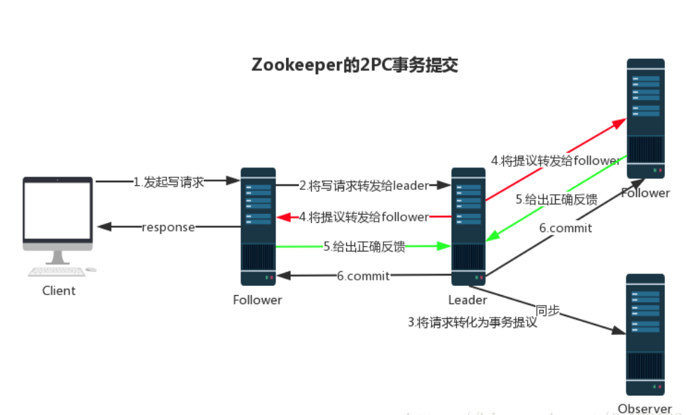

# ZAB & 分布式数据一致性

在 Zookeeper 中，主要依赖 ZAB 协议来实现分布式数据一致性。

`ZAB 协议`分为两部分：

-   消息广播
-   崩溃恢复

### 消息广播

Zookeeper 使用**单一的主进程 Leader** 来接收和处理客户端所有事务请求，并采用 ZAB 协议的原子广播协议，将事务请求以  Proposal 提议广播到所有 Follower 节点，<u>当集群中有过半的 Follower 服务器进行正确的 ACK  反馈</u>，那么 Leader 就会再次向所有的 Follower 服务器发送 commit 消息，将此次提案进行提交。这个过程可以简称为 2PC （两阶段提交），整个流程可以参考下图，注意 Observer 节点只负责同步 Leader 数据，不参与 2PC 数据同步过程。

### 崩溃恢复

在正常情况消息广播情况下能运行良好，但是一旦 Leader 服务器出现崩溃，或者由于网络原因导致 Leader 服务器失去了与过半  Follower 的通信，那么就会进入崩溃恢复模式，<u>需要选举出一个新的 Leader 服务器</u>。在这个过程中可能会出现两种数据不一致性的隐患，需要 ZAB 协议的特性进行避免：

1.   Leader 服务器将消息 commit 发出后，立即崩溃
2.   Leader 服务器刚提出 proposal 后，立即崩溃

ZAB 协议的恢复模式使用了以下策略：

1.   选举 zxid 最大的节点作为新的 Leader       <(￣︶￣)↗[Zookeeper 理论 - Leader 选举.md](./Zookeeper 理论 - Leader 选举.md)

2.   新 Leader 将事务日志中尚未提交的消息进行处理

