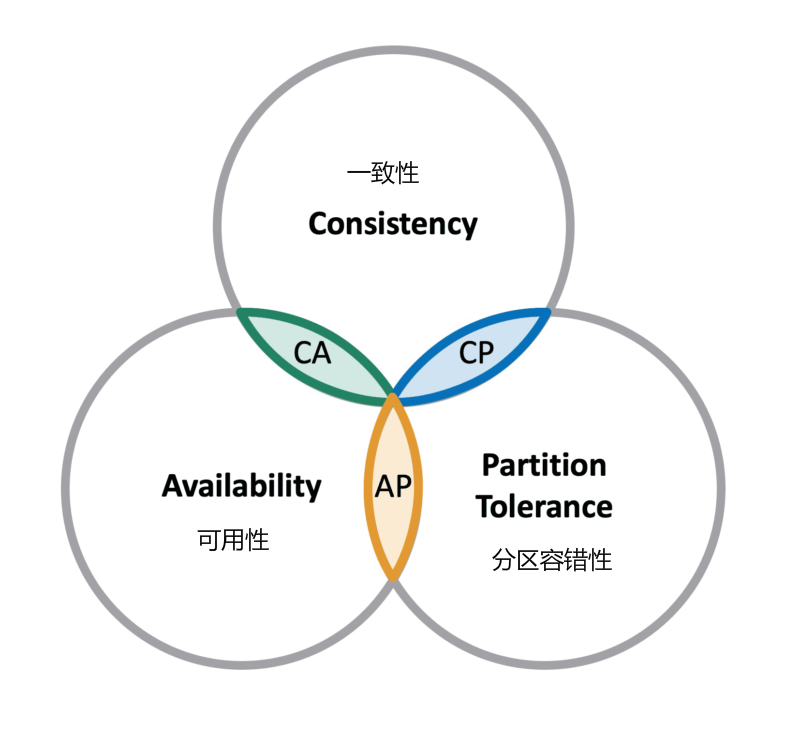
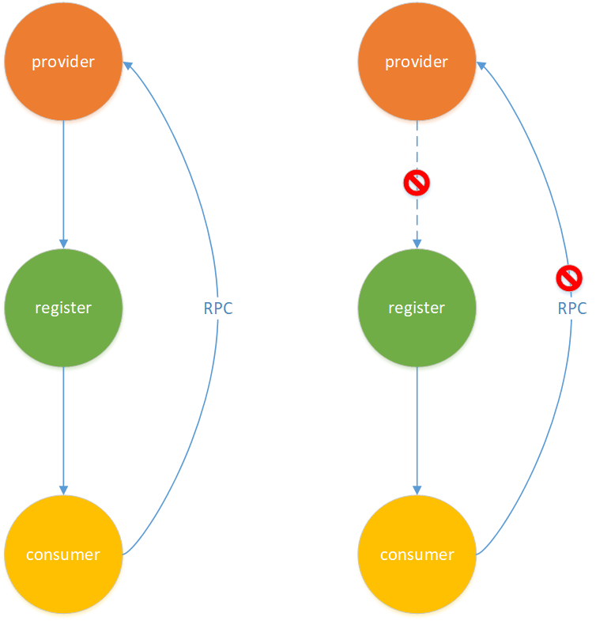
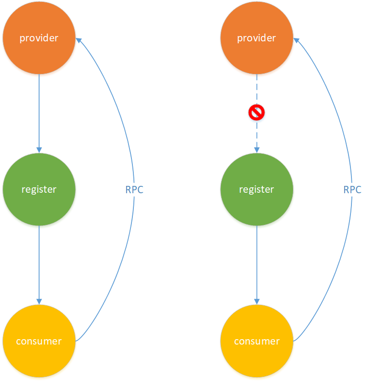

# Zookeeper 与 CAP 理论

Zookeeper 保证的是 CP，相比之下 Eureka 保证的是 AP~（启动自我保护机制）~

---

## Zookeeper —— CP

-   `会话`

    Zookeeper 客户端与服务端的连接基于 Session，每个 Session 都有一个过期时间，Zookeeper 服务端会定时检查并移除过期的 Session。Zookeeper 客户端需要在 Session 过期时间内向服务端发送请求（读或写操作）或 ping 包（心跳），Zookeeper 服务端接收到请求后会更新 Session 的过期时间。

    

-   `临时节点`

    Zookeeper 的节点分为两种：

    1.   临时节点：与 Session 绑定，Zookeeper 会在 Session 过期后自动删除该 Session 创建的临时节点
    2.   持久节点：不与 Session 绑定，需要手动删除

    

使用 Zookeeper 作为注册中心时，服务实例使用临时节点存储。因此，一旦出现网络分区导致服务实例发送的心跳无法到达 Zookeeper 服务端，服务实例连接 Zookeeper 的 Session 就会过期，Zookeeper 会删除 Session 并删除该 Session 创建的所有临时节点，实例信息随之删除。实例信息被删除后，下游服务就无法从注册中心查询到该实例，也就不会向该实例发送请求，而实际上该实例是健康的……

## Eureka —— AP

Eureka 的保护机制：如果短时间内大量的服务实例过期（超过85%），服务端就推测可能是~实例与注册中心间的~网络出现了问题，于是暂时不移除过期的服务实例。由于服务实例没有被移除，下游服务能够继续从注册中心查询到实例信息，下游服务对服务实例的请求不受影响~（前提：下游服务与服务实例间的网络正常）~

