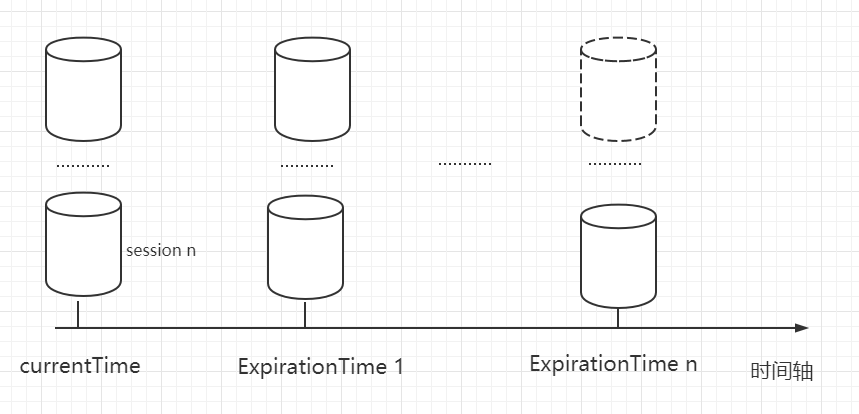
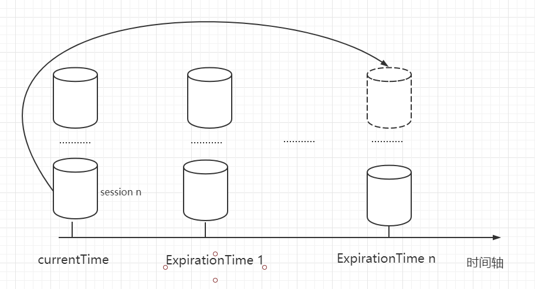

# 会话

Zookeeper 客户端与服务端的连接基于 TCP 长连接，也就是 Session 会话。

## Zookeeper 会话的属性

| 属性      | 说明                                                         |
| --------- | ------------------------------------------------------------ |
| SessionID | 会话ID。用来唯一标识一个会话，每次客户端创建会话的时候，Zookeeper 都会为其分配一个全局唯一的 SessionID |
| Timeout   | 会话超时时间。客户端可以在创建连接的时候向服务端发送会话超时时间，同时服务端也可以配置超时时间，客户端设置的超时时间受限于服务端配置的超时时间。 |
| TickTime  | 下次会话超时时间点。默认 2000 毫秒，可在 zoo.cfg 配置文件中配置，便于服务端对 Session 会话实行**分桶策略管理** |
| isClosing | 会话关闭标识。当服务端检测到会话已经超时失效，便将会话标记为"已关闭"，并不再处理该会话的新请求。 |


## Zookeeper 会话的状态

| 状态       | 说明                                                         |
| ---------- | ------------------------------------------------------------ |
| connecting | 连接中。Session 一旦建立，状态就是 connecting 状态，时间很短。 |
| connected  | 已连接。连接成功之后的状态。                                 |
| closed     | 已关闭。发生在 Session 过期，一般由于网络故障客户端重连失败，服务器宕机或者客户端主动断开。 |


## 会话超时管理（分桶策略 + 会话激活）



Zookeeper 的 Leader 服务器在运行时间定时检查会话超时状态，时间间隔是 ExpirationInterval，单位是毫秒。

ExpirationInterval 的计算方式：

```
ExpirationTime = CurrentTime + SessionTimeout;
ExpirationTime = (ExpirationTime / ExpirationInterval + 1) * ExpirationInterval;
```


通常，客户端会在会话过期时间范围内向服务端发送请求（包括读和写）或者 ping ，俗称“心跳检测”，以完成会话的激活，从而保持会话的有效性。

会话激活流程：


激活后进行迁移会话的过程，然后开始新一轮：




>   ### “分桶策略”
>
>   把过期时间相同的Session放在同一个桶里，只要检查到一个Session过期，说明桶中的其他Session也过期了，可以免去检查的必要。如果检查到的Session没有过期，那么重新计算Session的过期时间，然后将Session迁移到新的桶。