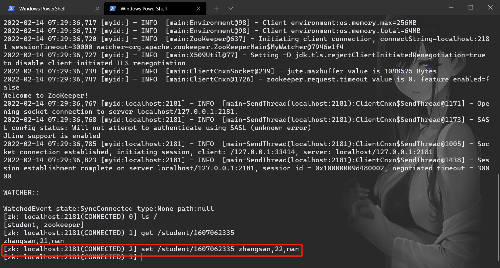

# 客户端基本命令

[toc]

## ls

ls 命令用于查看某个路径下目录列表

```shell
ls path
```

-   path：节点路径


## get

get 命令用于获取节点数据

```shell
get [-w] path
```

-   path：节点路径
-   -w：对节点进行事件监听


同时开启两个客户端。

客户端1查询节点数据，并进行事件监听：


客户端2查询节点数据：


客户端2修改节点数据：



客户端1输出信息：


## stat

stat 命令用于查看节点状态信息。

```shell
stat [-w] path
```

-   path：节点路径
-   -w：对节点进行事件监听


## create

create 命令用于创建节点并赋值。

```shell
create [-s] [-e] path data [acl]
```

-   path：节点路径
-   data：节点数据
-   acl：访问权限
-   -s：顺序节点
-   -e：临时节点

## set

set 命令用于修改节点存储的数据。

```shell
set path data [version]
```

-   path：节点路径
-   data：节点数据
-   version：版本号，可用于 CAS 操作，即在版本号正确的情况下进行赋值操作


## delete

delete 命令用于删除某节点，如果节点包含子节点则抛出异常。

```shell
delete path [version]
```

-   path：节点路径
-   version：版本号，可用于 CAS 操作，即在版本号正确的情况下进行赋值操作


## deleteall

deleteall 命令用于删除某节点及其子节点

```
deleteall path [version]
```

