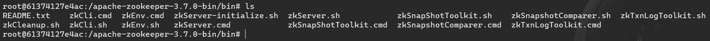
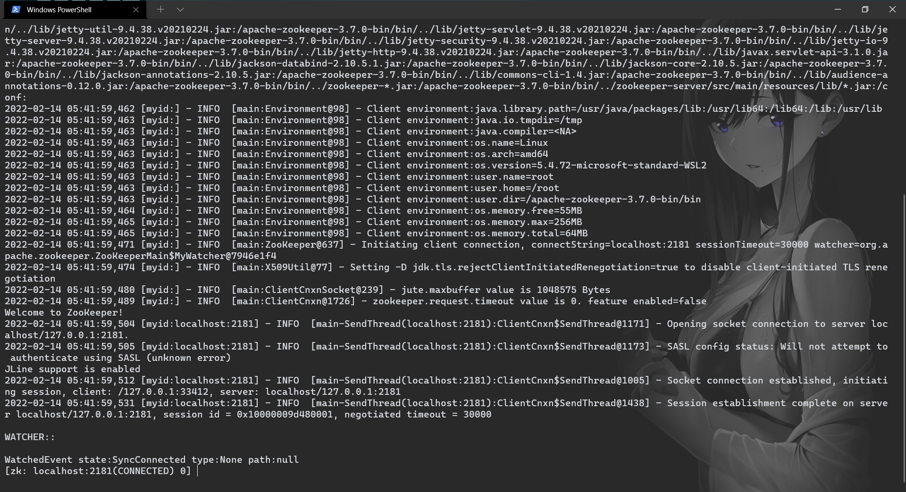
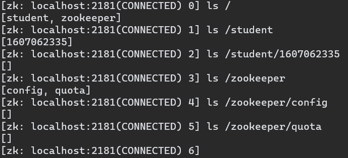
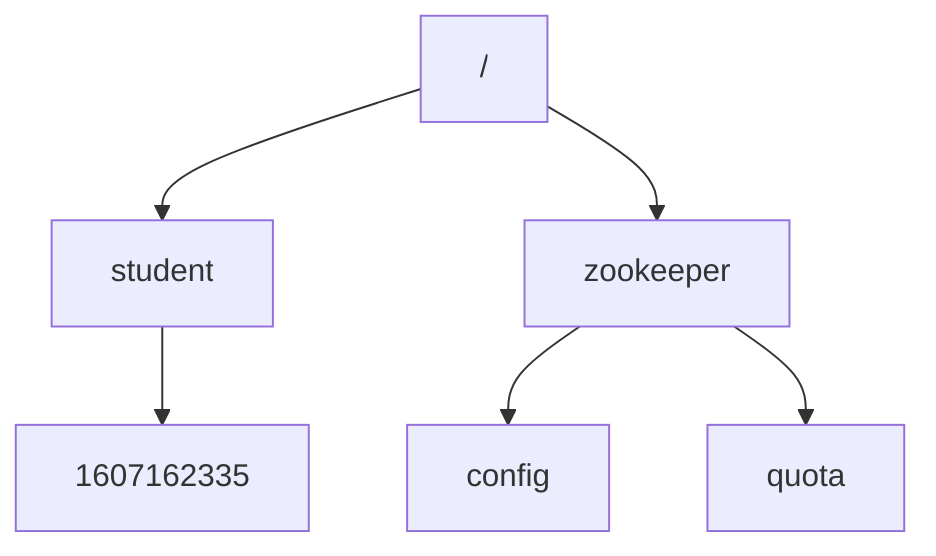
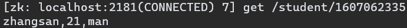
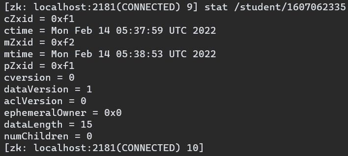

# 数据模型

可以说 Zookeeper 存储的所有数据是由 Znode 组成的（节点也称为 Znode），并以 key/value 形式存储数据。

Zookeeper 提供的名称空间非常类似于标准文件系统，名称 key 是由斜线 / 分割的一系列路径元素，其中根路径以 / 开头。Zookeeper 名称空间中的每个节点都由一个路径标识。

进入 Zookeeper 安装路径的 bin 目录，通过 zhCli.sh 打开 Zookeeper 客户端：

通过 ‘ls’ 命令查看各个路径下的目录列表：

可以直观的看到，Zookeeper 当前的节点结构：

通过 `get` 命令可以获取节点存储的数据：

通过 `stat` 命令可以获取节点的状态：

| Znode属性      | 说明                                                         |
| -------------- | ------------------------------------------------------------ |
| cZxid          | 创建节点的事务的ID                                           |
| ctime          | 创建节点的时间                                               |
| mZxid          | 最后修改节点的事务的ID                                       |
| mtime          | 最后修改节点的时间                                           |
| pZxid          | 最后修改节点<u>子节点列表</u>的事务的ID（注意：添加和删除子节点会影响子节点列表，修改子节点的数据内容不会影响子节点列表） |
| cversion       | 子节点版本号，子节点每次修改，版本号 +1                      |
| dataVersion    | 数据版本号，数据每次修改，版本号 +1                          |
| aclVersion     | 权限版本号，权限每次修改，版本号 +1                          |
| ephemeralOwner | 如果该节点是持久节点，该属性值为 0 ；如果该节点是临时节点，该属性值为创建该节点的临时会话的 SessionID |
| dataLength     | 该节点数据的长度                                             |
| numChildren    | 该节点拥有的<u>直接</u>子节点的数量                          |

