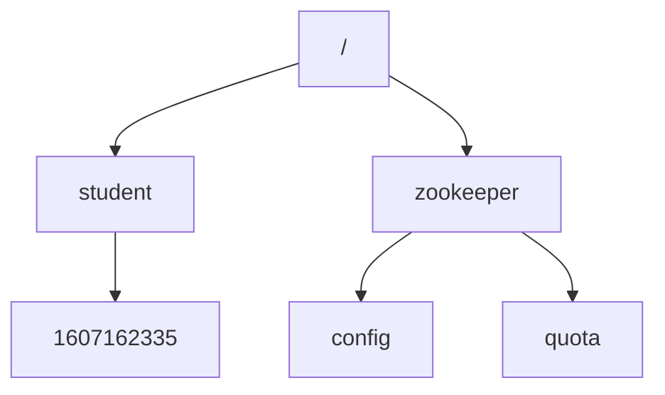
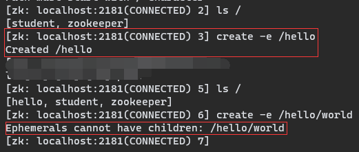
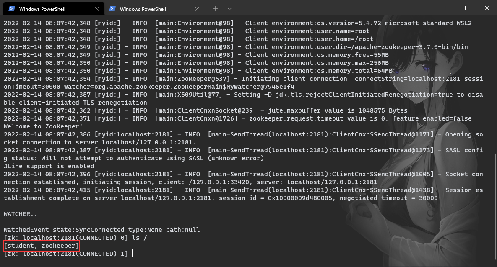

# 节点特性

本文介绍 Zookeeper 的节点特征以及简单使用场景，正是由于这些节点特征，Zookeeper 才能适用于这么多的应用场景。

[toc]

## 节点特性

### 1. 处于同一级的节点，节点名称是唯一的



节点的名称实际上是全路径，config节点的名称实际等于 “/zookeeper/config” 

### 2. 创建节点时必须使用全路径

```
create /student/1607162335
```

### 3. 临时节点不能有子节点



### 4. Session 关闭后，该 Session 创建的临时节点会被清除

关闭创建临时节点的客户端，另外开启一个客户端，查看节点列表：



可以看到临时节点已经被删除

### 5. Watch 机制，监听节点变化

事件监听机制类似于观察者模式，watch 流程是客户端向服务端某个节点路径上注册一个 watcher，同时客户端也会存储特定的 watcher，当节点数据或子节点发生变化时，服务端通知客户端，客户端进行回调处理。


## 经典应用场景

1.   数据发布/订阅
2.   负载均衡
3.   分布式协调/通知
4.   集群管理
5.   master 管理
6.   分布式锁
7.   分布式队列

