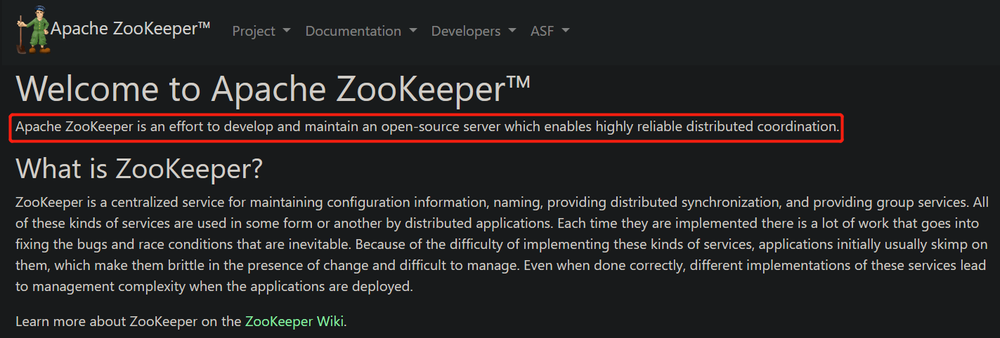

# Zookeeper 理论

[toc]

ZooKeeper  是 Apache 软件基金会的一个软件项目，官网：https://zookeeper.apache.org/

Zookeeper  =   **分布式应用程序协调服务软件**，分布式应用程序可以基于它实现下列功能：

-   数据发布/订阅
-   负载均衡
-   命名服务
-   分布式协调/通知
-   集群管理
-   Master 选举
-   分布式锁
-   分布式队列

---

## 数据模型

<(￣︶￣)↗[Zookeeper 理论 - 数据模型.md](./Zookeeper 理论 - 数据模型.md)

## Zookeeper 与 CAP 理论

<(￣︶￣)↗[Zookeeper 理论 - Zookeeper 与 CAP 理论.md!](Zookeeper 理论 - Zookeeper 与 CAP 理论.md)

## 会话

<(￣︶￣)↗[Zookeeper 理论 - 会话.md](Zookeeper 理论 - 会话.md)

## 客户端基本命令

<(￣︶￣)↗[Zookeeper 理论 - 客户端基本命令.md](./Zookeeper 理论 - 客户端基本命令.md)

## 节点特性

<(￣︶￣)↗[Zookeeper 理论 - 节点特性.md](./Zookeeper 理论 - 节点特性.md)

## ACL & 权限控制

<(￣︶￣)↗[Zookeeper 理论 - ACL & 权限控制.md](./Zookeeper 理论 - ACL & 权限控制.md)

## Watcher 事件机制

<(￣︶￣)↗[Zookeeper 理论 - Watcher 事件机制.md](./Zookeeper 理论 - Watcher 事件机制.md)

## ZAB & 分布式数据一致性

<(￣︶￣)↗[Zookeeper 理论 - ZAB & 分布式数据一致性.md](./Zookeeper 理论 - ZAB & 分布式数据一致性.md)

## Leader 选举

<(￣︶￣)↗[Zookeeper 理论 - Leader 选举.md](./Zookeeper 理论 - Leader 选举.md)

