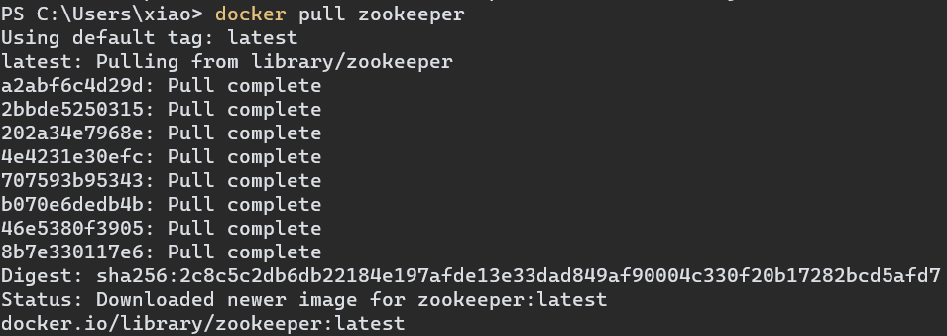
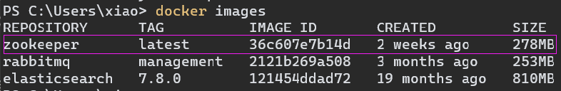
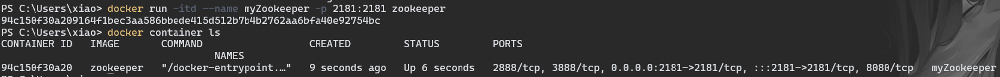
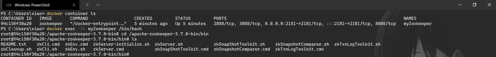
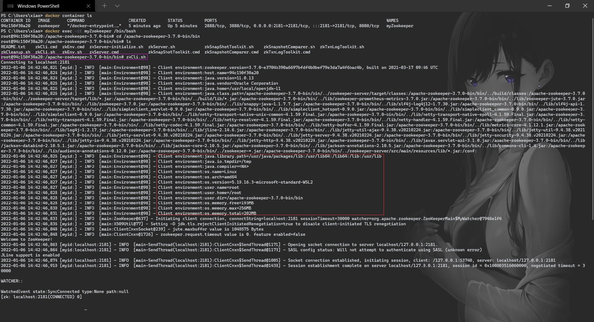

### Zookeeper 安装

# 1. Win10

# 2. Linux

# 3. Win10 + Docker

1.   拉取最新的 Zookeeper 镜像

     ```dockerfile
     docker pull zookeeper
     ```

     

     >   拉取指定版本的 Zookeeper 镜像
     >
     >   ```dockerfile
     >   docker pull zookeeper:xxx
     >   ```

     

2.   查看拉取的镜像

     ```dockerfile
     docker images
     ```

     

     

3.   根据镜像创建并启动容器

     ```dockerfile
     docker run -itd --name myZookeeper -p 2181:2181 zookeeper
     ```

     -   -i：以交互模式运行容器

     -   -t：为容器重新分配一个伪输入终端

     -   -d：后台运行容器，并返回容器ID

     -   --name myZookeeper：自定义容器名称

     -   -p 2181:2181：端口映射

         

4.   查看容器运行状态

     ```dockerfile
     docker container ls
     ```

     

     

5.   进入 Zookeeper 容器；进入 Zookeeper 安装目录

     

6.   运行客户端

     ```sh
     zkCli.sh
     ```

     
