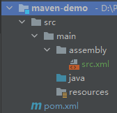

# Maven - 打包插件


当你使用 Maven 对项目进行打包时，你需要了解以下 3 个打包插件：

-   maven-jar-plugin：maven 默认的打包插件，用于构建 project jar
-   maven-shade-plugin：用于打可执行包，executable（fat）jar
-   maven-assembly-plugin：用于定制化打包方式


[toc]


---

## 一、Apache Maven Shade Plugin


### 1.1 说明

>   官方说明：https://maven.apache.org/plugins/maven-shade-plugin/
>
>   -   Shade is bound to the `packing` phase and is used to create a **shaded** jar.
>   -   This plugin provides the capability to package the artifact in an uber-jar, including its dependencies and to *shade* - i.e. **rename - the packages of some of the dependencies.**

Shade 作用于 Maven 的 Packing 阶段，它能够将项目依赖的 jar 包解压并融合到项目自身的编译文件（.class）中，例：

>   我们自己的项目：
>
>   ```
>   com.xzy.demo
>       Main.java
>   ```
>
>   项目依赖的jar包：
>
>   ```
>   com.fake.text
>       A.class
>       B.class
>   ```
>
>   借助 Shade 插件，我们可以对上面两个项目的结构进行融合，并打进一个 jar 包：（解压、合并）
>
>   ```
>   com.
>       xzy.demo
>           Main.class
>       fake.text
>           A.class
>           B.class
>   ```


### 1.2 使用流程

1、配置：Shade 的配置模板如下

```xml
<project>
    ...
    <build>
        <plugins>
            <plugin>
                <groupId>org.apache.maven.plugins</groupId>
                <artifactId>maven-shade-plugin</artifactId>
                <version>3.3.0</version>
                <configuration>
                    <!--put your configuration here-->
                </configuration>
                <executions>
                    <execution>
                        <phase>package</phase>
                        <goals>
                            <goal>shade</goal>
                        </goals>
                    </execution>
                </executions>
            </plugin>
        </plugins>
    </build>
    ...
</project>
```

2、生效：Shade 在 Maven 的 Packing 阶段生效

```shell
mvn package
```


### 1.3 DEMO


#### Selecting Contents for Uber JAR —— 定制JAR包内容

下面的片段显示了如何控制JAR包中应该包含/排除哪些依赖项：

```xml
<configuration>
    <!--put your configuration here-->
    <artifactSet>
        <excludes>
            <exclude>classworlds:classworlds</exclude>
            <exclude>junit:junit</exclude>
            <exclude>jmock:*</exclude>
            <exclude>*:xml-apis</exclude>
            <exclude>org.apache.maven:lib:tests</exclude>
            <exclude>log4j:log4j:jar:</exclude>
        </excludes>
        <includes>
            <include>...</include>
            ...
        </includes>
    </artifactSet>
</configuration>
```

依赖项的格式： *groupId*:*artifactId*[[:*type*]:*classifier*] 。从 1.3 版本开始，指定依赖项的时候可以使用 `*`、`?`进行正则匹配。


如果需要进行更细粒度的控制，可以使用 <filter>：

```xml
<configuration>
    <!--put your configuration here-->
    <filters>
        <!--junit:junit中应该包含/排除哪些内容-->
        <filter>
            <artifact>junit:junit</artifact>
            <includes>
                <include>junit/framework/**</include>
                <include>org/junit/**</include>
            </includes>
            <excludes>
                <exclude>org/junit/experimental/**</exclude>
                <exclude>org/junit/runners/**</exclude>
            </excludes>
        </filter>
        <!--所有依赖项应该排除哪些内容-->
        <filter>
            <artifact>*:*</artifact>
            <excludes>
                <exclude>META-INF/*.SF</exclude>
                <exclude>META-INF/*.DSA</exclude>
                <exclude>META-INF/*.RSA</exclude>
            </excludes>
        </filter>
    </filters>
</configuration>
```


除了手动配置依赖项的过滤，Shade 还提供了<u>自动删除项目未使用的依赖类</u>的功能，以此最大限度的压缩JAR包的大小：

```xml
<configuration>
    <minimizeJar>true</minimizeJar>
</configuration>
```

从 1.6 版本开始，<minimizeJar> 能够与 <filter> 一起使用：<filter> 配置的优先级高于 <minimizeJar>


#### Relocating Classed —— 修改类的全限定名

先来分析一个问题：

>   假如我们的项目具有以下结构：
>
>   ```
>   com.demo.util
>       NumberUtil
>       StringUtil
>   ```
>
>   某个项目需要使用我们项目打出的JAR包，而这个项目的结构是这样的：
>
>   ```
>   com.demo.util
>       DateUtil
>       CollectionUtil
>       StringUtil
>   ```
>
>   那么最终通过 Shade 进行项目合并的时候就会出现冲突：两个项目都有 com.demo.util.StringUtil 类，到底取哪一个？
>
>   ```
>   com.demo.util
>       NumberUtil
>       DateUtil
>       CollectionUtil
>       StringUtil ？？？
>   ```

为了解决我们上面分析的由于类的全限定名相同而导致的冲突问题，Shade 提供了修改类包名的功能：（重定位）

```xml
<configuration>
    <!--put your configuration here-->
    <relocations>
        <relocation>
            <pattern>com.demo.util</pattern>
            <shadedPattern>com.demo.util.out</shadedPattern>
            <includes>...</includes>
            <excludes>...</excludes>
        </relocation>
    </relocations>
</configuration>
```

根据上面的配置，合并项目的时候 Shade 会创建一个 com.demo.util.out 路径用于存储依赖项 com.demo.util 路径下的类：

```
com.demo.util
    DateUtil
    CollectionUtil
    StringUtil
    out
        NumberUtil
        StringUtil 
```


#### Attaching the Shaded Artifact

https://maven.apache.org/plugins/maven-shade-plugin/examples/attached-artifact.html


#### Executable JAR

https://maven.apache.org/plugins/maven-shade-plugin/examples/executable-jar.html


#### Resource Transformers

https://maven.apache.org/plugins/maven-shade-plugin/examples/resource-transformers.html


---

## 二、Apache Maven Assembly Plugin

### 2.1 使用流程

>   官方文档：https://maven.apache.org/plugins/maven-assembly-plugin/usage.html



1.   编写 Assembly 配置文件

     后文会详细说明，此处暂不说明

     

2.   在 pom.xml 中指定 Assembly 配置文件

     ```xml
     <project>
         ...
         <build>
             ...
             <plugins>
                 ...
                 <plugin>
                     <groupId>org.apache.maven.plugins</groupId>
                     <artifactId>maven-assembly-plugin</artifactId>
                     <version>3.3.0</version>
                     <configuration>
                         <descriptors>
                             <descriptor>src/main/assembly/src.xml</descriptor>
                         </descriptors>
                     </configuration>
                     <executions>
                         <!--指定执行方式-->
                         <execution>
                             <id>make-assembly</id> <!-- this is used for inheritance merges -->
                             <phase>package</phase> <!-- bind to the packaging phase -->
                             <goals>
                                 <goal>single</goal>
                             </goals>
                         </execution>
                     </executions>                
                 </plugin>
                 ...
             </plugins>
             ...
         </build>
         ...
     </project>
     ```

3.   Assembly 生效：Assembly 作用与 Maven 的 package 阶段

     ```shell
     mvn package
     ```


### 2.2 配置

Assembly 提供了大量的描述符同于定制项目的打包方式：https://maven.apache.org/plugins/maven-assembly-plugin/assembly.html


### 2.3 DEMO

>   官网DEMO：
>
>   -   Working with Single Projects
>       -   [Filtering Some Distribution Files](https://maven.apache.org/plugins/maven-assembly-plugin/examples/single/filtering-some-distribution-files.html)
>       -   [Including/Excluding Artifacts](https://maven.apache.org/plugins/maven-assembly-plugin/examples/single/including-and-excluding-artifacts.html)
>       -   [Using Component Descriptors](https://maven.apache.org/plugins/maven-assembly-plugin/examples/single/using-components.html)
>       -   [Using Repositories](https://maven.apache.org/plugins/maven-assembly-plugin/examples/single/using-repositories.html)
>       -   [Using Container Descriptor Handlers](https://maven.apache.org/plugins/maven-assembly-plugin/examples/single/using-container-descriptor-handlers.html)
>   -   Working with Multi-Module Projects
>       -   [Adding Module Sources to the Assembly](https://maven.apache.org/plugins/maven-assembly-plugin/examples/multimodule/module-source-inclusion-simple.html)
>       -   [Adding Module Binaries to the Assembly](https://maven.apache.org/plugins/maven-assembly-plugin/examples/multimodule/module-binary-inclusion-simple.html)
>   -   [Sharing Assembly Descriptors](https://maven.apache.org/plugins/maven-assembly-plugin/examples/sharing-descriptors.html)