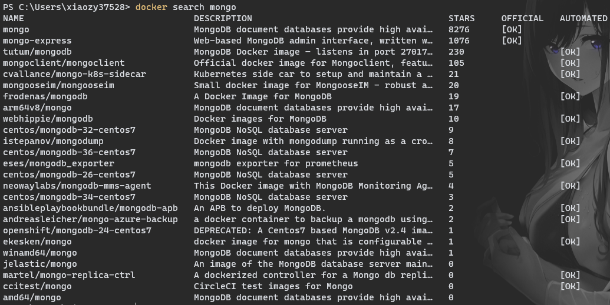
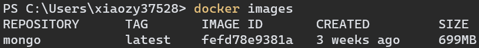
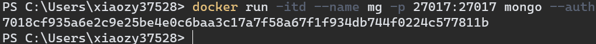
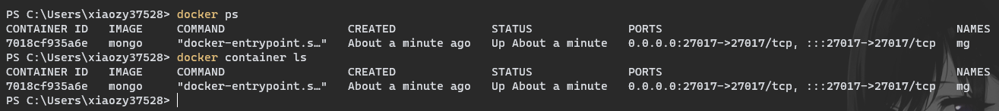
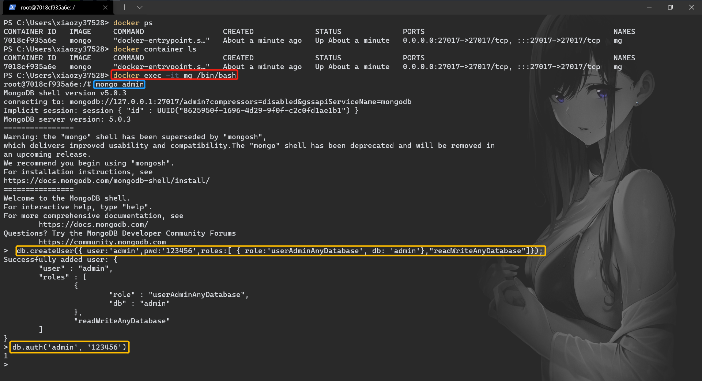

# MongoDB安装

---

## [Docker安装MongoDB](https://www.runoob.com/docker/docker-install-mongodb.html)

1、搜索docker仓库中可用的mongo镜像

```sh
docker search mongo
```




2、拉取镜像

```sh
docker pull mongo
```


3、检查拉取结果




4、创建并运行容器

```
docker run -itd --name mg -p 27017:27017 mongo --auth
```

>   -   **-p 27017:27017** ：映射容器服务的 27017 端口到宿主机的 27017 端口。外部可以直接通过 宿主机 ip:27017 访问到 mongo 的服务。
>   -   **--auth**：需要密码才能访问容器服务。




5、安装成功

最后我们可以通过 **docker ps** 命令或 **docker container ls** 命令查看容器的运行信息：



接着使用以下命令添加用户和设置密码，并且尝试连接：

```
$ docker exec -it mongo mongo admin
# 创建一个名为 admin，密码为 123456 的用户。
>  db.createUser({ user:'admin',pwd:'123456',roles:[ { role:'userAdminAnyDatabase', db: 'admin'},"readWriteAnyDatabase"]});
# 尝试使用上面创建的用户信息进行连接。
> db.auth('admin', '123456')
```



