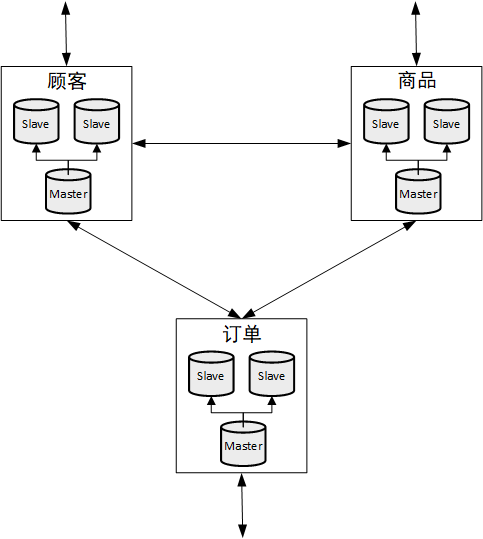

# Redis 6

---

## 1. NoSQL 数据库简介

### 1.1 技术的发展


技术的分类：

1.  解决功能问题：Java、JSP、Tomcat、Linux、JDBC
2.  解决拓展问题：Struts、Spring、SpringMVC、JPA、MyBatis
3.  解决性能问题：==NoSQL==、MQ、Java线程、Hadoop

无论何种技术，存在的意义都是解决问题。NoSQL就是一种用来解决性能问题的技术，而Redis就是一种典型的NoSQL技术。

#### 1.1.1 Web1.0时代

Web1.0 时代，系统访问量、数据量有限（早期的访问全部来自PC6且互联网用户量不多），单体服务器可以满足需求。


#### 1.1.2 Web2.0时代

Web2.0时代，智能移动设备普及，互联网用户数量剧增，系统访问量、数据量随之大幅提升，单体系统难以支撑，互联网平台面临巨大的挑战。


##### 1.1.2.1 解决CPU及内存压力

服务器集群化、分布式部署，使用负载均衡将客户端请求均匀的发送给各个服务器，缓解单个服务器的CPU和内存压力。


但依然存在问题，例如session共享问题。

>   session共享问题：客户在服务器1登录，服务器1创建了session对象。请求被转发到服务器1的时候可以正常处理，请求被转发到服务器2的时候由于服务器2不存在客户的session对象因此无法处理请求。

解决session问题的方案：

1.  将session存储在cookie：不安全、额外的负载

2.  存在文件服务器或数据库：大量的IO

3.  将session复制到所有服务器：数据冗余

4.  **将session存储到缓存数据库：读取速度快（存储在内存，直接读取，不需要IO）、数据结构简单**

    

##### 1.1.2.2 解决IO压力

读写分离、分库分表：通过破坏一定的业务逻辑来换取性能

**缓存数据库：减少IO操作，例如将热点数据存储缓存数据库（数据存储在内存，避免IO）**


### 1.2 NoSQL数据库

打破了传统关系型数据库以业务逻辑为依据的存储模式，而针对不同数据结构类型改为以性能为依据的存储方式。

#### 1.2.1 NoSQL概述

NoSQL = <font color = red>Not Only SQL</font>，泛指所有非关系数据。NoSQL不依赖业务逻辑存储，而以简单的<font color = red>key-value</font>模式存储，因此大大的增加的数据库的**拓展能力**。

>   理解：假设某个已上线的系统现有3亿用户，如果使用关系型数据库存储用户信息，此时想要往用户表加一个字段，这是非常恐怖的！如果是NoSQL数据库，情况就会好很多。

-   不遵循SQL标准
-   不支持ACID（不支持ACID不意味着不支持事务）
-   性能远超于SQL

#### 1.2.2 适用、不适用场景

适合：

-   高并发读写（电商秒杀）
-   海量数据读写
-   数据高可拓展性

不适合：

-   需求事务支持
-   需要结构化查询

#### 1.2.3 常见NoSQL数据库

1.  Memcache
    -   开源
    -   很早出现的NoSQL数据库
    -   支持的value类型比较单一
    -   数据存储在内存，==不支持持久化==
    -   一般作为缓存数据库辅助持久化数据库
    -   多线程 + 锁
2.  Redis
    -   开源
    
    -   几乎涵盖了Memcache的绝大部分功能
    
    -   支持多种数据结构的value，例如string、list、hash、set、zset
    
    -   数据存储在内存，==支持持久化==（周期性的把更新的数据写入磁盘，或者把修改操作写入记录文件，主要用于备份恢复），在此基础上实现了==Redis主从复制==
    
    -   一般作为缓存数据库辅助持久化数据库
    
    -   单线程 + 多路IO复用
    
        
3.  MongoDB
    -   文档型数据库


## 2. Redis 概述、安装

Redis = REmote DIctionary Server，Redis是一个开源的使用ANSI C语言编写、遵守BSD协议、支持网络、可基于内存亦可持久化的日志型、Key-Value数据库，并提供多种语言的API。

一般来说，我们都是使用关系型数据库MySQL来存储数据，但是面对着流量高峰，会对MySQL造成巨大的压力，导致数据库性能很差，这时就要使用缓存中间件来降低数据库的压力，这是Redis最常见的使用场景。除了作为缓存使用之外，Redis还有很多使用场景，比如分布式锁，计数，队列等等。

所以Redis对于程序员来说可以算得上是必修课。

### 2.1 特点

要用好Redis，首先要明白它的特点：

-   读写速度快

    根据Redis官网的数据，Redis每秒能够完成10w次左右的读写。速度快的原因这里先简单说一下：

    1.   数据存储在内存中，我们知道机器访问内存的速度是远远大于访问磁盘的
    2.   Redia采用单线程架构，避免了上下文切换带来的成本以及多线程带来的竞争（即不存在加锁和释放锁的操作），减少了CPU的消耗
    3.   采用了非阻塞I/O多路复用机制

-   数据结构丰富

    Redis不仅仅支持简单的key-value类型的数据，同时还提供list，set，zset，hash等数据结构

-   支持持久化

    Redis提供了RDB和AOF两种持久化策略，能最大限度地保证Redis服务器宕机重启后数据不会丢失

-   支持高可用

    可以使用主从复制（并且提供哨兵机制）、集群保证服务器的高可用

-   客户端语言多

    因为Redis受到社区和各大公司的广泛认可，所以客户端语言涵盖了所有的主流编程语言，比如Java，C，C++，PHP，NodeJS等等

#### 2.1.1 单线程 + I/O多路复用

Redis使用了单线程架构和I/O多路复用模型来实现高性能的内存数据库服务。

所有的命令在一个队列里排队等待被执行，不存在多个命令被同时执行的情况。


为什么单线程还能这么快？

1.   纯内存访问

     Redis将所有数据放在内存中，内存的响应时间长约100纳秒，这是Redis达到每秒万级别访问的==重要基础==。

2.   非阻塞I/O

     Redis使用epoll作为I/O多路复用技术的实现，再加上Redis自身的事件处理模型将epoll中的连接、读写、关闭都转换为事件，不在网络I/O上浪费过多的时间。

     

3.   单线程避免了线程切换和竟态（即没有加解锁操作）产生的CPU消耗

### 2.2 应用场景

-   高速缓存
    -   配合关系型数据库，存储高频热点数据，降低数据库IO
    -   配合分布式结构，实现内存数据共享，如分布式Session
-   数据结构
    -   最新N个数据：通过List实现按照自然时间排序的数据
    -   排行榜：利用zSet（有序集合）
    -   时效性数据，如短信验证码：Expire过期
    -   计数器、秒杀：原子性
    -   去重：利用Set
    -   发布订阅消息系统：pub/sub模式


### 2.2 Redis安装（手动）

#### 2.2.1 安装版本

[官网下载地址](https://redis.io/)


#### 2.2.2 安装步骤

1.  准备工作：下载安装最新版本的gcc编译器

    ```shell
    # 查看当前系统是否安装、安装了什么版本的gcc编译器
    gcc --version
    ```

    ```shell
    # 安装
    yum install centos-release-scl scl-utils-build
    yum install -y devtoolset-8-toolchain
    scl enable devtoolset-8 bash
    ```

2.  上传redis文件至服务器

    

3.  解压文件

    ```shell
    tar -zxvf redis-6.2.5.tar.gz

4.  进入目录

    ```shell
    cd redis-6.2.5
    ```

    

5.  编译

    ```shell
    make
    ```

    

6.  安装

    ```shell
    # 跳过 make test 直接进行安装
    make install
    ```

    

#### 2.2.3 安装目录

/usr/local/bin


-   redis-benchmark：性能测试工具
-   redis-check-aof：用于修复有问题的aof文件
-   redis-check-rdb：用于修复有问题的rdb文件
-   redis-sentinel：哨兵，Redis主从使用
-   ==redic-cli==：客户端，操作入口
-   ==redis-server==：redis服务器启动命令

#### 2.2.4 前台启动（不推荐）

以前台方式启动，命令行窗口关闭则redis服务随着关闭。

```shell
redis-server
```


#### 2.2.5 后台启动（推荐）

1.  进入redis解压目录，复制redis配置文件

    ```shell
    cd /opt/redis-6.2.5/
    cp redis.conf /usr/local/bin/my-config.conf
    ```

2.  修改配置文件

    修改配置文件中的daemonize配置项目，将原来的no改为yes

    

3.  启动Redis

    ```shell
    # 启动redis
    redis-server my-config.conf
    # 查看启动状态
    ps -ef | grep redis
    ```

    

4.  测试验证

    ```shell
    # 客户端连接redis
    redis-cli
    ```

    

    redis-cli -p xxx：连接使用指定端口的Redis服务，默认情况下连接6379端口的Redis服务

5.  关闭Redis

    方案1：通过客户端，使用shutdown命令

    ```
    # 单实例关闭
    redis-cli shutdown
    
    # 多实例关闭
    redis-cli -p 6379 shutdown
    ```

    方案2：找到redis进程号，使用kill -9 关闭

#### 2.2.6 Redis相关知识

-   默认端口6379

-   默认16个数据库，下标从0开始。默认使用0号数据库，使用 select <dbid> 切换数据库。

    

### 2.3 Redis安装（Docker）

教程地址：https://www.runoob.com/docker/docker-install-redis.html

#### 2.3.1 搜索镜像

```
docker search redis
```


#### 2.3.2 拉取镜像

```
docker pull redis # 拉取最新版本的redis镜像，等用于 docker pull redis:latest
```


查看本地镜像：

```
docker images
```


#### 2.3.3 启动容器

```
# A:新建并启动容器
docker run -itd --name redis-test -p 6379:6379 redis
# B:启动容器
docker start 容器ID或容器名
```

查看容器运行信息：

```
docker ps -a
```


>   参数说明：
>
>   -   -i：以交互模式运行容器（通常与-t一起使用）
>   -   -t：为容器重新分配一个伪输入端口（通常与-i一起使用）
>
>   -   -d：后台启动容器，并返回容器ID，即启动守护式容器
>   -   -name：指定容器名称
>
>   -   -p：本地端口:容器端口：指定端口映射

#### 2.3.4 使用Redis

调用容器的bash：

```
docker exec -it redis-test /bin/bash
```

使用redis-cli：

```
cd /usr/local/bin/
redis-cli
```


#### 2.3.4 关闭容器

```
docker stop 容器ID或容器名
```


## 3. 五大常用数据类型

Redis官网资料：

-   命令
    -   [Redis命令中心（英文）](https://redis.io/commands)
    -   [Redis命令中心（中文）](http://www.redis.cn/commands.html)
    -   [Redis命令手册（中文）](https://www.redis.net.cn/order/)
-   数据类型
    -   [数据类型（英文）](https://redis.io/topics/data-types-intro)
    -   [数据类型（中文）](http://www.redis.cn/topics/data-types.html)

### 3.1 键（key）

#### 3.1.1 简介

Redis是一个Key-Value型的内存数据库，它所有的key都是字符串。Redis的key值是==二进制安全==的，这意味着可以用任何二进制序列作为key值，从形如”abc”的简单字符串到一个JPEG文件的内容都可以。空字符串也是有效key值。

关于key的几条建议：

-   太长的键值不是个好主意，例如1024字节的键值就不是个好主意，不仅因为消耗内存，而且在数据中查找这类键值的计算成本很高。
-   太短的键值通常也不是好主意，如果你要用”u:1000:pwd”来代替”user:1000:password”，这没有什么问题，但后者更易阅读，并且由此增加的空间消耗相对于key object和value object本身来说很小。当然，没人阻止您一定要用更短的键值节省一丁点儿空间。
-   最好坚持一种模式。例如：”object-type: id: field”就是个不错的注意，像这样”user:1000:password”。我喜欢对多单词的字段名中加上一个点，就像这样：”comment: 1234: reply.to”。

#### 3.1.2 常用命令

##### 查询类

###### <font color = #1AA3FF>KEYS</font> pattern

>   **时间复杂度：**O(N)
>
>   **说明：**查找所有匹配给定正则表达式的键
>
>   **警告：**虽然KEYS的速度非常快，但是如果在一个很大的数据库中使用它依然可能造成性能问题，如果你需要从一个数据集中查找特定的KEY，最好还是用Redis的集合结构SETS来代替。

```
127.0.0.1:6379> KEYS *
1) "k11"
2) "k33"
3) "k1"
4) "k2"
5) "k3"
6) "k22"
127.0.0.1:6379> KEYS *1*
1) "k11"
2) "k1"
```


###### <font color = #1AA3FF>EXISTS</font> key [key ...]

>   **时间复杂度：**O(1)
>
>   **说明：**判断指定的key（一个或多个）是否存在
>
>   **返回：**存在的key的数量

```
127.0.0.1:6379> KEYS *
1) "k4"
2) "k3"
127.0.0.1:6379> EXISTS k3
(integer) 1
127.0.0.1:6379> EXISTS k4
(integer) 1
127.0.0.1:6379> EXISTS k5
(integer) 0
127.0.0.1:6379> EXISTS k3 k4 k4
(integer) 3
127.0.0.1:6379> EXISTS k3 k4 k5
(integer) 2

```


###### <font color = #1AA3FF>TYPE</font> key

>   **时间复杂度：**O(1)
>
>   **说明：**查询指定key所存储的value的存储类型。
>
>   **返回：**`string`, `list`, `set`, `zset` 和 `hash`等不同类型，如果key不存在就返回none

```
127.0.0.1:6379> SET k1 stirng
OK
127.0.0.1:6379> LPUSH k2 1 2 3 4 5 6
(integer) 6
127.0.0.1:6379> SADD k3 a b c
(integer) 3
127.0.0.1:6379> KEYS *
1) "k3"
2) "k2"
3) "k1"
127.0.0.1:6379> TYPE k1
string
127.0.0.1:6379> TYPE k2
list
127.0.0.1:6379> TYPE k3
set
127.0.0.1:6379> TYPE k4
none
```


###### <font color = #1AA3FF>TTL</font> key

>**时间复杂度：**O(1)
>
>**说明：**查询指定key的剩余有效时间。2.6版本之后添加了<font color = #1AA3FF>PTTL</font>命令，以毫秒为单位返回key的剩余时间。
>
>**返回：**
>
>-   2.6及以前版本：`-1` key不存在或已经过期
>-   2.8及之后版本：`-1` key存在且没有设置过期时间  `-2` key不存在或已经过期

```
127.0.0.1:6379> KEYS *
1) "k2"
127.0.0.1:6379> TTL k1    # k1不存在
(integer) -2
127.0.0.1:6379> TTL k2    # k2没有设置过期时间
(integer) -1
127.0.0.1:6379> EXPIRE k2 100
(integer) 1
127.0.0.1:6379> TTL k2    # k2尚未过期
(integer) 96
127.0.0.1:6379> TTL k2    # k2已经过期
(integer) -2
```


##### 操作类

###### <font color = #1AA3FF>DEL</font> key [key …]

>   **时间复杂度：**O(N)，当删除的key是字符串以外的复杂数据类型时（如`List`、`Set`、`Hash`），删除这个key的时间复杂度是O(1)
>
>   **说明：**删除指定的一批key，如果删除的key不存在则直接跳过
>
>   **返回：**被删除的keys的数量

```
127.0.0.1:6379> KEYS *
1) "k1"
2) "k2"
3) "k4"
4) "k3"
127.0.0.1:6379> DEL k1 k2 k5 k6
(integer) 2
127.0.0.1:6379> KEYS *
1) "k4"
2) "k3"
```


###### <font color = #1AA3FF>RENAME</font> oldKey newKey

>   **时间复杂度：**O(1)
>
>   **说明：**为指定的key设置新的名称

```
127.0.0.1:6379> keys *
1) "k1"
127.0.0.1:6379> RENAME k1 k2
OK
127.0.0.1:6379> keys *
1) "k2"
127.0.0.1:6379> RENAME k2 k2
OK
127.0.0.1:6379> keys *
1) "k2"
```


###### <font color = #1AA3FF>EXPIRE</font> key seconds

>   **时间复杂度：**O(1)
>
>   **说明：**为指定的key设置过期时间（秒），超过时间后该key会被自动删除。在Redis 2.4及以前版本，过期期时间可能不是十分准确，有0-1秒的误差；从Redis 2.6起，过期时间误差缩小到0-1毫秒。2.6.0版本新增了<font color = #1AA3FF>PEXPIRE</font>命令，以毫秒为单位设置key的过期时间。
>
>   **返回：**`1`-设置成功 `0`-设置不成功（key不存在或不能设置过期时间）

-   过期和持久化

    ==Keys的过期时间使用Unix时间戳存储(从Redis 2.6开始以毫秒为单位)，这意味着即使Redis实例不可用，时间也是一直在流逝的。==

    要想过期的工作处理好，计算机必须采用稳定的时间。 如果你将RDB文件在两台时钟不同步的电脑间同步，有趣的事会发生——可能所有的keys装载时就会过期。即使正在运行的实例也会检查计算机的时钟，例如如果你设置了一个key的有效期是1000秒，然后设置你的计算机时间为未来2000秒，这时key会立即失效，而不是等1000秒之后。

-   <font color= red>Redis如何淘汰过期的key？</font>

    Redis的key过期方式有两种：被动发现和主动发现

    当客户端尝试访问过期的key时，它会被发现并删除。显然这样是不够的，因为有些过期的key永远不会被访问，无论如何必须想办法删除这些过期的key，所以Redis会定时随机抽取key，验证过期时间，如果过期则删除。

    主动发现的具体工作流程：（每隔10秒）

    1.  随机抽取20个key验证过期时间
    2.  删除所有已经过期的key
    3.  如果过期的key超过25%，重复步骤1

    观察上述流程可以知道，任何给定的时刻，最多清除1/4的过期key。

-   修改key名

    如果使用RENAME修改key，相关的过期时间会转移到新key上面。如果key原本就存在：假设存在k2，调用RENAME k1 k2命令，此时k1的过期时间会被k2覆盖。

    ```
    127.0.0.1:6379> KEYS *
    1) "k3"
    127.0.0.1:6379> EXPIRE k3 30        # 设置30秒过期时间
    (integer) 1
    127.0.0.1:6379> RENAME k3 k4        # 修改键名
    OK
    127.0.0.1:6379> KEYS *
    1) "k4"
    127.0.0.1:6379> KEYS *
    1) "k4"
    127.0.0.1:6379> KEYS *
    1) "k4"
    127.0.0.1:6379> KEYS *
    1) "k4"
    127.0.0.1:6379> KEYS *
    1) "k4"
    127.0.0.1:6379> KEYS *
    1) "k4"
    127.0.0.1:6379> KEYS *
    1) "k4"
    127.0.0.1:6379> KEYS *
    1) "k4"
    127.0.0.1:6379> KEYS *
    1) "k4"
    127.0.0.1:6379> KEYS *        # 过期自动删除
    (empty array)
    ```

-   刷新过期时间

    重复调用EXPIRE命令可以重新为key设置过期时间

    ```
    127.0.0.1:6379> SET k1 v1
    OK
    127.0.0.1:6379> KEYS *
    1) "k1"
    127.0.0.1:6379> EXPIRE k1 3   # 设置过期时间3秒
    (integer) 1
    127.0.0.1:6379> EXPIRE k1 3
    (integer) 1
    127.0.0.1:6379> EXPIRE k1 3
    (integer) 1
    127.0.0.1:6379> EXPIRE k1 3
    (integer) 1
    127.0.0.1:6379> EXPIRE k1 3
    (integer) 1
    127.0.0.1:6379> EXPIRE k1 3    # 每隔1秒重置过期时间
    (integer) 1
    127.0.0.1:6379> EXPIRE k1 3
    (integer) 1
    127.0.0.1:6379> EXPIRE k1 3
    (integer) 1
    127.0.0.1:6379> EXPIRE k1 3
    (integer) 1
    127.0.0.1:6379> EXPIRE k1 3
    (integer) 1
    127.0.0.1:6379> EXPIRE k1 3
    (integer) 1
    127.0.0.1:6379> KEYS *         # 间隔第一次设置过期时间实际早已超过3秒
    1) "k1"
    ```
    
-   移除过期设置

    通过调用PERSIST命令可以移除key的过期设置。

    ```
    127.0.0.1:6379> SET k1 v1
    OK
    127.0.0.1:6379> KEYS *
    1) "k1"
    127.0.0.1:6379> EXPIRE k1 10    # 设置10s后过期
    (integer) 1
    127.0.0.1:6379> PERSIST k1      # 移除过期设置
    (integer) 1
    127.0.0.1:6379> KEYS *          # 等待15秒后，k1依然存在
    1) "k1"
    127.0.0.1:6379> 
    ```


###### <font color = #1AA3FF>EXPIREAT</font> key timestamp

>   **时间复杂度：**O(1)
>
>   **说明：**EXPIREAT命令和EXPIRE命令类似，都用于设置key的生存时间，不同在于EXPIREAT命令接受的参数是UNIX时间戳。2.6.0版本新增了<font color = #1AA3FF>PEXPIREAT</font>命令，以毫秒为单位设置key的过期时间。
>
>   **返回：**`1`-设置成功 `0`-设置不成功（key不存在或不能设置过期时间）

```
127.0.0.1:6379> SET k1 v1
OK
127.0.0.1:6379> EXISTS k1
(integer) 1
127.0.0.1:6379> EXPIREAT k1 1293840000
(integer) 1
127.0.0.1:6379> EXISTS k1
(integer) 0
```


###### <font color = #1AA3FF>PERSIST</font> key

>   **时间复杂度：**O(1)
>
>   **说明：**移除设置在给定key上的过期设置
>
>   **返回：**`1`-移除成功 `0`-移除失败（key不存在或没有设置过期时间）


### 3.2 字符串（String）

#### 3.2.1 简介

字符串是一种最基本的Redis值类型。Redis字符串是==二进制安全==的，这意味着一个Redis字符串能包含任意类型的数据，例如： 一张JPEG格式的图片或者一个序列化的Ruby对象。

一个字符串类型的值最多能存储==512MB==的内容。

#### 3.2.2 常用命令

##### 查询类

###### <font color = #1AA3FF>GET</font> key

>   **时间复杂度：**O(1)
>
>   **说明：**返回指定的key的value。如果key不存在，返回特殊值nil；如果key的value不是string类型，返回错误信息（GET只支持处理string类型的values）。

```
127.0.0.1:6379> SET str:k1 abc        # 插入string类型的数据
OK
127.0.0.1:6379> LPUSH lis:k2 1 2 3    # 插入list类型的数据
(integer) 3
127.0.0.1:6379> keys *
1) "lis:k2"
2) "str:k1"
127.0.0.1:6379> GET str:k1    # 使用get查询存在的string数据
"abc"
127.0.0.1:6379> GET str:k2    # 使用get查询不存在的string数据
(nil)
127.0.0.1:6379> GET lis:k2    # 使用get查询非string数据
(error) WRONGTYPE Operation against a key holding the wrong kind of value
```


###### <font color = #1AA3FF>MGET</font> key [key …]

>   **时间复杂度：**O(N)，N代表key的数量
>
>   **说明：**返回指定的所有key的value。对于不对应string或者不存在的key，都返回nil（因此本操作从来不会失败）。

```
127.0.0.1:6379> keys *
1) "lis:k2"    # list类型
2) "str:k1"    # string类型
127.0.0.1:6379> MGET str:k1 str:k2 lis:k1 lis:k2
1) "abc"
2) (nil)
3) (nil)
4) (nil)
```


###### <font color = #1AA3FF>GETSET</font> key value

>   **时间复杂度：**O(1)
>
>   **说明：**将key对应到指定的value，并且返回key原本对应的value。如果key不存在，返回nil；如果key存在但是原本对应的不是string类型的数据，返回错误信息。

```
127.0.0.1:6379> keys *
1) "lis:k2"    # list类型
2) "str:k1"    # string类型
127.0.0.1:6379> GET str:k1
"abc"
127.0.0.1:6379> GETSET str:k1 def    # 正常操作
"abc"
127.0.0.1:6379> GET str:k1
"def"
127.0.0.1:6379> GET str:k2
(nil)
127.0.0.1:6379> GETSET str:k2 666    # 操作不存在的key
(nil)
127.0.0.1:6379> GETSET lis:k2 777    # 操作对应非string类型数据的key
(error) WRONGTYPE Operation against a key holding the wrong kind of value
127.0.0.1:6379> 127.0.0.1:6379> keys *
```


###### <font color = #1AA3FF>STRLEN</font> key

>   **时间复杂度：**O(1)
>
>   **说明**：返回key的string类型value的长度。如果key不存在，返回`0`；如果key存在，但对应非string类型，就返回错误。

```
127.0.0.1:6379> SET str:k1 abcdefghijklmn    # string类型
OK
127.0.0.1:6379> LPUSH lis:k1 a b c d e       # list类型
(integer) 5
127.0.0.1:6379> STRLEN str:k1                # key存在，且对应string类型
(integer) 14
127.0.0.1:6379> STRLEN str:k2                # key不存在
(integer) 0
127.0.0.1:6379> STRLEN lis:k1                # key存在，但对应非string类型
(error) WRONGTYPE Operation against a key holding the wrong kind of value
```


###### <font color = #1AA3FF>GETRANGE</font> key start end

>   **时间复杂度：**O(N)，N是字符串长度，复杂度由最终返回长度决定，但由于通过一个字符串创建子字符串是很容易的，它可以被认为是O(1)。
>
>   **说明：**返回key对应的字符串的在指定范围内的子串。可以使用负数表示字符串倒数的位置，所以`-1`表示最后一个字符，`-2`表示倒是第二个字符，以此类推。
>
>   **警告：**在2.0之前的版本中这个命令叫做<font color = #1AA3FF>SUBSTR</font>

```
127.0.0.1:6379> GET k1
"123456789"
127.0.0.1:6379> GETRANGE k1 2 6
"34567"
127.0.0.1:6379> GETRANGE k1 -8 -4
"23456"
127.0.0.1:6379> GETRANGE k1 1 20
"23456789"
127.0.0.1:6379> 
```


##### 操作类

###### <font color = #1AA3FF>SET</font> key value [<font color = #1AA3FF>EX</font> seconds] [<font color = #1AA3FF>PX</font> milliseconds] [<font color = #1AA3FF>NX</font>|<font color = #1AA3FF>XX</font>]

>   **时间复杂度：**O(1)
>
>   **说明：**将key与指定字符串对应。如果key已经对应了一个值，这个操作会直接覆盖原来的值，并且忽略原始类型。命令执行成功之后，之前设置的过期时间都将失效。
>
>   从2.6.12版本开始，Redis为`SET`命令增加了一系列选项：
>
>   -   `EX` *seconds* – 设置键key的过期时间，单位时秒
>   -   `PX` *milliseconds* – 设置键key的过期时间，单位时毫秒
>   -   `NX` – 只有键key不存在的时候才会设置key的值
>   -   `XX` – 只有键key存在的时候才会设置key的值
>
>   **警告：**由于`SET`命令加上上述选项就已经可以完全实现SETNX、SETEX、PSETED等命令的功能，所以在将来的版本中这些命令可能会被Redis抛弃。


###### <font color = #1AA3FF>MSET</font> key value [key value …]

>   **时间复杂度：**O(N)，N代表k-v对的数量。
>
>   **说明：**同时设置多对k-v对。与`SET`命令相同，如果key已经对应了一个值，这个操作会直接覆盖原来的值，并且忽略原始类型。命令执行成功之后，之前设置的过期时间都将失效。
>
>   **警告：**`MSET`命令是原子的，即要么所有k-v设置都成功，要么所有k-v设置都不成功。

```
127.0.0.1:6379> MSET k1 v1 k2 v2 k3 v3
OK
127.0.0.1:6379> KEYS *
1) "k2"
2) "k1"
3) "k3"
```


###### <font color = #1AA3FF>SETRANGE</font> key offset value

>   **说明：**覆盖key对应的string的一部分，从指定的offset处开始，覆盖value的长度。如果offset比当前key对应string还要长，那这个string后面就补0以达到offset。不存在的keys被认为是空字符串，所以这个命令可以确保key有一个足够大的字符串，能在offset处设置value。
>
>   **警告：**offset最大可以是229-1(536870911),因为redis字符串限制在512M大小。

```
127.0.0.1:6379> SET k1 123456789
OK
127.0.0.1:6379> SETRANGE k1 5 hello
(integer) 10
127.0.0.1:6379> GET k1
"12345hello"

127.0.0.1:6379> SET k2 123456789
OK
127.0.0.1:6379> SETRANGE k2 15 hello
(integer) 20
127.0.0.1:6379> get k2
"123456789\x00\x00\x00\x00\x00\x00hello"

127.0.0.1:6379> SETRANGE k3 5 hello
(integer) 10
127.0.0.1:6379> GET k3
"\x00\x00\x00\x00\x00hello"
127.0.0.1:6379> 
```


###### <font color = #1AA3FF>SETNX</font> key value

>   **时间复杂度：**O(1)
>
>   **说明：**在key不存在的前提下，创建key和value的对应关系。SETNX是SET if Not eXists的简写。
>
>   返回值：`1`-设置成功 `0`-设置失败


###### <font color = #1AA3FF>MSETNX</font> key value [key value …]

>   **时间复杂度：**O(N) ，N为k-v的数量
>
>   **说明：**与`MSET`命令相同，`MSETNX`命令是原子的。
>
>   **返回值：**`1`-所有k-v设置成功 `0`-设置失败（说明至少有一个key是已经存在的）


###### <font color = #1AA3FF>SETEX</font> key seconds value

>   **说明：**设置k-v对应关系，同时设置过期时间。过期时间以秒为单位。这个命令等同于顺序执行以下命令：
>
>   ``` 
>   SET key value
>   EXPIRE key seconds
>   ```
>
>   `SETEX`命令是原子的，==相比连续执行上述两条命令，更快==


###### <font color = #1AA3FF>PSETEX</font> key milliseconds value

>   **说明：**功能与SETEX相同，唯一的区别是过期时间以毫秒为单位，而不是秒。


###### <font color = #1AA3FF>INCR</font> key

>   **说明：**对存储在指定`key`的数值执行加1操作。如果指定的key不存在，那么在执行INCR操作之前，会先将它的值设定为`0`；如果指定的key中存储的值不是字符串类型，或者存储的字符串类型不能表示为一个整数，那么执行这个命令时服务器会返回错误信息。
>
>   **警告：**
>
>   1.  该命令是原子的。
>   2.  这个操作仅限于64位的有符号整型数据。由于redis并没有一个明确的类型来表示整型数据，所以这个操作是一个字符串操作。执行这个操作的时候，key对应存储的字符串被解析为10进制的**64位有符号整型数据**。事实上，Redis 内部采用整数形式（Integer representation）来存储对应的整数值，所以对该类字符串值实际上是用整数保存，也就不存在存储整数的字符串表示（String representation）所带来的额外消耗。

```
127.0.0.1:6379> GET k1
"1"
127.0.0.1:6379> INCR k1
(integer) 2
127.0.0.1:6379> INCR k1
(integer) 3
127.0.0.1:6379> INCR k1
(integer) 4
127.0.0.1:6379> INCR k1
(integer) 5
127.0.0.1:6379> GET k1
"5"
```


###### <font color = #1AA3FF>INCRBY</font> key increment

>   **说明：**功能与`INCR`命令大体相同，唯一的不同在于本命令可以指定累加的量。

```
127.0.0.1:6379> GET k1
"1"
127.0.0.1:6379> INCR k1
(integer) 2
127.0.0.1:6379> GET k1
"2"
127.0.0.1:6379> INCRBY k1 10
(integer) 12
127.0.0.1:6379> GET k1
"12"
```


###### <font color = #1AA3FF>DECR</font> key

>   说明：参考INCR命令


###### <font color = #1AA3FF>DECRBY</font> key decrement

>   说明：参考INCRBY命令

---

### 3.3 列表（List）

#### 3.3.1 简介

Redis列表是简单的字符串列表。一个列表最多可以包含2^32^-1个元素（4294967295，每个表超过40亿个元素）。

可以按照顺序将元素插入到列表的头部（左边）或尾部（右边）。LPUSH命令将一个新元素插到列表头部，RPUSH命令将一个新元素插到列表尾部，当对一个key执行某个列表命令时，Redis会自动创建列表，类似的，当对某个key执行列表清空命令时，Redis会自动删除列表。

Redis列表支持以O(1)的时间复杂度操作列表两端的数据，但是操作列表中间的元素需要的时间复杂度为O(n)，当数据量很大的时候操作就会很忙，为此Redis列表提供了异步操作支持（后文介绍）。

#### 3.3.2 常用命令

##### 查询类

###### <font color = #1AA3FF>LINDEX</font> key index

>   **时间复杂度：**O(N) where N is the number of elements to traverse to get to the element at index. This makes asking for the first or the last element of the  list O(1).
>
>   **说明：**根据索引查询列表中给的元素，索引从0开始。负数索引用于指定从列表尾部开始索引的元素，在这种情况下，-1 表示最后一个元素。如果索引超出列表的范围，返回nil。

```
127.0.0.1:6379> LPUSH lis 6 5 4 3 2 1
(integer) 6
127.0.0.1:6379> LINDEX lis 0
"1"
127.0.0.1:6379> LINDEX lis 1
"2"
127.0.0.1:6379> LINDEX lis -1
"6"
127.0.0.1:6379> LINDEX lis -2
"5"
127.0.0.1:6379> LINDEX lis 6
(nil)
```


###### <font color = #1AA3FF>LRANGE</font> key start stop

>   **时间复杂度：**O(S+N) where S is the distance of start offset  from HEAD for small lists, from nearest end (HEAD or TAIL) for large  lists; and N is the number of elements in the specified range.
>
>   **说明：**查询列表在指定范围内的元素。与`LINDEX`命令中的index参数相同，start和stop从0开始，且允许为负数。当下标超过list范围的时候不会产生error。 当start比list的尾部下标大的时候，会返回一个空列表；当stop比list的实际尾部大的时候，Redis会当它是最后一个元素的下标。

```
127.0.0.1:6379> LPUSH lis 6 5 4 3 2 1
(integer) 6
127.0.0.1:6379> LRANGE lis 0 5
1) "1"
2) "2"
3) "3"
4) "4"
5) "5"
6) "6"
127.0.0.1:6379> LRANGE lis 5 10
1) "6"
127.0.0.1:6379> LRANGE lis 6 10
(empty array)
```


###### <font color = #1AA3FF>LLEN</font> key

>   **时间复杂度：**O(1)
>
>   **说明：**返回列表的长度。如果key不存在，那么返回0；如果key存在，但对应的value不是一个列表，返回error。

```
127.0.0.1:6379> LPUSH lis1 3 2 1
(integer) 3
127.0.0.1:6379> SET str1 hello
OK
127.0.0.1:6379> LLEN lis1
(integer) 3
127.0.0.1:6379> LLEN lis2
(integer) 0
127.0.0.1:6379> LLEN str1
(error) WRONGTYPE Operation against a key holding the wrong kind of value
```


##### 操作类

###### <font color = #1AA3FF>LPUSH</font> key value [value …]

>   **时间复杂度：**O(1)
>
>   **说明：**从列表==头部==依次压入若干元素。如果可以不存在，那么redis会在进行push操作前先创建一个空列表；如果key存在，但对应的value不是一个列表，那么返回err。
>
>   **返回值：**完成push操作后列表的长度
>
>   


###### <font color = #1AA3FF>RPUSH</font> key value [value …]

>   **说明：**功能与`LPUSH`命令基本相同，不同之处在于，`RPUSH`命令将从列表==尾部==压入元素。


###### <font color = #1AA3FF>LPUSHX</font> key value

>   **时间复杂度：**O(1)
>
>   **说明：**在key存在且对应着一个list的前提下，从ist的==头部==压入元素。
>
>   **返回值：**完成push操作后列表的长度

```
127.0.0.1:6379> keys *
1) "k1"
127.0.0.1:6379> LPUSHX k1 1
(integer) 7
127.0.0.1:6379> LPUSHX k2 1
(integer) 0
```


###### <font color = #1AA3FF>RPUSHX</font> key value

>   **说明：**功能与`LPUSHX`命令基本相同，不同之处在于，`RPUSHX`命令将从列表的尾部==压入==元素。


###### <font color = #1AA3FF>LSET</font> key index value

>   **时间复杂度：**O(N) where N is the length of the list. Setting either the first or the last element of the list is O(1).
>
>   **说明：**修改列表指定位置的元素。如果index超过列表范围将返回一个error。

```
127.0.0.1:6379> LPUSH lis1 3 2 1
(integer) 3
127.0.0.1:6379> LINDEX lis1 0
"1"
127.0.0.1:6379> LSET lis1 0 6
OK
127.0.0.1:6379> LINDEX lis1 0
"6"
127.0.0.1:6379> LSET lis1 3 6
(error) ERR index out of range
```


###### <font color = #1AA3FF>LINSERT</font> key <font color = #1AA3FF>BEFORE</font>|<font color = #1AA3FF>AFTER</font> pivot value

>   **时间复杂度：**O(N) where N is the number of elements to  traverse before seeing the value pivot. This means that inserting  somewhere on the left end on the list (head) can be considered O(1) and  inserting somewhere on the right end (tail) is O(N).
>
>   **说明：**在列表中的pivot元素之前插入value。如果key不存在，不执行任何操作；如果key存在但对应的不是list，返回error；如果pivot不存在，返回-1
>
>   **返回值：**完成操作后列表的长度

```
127.0.0.1:6379> LPUSH lis 11 22 33 44 55    # 准备一个list
(integer) 5
127.0.0.1:6379> LRANGE lis 0 -1
1) "55"
2) "44"
3) "33"
4) "22"
5) "11"
127.0.0.1:6379> LINSERT lis BEFORE 33 aa    # 在list的33元素之前插入若干元素
(integer) 6
127.0.0.1:6379> LINSERT lis BEFORE 33 bb
(integer) 7
127.0.0.1:6379> LINSERT lis BEFORE 33 cc
(integer) 8
127.0.0.1:6379> LRANGE lis 0 -1    # 查看插入结果
1) "55"
2) "44"
3) "aa"    # aa
4) "bb"    # bb
5) "cc"    # cc
6) "33"
7) "22"
8) "11"
127.0.0.1:6379> LINSERT lis BEFORE 99 bb    # 当pivot不存在
(integer) -1
```


###### <font color = #1AA3FF>LPOP</font> key [count]

>   **时间复杂度：**O(1)
>
>   **说明：**从列表头部弹出一个或多个元素，如果key不存在返回nil。

```
127.0.0.1:6379> LRANGE lis 0 -1
1) "55"
2) "44"
3) "aa"
4) "bb"
5) "cc"
6) "33"
7) "22"
8) "11"
127.0.0.1:6379> LPOP lis
"55"
127.0.0.1:6379> LPOP lis 2
1) "44"
2) "aa"
```


###### <font color = #1AA3FF>RPOP</font> key [count]

>   **说明：**与`LPOP`命令功能基本相同，不同在于从尾部弹出元素。如果给定 key 内至少有一个非空列表，那么弹出遇到的第一个非空列表的头元素，并和被弹出元素所属的列表的名字 key 一起，组成结果返回给调用者。


###### <font color = #1AA3FF>BLPOP</font> key [key …] timeout

>   **说明：**`LPOP`的阻塞版本。


###### <font color = #1AA3FF>BRPOP</font> key [key …] timeout

>   参照`BLPOP`


###### <font color = #1AA3FF>RPOPLPUSH</font> source destination

>   **说明：**原子性地返回并移除存储在 source 的列表的最后一个元素（列表尾部元素）， 并把该元素放入存储在 destination 的列表的第一个元素位置（列表头部）。
>
>   如果 source 不存在，那么会返回 nil 值，并且不会执行任何操作。 如果 source 和 destination 是同样的，那么这个操作等同于移除列表最后一个元素并且把该元素放在列表头部， 所以这个命令也可以当作是一个旋转列表的命令。
>
>   

```
127.0.0.1:6379> LRANGE lis1 0 -1
1) "1"
2) "2"
3) "3"
127.0.0.1:6379> RPOPLPUSH lis1 lis2    # 转移列表
"3"
127.0.0.1:6379> RPOPLPUSH lis1 lis2
"2"
127.0.0.1:6379> RPOPLPUSH lis1 lis2
"1"
127.0.0.1:6379> LRANGE lis1 0 -1
(empty array)
127.0.0.1:6379> LRANGE lis2 0 -1
1) "1"
2) "2"
3) "3"
127.0.0.1:6379> RPOPLPUSH lis2 lis2    # 旋转列表
"3"
127.0.0.1:6379> LRANGE lis2 0 -1
1) "3"
2) "1"
3) "2"
```


###### <font color = #1AA3FF>BRPOPLPUSH</font> source destination

>   `RPOPLPUSH`的阻塞版本。


###### <font color = #1AA3FF>LREM</font> key count value

>   **时间复杂度：**O(N) where N is the length of the list.
>
>   **说明：**从存于 key 的列表里移除前 count 次出现的值为 value 的元素。 如果list里没有存在key就会被当作空list处理，所以当 key 不存在的时候，这个命令会返回 0。这个 count 参数通过下面几种方式影响这个操作：
>
>   -   count > 0: 从头往尾移除值为 value 的元素。
>   -   count < 0: 从尾往头移除值为 value 的元素。
>   -   count = 0: 移除所有值为 value 的元素。
>
>   比如， LREM list -2 “hello” 会从存于 list 的列表里移除最后两个出现的 “hello”。
>
>   **返回值：**被移除的元素的个数


###### <font color = #1AA3FF>LTRIM</font> key start stop

>   **时间复杂度：**O(N) where N is the number of elements to be removed by the operation.
>
>   **说明：**修剪list，使list只保留指定范围内的元素。start和stop从0开始，且允许为负数。
>
>   超过范围的下标并不会产生错误：如果 start 超过列表尾部，或者 start > end，结果会是列表变成空表（即该 key 会被移除）。 如果 end 超过列表尾部，Redis 会将其当作列表的最后一个元素。
>
>   `LTRIM` 的一个常见用法是和 LPUSH、RPUSH一起使用。 例如：
>
>   -   LPUSH mylist someelement
>   -   LTRIM mylist 0 99
>
>   这一对命令会将一个新的元素 push 进列表里，并保证该列表不会增长到超过100个元素。这个是很有用的，比如当用 Redis 来存储日志。 需要特别注意的是，当用这种方式来使用 LTRIM 的时候，操作的复杂度是 O(1) ， 因为平均情况下，每次只有一个元素会被移除。

```
127.0.0.1:6379> LPUSH lis 0 1 2 3 4 5 6 7 8 9
(integer) 10
127.0.0.1:6379> LTRIM lis 3 6
OK
127.0.0.1:6379> LRANGE lis 0 -1
1) "6"
2) "5"
3) "4"
4) "3"
```

---

### 3.4 集合（Set）

#### 3.4.1 简介

Redis集合是无序的字符串集合。一个集合最多可以包含2^32^-1个元素（4294967295，每个表超过40亿个元素）。

Redis集合支持以O(1)的时间复杂度进行删除、添加、测试元素是否存在的操作。Redis集合有着不允许相同成员存在的优秀特性。向集合中多次添加同一元素，在集合中最终只会存在一个此元素。实际上这就意味着，在添加元素前，你并不需要事先进行检验此元素是否已经存在的操作。

#### 3.4.2 常用命令

##### 查询类

###### <font color = #1AA3FF>SCARD</font> key

>   **时间复杂度：**O(1)
>
>   **说明：**返回集合中元素的数量
>
>   ```
>   127.0.0.1:6379> SADD s1 1 2 3
>   (integer) 3
>   127.0.0.1:6379> keys *
>   1) "s1"
>   127.0.0.1:6379> SCARD s1    # 当集合存在
>   (integer) 3
>   127.0.0.1:6379> SCARD s2    # 当集合不存在
>   (integer) 0
>   ```


###### <font color = #1AA3FF>SMENBERS</font> key

>   **时间复杂度：**O(N) where N is the set cardinality.
>
>   **说明：**返回集合中所有的元素
>
>   ```
>   127.0.0.1:6379> SADD s1 1 2 3
>   (integer) 3
>   127.0.0.1:6379> SMEMBERS s1
>   1) "1"
>   2) "2"
>   3) "3"
>   ```


###### <font color = #1AA3FF>SISMEMBER</font> key member

>   **时间复杂度：**O(1)
>
>   **说明：**判断集合中是否存在member元素
>
>   **返回值：**`0`- 不存在（或key不存在）  `1`存在
>
>   ```
>   127.0.0.1:6379> SMEMBERS s1
>   1) "1"
>   2) "2"
>   3) "3"
>   127.0.0.1:6379> SISMEMBER s1 1
>   (integer) 1
>   127.0.0.1:6379> SISMEMBER s1 4    # member不存在
>   (integer) 0
>   127.0.0.1:6379> SISMEMBER s2 1    # key不存在
>   (integer) 0
>   ```


###### <font color = #1AA3FF>SRANDMEMBER</font> key [count]

>   **时间复杂度：**Without the count argument O(1), otherwise O(N) where N is the absolute value of the passed count.
>
>   **说明：**随机返回集合中的若干个元素。如果未指定count，那么随机返回key集合中的一个元素。


###### <font color = #1AA3FF>SDIFF</font> key [key …]

>   **时间复杂度：**O(1)
>
>   **说明：**返回集合的差集。不存在的key当作空集处理。


###### <font color = #1AA3FF>SDIFFSTORE</font> destination key [key …]

>   **时间复杂度：**O(1)
>
>   **说明：**将集合的差集存储到destination


###### <font color = #1AA3FF>SINTER</font> key [key …]

>   **时间复杂度：**O(1)
>
>   **说明：**返回集合的交集。不存在的key当作空集处理。


###### <font color = #1AA3FF>SINTERSTORE</font> destination key [key …]

>   **时间复杂度：**O(1)
>
>   **说明：**将集合的交集存储到destination


###### <font color = #1AA3FF>SUNION</font> key [key …]

>   **时间复杂度：**O(1)
>
>   **说明：**返回集合的并集。不存在的key当作空集处理。


###### <font color = #1AA3FF>SUNIONSTORE</font> key [key …]

>   **时间复杂度：**O(1)
>
>   **说明：**将集合的并集存储到destination


##### 操作类

###### <font color = #1AA3FF>SADD</font> key member [member …]

>   **时间复杂度：**O(N) where N is the number of members to be added.
>
>   **说明：**添加若干个成员到指定的集合中。如果key对应的value不是set类型，返回error。
>
>   **返回值：**返回新成功添加到集合里元素的数量，不包括已经存在于集合中的元素。


###### <font color = #1AA3FF>SREM</font> key member [member]

>   **时间复杂度：**O(N) where N is the number of members to be removed.
>
>   **说明：**从集合删除指定的元素。
>
>   **返回值：**如果删除成功，返回删除的元素的个数；如果key对应的不是一个set，返回error。

```
127.0.0.1:6379> SMEMBERS set2
1) "1"
2) "2"
3) "3"
127.0.0.1:6379> SREM set2 1 2
(integer) 2
127.0.0.1:6379> SMEMBERS set2
1) "3"
```


###### <font color = #1AA3FF>SPOP</font> key [count]

>   **时间复杂度：**O(1)
>
>   **说明：**从集合中随机删除若干个成员。
>
>   **返回值：**被删除的元素，如果key不存在返回nil。

```
127.0.0.1:6379> SADD set1 a b c
(integer) 3
127.0.0.1:6379> SMEMBERS set1
1) "a"
2) "c"
3) "b"
127.0.0.1:6379> SPOP set1 2
1) "c"
2) "a"
127.0.0.1:6379> SMEMBERS set1
1) "b"
```


###### <font color = #1AA3FF>SMOVE</font> source destination member

>   **说明：**将member从source集合移动到destination集合。
>
>   **返回值：**如果元素移动成功，返回1；如果元素移动失败，返回0；如果destination不是集合，返回error。

```
127.0.0.1:6379> SADD set1 1 2 3
(integer) 3
127.0.0.1:6379> SMOVE set1 set2 1
(integer) 1
127.0.0.1:6379> SMOVE set1 set2 2
(integer) 1
127.0.0.1:6379> SMOVE set1 set2 3
(integer) 1
127.0.0.1:6379> SMEMBERS set1
(empty array)
127.0.0.1:6379> SMEMBERS set2
1) "1"
2) "2"
3) "3"
```

---

### 3.5 哈希（Hash）

#### 3.5.1 简介

Redis Hashes是字符串字段和字符串值之间的映射，所以它们是完美的表示对象的数据类型。一个Hash最多可以包含2^32^-1个key-value键值对（4294967295，每个表超过40亿个元素）。

一个拥有少量（100个左右）字段的Hash只需要很少的空间来存储，所有你可以在一个小型的Redis实例中存储上百万的对象。

```json
"key":{
        "field1":value1,
        "field2":value2,
        "field3":value3
}
```

#### 3.5.2 常用命令

##### 查询类

###### <font color = #1AA3FF>HKEYS</font> key

>   **时间复杂度：**O(N) where N is the size of the hash.
>
>   **说明：**返回指定哈希集中所有字段的名称。
>
>   **返回值：**哈希集中的所有字段列表，当key指定的哈希集不存在时返回空列表。
>
>   ```
>   127.0.0.1:6379> HSET user name xiaozy
>   (integer) 1
>   127.0.0.1:6379> HSET user age 24
>   (integer) 1
>   127.0.0.1:6379> HSET user sex m
>   (integer) 1
>   127.0.0.1:6379> HKEYS user
>   1) "name"
>   2) "age"
>   3) "sex"
>   127.0.0.1:6379> HKEYS user2
>   (empty array)
>   ```


###### <font color = #1AA3FF>HVALS</font> key

>   **时间复杂度：**O(N) where N is the size of the hash.
>
>   **说明：**返回指定哈希集中所有字段对应的值。
>
>   **返回值：**哈希集中所有字段对应的值，当key指定的哈希集不存在时返回空列表。
>
>   ```
>   127.0.0.1:6379> HSET user name xiaozy
>   (integer) 1
>   127.0.0.1:6379> HSET user age 24
>   (integer) 1
>   127.0.0.1:6379> HSET user sex m
>   (integer) 1
>   127.0.0.1:6379> HVALS user
>   1) "xiaozy"
>   2) "24"
>   3) "m"
>   127.0.0.1:6379> HVALS user2
>   (empty array)
>   ```


###### <font color = #1AA3FF>HLEN</font> key

>   **时间复杂度：**O(1)
>
>   **说明：**返回指定哈希集包含的字段的数量。
>
>   **返回值：**指定哈希集包含的字段的数量，当key指定的哈希集不存在时返回0。
>
>   ```
>   127.0.0.1:6379> HKEYS user
>   1) "name"
>   2) "age"
>   3) "sex"
>   127.0.0.1:6379> HLEN user
>   (integer) 3
>   127.0.0.1:6379> HLEN user2
>   (integer) 0
>   ```


###### <font color = #1AA3FF>HSTRLEN</font> key field

>   **时间复杂度：**O(1)
>
>   **说明：**返回指定哈希集包含的指定字段对应的value的字符串长度。如果hash或field不存在，返回0。
>
>   ```
>   127.0.0.1:6379> HKEYS user    # 列出hash包含的所有field
>   1) "name"
>   2) "age"
>   3) "sex"
>   127.0.0.1:6379> HVALS user    # 列出hash包含的所有field对应的value
>   1) "xiaozy"
>   2) "24"
>   3) "m"
>   127.0.0.1:6379> HSTRLEN user name
>   (integer) 6
>   127.0.0.1:6379> HSTRLEN user age
>   (integer) 2
>   127.0.0.1:6379> HSTRLEN user sex
>   (integer) 1
>   127.0.0.1:6379> HSTRLEN user xxx
>   (integer) 0
>   ```


###### <font color = #1AA3FF>HEXISTS</font> key field

>   **时间复杂度：**O(1)
>
>   **说明：**判断hash中是否包含指定的field
>
>   **返回值：**`0`-指定的hash不存在或hash中不包含指定的field `1`-存在指定的field


###### <font color = #1AA3FF>HGET</font> key field

>   **时间复杂度：**O(1)
>
>   **说明：**获取指定hash指定field对应的value，若hash不存在或field不存在返回nil
>
>   ```
>   127.0.0.1:6379> HKEYS user
>   1) "name"
>   2) "age"
>   3) "sex"
>   127.0.0.1:6379> HGET user name
>   "xiaozy"
>   127.0.0.1:6379> HGET user age
>   "24"
>   127.0.0.1:6379> HGET user sex
>   "m"
>   ```


###### <font color = #1AA3FF>HMGET</font> key field [field …]

>   **时间复杂度：**O(N) where N is the number of fields being requested.
>
>   **说明：**获取指定hash指定field对应的value。对于不存在的field返回nil。
>
>   ```
>   127.0.0.1:6379> HKEYS user
>   1) "name"
>   2) "age"
>   3) "sex"
>   127.0.0.1:6379> HMGET user name age sex aaa bbb    # 不存在aaa、bbb
>   1) "xiaozy"
>   2) "24"
>   3) "m"
>   4) (nil)
>   5) (nil)
>   127.0.0.1:6379> HMGET user2 name age sex aaa bbb    # 不存在user2对用的hash
>   1) (nil)
>   2) (nil)
>   3) (nil)
>   4) (nil)
>   5) (nil)
>   ```


###### <font color = #1AA3FF>HGETALL</font> key

>   **时间复杂度：**O(N) where N is the size of the hash.
>
>   **说明：**返回 key 指定的哈希集中所有的字段和值。返回值中，每个字段名的下一个是它的值，所以返回值的长度是哈希集大小的两倍。当 key 指定的哈希集不存在时返回空列表。
>
>   ```
>   127.0.0.1:6379> HKEYS user
>   1) "name"
>   2) "age"
>   3) "sex"
>   127.0.0.1:6379> HVALS user
>   1) "xiaozy"
>   2) "24"
>   3) "m"
>   127.0.0.1:6379> HGETALL user
>   1) "name"
>   2) "xiaozy"
>   3) "age"
>   4) "24"
>   5) "sex"
>   6) "m"
>   127.0.0.1:6379> HGETALL user2
>   (empty array)
>   ```


##### 操作类

###### <font color = #1AA3FF>HSET</font> key field value

>   **时间复杂度：**O(1)
>
>   **说明：**设置指定hash集指定field对应的value。
>
>   **返回值：**`0`-如果field已经存在 `1`-如果field尚不存在
>
>   ```
>   127.0.0.1:6379> HSET user name xiaozy
>   (integer) 1
>   127.0.0.1:6379> HSET user name zhangsan
>   (integer) 0
>   ```


###### <font color = #1AA3FF>HMSET</font> key field value [field value …]

>   **时间复杂度：**O(N) where N is the number of fields being set.
>
>   **说明：**向指定hash集一次性设置多个field-value对。
>
>   ```
>   127.0.0.1:6379> HMSET user name xiaozy age 24 sex m
>   OK
>   127.0.0.1:6379> HGETALL user
>   1) "name"
>   2) "xiaozy"
>   3) "age"
>   4) "24"
>   5) "sex"
>   6) "m"
>   ```


###### <font color = #1AA3FF>HSETNX</font> key field value

>   **时间复杂度：**O(1)
>
>   **说明：**在指定hash集的指定field不存在的前提下，设置该field和value的对应关系。


###### <font color = #1AA3FF>HDEL</font> key field [field …]

>   **时间复杂度：**O(N) N是被删除的字段数量
>
>   **说明：**从指定hash集中移除指定field，不存在的field将被忽略。
>
>   **返回值：**成功移除的field的数量。


###### <font color = #1AA3FF>HINCRBY</font> key field increment

>   **时间复杂度：**O(1)
>
>   **说明：**增加指定hash集合指定field对应的value的值。支持的值的范围限定在 64位 有符号整数。
>
>   **返回值：**操作完成后该field对应的value

---

### 3.6 有序集合（ZSet）

#### 3.6.1 简介

Redis有序集合与Redis集合类似，都是不相同的字符串的合集。它们的差别是，每个有序集合的成员都关联着一个==评分==，这个评分用于把有序集合中的成员按照从最低分到最高分排列。

使用有序集合，你可以非常快（**O(log^N^**）地完成添加，删除和更新元素的操作。

#### 3.6.2 常用命令

##### 查询类

###### <font color = #1AA3FF>ZCARD</font> key

>   **时间复杂度：**O(1)
>
>   **说明：**返回有序集合包含的成员的个数，如果指定的key不存在则返回0。


###### <font color = #1AA3FF>ZCOUNT</font> key min max

>   **时间复杂度：**O(log(N)) with N being the number of elements in the sorted set.
>
>   **说明：**统计 min <= score <= max 的成员的数量。


###### <font color = #1AA3FF>ZSCORE</font> key member

>   **时间复杂度：**O(1)
>
>   **说明：**获取成员的分数，如果集合不存在或member不是集合的成员，返回nil。


###### <font color = #1AA3FF>ZLENXCOUNT</font> key min max

>   **时间复杂度：**
>
>   **说明：**
>
>   **返回值：**


###### <font color = #1AA3FF>ZRANGE</font> key start stop [<font color = #1AA3FF>WITHSCORES</font>]

>   **时间复杂度：**O(log(N)+M) with N being the number of elements in the sorted set and M the number of elements returned.
>
>   **说明：**将集合元素按score==升序排序==（如果得分相同，将按字典排序），返回集合在指定范围内的成员。可以传递`WITHSCORES`选项，以便将元素的分数与元素一起返回。
>
>   ```
>   127.0.0.1:6379> ZADD set 0 a 1 b 2 c 3 d 4 e 5 f 6 g 7 h 8 i 9 j
>   (integer) 10
>   127.0.0.1:6379> ZRANGE set 0 5
>   1) "a"
>   2) "b"
>   3) "c"
>   4) "d"
>   5) "e"
>   6) "f"
>   127.0.0.1:6379> ZRANGE set 0 5 WITHSCORES
>    1) "a"
>    2) "0"
>    3) "b"
>    4) "1"
>    5) "c"
>    6) "2"
>    7) "d"
>    8) "3"
>    9) "e"
>   10) "4"
>   11) "f"
>   12) "5"
>   ```


###### <font color = #1AA3FF>ZREVRANGE</font> key start stop [<font color = #1AA3FF>WITHSCORES</font>]

>   参考`ZRANGE`命令。将集合元素按score==降序排序==（如果得分相同，将按字典排序），返回集合在指定范围内的成员。
>
>   ```
>   127.0.0.1:6379> ZADD set 0 a 1 b 2 c 3 d 4 e 5 f 6 g 7 h 8 i 9 j
>   (integer) 10
>   127.0.0.1:6379> ZRANGE set 0 5 WITHSCORES
>    1) "a"
>    2) "0"
>    3) "b"
>    4) "1"
>    5) "c"
>    6) "2"
>    7) "d"
>    8) "3"
>    9) "e"
>   10) "4"
>   11) "f"
>   12) "5"
>   127.0.0.1:6379> ZREVRANGE set 0 5 WITHSCORES
>    1) "j"
>    2) "9"
>    3) "i"
>    4) "8"
>    5) "h"
>    6) "7"
>    7) "g"
>    8) "6"
>    9) "f"
>   10) "5"
>   11) "e"
>   12) "4"
>   ```


###### <font color = #1AA3FF>ZRANGEBYLEX</font> key min max [<font color = #1AA3FF>LIMIT</font> offset count] 

>   **时间复杂度：**
>
>   **说明：**
>
>   **返回值：**


###### <font color = #1AA3FF>ZREVRANGEBYLEX</font> key min max [<font color = #1AA3FF>LIMIT</font> offset count] 

>   **时间复杂度：**
>
>   **说明：**
>
>   **返回值：**


###### <font color = #1AA3FF>ZRANGEBYSCORE</font> key min max [<font color = #1AA3FF>WITHSCORES</font>] [<font color = #1AA3FF>LIMIT</font> offset count]

>   **时间复杂度：**O(log(N)+M) with N being the number of elements in the sorted set and M the number of elements removed by the operation.
>
>   **说明：**
>
>   **返回值：**


###### <font color = #1AA3FF>ZREVRANGEBYSCORE</font> key min max [<font color = #1AA3FF>WITHSCORES</font>] [<font color = #1AA3FF>LIMIT</font> offset count]

>   **时间复杂度：**
>
>   **说明：**
>
>   **返回值：**


###### <font color = #1AA3FF>ZRANK</font> key member

>   **时间复杂度：**O(log(N))
>
>   **说明：**返回有序集key中成员member的排名。其中有序集成员按score值递增(==从小到大==)顺序排列。排名以0为底，也就是说，score值最小的成员排名为0。


###### <font color = #1AA3FF>ZREVRANK</font> key member

>   **时间复杂度：**O(log(N))
>
>   **说明：**返回有序集key中成员member的排名。其中有序集成员按score值递减(==从小到大==)顺序排列。排名以0为底，也就是说，score值最小的成员排名为0。


##### 操作类

###### <font color = #1AA3FF> ZADD</font> key [<font color = #1AA3FF>NX</font>|<font color = #1AA3FF>XX</font>] [<font color = #1AA3FF>CH</font>] [<font color = #1AA3FF>INCR</font>] score member [score member ...] 

>   **时间复杂度：**O(log(N)) for each item added, where N is the number of elements in the sorted set.
>
>   **说明：**将若干个成员及其分数添加到指定的有序集合中。如果member已经存在于集合中，则新的score将会覆盖member原来的score，并更新member到正确的排序位置。如果key不存在，则新建一个有序集合执行操作；如果key存在但对应的不是一个有序集合，则返回error。
>
>   **可选参数：**
>
>   -   NX：不更新存在的成员，只添加新成员。
>   -   XX：仅更新存在的成员，不添加新成员。
>   -   CH：修改返回值为发生变化的成员总数，原始是返回新添加成员的总数 (CH 是 *changed* 的意思)。
>   -   INCR： 当`ZADD`指定这个选项时，成员的操作就等同`ZINCRBY`命令，对成员的分数进行递增操作。
>
>   **注意：**
>
>   1.   score是一个双精度64位浮点数，正负数均可。
>   2.   有序集合里面的成员是不能重复的都是唯一的，但是，不同成员间有可能*有相同的分数*。当多个成员有相同的分数时，他们将是*有序的字典*（ordered lexicographically）（仍由分数作为第一排序条件，然后，相同分数的成员按照字典规则相对排序）。字典顺序排序用的是二进制，它比较的是字符串的字节数组。
>
>   **返回值：**新添加到集合的member的数量。
>
>   ```
>   127.0.0.1:6379> ZADD set -1 a  0 b  1 c
>   (integer) 3
>   127.0.0.1:6379> ZADD set 0 a  1 v  2 c    # 修改a、c，新增v
>   (integer) 1
>   127.0.0.1:6379> ZRANGE set 0 -1
>   1) "a"
>   2) "b"
>   3) "v"
>   4) "c"
>   ```


###### <font color = #1AA3FF>ZINCREBY</font> key increment member

>   **时间复杂度：**O(log(N)) where N is the number of elements in the sorted set.
>
>   **说明：**增加有序集合中指定成员的分数。如果有序集合中不存在该member，则添加该member并将increment设为它的分数；如果key对应的不是一个有序集合，返回error。
>
>   **返回值：**member的新分数


###### <font color = #1AA3FF>ZPOPMAX</font> key [count]

>   **时间复杂度：**O(log(N)*M) with N being the number of elements in the sorted set, and M being the number of elements popped.
>
>   **说明：**弹出有序集合中分数最高的count个成员及其分数。如果没有指定count，count的值默认为1。
>
>   **返回值：**弹出的元素和分数的有序列表。
>
>   ```
>   127.0.0.1:6379> ZRANGE set 0 -1
>   1) "a"
>   2) "b"
>   3) "v"
>   4) "c"
>   127.0.0.1:6379> ZPOPMAX set 10
>   1) "c"
>   2) "2"
>   3) "v"
>   4) "1"
>   5) "b"
>   6) "0"
>   7) "a"
>   8) "0"
>   127.0.0.1:6379> ZRANGE set 0 -1
>   (empty array)
>   ```


###### <font color = #1AA3FF>ZPOPMIN</font> key [count]

>   参照`ZPOPMAX`命令。弹出有序集合分数最小的count个成员及其分数。


###### <font color = #1AA3FF>ZREM</font> key member [member …]

>   **时间复杂度：**O(M*log(N)) with N being the number of elements in the sorted set and M the number of elements to be removed.
>
>   **说明：**从集合删除指定成员。自动忽略不存在的成员。如果key对应的不是有序集合，返回error。
>
>   **返回值：**实际删除的成员的格式。


###### <font color = #1AA3FF>ZREMRANGEBYLEX</font> key min max

>   **时间复杂度：**
>
>   **说明：**
>
>   **返回值：**


###### <font color = #1AA3FF>ZREMRANGEBYRANK</font> key start stop

>   **时间复杂度：**O(log(N)+M) with N being the number of elements in the sorted set and M the number of elements removed by the operation.
>
>   **说明：**移除有序集合中排名（rank）在指定范围内的所有成员。start和stop从0开始，允许为负数。
>
>   **返回值：**所有被移除的成员的数量
>
>   ```
>   127.0.0.1:6379> ZADD set 0 a  1 v  2 c
>   (integer) 3
>   127.0.0.1:6379> ZREMRANGEBYRANK set 0 3
>   (integer) 3
>   ```


###### <font color = #1AA3FF>ZREMRANGEBYSCORE</font> key min max

>   **时间复杂度：**O(log(N)+M) with N being the number of elements in the sorted set and M the number of elements removed by the operation.
>
>   **说明：**移除有序集合中分数在指定范围内的所有成员（min <= score <= max）
>
>   **返回值：**所有被移除的成员的数量


## 4. 底层原理

Redis五种常用的数据结构及其内部编码：


每种数据结构的底层都有两种以上的内部编码实现，Redis会在不同的应用场景自动选择合适的内部编码。Redis这样设计有两种好处：

1.  可以偷偷的改进内部编码，而对外的数据结构和命令没有影响，这样一旦开发出更优秀的内部编码，无需改动对外数据结构和命令。
2.  多种内部编码实现可以在不同场景下发挥各自的优势。例如ziplist比较节省内存，但是在列表元素比较多的情况下，性能会有所下降，这时候Redis会根据配置选项将列表类型的内部实现转换为linkedlist。

### 4.1 redisObject

<u>value的数据结构决定了key能够处理哪些命令，数据结构的内部编码决定的命令的具体实现流程</u>。例如，`LPUSH` 命令只能用于value为列表的key，根据列表的具体编码（linkedlist或ziplist）redis采用不同的方式执行数据的压入操作。

以上描述说明，在处理各种命令之前，Redis必须通过某种方式判断出key对应的value具体是什么数据类型、具体采用了什么内部编码。Redis通过构建自己的类型系统来解决这个问题，这个系统的主要功能包括：

-   redisObject对象
-   基于redisObject对象的类型检查
-   基于redisObject对象的显示多态函数
-   redisObject的分配、共享、销毁机制

==redisObject是Redis类型系统的核心，所有value实际都是redisObject==：

```C
typedef struct redisObject {
    // 类型
    unsigned type:4;
    // 对齐位
    unsigned notused:2;
    // 编码方式
    unsigned encoding:4;
    // Least Recently Used的缩写，即最近最少使用
    unsigned lru:22;
    // 引用计数
    int refcount;
    // 指向对象的值
    void *ptr;
} robj;
```

`type`、`encoding`、`ptr`是redisObject最重要的3个属性：

-   ==type==记录了value的数据类型，它的值可能是下列常量中的一个：

    ```c
    #define REDIS_STRING 0  // 字符串
    #define REDIS_LIST 1    // 列表
    #define REDIS_SET 2     // 集合
    #define REDIS_ZSET 3    // 有序集
    #define REDIS_HASH 4    // 哈希表
    ```

-   ==encoding==记录value的编码方式，它的值可能是下列常量中的一个：

    ```c
    #define REDIS_ENCODING_RAW 0            // 编码为字符串
    #define REDIS_ENCODING_INT 1            // 编码为整数
    #define REDIS_ENCODING_HT 2             // 编码为哈希表
    #define REDIS_ENCODING_ZIPMAP 3         // 编码为 zipmap
    #define REDIS_ENCODING_LINKEDLIST 4     // 编码为双端链表
    #define REDIS_ENCODING_ZIPLIST 5        // 编码为压缩列表
    #define REDIS_ENCODING_INTSET 6         // 编码为整数集合
    #define REDIS_ENCODING_SKIPLIST 7       // 编码为跳跃表
    ```

    

-   ==ptr==是一个指向实际存储value的数据结果的指针

有了redisObject结构的存在，Redis在执行命令时进行类型检查和对编码进行多态操作就简单得多了。Redis处理一个命令的大致步骤如下：

1.  根据给定的key在数据库字典中查找它对应的redisObject，如果找不到则返回NULL
2.  检查redisObject的type属性和执行命令所需的类型要求是否相符，如果不相符则返回ERROR
3.  根据redisObject的encoding属性，选择合适和操作函数来处理底层的数据结构。
4.  返回数据结构的操作结果作为命令的返回值

Redis执行LPOP命令的完整流程：


redisObject相关命令：

-   `TYPE` key：查看value的数据结构（type）
-   `OBJECT` `ENCODING` key：查看value的内部编码（encoding）

```
127.0.0.1:6379> SET k1 123
OK
127.0.0.1:6379> TYPE k1
string
127.0.0.1:6379> OBJECT encoding k1
"int"
```

### 4.2 String


| encoding | 适用场景                           |
| -------- | ---------------------------------- |
| int      | 字符串是可以用long类型表示的整数值 |
| embstr   | 字符串长度 <= 39字节               |
| raw      | 字符串长度 > 39字节                |

```
127.0.0.1:6379> SET str 123456
OK
127.0.0.1:6379> OBJECT ENCODING str    # 整数
"int"
127.0.0.1:6379> SET str "hello world"
OK
127.0.0.1:6379> OBJECT ENCODING str    # 短字符串
"embstr"
127.0.0.1:6379> SET str "abcabcabcabcabcabcabcabcabcabcabcabcabcabcabcabc"
OK
127.0.0.1:6379> OBJECT ENCODING strn   # 长字符串
"raw"
```

#### 4.2.1 int


#### 4.2.2 embstr


#### 4.2.3 raw

redis的string为什么是二进制安全的？

### 4.3 List


-   ziplist：保存的键值对的个数 < hash_max_ziplist_entried（默认为512个），且键和值的字符串长度都 < hash_max_ziplist_value（默认为64字节），那么encoding为ziplist
-   linkedlist：不满足ziplist使用条件时


### 4.4 Set


-   intset：如果集合中所有字符串都是整数值，且个数 < set_max_intset_entries（默认为512个），那么encoding为intset
-   hashtabl：不满足intset使用条件时


### 4.5 Hash


-   ziplist：保存的键值对的个数 < hash_max_ziplist_entried（默认为512个），且键和值的字符串长度都 < hash_max_ziplist_value（默认为64字节），那么encoding为ziplist
-   hashtable：不满足ziplist使用条件时


### 4.6 ZSet


-   ziplist：如果集合中所有字符串的长度都 < zset_max_ziplist_value（默认为64字节），且元素个数 < zset_max_ziplist_entries（默认为128 个），那么encoding为ziplist
-   skiplist：不满足ziplist使用条件时

## 5. Redis 配置文件

### 5.1 存储单位

```
# Note on units: when memory size is needed, it is possible to specify
# it in the usual form of 1k 5GB 4M and so forth:
#
# 1k => 1000 bytes
# 1kb => 1024 bytes
# 1m => 1000000 bytes
# 1mb => 1024*1024 bytes
# 1g => 1000000000 bytes
# 1gb => 1024*1024*1024 bytes
#
# units are case insensitive so 1GB 1Gb 1gB are all the same.
```

Redis只支持以bytes为单位定位存储单位，且大小写不敏感。

### 5.2 配置文件引入

```
################################## INCLUDES ###################################

# Include one or more other config files here.  This is useful if you
# have a standard template that goes to all Redis servers but also need
# to customize a few per-server settings.  Include files can include
# other files, so use this wisely.
#
# Note that option "include" won't be rewritten by command "CONFIG REWRITE"
# from admin or Redis Sentinel. Since Redis always uses the last processed
# line as value of a configuration directive, you'd better put includes
# at the beginning of this file to avoid overwriting config change at runtime.
#
# If instead you are interested in using includes to override configuration
# options, it is better to use include as the last line.
#
# include /path/to/local.conf
# include /path/to/other.conf
```

可以将一些公共的配置信息单独抽取到一个配置文件，然后通过include引入。

### 5.3 网络

#### 主机绑定

```
################################## NETWORK #####################################

# By default, if no "bind" configuration directive is specified, Redis listens
# for connections from all available network interfaces on the host machine.
# It is possible to listen to just one or multiple selected interfaces using
# the "bind" configuration directive, followed by one or more IP addresses.
# Each address can be prefixed by "-", which means that redis will not fail to
# start if the address is not available. Being not available only refers to
# addresses that does not correspond to any network interfece. Addresses that
# are already in use will always fail, and unsupported protocols will always BE
# silently skipped.
#
# Examples:
#
# bind 192.168.1.100 10.0.0.1     # listens on two specific IPv4 addresses
# bind 127.0.0.1 ::1              # listens on loopback IPv4 and IPv6
# bind * -::*                     # like the default, all available interfaces
#
# ~~~ WARNING ~~~ If the computer running Redis is directly exposed to the
# internet, binding to all the interfaces is dangerous and will expose the
# instance to everybody on the internet. So by default we uncomment the
# following bind directive, that will force Redis to listen only on the
# IPv4 and IPv6 (if available) loopback interface addresses (this means Redis
# will only be able to accept client connections from the same host that it is
# running on).
#
# IF YOU ARE SURE YOU WANT YOUR INSTANCE TO LISTEN TO ALL THE INTERFACES
# JUST COMMENT OUT THE FOLLOWING LINE.
# ~~~~~~~~~~~~~~~~~~~~~~~~~~~~~~~~~~~~~~~~~~~~~~~~~~~~~~~~~~~~~~~~~~~~~~~~
bind 127.0.0.1 -::1
```

如果未指定“bind”配置指令，Redis将侦听本地主机（host machine）上所有可用网络接口的连接。

[如果我们想到限制只有指定的主机才可以连接到Redis，我们只能通过防火墙来控制，而不能通过Redis配置文件中的bind参数来限制。](https://blog.csdn.net/cw_hello1/article/details/83444013?utm_source=app)

#### 安全模式

```
# Protected mode is a layer of security protection, in order to avoid that
# Redis instances left open on the internet are accessed and exploited.
#
# When protected mode is on and if:
#
# 1) The server is not binding explicitly to a set of addresses using the
#    "bind" directive.
# 2) No password is configured.
#
# The server only accepts connections from clients connecting from the
# IPv4 and IPv6 loopback addresses 127.0.0.1 and ::1, and from Unix domain
# sockets.
#
# By default protected mode is enabled. You should disable it only if
# you are sure you want clients from other hosts to connect to Redis
# even if no authentication is configured, nor a specific set of interfaces
# are explicitly listed using the "bind" directive.
protected-mode yes
```

Redis本身没有办法限制只让指定主机访问，就像上文说的，bind只用于设置接口地址。

1.   如果设置 bind 127.0.0.1，这是很安全的，因为只有本地主机可以连接Redis，就算不设置密码也很安全，除非有人登录了服务器。
2.   如果设置 bind 0.0.0.，这表示所有主机都可以连接到Redis（前提是你的服务器开发了Redis的端口），这是如果设置密码就会多一层保护。

protected-mode 就是Redis自身的一个安全层，这个安全层的作用就是控制只有本地主机可以访问redis。开启这个安全层必须同时满足三个条件，否则安全层就是关闭的：

1.   配置 protected-mode yes
2.   没有配置 bind
3.   没有设置密码

#### 监听端口

```
# Accept connections on the specified port, default is 6379 (IANA #815344).
# If port 0 is specified Redis will not listen on a TCP socket.
port 6379
```

配置访问Redis监听的端口

#### 客户端闲置时间

```
# Close the connection after a client is idle for N seconds (0 to disable)
timeout 0
```

当客户端闲置多长秒后关闭连接，如果指定为 0 ，表示关闭该功能 

### 5.4 数据库个数

```
# Set the number of databases. The default database is DB 0, you can select
# a different one on a per-connection basis using SELECT <dbid> where
# dbid is a number between 0 and 'databases'-1
databases 16
```

默认情况下Redis数据库个数为16

### 5.6 访问限制

#### 5.6.1 密码

```
# IMPORTANT NOTE: starting with Redis 6 "requirepass" is just a compatibility
# layer on top of the new ACL system. The option effect will be just setting
# the password for the default user. Clients will still authenticate using
# AUTH <password> as usually, or more explicitly with AUTH default <password>
# if they follow the new protocol: both will work.
#
# The requirepass is not compatable with aclfile option and the ACL LOAD
# command, these will cause requirepass to be ignored.
#
# requirepass foobared
```

#### 5.6.2 客户端数

```
# Set the max number of connected clients at the same time. By default
# this limit is set to 10000 clients, however if the Redis server is not
# able to configure the process file limit to allow for the specified limit
# the max number of allowed clients is set to the current file limit
# minus 32 (as Redis reserves a few file descriptors for internal uses).
#
# Once the limit is reached Redis will close all the new connections sending
# an error 'max number of clients reached'.
#
# IMPORTANT: When Redis Cluster is used, the max number of connections is also
# shared with the cluster bus: every node in the cluster will use two
# connections, one incoming and another outgoing. It is important to size the
# limit accordingly in case of very large clusters.
#
# maxclients 10000
```

设置同一时间最大客户端连接数，默认无限制，Redis 可以同时打开的客户端连接数为 Redis 进程可以打开的最大文件描述符数，如果设置  maxclients 0，表示不作限制。当客户端连接数到达限制时，Redis 会关闭新的连接并向客户端返回 max number of  clients reached 错误信息

### 5.7 内存管理

#### 5.7.1 最大内存

```
# Set a memory usage limit to the specified amount of bytes.
# When the memory limit is reached Redis will try to remove keys
# according to the eviction policy selected (see maxmemory-policy).
#
# If Redis can't remove keys according to the policy, or if the policy is
# set to 'noeviction', Redis will start to reply with errors to commands
# that would use more memory, like SET, LPUSH, and so on, and will continue
# to reply to read-only commands like GET.
#
# This option is usually useful when using Redis as an LRU or LFU cache, or to
# set a hard memory limit for an instance (using the 'noeviction' policy).
#
# WARNING: If you have replicas attached to an instance with maxmemory on,
# the size of the output buffers needed to feed the replicas are subtracted
# from the used memory count, so that network problems / resyncs will
# not trigger a loop where keys are evicted, and in turn the output
# buffer of replicas is full with DELs of keys evicted triggering the deletion
# of more keys, and so forth until the database is completely emptied.
#
# In short... if you have replicas attached it is suggested that you set a lower
# limit for maxmemory so that there is some free RAM on the system for replica
# output buffers (but this is not needed if the policy is 'noeviction').
#
# maxmemory <bytes>
```

指定 Redis 最大内存限制，Redis 在启动时会把数据加载到内存中，达到最大内存后，Redis 会先尝试清除已到期或即将到期的  Key，当此方法处理 后，仍然到达最大内存设置，将无法再进行写入操作，但仍然可以进行读取操作。Redis 新的 vm 机制，会把 Key  存放内存，Value 会存放在 swap 区

#### 5.7.2 回收策略

```
# MAXMEMORY POLICY: how Redis will select what to remove when maxmemory
# is reached. You can select one from the following behaviors:
#
# volatile-lru -> Evict using approximated LRU, only keys with an expire set.
# allkeys-lru -> Evict any key using approximated LRU.
# volatile-lfu -> Evict using approximated LFU, only keys with an expire set.
# allkeys-lfu -> Evict any key using approximated LFU.
# volatile-random -> Remove a random key having an expire set.
# allkeys-random -> Remove a random key, any key.
# volatile-ttl -> Remove the key with the nearest expire time (minor TTL)
# noeviction -> Don't evict anything, just return an error on write operations.
#
# LRU means Least Recently Used
# LFU means Least Frequently Used
#
# Both LRU, LFU and volatile-ttl are implemented using approximated
# randomized algorithms.
#
# Note: with any of the above policies, when there are no suitable keys for
# eviction, Redis will return an error on write operations that require
# more memory. These are usually commands that create new keys, add data or
# modify existing keys. A few examples are: SET, INCR, HSET, LPUSH, SUNIONSTORE,
# SORT (due to the STORE argument), and EXEC (if the transaction includes any
# command that requires memory).
#
# The default is:
#
# maxmemory-policy noeviction
```

#### 5.7.3 样本数量

```
# LRU, LFU and minimal TTL algorithms are not precise algorithms but approximated
# algorithms (in order to save memory), so you can tune it for speed or
# accuracy. By default Redis will check five keys and pick the one that was
# used least recently, you can change the sample size using the following
# configuration directive.
#
# The default of 5 produces good enough results. 10 Approximates very closely
# true LRU but costs more CPU. 3 is faster but not very accurate.
#
# maxmemory-samples 5
```

### 5.8 守护进程

```
# By default Redis does not run as a daemon. Use 'yes' if you need it.
# Note that Redis will write a pid file in /var/run/redis.pid when daemonized.
# When Redis is supervised by upstart or systemd, this parameter has no impact.
daemonize no
```

开启Redis后台启动

## 6. 发布与订阅

### 6.1 含义

Redis发布/订阅是一种消息通信模式：发送者（pub）发送消息，订阅者（sub）接收消息。

Redis数据库可以存在任意数量的频道，Redis客户端可以订阅任意数量的频道。（类似于B站UP主和B站用户的关系——B站存在若干UP主，B站存在若干用户，用户可以关注若干UP主）


### 6.2 实现

#### 6.2.1 发布

-   <font color = #1AA3FF>PUBLISH</font> channel message

    >   先指定频道分布消息

#### 6.2.2 订阅

-   <font color = #1AA3FF>SUBSCRIBE</font> channel [channel …]

    >   订阅指定频道的消息。一旦进入订阅状态，客户端只能接受订阅相关的命令（`SUBSCRIBE`、`PSUBSCRIBE`、`UNSUBSCRIBE`、`PUBSUBSCRIBE`），除此之外的其他命令一律失效。

-   <font color = #1AA3FF>UNSUBSCRIBE</font> channel [channel …]

    >   取消对指定频道的订阅。如果没有指定channel，那么客户端取消对所有channel的订阅。

-   <font color = #1AA3FF>PSUBSCRIBE</font> pattern [pattern …]

    >   订阅符合指定模式的消息。支持的模式有：
    >
    >   1.  `h?llo` subscribes to `hello`, `hallo` and `hxllo`
    >   2.  ``h*llo` subscribes to `hllo` and `heeeello`
    >   3.  `h[ae]llo` subscribes to `hello` and `hallo,` but not `hillo`
    >
    >   如果想输入普通的字符，可以在前面添加\

-   <font color = #1AA3FF>PUNSUBSCRIBE</font> pattern [pattern …]

    >   取消对指定模式的的订阅。如果没有指定pattern，那么客户端取消对所有模式的订阅。


## 7. Redis 6 新数据类型

### 7.1 BitMaps

#### 7.1.1 简介


官方原文：

>   Bitmaps are not an actual data type, but a set of bit-oriented operations defined on the String type. Since strings are binary safe blobs and their maximum length is 512 MB, they are suitable to set up to 2^32 different bits.
>
>   One of the biggest advantages of bitmaps is that they often provide extreme space savings when storing information. 


==BitMaps不是一种新的数据类型，而是基于字符串类型定义的一组面向”位“的操作。==由于Redis中单个字符串的大小上限为512Mb，所以BitMaps存储的位上限为2^32^个（1b = 8bit），即便如此，BitMaps也可以简单的划分成多个BitMaps存储在不同的key。

BitMaps最大的优势在于，在某些场景下能够极大的<font color = red>节约存储空间</font>

##### BitMaps与Set对比

假设网站有1亿用户， 每天独立访问的用户有5千万， 如果每天用Set和Bitmaps分别存储活跃用户可以得到下表数据：

| 数据类型 | 每个用户id占用空间 | 需要存储的用户量 | 全部内存量             |
| -------- | ------------------ | ---------------- | ---------------------- |
| Set      | 64位               | 50000000         | 64位*50000000 = 400MB  |
| Bitmaps  | 1位                | 100000000        | 1位*100000000 = 12.5MB |

很明显， 这种情况下使用Bitmaps能节省很多的内存空间， 尤其是随着时间推移节省的内存还是非常可观的：

| 数据类型 | 一天   | 一个月 | 一年  |
| -------- | ------ | ------ | ----- |
| Set      | 400MB  | 12GB   | 144GB |
| Bitmaps  | 12.5MB | 375MB  | 4.5GB |

但Bitmaps并不是万金油， 假如该网站每天的独立访问用户很少， 例如只有10万（大量的僵尸用户）， 那么两者的对比如下表所示， 很显然， 这时候使用Bitmaps就不太合适了， 因为基本上大部分位都是0：

| 数据类型 | 每个userid占用空间 | 需要存储的用户量 | 全部内存量             |
| -------- | ------------------ | ---------------- | ---------------------- |
| Set      | 64位               | 100000           | 64位*100000 = 800KB    |
| Bitmaps  | 1位                | 100000000        | 1位*100000000 = 12.5MB |


#### 7.1.2 常用命令

##### 查询类

###### <font color = #1AA3FF>GETBIT</font> key offset

>   **说明：**获取指定位的值
>
>   ```
>   127.0.0.1:6379> SETBIT str 1 1
>   (integer) 1
>   127.0.0.1:6379> GETBIT str 1
>   (integer) 1
>   127.0.0.1:6379> GET str
>   "@"
>   ```


###### <font color = #1AA3FF>BIGCOUNT</font> key [start end]

>   **说明：**统计字符串指定范围内，值为1的位的数量。默认情况下统计整个字符串。


##### 操作类

###### <font color = #1AA3FF>SETBIT</font> key offset value

>   
>
>   **说明：**修改指定字符串在指定“位”的值。
>
>   **返回值：**指定位原来的值
>
>   ```
>   127.0.0.1:6379> SETBIT bt 7 1
>   (integer) 0
>   127.0.0.1:6379> SETBIT bt 7 0
>   (integer) 1
>   ```
>
>   **注意：**
>
>   1.   offset值的有效范围：0 <= offset <= 2^32^-1
>
>   2.   value值的有效范围：0或1
>
>   3.   如果指定的key不存在，Redis会自动创建一个字符串；如果offset超出字符串的范围，==Redis会自动扩充字符串的长度==。因此，如果初次对某个key进行`SETBIT`命令时将offset设置的很大，命令的执行时间可能会比较长。例如，SETBIT newkey 2^32^-1 1
>
>   4.   ==Bitmaps是基于String的，因此可以配合String的命令实现一些操作==。例如，如果想要将某个key对应的bitmap的前8位的值设置成0100 0001，可以直接使用一个SET命令，从而避免使用8次BITSET命令：
>
>        ```
>        127.0.0.1:6379> SET bitmap A
>        OK
>        127.0.0.1:6379> GETBIT bitmap 0
>        (integer) 0
>        127.0.0.1:6379> GETBIT bitmap 1
>        (integer) 1
>        127.0.0.1:6379> GETBIT bitmap 2
>        (integer) 0
>        127.0.0.1:6379> GETBIT bitmap 3
>        (integer) 0
>        127.0.0.1:6379> GETBIT bitmap 4
>        (integer) 0
>        127.0.0.1:6379> GETBIT bitmap 5
>        (integer) 0
>        127.0.0.1:6379> GETBIT bitmap 6
>        (integer) 0
>        127.0.0.1:6379> GETBIT bitmap 7
>        (integer) 1
>        ```
>
>        


###### <font color = #1AA3FF>BITOP</font> and|or|not|xor destkey key [key]

>   **说明：**bitop是一个复合操作， 它可以做多个Bitmaps的and（交集） 、 or（并集） 、 not（非） 、 xor（异或） 操作并将结果保存在destkey中。

### 7.2 HyperLogLog（HLL）

#### 7.2.1 简介

工作中经常会遇到与统计相关的功能需求，例如统计网站PV（PageView，页面访问量），对此，使用Redis中String数据结构的`INCR`和`INCRBY`命令即可轻松实现。然而，当面对UV（UniqueVisitor，独立访客）、独立IP、所有记录数等需要去重和计数的问题时改如何解决？


上述统计集合中不重复元素的问题被称为==基数问题==。

>   什么是基数？：基数在数学的集合论上是用来描述集合大小的一个概念，以数据集{1，2，3，4，3，2，1}为例，这个数据集的基数集为{1，2，3，4}，基数为5。


解决基数问题有很多种方案：

1.   将数据存储在MySQL，使用 distinct count 进行统计
2.   将数据存储在Redis，使用Hash、Set、Bitmaps等数据结构进行处理

以上方案结果精确，<u>但是随着数据量不断提升，计算所占用的内存空间将越来越大，过于庞大的数据集根本没法处理。</u>为此，Redis 6 新增了HyperLogLog数据类型，采用<font color = red>“精度换内存”</font>的策略解决这个问题。


**HLL适用于需要统计唯一数据，但对精度要求不是特别高的场景。**

Redis HyperLogLog 是用来做基数统计的算法，HyperLogLog 的优点是，==在输入元素的数量或者体积非常非常大时，计算基数所需的空间总是固定的、并且是很小的==。

在 Redis 里面，每个 HyperLogLog 键只需要花费 12 KB 内存，就可以计算接近 2^64 个不同元素的基数。这和计算基数时，元素越多耗费内存就越多的集合形成鲜明对比。

但是，因为 HyperLogLog 只会根据输入元素来计算基数，而不会储存输入元素本身，所以 HyperLogLog 不能像集合那样，返回输入的各个元素。

>   **官方说明：**
>
>   A HyperLogLog is a probabilistic data structure used in order to count unique things.
>
>   （HyperLogLog是一种用于统计唯一事物的“概率性数据结构”）
>
>   <u>Usually counting unique items requires using an amount of memory proportional to the number of items you want to count, because you need to remember the elements you have already seen in the past in order to avoid counting them multiple times.</u> 
>
>   （通常，对多少元素进行唯一性统计就需要多少内存，因为，你必须记录已经统计的元素，以避免重复统计）
>
>   
>
>   However there is a set of algorithms that trade memory for precision: you end with an estimated measure with a standard error, in the case of the Redis implementation, which is less than 1%.  The magic of this algorithm is that you no longer need to use an amount of memory proportional to the number of items counted, and instead can use a constant amount of memory! 12k bytes in the worst case, or a lot less if your HyperLogLog (We’ll just call them HLL from now) has seen very few elements.
>
>   （但是，有一组算法可以牺牲精度为代价换取内存消耗的降低：计算过程需要的内存量不在于数据集的大小成正比，而可以是一个恒定的值——最坏的情况是12Kb）
>
>   HLLs in Redis, while technically a different data structure, is encoded as a Redis string, so you can call `GET` to serialize a HLL, and `SET` to deserialize it back to the server.
>
>   （从技术角度，HLL是一种新的Redis数据结构；从实现角度，HLL的底层是String）

#### 7.2.2 常用命令

##### 查询类

###### <font color = #1AA3FF>PFADD</font> key element [element …]

>   **说明：**将指定元素添加到HLL中。
>
>   该命令指定后能会调整HLL的内部结构，以反映对集合基数新的估计值。如果HLL的近似基数在执行完该命令以后发生变化，那么返回1，否则返回0。
>
>   ```
>   127.0.0.1:6379> PFADD hll A B C D C B A
>   (integer) 1
>   127.0.0.1:6379> PFCOUNT hll
>   (integer) 4
>   ```

##### 操作类

###### <font color = #1AA3FF>PFCOUNT</font> key [key]

>   **说明：**获取HLL计算的集合基数估计值。

###### <font color = #1AA3FF>PFMERGE</font> destkey sourcekey [sourcekey …]

>   **说明：**合并多个HLL的估计值，并将其保存到destkey。
>
>   ```
>   127.0.0.1:6379> PFADD hll A B C D C B A
>   (integer) 1
>   127.0.0.1:6379> PFCOUNT hll
>   (integer) 4
>   127.0.0.1:6379> PFADD hll2 1 2 3 4 3 2 1
>   (integer) 1
>   127.0.0.1:6379> PFCOUNT hll2
>   (integer) 4
>   127.0.0.1:6379> PFMERGE hll3 hll hll2
>   OK
>   127.0.0.1:6379> PFCOUNT hll3
>   (integer) 8
>   ```

### 7.3 Geospatial（Geo）

#### 7.3.1 简介

Redis GEO 主要用于存储地理位置信息，并对存储的信息进行操作，该功能在 Redis 3.2 版本新增。


#### 7.3.2 常用命令

##### 查询类

###### <font color = #1AA3FF>GEOPOS</font> key member [member …]

>   返回指定位置的经纬度，如果位置不存在则返回nil
>
>   ```
>   127.0.0.1:6379> GEOADD china_city 120.20000 30.26667 hangzhou
>   (integer) 1
>   127.0.0.1:6379> GEOADD china_city 118.30000 26.08333 fuzhou
>   (integer) 1
>   127.0.0.1:6379> GEOADD china_city 116.41667 39.91667 beijing
>   (integer) 1
>   127.0.0.1:6379> GEOADD china_city 121.55333 31.20000 shanghai
>   (integer) 1
>   
>   127.0.0.1:6379> GEOPOS china_city hangzhou beijing shanghai hainan
>   1) 1) "120.20000249147415161"
>      2) "30.2666706589875858"
>   2) 1) "116.41667157411575317"
>      2) "39.91667095273589183"
>   3) 1) "121.55333250761032104"
>      2) "31.20000061483705878"
>   4) (nil)
>   ```


###### <font color = #1AA3FF>GEODIST</font> key member1 member2 [unit]

>   返回两个位置的距离。计算出的距离会以双精度浮点数的形式被返回，如果指定的位置不存在则返回nil。
>
>   距离单位unit的可选值：m（米）、km（千米）、mi（英里）、ft（英尺），默认采用m作为距离单位。
>
>   **`GEODIST` 命令在计算距离时会假设地球为完美的球形， 在极限情况下， 这一假设最大会造成 0.5% 的误差。**
>
>   ```
>   127.0.0.1:6379> GEOADD china_city 120.20000 30.26667 hangzhou
>   (integer) 1
>   127.0.0.1:6379> GEOADD china_city 118.30000 26.08333 fuzhou
>   (integer) 1
>   127.0.0.1:6379> GEOADD china_city 116.41667 39.91667 beijing
>   (integer) 1
>   127.0.0.1:6379> GEOADD china_city 121.55333 31.20000 shanghai
>   (integer) 1
>   
>   127.0.0.1:6379> GEODIST china_city beijing shanghai km
>   "1074.6630"
>   127.0.0.1:6379> GEODIST china_city hangzhou shanghai km
>   "165.8803"
>   ```


###### <font color = #1AA3FF>GEORADIUS</font> key 经度 维度 半径 单位 [WITHCOORD] [WITHDIST] [WITHHASH] [COUNT count]

>   以给定经纬度为中心，查找半径范围内的其他位置。
>
>   距离单位unit的可选值：m（米）、km（千米）、mi（英里）、ft（英尺）
>
>   在给定以下可选项时， 命令会返回额外的信息：
>
>   -   `WITHDIST`: 在返回位置元素的同时， 将位置元素与中心之间的距离也一并返回。 距离的单位和用户给定的范围单位保持一致。
>   -   `WITHCOORD`: 将位置元素的经度和维度也一并返回。
>   -   `WITHHASH`: 以 52 位有符号整数的形式， 返回位置元素经过原始 geohash 编码的有序集合分值。 这个选项主要用于底层应用或者调试， 实际中的作用并不大。
>
>   命令默认返回未排序的位置元素。 通过以下两个参数， 用户可以指定被返回位置元素的排序方式：
>
>   -   `ASC`: 根据中心的位置， 按照从近到远的方式返回位置元素。
>   -   `DESC`: 根据中心的位置， 按照从远到近的方式返回位置元素。
>
>   在默认情况下， GEORADIUS 命令会返回所有匹配的位置元素。 虽然用户可以使用 **COUNT `<count>`** 选项去获取前 N 个匹配元素， 但是因为命令在内部可能会需要对所有被匹配的元素进行处理， 所以在对一个非常大的区域进行搜索时， 即使只使用 `COUNT` 选项去获取少量元素， 命令的执行速度也可能会非常慢。 但是从另一方面来说， 使用 `COUNT` 选项去减少需要返回的元素数量， 对于减少带宽来说仍然是非常有用的。


###### <font color = #1AA3FF>GEORADIUSBYMEMBER</font> key 经度 维度 半径 单位 [WITHCOORD] [WITHDIST] [WITHHASH] [COUNT count]

>   以给定位置为中心，查找半径范围内的其他位置。


###### <font color = #1AA3FF>GEOHASH</font> key member [member …]

##### 操作类

###### <font color = #1AA3FF>GEOADD</font> key 经度 维度 member [key 经度 维度 member …]

>   将指定的地理空间位置（纬度、经度、名称）添加到指定的`key`中。==这些数据将会存储到Sorted Set==这样的目的是为了方便使用`GEORADIUS`或者`GEORADIUSBYMEMBER`命令对数据进行半径查询等操作。
>
>   该命令以采用标准格式的参数x,y,所以经度必须在纬度之前。这些坐标的限制是可以被编入索引的，区域面积可以很接近极点但是不能索引。具体的限制，由EPSG:900913 / EPSG:3785 / OSGEO:41001 规定如下：
>
>   -   有效的经度：-180° - 180°
>   -   有效的纬度：-85.05112878° - 85.05112878°
>
>   当坐标位置超出上述指定范围时，该命令将会返回一个错误。
>
>   ```
>   127.0.0.1:6379> GEOADD china_city 120.20000 30.26667 hangzhou
>   (integer) 1
>   127.0.0.1:6379> GEOADD china_city 118.30000 26.08333 fuzhou
>   (integer) 1
>   127.0.0.1:6379> GEOADD china_city 116.41667 39.91667 beijing
>   (integer) 1
>   127.0.0.1:6379> GEOADD china_city 121.55333 31.20000 shanghai
>   (integer) 1
>   ```


## 8. Jedis 操作 Redis

1.  **关闭服务器防火墙**

    

2.  **修改Redis配置文件，开启远程访问**

    ① 移除或数值原有的 `bind`配置项

    ② 修改 `protected-mode`配置项的值为 no

    

    ③ 重启Redis

    

3.  **引入依赖**

    ```xml
    <dependency>
        <groupId>redis.clients</groupId>
        <artifactId>jedis</artifactId>
        <version>2.7.1</version>
    </dependency>
    ```

    

4.  **简单使用**

    ```java
    // 创建连接
    Jedis jedis = new Jedis("192.168.175.128", 6379);
    
    // 测试连接
    if (!"PONG".equals(jedis.ping())) {
        System.out.println("Redis连接失败");
        return;
    }
    
    // 简单使用
    jedis.set("hi", "hello world!");
    System.out.println(jedis.get("hi"));
    ```
    Jedis提供了大量的API，允许通过Java操作Redis的所有命令。

## 9. SpringBoot 整合 Redis

1.  **依赖文件**

    ```xml
    <!--Redis-->
    <dependency>
        <groupId>org.springframework.boot</groupId>
        <artifactId>spring-boot-starter-data-redis</artifactId>
    </dependency>
    <!--连接池-->
    <dependency>
        <groupId>org.apache.commons</groupId>
        <artifactId>commons-pool2</artifactId>
    </dependency>
    <!--数据绑定-->
    <dependency>
        <groupId>com.fasterxml.jackson.core</groupId>
        <artifactId>jackson-databind</artifactId>
    </dependency>
    ```

    

2.  **配置文件**

    ```yaml
    spring:
      redis:
        # Redis服务器地址
        host: 192.168.175.128
        # Redis服务器连接端口号
        port: 6379
        # Redis数据库（默认为0）
        database: 0
        # 超时时间（毫秒）
        timeout: 1800000
        lettuce:
          pool:
            # 连接池最大连接数（负数表示没有限制）
            max-active: 20
            # 连接池最大空闲连接数
            max-idle: 5
            # 连接池最小空闲连接数
            min-idle: 0
            # 最长阻塞时间（负数表示没有限制）
            max-wait: -1
    
    ```

    

3.  **配置类**

    ```java
    @EnableCaching
    @Configuration
    public class RedisConfig {
    
        @Bean
        public RedisTemplate<String, Object> redisTemplate(RedisConnectionFactory redisConnectionFactory) {
    
            Jackson2JsonRedisSerializer<Object> objectJackson2JsonRedisSerializer = new Jackson2JsonRedisSerializer<>(Object.class);
            ObjectMapper objectMapper = new ObjectMapper();
            objectMapper.setVisibility(PropertyAccessor.ALL, JsonAutoDetect.Visibility.ANY);
            objectMapper.activateDefaultTyping(LaissezFaireSubTypeValidator.instance, ObjectMapper.DefaultTyping.NON_FINAL);
            objectJackson2JsonRedisSerializer.setObjectMapper(objectMapper);
    
            RedisTemplate<String, Object> redisTemplate = new RedisTemplate<>();
            redisTemplate.setConnectionFactory(redisConnectionFactory);
            // key序列化方式
            redisTemplate.setKeySerializer(new StringRedisSerializer());
            // value序列化方式
            redisTemplate.setValueSerializer(objectJackson2JsonRedisSerializer);
    
            return redisTemplate;
        }
    
        @Bean
        public CacheManager cacheManager(RedisConnectionFactory redisConnectionFactory) {
    
            Jackson2JsonRedisSerializer<Object> objectJackson2JsonRedisSerializer = new Jackson2JsonRedisSerializer<>(Object.class);
            ObjectMapper objectMapper = new ObjectMapper();
            objectMapper.setVisibility(PropertyAccessor.ALL, JsonAutoDetect.Visibility.ANY);
            objectMapper.activateDefaultTyping(LaissezFaireSubTypeValidator.instance, ObjectMapper.DefaultTyping.NON_FINAL);
            objectJackson2JsonRedisSerializer.setObjectMapper(objectMapper);
    
            // 配置序列化（解决乱码问题）、缓存过期时间
            RedisCacheConfiguration redisCacheConfiguration = RedisCacheConfiguration.defaultCacheConfig()
                    .entryTtl(Duration.ofSeconds(600))
                    .serializeKeysWith(RedisSerializationContext.SerializationPair.fromSerializer(new StringRedisSerializer()))
                    .serializeValuesWith(RedisSerializationContext.SerializationPair.fromSerializer(objectJackson2JsonRedisSerializer))
                    .disableCachingNullValues();
    
            return RedisCacheManager.builder(redisConnectionFactory)
                    .cacheDefaults(redisCacheConfiguration)
                    .build();
        }
    }
    ```

    

4.  **RedisTemplate**

    ```java
    @SpringBootTest
    @RunWith(SpringRunner.class)
    class RedisTest {
        @Autowired
        private RedisTemplate<String, Object> redisTemplate;
    
        @Test
        void test() {
            redisTemplate.opsForValue().set("say", "hello world!");
            System.out.println(redisTemplate.opsForValue().get("say"));
        }
    }
    ```
    
    

## 10. [事务](https://redis.io/topics/transactions)

### 10.1 Redis事务的定义

MULTI、EXEC、DISCARD 和 WATCH 命令是 Redis 事务的基础。Redis 事务可以在一次执行多个命令（They allow the execution of a group of commands in a single step），并有以下两个重要保证：

1.  **隔离性**：事务中的命令会被序列化并按顺序执行。事务的执行过程不会被其他其他客户端发送的命令请求所打断。
2.  **原子性**：事务中的命令要么不处理，要么全部处理。

从2.2版本开始，Redis支持以乐观锁（optimistic locking）的形式为上述两点提供保证，其方式类似于CAS（check-and-sete）操作。


### 10.2 Redis事务的使用


#### 10.2.1 <font color = #1AA3FF>MULTI</font>

>   **说明：**标记一个事务块的开始。随后罗列的命令将在执行`EXEC`命令时作为一个原子操作。
>
>   `MULTI`命令执行后，客户端可以继续向服务器发送任意多条命令，<u>这些命令不会立即被执行，而是被放到一个队列中，当`EXEC`命令被调用后，队列中的命令才会被执行。</u>
>
>   另一方面，通过调用`DISCARD`命令，客户端可以清空事务队列，并放弃执行事务。
>
>   
>
>   **返回值：**始终为OK


#### 10.2.2 <font color = #1AA3FF>EXEC</font>

>   **说明：**执行事务队列中的每条命令，并将客户端连接状态恢复为正常状态。
>
>   <u>当使用`WATCH`命令时，`EXEC`命令只有在被监视的key没有被修改的情况下才会执行（`check-and-set`）。</u>
>
>   
>
>   **返回值：**事务队列中每条命令的返回值组成的队列。
>
>   当使用`WATCH`命令时，如果被监视的key已经被修改，EXEC命令返回NULL。

```
127.0.0.1:6379> keys *
(empty array)
127.0.0.1:6379> MULTI    # 开启事务
OK
127.0.0.1:6379(TX)> SET k1 123    # 罗列命令
QUEUED
127.0.0.1:6379(TX)> SET k2 456
QUEUED
127.0.0.1:6379(TX)> SET k3 abc
QUEUED
127.0.0.1:6379(TX)> SET k4 dfe
QUEUED
127.0.0.1:6379(TX)> EXEC    # 执行事务
1) OK    # 返回事务队列中每个命令的返回值组成的队列
2) OK
3) OK
4) OK
127.0.0.1:6379> keys *
1) "k4"
2) "k3"
3) "k1"
4) "k2"
```


#### 10.2.3 <font color = #1AA3FF>DISCARD</font>

>   **说明：**刷新事务队列，并将客户端连接状态恢复为正常状态。
>
>   当使用`WATCH`命令时，`DISCARD`命令将取消对所有key的监视。
>
>   
>
>   **返回值：**始终为OK

```
127.0.0.1:6379> keys *
(empty array)
127.0.0.1:6379> MULTI
OK
127.0.0.1:6379(TX)> SET k1 123
QUEUED
127.0.0.1:6379(TX)> SET k2 abc
QUEUED
127.0.0.1:6379(TX)> DISCARD
OK
127.0.0.1:6379> keys *
(empty array)
```


### 10.3 Redis事务的冲突处理

##### 10.3.1 <font color = #1AA3FF>WATCH</font> key [key …]

>   **说明：**WATCH命令可以为Redis事务提供==乐观锁的 check-and-set （CSA）实现方式==。指定的key会被监视。在执行EXEC命令前存在key被修改的情况，那么整个事务将会被取消，执行EXEC命令将返回nil。
>
>   EXEC命令执行后，无论事务是否执行成功，对所有key的监视都会被取消。除此之外，当客户端连接断开时，该客户端对key的监视也会被取消。
>
>   
>
>   **返回值：**始终为OK


##### 10.3.2 [Lua脚本](https://redis.io/commands/eval)

Redis使用单个Lua解释器去运行所有脚本（串行），并且，==Redis将保证脚本会以原子的方式执行（原子）：当某个脚本正在执行的时候，不会有其他脚本或Redis命令被执行。==这和使用MULTI、EXEC包围的事务很类似。

另一方面，这也意味着，执行一个运行缓慢的脚本会严重影响Redis的吞吐量。

Lua脚本可以用于解决使用WATCH时出现的库存遗留问题。


### 10.4 Redis事务的错误处理

#### 10.4.1 Redis事务的错误场景


使用Redis事务时可能出现错误的场景有两种：

1.  事务执行前：向事务队列插入命令时产生的错误，例如，命令的语法错误、服务器内存不足。==出现这种情况时，服务器会拒绝执行并放弃这个事务。==

    ```
    127.0.0.1:6379> MULTI
    OK
    127.0.0.1:6379(TX)> SET k1 123
    QUEUED
    127.0.0.1:6379(TX)> SET k2 
    (error) ERR wrong number of arguments for 'set' command
    127.0.0.1:6379(TX)> SET k2 456
    QUEUED
    127.0.0.1:6379(TX)> SET k3 abc
    QUEUED
    127.0.0.1:6379(TX)> EXEC
    (error) EXECABORT Transaction discarded because of previous errors.
    ```

    

2.  事务执行中：执行事务队列中命令时长生的错误，例如，命令的执行错误。==出现这种情况时，服务器会继续执行其他命令。==

    **最重要的是记住这样一条， 即使事务中有某条/某些命令执行失败了， 事务队列中的其他命令仍然会继续执行 —— Redis 不会停止执行事务中的命令。**

    ```
    127.0.0.1:6379> MULTI
    OK
    127.0.0.1:6379(TX)> SET k1 123
    QUEUED
    127.0.0.1:6379(TX)> SET k2 abc
    QUEUED
    127.0.0.1:6379(TX)> INCR k2
    QUEUED
    127.0.0.1:6379(TX)> SET k3 efg
    QUEUED
    127.0.0.1:6379(TX)> SET k4 666
    QUEUED
    127.0.0.1:6379(TX)> EXEC
    1) OK
    2) OK
    3) (error) ERR value is not an integer or out of range
    4) OK
    5) OK
    ```

#### 10.4.2 Redis事务为什么不支持回滚？

如果你有使用关系式数据库的经验， 那么 “Redis 在事务失败时不进行回滚，而是继续执行余下的命令”这种做法可能会让你觉得有点奇怪。

以下是这种做法的优点：

-   Redis 命令只会因为错误的语法而失败（并且这些问题不能在入队时发现），或是命令用在了错误类型的键上面：这也就是说，从实用性的角度来说，失败的命令是由编程错误造成的，而这些错误应该在开发的过程中被发现，而不应该出现在生产环境中。
-   因为不需要对回滚进行支持，所以 Redis 的内部可以保持简单且快速。

有种观点认为 Redis 处理事务的做法会产生 bug ， 然而需要注意的是， 在通常情况下， 回滚并不能解决编程错误带来的问题。 举个例子， 如果你本来想通过 INCR 命令将键的值加上 1 ， 却不小心加上了 2 ， 又或者对错误类型的键执行了 INCR， 即使回滚也是没有办法处理这些情况的。


## 11. 持久化（Persistence）

官方文档：https://redis.io/topics/persistence

Redis 提供了不同层次的持久化选项：

-   **No Persistence**：完全禁用持久化。数据只在Redis服务器运行时存在于内存，Redis关闭后就会丢失。
-   **RDB**（Redis Database）：仅启用RDB。将Redis服务器产生的数据集持久化到磁盘中的rdb文件，Redis服务器重启时读取rdb文件中记录的数据至内存，重建数据集。
-   **AOF**（Append Only File）：仅启用AOF。将Redis服务器接到的写操作（write operation）持久化到磁盘zh中的aof文件，Redis服务器重启时读取并执行aof文件中记录的写操作，重建数据集。
-   **RDB + AOF**：同时启用RDB和AOPF。数据集和写操作都将被持久化到磁盘，注意，在这种情况下，Redis服务器重启时，仅使用aof文件重建数据集，因为通常情况下AOF更能保证数据集的完整性。

### 11.1 RDB

#### 11.1.1 作用

每隔一段时间，将数据集存储到磁盘。

>   **redis配置文件相关配置项：**
>
>   ```yaml
>   # Save the DB to disk.
>   #
>   # save <seconds> <changes>
>   #
>   # Redis will save the DB if both the given number of seconds and the given
>   # number of write operations against the DB occurred.
>   #
>   # Snapshotting can be completely disabled with a single empty string argument
>   # as in following example:
>   #
>   # save ""
>   #
>   # Unless specified otherwise, by default Redis will save the DB:
>   #   * After 3600 seconds (an hour) if at least 1 key changed
>   #   * After 300 seconds (5 minutes) if at least 100 keys changed
>   #   * After 60 seconds if at least 10000 keys changed
>   #
>   # You can set these explicitly by uncommenting the three following lines.
>   #
>   # save 3600 1
>   # save 300 100
>   # save 60 10000
>   ```
>
>   通过修改配置文件，让Redis在**“N秒内至少完成M次写操作”**这一条件被满足时，自动保存一次数据集。另外，也可以调用`SAVE`或`BGSAVE`命令，手动让Redis进行数据集保存操作。
>
>   官方将种持久化方式被称为 `snapshotting`


#### 11.1.2 实现原理、工作流程

RDB的工作流程：

1.  调用[fork()](https://linux.die.net/man/2/fork)方法创建子进程
2.  子进程将数据集写入临时文件
3.  使用临时文件替换旧的rdb文件

上述 2、3 步骤所采用的方式被称为“**写时复制**”（copy-on-write）


#### 11.1.3 优缺点

RDB的优点：

-   RDB是Redis数据的一种非常紧凑的单文件时间点表示。RDB文件非常适合用于备份。例如，您可能希望在最近的24小时内每小时对 RDB 文件进行归档，并在30天内每天保存 RDB 快照。这使您可以在发生灾难时轻松地恢复不同版本的数据集。（官方原文如此，确实不好理解）
-   RDB非常适合灾难恢复，它是一个可以传输到远程数据中心的紧凑文件
-   <u>RDB最大限度的提高了Redis的性能</u>，因为持久化时Redis父进程唯一的工作是调用fork()方法创建一个子进程，之后的工作全部交由子进程处理。父进程永远不会执行磁盘I/O或类似操作
-   <u>相比AOF，RDB恢复大数据集的速度更快</u>


RDB的缺点：

-   <u>相比AOF，RDB更容易丢失数据</u>。完整的保存一次数据集是非常繁重、费事的工作，通常会每隔5分钟或更久做一次完成的保存，如果发生宕机，可能会丢失最后几分钟的数据。
-   RDB需要经常调用fork()方法创建子进程，当数据集比较大并且CPU性能不高的时候，fork()的执行时间可能会很长，从而导致Redis停止为客户端提供服务几毫秒甚至一秒。虽然AOF也需要调用fork()方法，但是你可以调整重写日志的频率，而无需在耐用性上进行权衡。（官方原文如此，我的理解：使用RDB方式进行数据备份，每次都需要重新保存完整的数据集，所以每一次备份都很耗时。但是为了降低丢失数据的概率，又不可能将RDB备份数据的频率调的很低，比如1天一次，真这么干的话宕机时可能会丢失1天的数据；AOF的话，每次都是追加数据，单次的工作量小很多，可以小步快走）


#### 11.1.4 实际使用

详情见 [RDB实战.md](./Redis实战/Redis持久化：RDB和AOF.md)


### 11.2 AOF

#### 11.2.1 作用

将Redis接收到的“写操作”存储到磁盘。


#### 11.2.2 实现原理、工作流程

AOF的工作流程：

1.   记录Redis写操作
2.   存储写操作至aof文件尾部


**日志重写（Log rewriting）**

随着命令的不断写入，aof文件会变的越来越大，为此Redis提供了日志重写功能：==将对于同一个key的多个写操作用效果相同的一个操作替代==。例如：SET k1 1、SET k1 2、SET k1 3 … SET k1 n 的效果与 SET k1 n 的完全相同，前面的 n-1 个操作没有必要存储。

日志重写和SNAPSHOTTING一样采用了写时复制技术（copy-on-write），其工作流程如下：

1.   调用[fork()](https://linux.die.net/man/2/fork)方法创建子进程
2.   子进程读取旧aof文件，将重写后的数据存储到临时aof文件。在此期间，如果Redis接收到新的写操作，父进程会将这些操作记录到内存缓存（同时，也会将这些操作追加到当前aof文件尾部，这样可以确保即使重写失败，旧aof文件也是安全的）
3.   当子进程完成重写工作，它会像父进程发送一个信号，父进程接收到信号后会将内存缓存中记录的所有操作追加到临时aof文件。
4.   使用临时aof文件替换旧aof文件。


#### 11.2.3 优缺点

AOF的优点：

-   <u>相比RDB，AOF更不容易丢失数据</u>。如果采用默认的工作模式，遇到宕机最多丢失1秒的数据。
-   AOF文件是一个只进行追加的日志文件，因此在断电时不会出现查找或损坏问题。即使由于某种原因（磁盘已满或其他原因），日志以半写命令结束，使用redis-check-aof工具也能够轻松修复它。
-   提供日志重写功能
-   AOF以易于理解和解析的格式包含一个接一个的所有操作的日志。您甚至可以轻松导出AOF文件。例如，即使您使用FLUSHALL命令意外刷新了所有内容，只要在此期间没有对日志进行重写，您仍然可以通过停止服务器、删除最新命令并再次重新启动Redis来保存数据集。


AOF的缺点：

-   对于相同的数据集，AOF文件通常比等效的RDB文件大（因为同时存储命令和数据）
-   AOF可能比RDB慢，具体取决于工作模式。一般来说，如果将工作模式设置为`always`，性能仍然很高；如果禁用fsync，即使在高负载下，它也应该和RDB一样快。即使在写负载很大的情况下，RDB仍然能够提供关于最大延迟的更多保证。


#### 11.2.4 实际使用

详情见 [AOF实战.md](./Redis实战/Redis持久化：RDB和AOF.md)


### 11.3 其他

#### 11.3.1 如何选择持久化方式？

-   RDB+AOF：适用于对数据安全性要求非常高的场景
-   RDB：适用于可以容忍数分钟数据丢失的场景
-   AOF：不建议单独使用AOF


#### 11.3.2 AOF文件损坏了该如何处理？

1.   为损坏的aof文件创建备份
2.   使用Redis自带的redis-check-aof工具对文件进行修改
3.   （可选）使用 diff -u 对比修复后的 AOF 文件和原始 AOF 文件的备份，查看两个文件之间的不同之处。
4.   重启 Redis 服务器


#### 11.3.3 如何从RDB切换到AOF？

官方说明：[How I can switch to AOF, if I'm currently using dump.rdb snapshots?](https://redis.io/topics/persistence)


#### 11.3.4 RDB和AOF的相互作用

在2.4以上版本中，BGSAVE执行的过程中不可以执行BGREWRITEAOF，BGREWRITEAOF执行的过程中不可以执行BGSAVE。这样可以防止两个Redis后台进程同时对磁盘进行大量的IO操作。

>   如果 BGSAVE 正在执行， 并且用户显示地调用 BGREWRITEAOF 命令， 那么服务器将向用户回复一个 OK 状态， 并告知用户，  BGREWRITEAOF 已经被预定执行： 一旦 BGSAVE 执行完毕， BGREWRITEAOF 就会正式开始。


当 Redis 启动时， 如果 RDB 持久化和 AOF 持久化都被打开了， 那么程序会优先使用 AOF 文件来恢复数据集， 因为 AOF  文件所保存的数据通常是最完整的。


#### 11.3.5 Redis数据备份

**Make Sure to Backup Your Database**。磁盘故障、节点失效都可能导致数据的丢失。

Redis 对于数据备份是非常友好的， 因为你可以在服务器运行的时候对 RDB 文件进行复制： RDB 文件一旦被创建， 就不会进行任何修改，只会被覆盖（copy-on-write）。这也就是说， 无论何时， 复制 RDB 文件都是绝对安全的。


## 12. 主从复制

### 12.1 实战

[一主二从、薪火相传、反客为主、哨兵模式](.\Redis实战\Redis主从复制.md)

### 12.2 原理

Redis主从复制时有两种数据同步方式：全量同步、增量同步

#### 全量同步

Redis全量同步一般发生在Slave的初始化阶段（初次连接Master或重新连接Master），此时Slave需要将Master上的所有数据都复制一份。具体流程如下：

1.  Slave连接上Master，发送SYNC命令
2.  Master接收到SYNC命令，开始执行BGSAVE命令生成RDB文件，并使用缓冲区记录此后执行的所有写命令
3.  Master完成执行BGSAVE命令后，==向所有Slave发送rdb文件==，并继续使用缓冲区记录在此期间执行的写命令
4.  <font color = red>Slave接收到rdb文件后，丢弃旧数据，载入rdb数据</font>
5.  Master发送完rdb文件后，向Slave发送缓冲区中记录的写命令
6.  Slave完成rdb数据的载入后，开始接收并执行来自Master缓冲区的写命令

经过上述步骤，Slave就完成了数据初始化，开始接受客户端读请求。


#### 增量同步

Redis增量同步是指Slave完成初始化工作并开始正常工作后，Master将写操作同步到Slave的过程：Master每执行一个写命令就会==向Slave发送相同的写命令==，Slave接受并执行该写命令。


#### 同步策略

主从刚连接的时候，进行全量同步；全量同步结束后，进行增量同步。当然，如果有需要Slave可以在任何时候发起全量同步。Redis的策略是，无论如何，优先尝试增量同步，如果不成功则尝试进行全量同步。


#### 注意点

如果同时重启多个Slave，可能导致Master IO 剧增，有可能导致宕机。


## 13. 集群

### 13.1 Redis集群简介

**Redis集群用于解决两个问题**：

1.  单体容量有限，如何扩容？
2.  海量并发写操作，如何分摊？


**Redis集群自身需要解决的问题**：集群中实例的IP地址以及端口号是动态变化的，客户端如何访问？

1.  Redis3.0之前：代理主机

2.  Redis3.0开始：Redis提供的解决方案——无中心集群配置

    

    代理主机：代理主机是系统唯一入口，由代理主机统一接收、分发所有请求

    

    无中心集群：所有集群都是系统的入口，所有集群都可以接收、分发、处理请求

    


Redis集群实现对Reids系统的水平扩充。如果启动N个节点，那么整个系统的数据就分布存储在N个节点，单个节点存储总数据量的1/N。

Redis集群通过提供分区（partition）来提供一定程度的可用性（availability）：通过配置使得Redis集群在部分节点失效或失联的情况下，继续对外提供服务。


### 13.2 Redis集群实战

[Redis集群.md](.\Redis实战\Redis集群.md)


## 14. 应用问题

怎么发生的？怎么去避免？发生后怎么去抢救？

### 缓存雪崩、穿透、击穿

[Redis缓存雪崩、穿透、击穿.md](.\Redis实战\Redis缓存雪崩、穿透、击穿.md)

### 分布式锁

[Redis分布式锁.md](.\Redis实战\Redis分布式锁.md)

## 参考资料

1.   [尚硅谷2021Redis视频教程](https://www.bilibili.com/video/BV1Rv41177Af)
2.   [菜鸟Redis教程](https://www.runoob.com/redis/redis-tutorial.html)
3.   [Redis的五种数据类型底层实现原理是什么？](https://zhuanlan.zhihu.com/p/344918922)
4.   [Redis redisObject 数据结构](https://segmentfault.com/a/1190000019980165)
5.   [详解：Redis的主从复制原理](https://www.sohu.com/a/282320434_100212268)
