# Redis主从复制


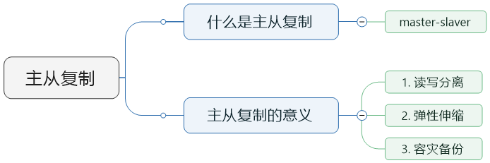


## 简单实现

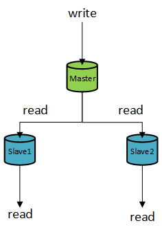

### 1. 准备Master和Slave的配置文件

Master配置文件（master-6379.conf）：

```
include /usr/local/bin/redis.conf            # 引用公共配置文件

port 6379
pidfile /var/run/redis_6379.pid
logfile /usr/local/bin/log/master_6379.log   # 日志文件
dbfilename master_6379.rdb                   # rdb文件
```


Slave 1配置文件（slave-6380.conf）：

```
include /usr/local/bin/redis.conf

port 6380
pidfile /var/run/redis_6380.pid
logfile /usr/local/bin/log/slave_6380.log
dbfilename slave_6380.rdb
```


Slave 2配置文件（slave-6381.conf）：

```
include /usr/local/bin/redis.conf

port 6381
pidfile /var/run/redis_6381.pid
logfile /usr/local/bin/log/slave_6381.log
dbfilename slave_6381.rdb
```


### 2. 启动Master和Slave数据库

```
redis-server master-6379.conf
redis-server slave-6380.conf
redis-server slave-6381.conf
```

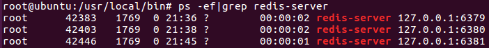


### 3. 设置Slave指向的Master

1.  连接Slave

    ```
    redis-cli -p 服务器端口号
    ```

2.  设置Slave指向的Master（也可以将命令写入配置文件）

    ```
    slaveof Master地址 Master端口号 
    ```
    
    

Slave1配置Master：

```
root@ubuntu:/usr/local/bin# redis-cli -p 6380
127.0.0.1:6380> slaveof 127.0.0.1 6379
OK
```

Slave2配置Master：

```
root@ubuntu:/usr/local/bin# redis-cli -p 6381
127.0.0.1:6381> slaveof 127.0.0.1 6379
OK
```


### 4. 测试配置效果

1.  查看Master和Slave是否配置正确

    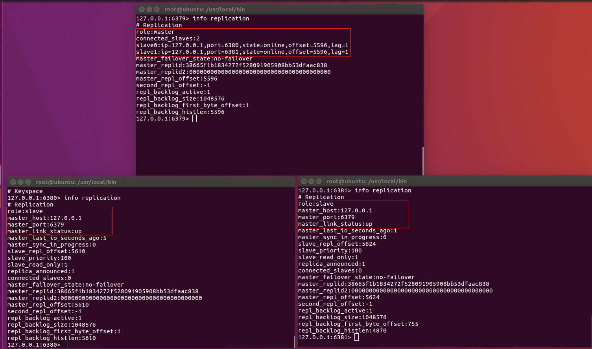

2.  查看Master和Slave工作是否正常

    ① 初始时三个库都没有数据

    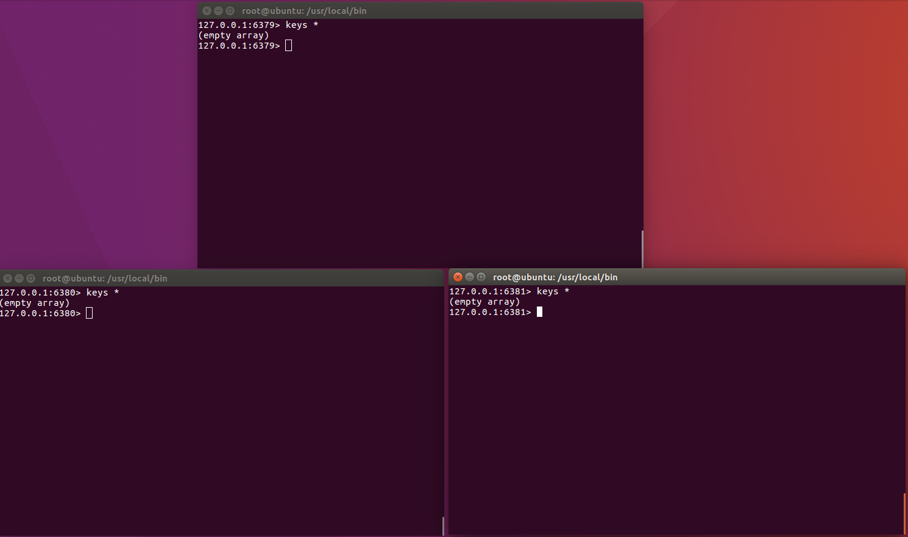

    ②往Master插入若干数据

    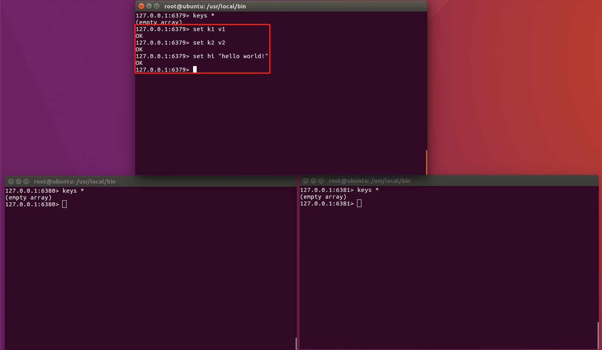

    ③数据被同步到Slave

    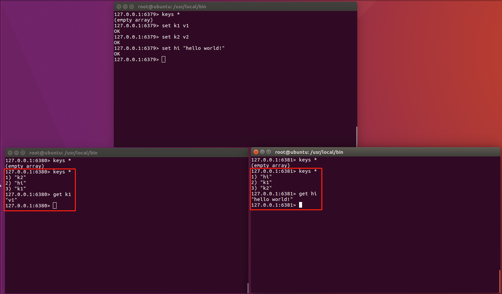

    ④无法在Slave插入数据

    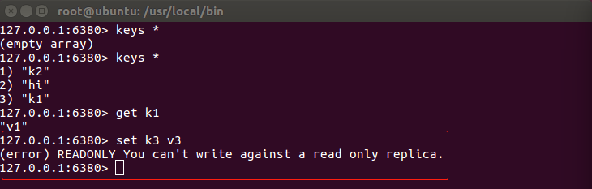

## 重点问题

### 1. 一主二从

#### Slave宕机重启

假如重启某个Slave：

-   <u>如果没有在配置文件中指定Master</u>，重启后需要重新手动指定Master

-   Slave重启后会重新同步Master的最新数据（**全量复制**）

关闭Salve1前：

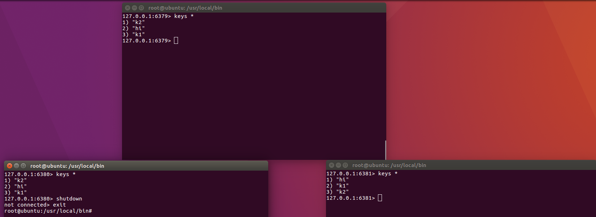

关闭Slave1后Master产出若干新数据：

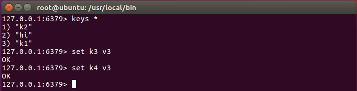

重启Slave1后：由于没有在配置文件设置Master，Slave1重启后并没有自动指向Master（小弟自己成大哥了）

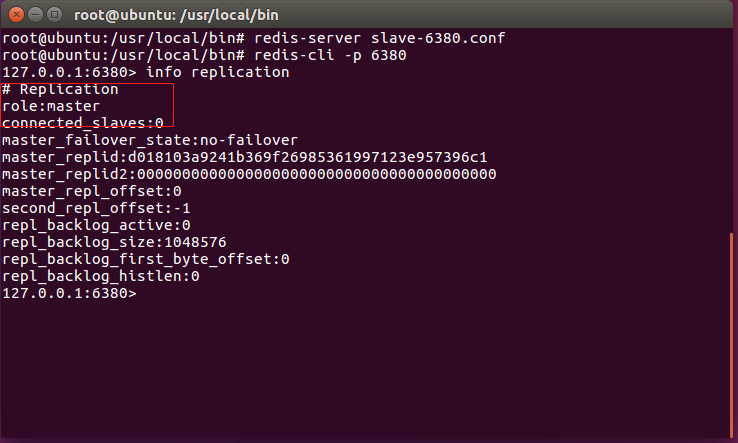

Slave1手动指向Master后：重新从Master同步最新的数据

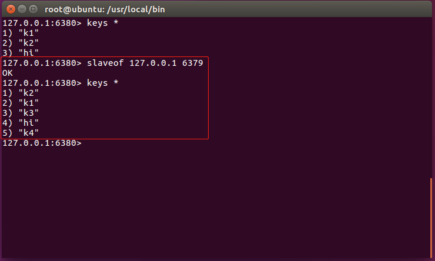

#### Master宕机重启

假如重启某个Master：

-   Master关闭后，Slave照常提供服务，且继续指向该Master（大哥永远是大哥）
-   Master重启后，一切照旧

### 2. 薪火相传

所有Slave指向同一个Master的情况：

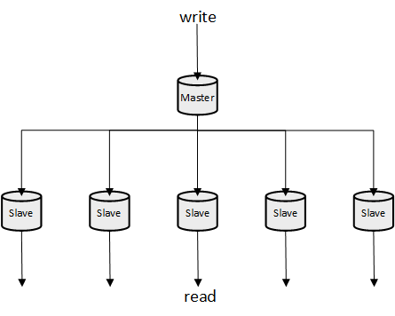

Slave同样可以作为其他Slave的Master，接受其他Slave的连接和同步请求：

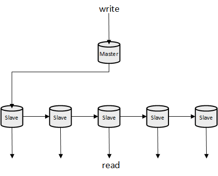

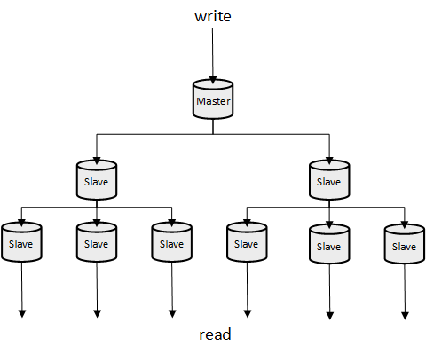

优点：降低Master的压力

缺点：一旦某个Slave宕机，后面的Slave就获取不到最新的数据。越末端的Slave数据越不可靠。

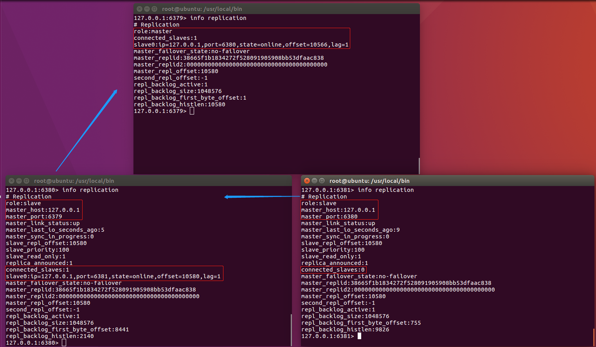

### 3. 反客为主

正常的工作情况：

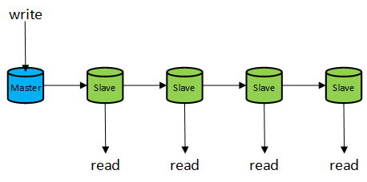

此时如果Master宕机，可以通过命令将原本指向它的Slave切换成Master继续工作（大哥死了小弟上位）：


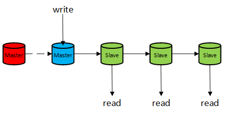

**演示：**

1.  Master宕机前：6379（Master）← 6380（Slave）← 6381（Slave）

    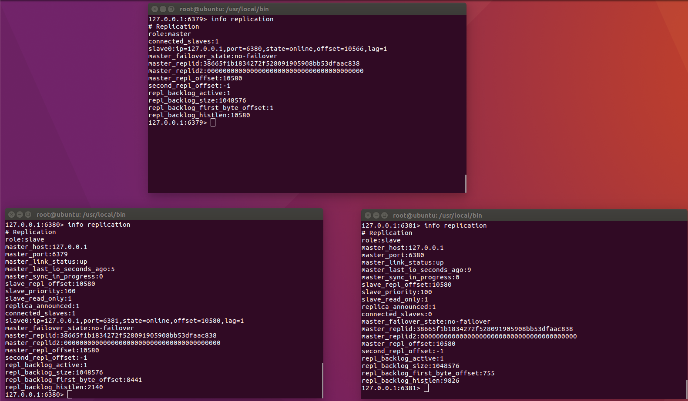

2.  切换6380为Master：6380（Master）← 6381（Slave）

    ```
    slaveof on one
    ```

    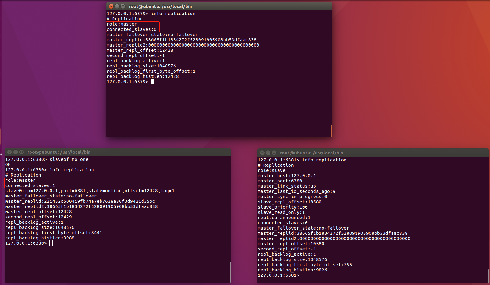

### 4. 哨兵模式（sentinel）

#### 是什么？

<font color = red>反客为主的自动版</font>——后台监视Master的工作情况，一旦Master出现故障，自动选择Slave切换为Master

官方文档：https://redis.io/topics/sentinel


#### 怎么用？

(下面是简单的示例，Redis Sentinel支持的功能远比下面的强大，需要单独另写一篇)

1.  以“一主二从”模式启动三个实例

    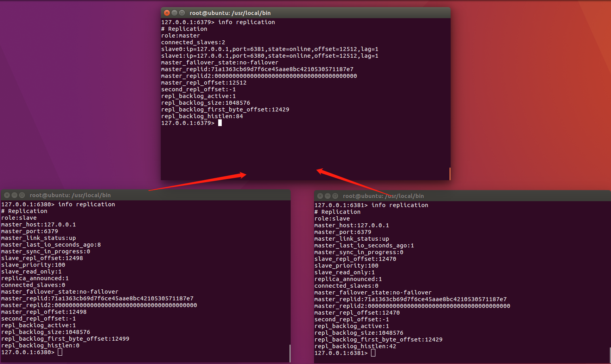

    

2.  创建配置文件

    创建sentinel.conf文件：

    ```
    entinel monitor mymaster 127.0.0.1 6379 1
    ```

    >   配置项说明：
    >
    >   ```
    >   sentinel monitor <master-name> <ip> <redis-port> <quorum>
    >   ```
    >
    >   quorum是一个数字，指明当有多少个sentinel认为一个master失效时，master才算真正失效。(sentinel天然支持分布式部署，一般为了提高master失效判断的准确率以及sentinel系统的可靠性，sentinel都会分布式部署。更详细的信息见官方文档)

    

3.  启动哨兵模式

    ```
    redis-sentinel sentinel.conf 
    ```

    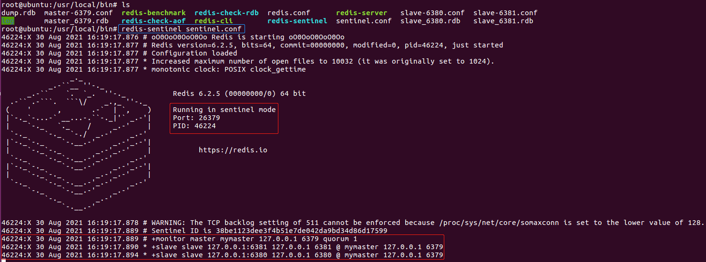

    从sentinel启动以后输出的信息可以看到， sentinel监视的是127.0.0.1:6379这个Master。这个Master下属的Slave有两个，一旦Master发生故障，最终将从两个Slave中选择一个作为新的Master。

    

4.  验证

    Master宕机前：

    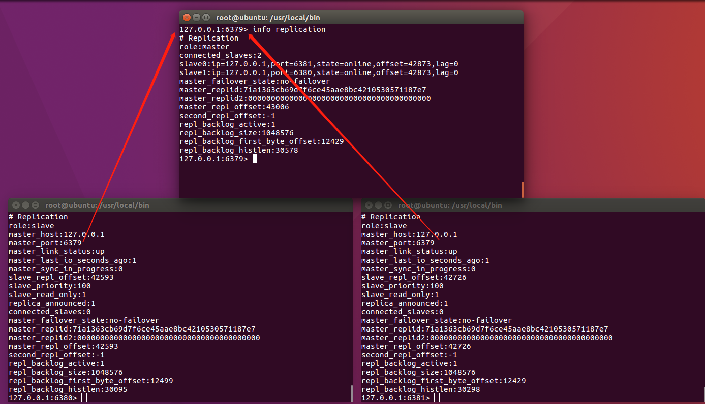

    Master宕机后：

    

    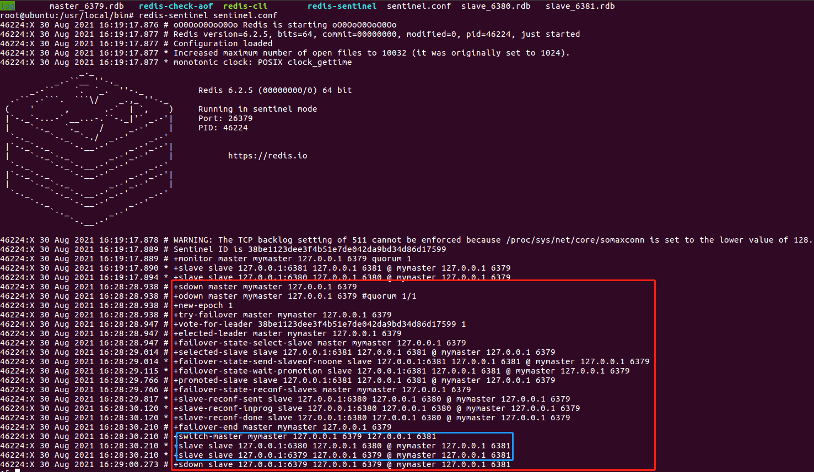

    可以看到，Master（6379）关闭以后，6381被自动设置为了新的Master，并且6379和6380被设置为指向6381的Slave（这意味着即使6379重新启动，它也不再是Master）

    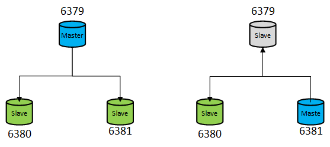


#### 工作流程

##### 1. 新主登基

从发生故障的Master的Slave中选择一个切换成新的Master。选择的条件：

1.  优先级

    Redis实例的优先级通过配置文件设置：（数值越小优先级越高）

    ```
    # The replica priority is an integer number published by Redis in the INFO
    # output. It is used by Redis Sentinel in order to select a replica to promote
    # into a master if the master is no longer working correctly.
    #
    # A replica with a low priority number is considered better for promotion, so
    # for instance if there are three replicas with priority 10, 100, 25 Sentinel
    # will pick the one with priority 10, that is the lowest.
    #
    # However a special priority of 0 marks the replica as not able to perform the
    # role of master, so a replica with priority of 0 will never be selected by
    # Redis Sentinel for promotion.
    #
    # By default the priority is 100.
    replica-priority 100
    ```

    

2.  偏移量

    偏移量指的是Slave与Master数据的同步程度（由于网络等各种原因，Slave与Maste之间的数据同步或多或少会存在延迟）。优先选择同步程度高的Slave。

    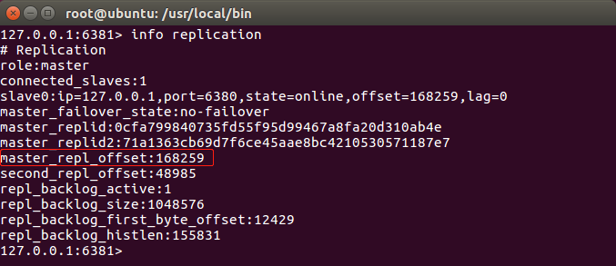

    

3.  runid

    runid是Redis实例启动时随机生成的一个40位的编号。优先选择runid最小的Slave。

    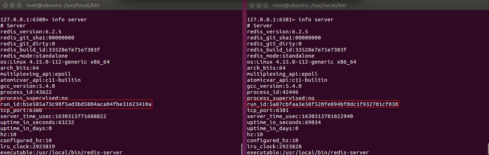

    

##### 2. 群臣俯首

选择出新的Master以后，sentinel向原Master的其他Salve发送slaveof命令，使其指向新的Master。


##### 3. 旧主俯首

当已经下线的服务重新上线时，sentinel会向其发送slaveof命令，使其称为新Master的Salve。
