# Redis哨兵模式（Sentinel）

官方文档：[Redis Sentinel Documentation](https://redis.io/topics/sentinel)

---


>   Redis Sentinel provides **high availability** for Redis. In practical terms this means that using Sentinel you can create a Redis deployment that **resists without human intervention certain kinds of failures**.
>
>   Sentinel为Redis提供高可用性——能够在没有人为干预的情况下自行解决某些故障


## 

从宏观层面看，Sentinel具有如下能力：

-   监控（Monitoring）：Sentinel会不断检查Master和Slave是否正常工作
-   通知（Notification）：Sentinel能够通过相关API向外发送检查到的异常
-   自动故障迁移（Automatic failover）：自动选择Slave替换出现异常的Master
-   配置查询中心（Configuration provider）：向外提供可靠的Master地址


## 分布式特性

Sentinel的分布式特性：Sentinel从一开始就被设计成可以与多个Sentinel进程协同工作（multiple Sentinel processes cooperating together）


多Sentinel进程协作的优势：

1.   综合多个Sentinel的Master故障检测结果，降低误判的概率
2.   提高Sentinel自身的可靠性：故障迁移系统本身必备足够可靠（打铁还需自身硬）


Sentinel、Master、Slave、Client共同构成了一个大型的分布式系统。


## 使用指南


### 启动方式

1.   获取Sentinel

     Redis2.6自带的Sentinel版本现已弃用，Sentinel稳定版从Redis2.8开始发布。

     

2.   启动Sentinel

     两种效果完全相同的启动方式：

     ```
     // 1
     redis-sentinel /path/to/sentinel.conf
     // 2
     redis-server /path/to/sentinel.conf --sentinel
     ```

     注意：

     1.   启动Sentinel时必须指定配置文件，如果没有指定配置文件Sentinel将拒绝启动（后文说明）
     2.   服务器必须开启26379端口。默认情况下，Sentinel使用26379端口接收其他Sentinel实例的连接请求


### 注意事项

1.   至少需要3个Sentinel实例才能保证故障迁移系统的可靠性
2.   Sentinel实例最好部署在完全独立的服务器（进一步保障故障迁移系统的可靠性，<u>避免被一锅端</u>）
3.   由于Redis使用异步复制，Sentinel + Redis 分布式系统不保证故障期间<u>被确认的写</u>(`acknowledged writes`)被保留（后文说明）


### 配置文件

Redis源码发行版会自带一个sentinel.conf实例文件。使用sentinel最典型、最基本的配置如下所示：

```
sentinel monitor mymaster 127.0.0.1 6379 2
sentinel down-after-milliseconds mymaster 60000
sentinel failover-timeout mymaster 180000
sentinel parallel-syncs mymaster 1

sentinel monitor resque 192.168.1.3 6380 4
sentinel down-after-milliseconds resque 10000
sentinel failover-timeout resque 180000
sentinel parallel-syncs resque 5
```

只需指定监视的Master节点，并为其设置唯一的名称。无需指定Slave，Sentinel能够自动发现Master的Slave。Sentinel会自动将Slave的信息附加到配置文件，以便重启时保留这些信息。当系统发生故障迁移，某个Slave被升级为Master，或者当系统发现了新的Sentinel，配置信息将发生更新。


上面的示例配置了Sentinel对两组Redis实例的监控，两组实例的Master名称分别被设为mymaster和resque。


`sentinel monitor`语句的参数说明如下：

```
sentinel monitor <master-group-name> <ip> <port> <quorum>
```

除了`quorum`，其他参数的含义都很简单，下面对`quorum`进行说明：

-   当有`quorum`个Sentinel同时认为Master已经故障，Master才会被标记为”故障“，并条件允许时进行故障迁移
-   需要注意，`quorum`仅用于故障检测（the quorum is only used to detect the failure），检测出故障后不是一定会进行故障迁移！还需满足条件：大多数Sentinel参与了决策（majority of the Sentinel）

举个例子，如果你有5个Sentinel进程，并且将quorum设置为2，那么可能出现以下情况：

-   在同一时刻至少有2个Sentinel进程认为Master已经发生故障，其中一个Sentinel将被授权进行故障迁移
-   如果至少有3个Sentinel进程参与了决策，故障迁移就会实际开始（5 * 0.5 = 2.5 ）

实际上，这意味着在故障期间，如果大多数Sentinel进程无法进行通信，那么Sentinel永远不会启动故障迁移（也就是在少数分区中永远没有故障迁移）


其他配置基本都采用如下格式：

```
sentinel <option_name> <master_name> <option_value>
```

-   `down-after-milliseconds`：如果超过down-after-milliseconds毫秒时间Master还没有响应，Sentinel就认为Master发生了故障
-   `parallel-syncs`：故障迁移完成后，允许同时有parallel-syncs个Slave进行数据同步（切换Master、同步新Master的数据）。数值越小意味着所有Slave完成数据同步的时间越长，客户端拿到旧数据的风险越高。数值越大意味着所有Slave完成数据同步的时间越短，虽然复制过程对于Slave来说大多是非阻塞的，但有时它会停止从Master加载批量数据。


### 示例分析

本节将使用若干个示例来分析Redis故障迁移系统需要多少Sentinel进程以及Sentinel进程应该如何放置。

图例说明见官网：https://redis.io/topics/sentinel#obtaining-sentinel

#### Example 1: just two Sentinels, DON'T DO THIS

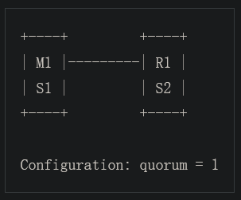

-   M1 宕机：在当前的设置下，如果M1宕机，R1将被晋升为Master，因为S1、S2可以完成M1故障的认定以及故障迁移的授权（quorum被设为1，意味着只要有一个Sentinel就可以判定M1故障；总共有2个Sentinel进程，意味着有两个Sentinel参与判定就可以对故障迁移授权）

-   M1 所在的服务器宕机：由于S1和M1一起宕机，参与判定的Sentinel只有1台，不满足“大多数Sentinel参与判定”的条件，因此无法对故障迁移进行授权，此时故障迁移系统实际上失效了

-   M1、R1 所在服务器断连：

    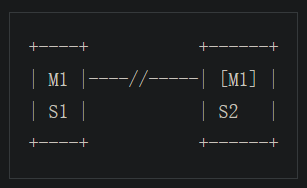

    如果S2可以不经授权就进行故障迁移，当两台服务器断连（分区问题，也称脑裂问题），系统中可能出现两个Master，客户端可能会同时向两个Master写入数据。

==综上，保证故障迁移系统可靠性的最低要求：至少在3台独立的主机上部署3个Sentinel进程。==

#### Example 2: basic setup with three boxes


由于Redis使用异步复制 + 网络延迟，Master发生宕机时，Master向客户端确认的部分写操作可能还没来得及同步到接下来晋升的新Master。

当前配置在发生网络分区时可能出现严重的数据丢失问题：

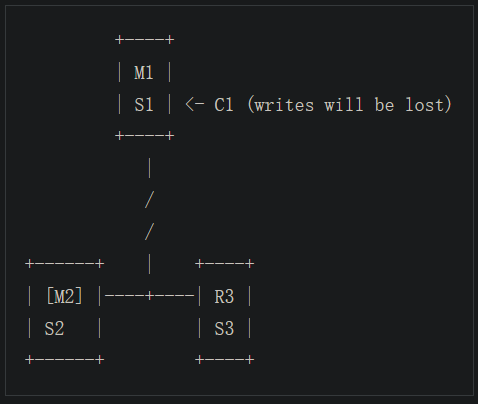

网络分区发生后M1继续接收写操作，而S2、S3已经选出了新的M2，当网络分区恢复，M1会被配置为M2的Slave，此时，M1会丢弃自己原来的数据集，对M2的数据集进行全量复制！这意味着，分区发生后M1执行的写操作全部全部丢失。


可以使用以下Redis配置缓解上述问题：当Master检测到它不再能将写操作同步到指定数据的Slave时，Master停止接收写操作

```
min-replicas-to-write 1
min-replicas-max-lag 10
```

基于以上配置，当Redis实例充当Master时，如果它不能将写操作同步到至少1个Slave，那么停止接收写操作。（由于Redis复制是异步的，因此“不能将写操作同步到Slave”意味着Slave已经断开连接，或者Slave的响应时间超过`max-lag`秒）

基于以上配置，M1将在网络分区发生后10秒停止接收写操作。弊端：假设没有发生网络分区，但是两个Slave宕机了，依然会导致M1停止工作


#### Example 3: Sentinel in the client boxes

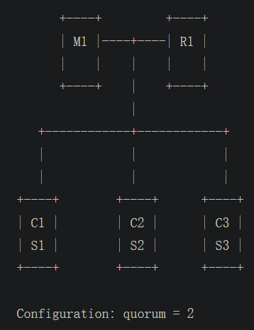


#### Example 4: Sentinel client side with less than three clients

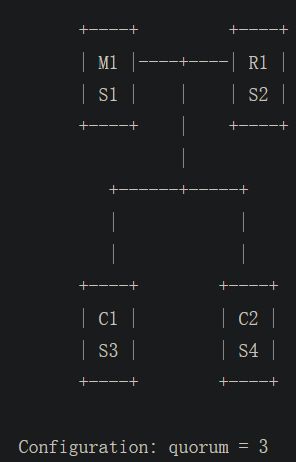


### 命令手册

-   Sentinel命令
-   运行时切换Sentinel配置文件
-   添加、删除Sentinel进程
-   删除旧的Master或无法访问的Slave
-   发布、订阅Sentinel信息

[Sentinel API](https://redis.io/topics/sentinel#obtaining-sentinel)

## 简单实例

一个Master、一个Slave、三个Sentinel

### 1. 启动两个Redis实例

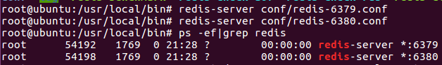


### 2. 手动配置主从关系

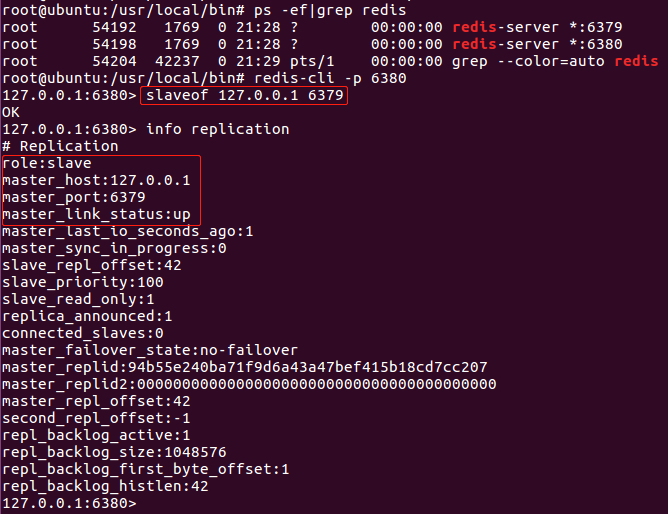


### 3. 准备Sentinel配置文件

使用5000、5001、5002端口启动三个Sentinel进程，以下为使用5000端口的Sentinel的配置文件：

```
port 5000
sentinel monitor mymaster 127.0.0.1 6379 2
sentinel down-after-milliseconds mymaster 5000
sentinel failover-timeout mymaster 60000
sentinel parallel-syncs mymaster 1
```


### 4. 启动三个Sentile进程

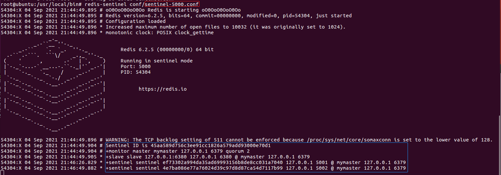

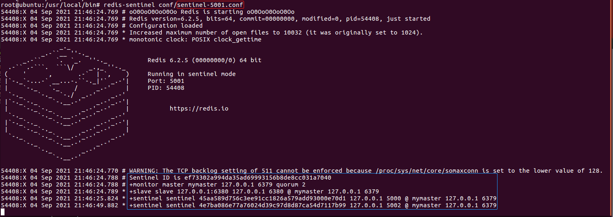

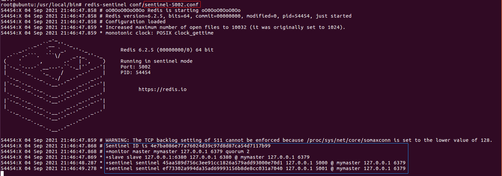

Sentinel控制台输出的信息：

1.  Master的信息
2.  Slave的信息
3.  其他Sentinel的信息
4.  quorum信息

### 5. 借助Sentinel查询Master的信息

① 使用redis-cli连接某个Sentinel

② 使用sentinel master查询执行master的信息

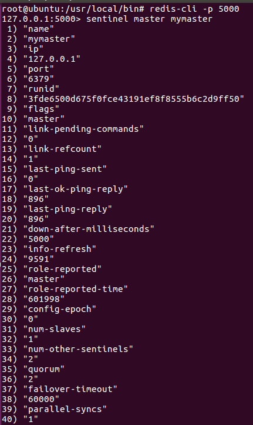

### 6. 测试故障迁移

使Master睡眠30秒：


Sentinel控制台信息：（5000端口）

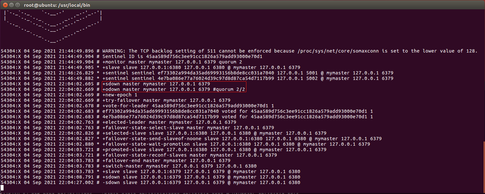

从控制台信息看：

1.  每个Sentinel进程都发生+sdown事件，这意味着Sentinel进程检测到了Master的故障
2.  +sdown事件升级为+odown之间，这意味着多个Sentinel进程一致认可Master已经无法联系
3.  多个Sentinel投票选出负责故障迁移的Sentinel
4.  故障迁移开始

再次向Sentinel查询Master的信息：

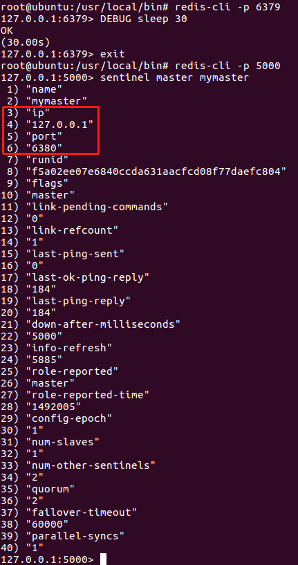

可以看到原来的Slave（6380）已经晋升为新的Master

## 重要概念

### SDOWN 及 ODOWN 失败状态

Redis Sentinel有两种不同的下线概念（two different concepts of *being down*）：

-   SDOWN（Subjectively Down，主观下线），单个Sentinel进程的判断结果
-   ODOWB（Objectively Down，客观下线），多个Sentinel进程的判断结果

从单个Sentinel进程的角度看，只要Master没有在规定时间（is-master-down-after-milliseconds）内对PING请求做出有效的响应，SDOWN的条件就达到了。

SDOWN不足以触发故障迁移（failover）：它只表示单个Sentinel进程任务Master不可用，若要触发故障迁移，必须达到ODOWN状态。

从SDOWN状态切换为ODOWN状态并没有使用强一致性算法（no strong consensus algorithm is used, but            just a form of gossip）：如果Sentinel在给定的时间范围内，从其他Sentinel那里接收到足够数量的Master下边报告（SDOWN），那么Sentinel就会将Master的状态从SDOWN切换到ODOWN，否则Sentinel将会移除Master的SDOWN状态标识。

当一个Sentinel进程发现Master进入ODOWN状态，这个Sentinel进程可能被其他Sentinel进程推选：负责对失效的Master进行故障迁移操作。

### Sentinel 及 Slave 自动发现

（本文说的Sentinel进程指的是对同一个Master进行监视的Sentinle进程）

Sentinel进程与其他Sentinel进程会相互保持联系，以便检查对方的可用性，以及交换信息。但是，你不需要在Sentinel的配置文件中配置其他Sentinel的地址，因为Sentinel进程会使用Redis实例的==发布/订阅==功能来发现监视同一个Master的其他Sentinel进程。这一功能是通过向频道 **sentinel**:hello 发送信息来实现的。

与此类似， 你也不必手动列出Master属下的所有Slave， 因为 Sentinel 可以通过询问Master来获得所有Slave的信息。

-   每个Sentinel会以每两秒一次的频率，通过发布与订阅功能，向被它监视的所有主服务器和从服务器的 **sentinel**:hello 频道发送一条信息，信息中包含了Sentinel的IP地址、端口号和运行ID（runid）
-   每个Sentinel都订阅了被它监视的所有主服务器和从服务器的**sentinel**:hello 频道，查找之前未出现过的 sentinel（looking for unknown sentinels）。当一个Sentinel发现一个新的Sentinel时， 它会将新的 Sentinel添加到一个列表中，这个列表保存了Sentinel已知的监视同一个主服务器的所有其他Sentinel
-   Sentinel发送的信息中还包括完整的主服务器当前配置。如果一个Sentinel包含的主服务器配置比另一个 Sentinel发送的配置要旧，那么这个Sentinel会立即升级到新配置上
-   在将一个新Sentinel添加到监视主服务器的列表上面之前，Sentinel会先检查列表中是否已经包含了和要添加的Sentinel拥有相同运行ID或者相同地址（包括 IP 地址和端口号）的Sentinel ，如果是的话，Sentinel会先移除列表中已有的那些拥有相同运行ID或者相同地址的Sentinel，然后再添加新Sentinel

### Slave优先级

Sentinel在故障迁移时使用以下信息选择晋升的Slave：

1.  Slave与Master断开连接的时间长度

    如果Slave与Master断连的时间过长，Sentinel将认为这个Slave是不可靠的，就会排除这个Slave。

2.  Slave配置文件中设置的优先级

    数值越小，优先级越高。通常不会可以设置，直接使用默认值。0 代表永远不会晋升为Master。

3.  Slave已经处理的复制偏移量

    复制偏移量越大，从Master同步的数据就越多，数据集就越完整

4.  Run ID

    启动Redis实例时随机生成


## 内部原理

### quorum

每个Sentinel的配置文件中都需要设置quorum。当有quorum个监视同一Master的Sentinel认为Master已经下线，故障迁移才会开始。

故障迁移开始后，必须得到大多数Sentinel的授权，故障迁移才能正真执行（at least a majority of Sentinels must authorize the Sentinel to failover）。因此，故障迁移永远不会发生在只具有少数Sentinel进程的分区。


-   quorum：检测到Maste下线，并将Master标记为ODOWN的最少Sentinel进程数
-   故障迁移有ODOWN触发
-   一旦触发故障迁移，尝试进行故障迁移的Sentinel进程需要请求**大多数**Sentinel进程的授权（the Sentinel trying to failover is required to ask for authorization to a majority of Sentinels）

理解：假如有5个Sentinel进程，quorum的值为2。那么，一旦有2个进程认为Master已经下线，就会触发故障迁移。但是，只有当两个Sentinel中的一个至少从3个Sentinel进程获得授权时，才能进行故障迁移。


这意味着，quorum可以用两种方式调整故障迁移系统：

1.  quorum < majority：系统对Master的故障更敏感，少数Sentinel检测到故障即可触发故障迁移
2.  quorum > majority：系统对Master的故障更迟缓，多数Sentinel检测到故障才能触发故障迁移


### 配置版本（configuration epochs）

-   某个Sentinel进程获得多数Sentinel进程的授权后，它将为正在故障迁移的Master获得一个唯一的configuration epochs。configuration epochs是一个数字，用于故障迁移结束后对新配置进行版本设置。
-   Sentinle的授权投票有**冷却时间**：选择某个Sentinel进行故障迁移后，需要过一段时间才能重新选择。这保证了同一时间只会有一个Sentinel进程进行故障迁移。

### 配置传播（configuration propagation）

一旦某个Sentinel进程完成了故障迁移，它将开始广播新的配置，以便一个Sentinel更新它们关于Master的信息。


### Consistency under partitions


### Sentinel persistent state

### TILT mode


