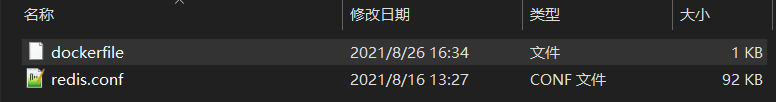

# Redis容器添加配置文件

---

## 问题描述

使用官方Redis镜像，创建、启动Redis容器，找不到配置文件。

```
docker run -itd --name redis-test -p 6379:6379 redis
```


## 解决方案

之所以找不到配置文件，是因为官方Redis镜像本来就没有配置文件。对此有以下两种解决方案：

1.   创建容器时从宿主机映射配置文件至容器
2.   使用Dockerfile定制自己的Redis镜像


### 方案一：映射配置文件

1.   停止旧容器

     ```
     # 罗列当前
     docker container ls -a
     # 停止指定容器
     docker container stop container_name
     ```

     

2.   删除旧容器

     ```
     docker container rm container_name
     ```

     

3.   创建新容器

     ```docker
     docker run -itd --name redis-master -p 6379:6379 -v /F/Docker/mapping/redis/redis.conf:/etc/redis/redis.conf redis redis-server /etc/redis/redis.conf
     ```

     >   说明：
     >
     >   -   -v /F/Docker/mapping/redis/redis.conf:/etc/redis/redis.conf    **从宿主机映射配置文件至容器**
     >   -   redis-server /etc/redis/redis.conf    **以映射的配置文件启动Redis服务**


### 方案二：定制镜像

1.   新建空文件夹，复制配置文件至文件夹

2.   编写dockerfile文件

     ```dockerfile
     FROM redis
     COPY redis.conf /etc/redis/
     ```

     >   说明：COPY redis.conf /etc/redis/ 表示从工作上下文复制 redis.conf 文件至镜像的 /etc/redis/ 路径

     

     

3.   执行dockerfile，创建镜像

     ```
     docker build -t redis:xzy .
     ```

     执行结果：

     ```
     PS F:\Docker\mapping\定制> docker build -t redis:xzy .
     [+] Building 0.4s (7/7) FINISHED
      => [internal] load build definition from Dockerfile                                                                                                                                    0.0s
      => => transferring dockerfile: 76B                                                                                                                                                     0.0s
      => [internal] load .dockerignore                                                                                                                                                       0.0s
      => => transferring context: 2B                                                                                                                                                         0.0s
      => [internal] load metadata for docker.io/library/redis:latest                                                                                                                         0.0s
      => [internal] load build context                                                                                                                                                       0.1s
      => => transferring context: 93.78kB                                                                                                                                                    0.0s
      => [1/2] FROM docker.io/library/redis                                                                                                                                                  0.2s
      => [2/2] COPY redis.conf /etc/redis/                                                                                                                                                   0.0s
      => exporting to image                                                                                                                                                                  0.1s
      => => exporting layers                                                                                                                                                                 0.0s
      => => writing image sha256:ca2347f158f330e1e7be6047c09244398fa1387bcf63b6b072b47193560f18dd                                                                                            0.0s
      => => naming to docker.io/library/redis:xzy                                                                                                                                            0.0s
     
     Use 'docker scan' to run Snyk tests against images to find vulnerabilities and learn how to fix them
     PS F:\Docker\mapping\定制> docker images *
     REPOSITORY   TAG       IMAGE ID       CREATED          SIZE
     redis        xzy       ca2347f158f3   41 seconds ago   106MB
     redis        latest    aa4d65e670d6   4 weeks ago      105MB
     ```

     

4.   使用定制的Redis镜像创建容器

     ```
     docker run -itd --name redis-xzy -p 6379:6379  redis:xzy redis-server /etc/redis/redis.conf
     ```

     执行结果：

     ```
     PS F:\Docker\mapping\定制> docker images *
     REPOSITORY   TAG       IMAGE ID       CREATED         SIZE
     redis        xzy       ca2347f158f3   7 minutes ago   106MB
     redis        latest    aa4d65e670d6   4 weeks ago     105MB
     PS F:\Docker\mapping\定制> docker run -itd --name redis-xzy -p 6379:6379  redis:xzy redis-server /etc/redis/redis.conf
     1b69d36c032b95c7f2ca3c2e5e3170d25d9431c3049bd4fc4d85d36feb06e6ac
     PS F:\Docker\mapping\定制> docker container ls -a
     CONTAINER ID   IMAGE       COMMAND                  CREATED          STATUS                      PORTS                    NAMES
     1b69d36c032b   redis:xzy   "docker-entrypoint.s…"   14 seconds ago   Up 12 seconds               0.0.0.0:6379->6379/tcp   redis-xzy
     5bf4fbbb9828   redis       "docker-entrypoint.s…"   2 hours ago      Exited (0) 22 seconds ago                            redis-master
     fef59e1b8024   redis       "docker-entrypoint.s…"   2 weeks ago      Exited (0) 3 hours ago                               redis-test
     ```

     验证：

     ```
     PS F:\Docker\mapping\定制> docker exec -it redis-xzy /bin/bash
     root@1b69d36c032b:/data# cd /etc/redis/
     root@1b69d36c032b:/etc/redis# ls
     redis.conf
     root@1b69d36c032b:/etc/redis# ls -l
     total 92
     -rwxr-xr-x 1 root root 93724 Aug 16 05:27 redis.conf
     ```

     

## 参考文章

1.   [解决创建Redis容器没有conf配置文件](https://blog.csdn.net/fangkang7/article/details/100642695)

2.   [Docker Dockerfile|菜鸟教程](https://www.runoob.com/docker/docker-dockerfile.html)
