# Redis集群（Cluster）

---

## 快速使用

搭建目标：3个Master + 3个Slave

### 1. 创建Redis实例的配置文件

```
include /usr/local/bin/redis.conf

port 6379
pidfile /var/run/redis_6379.pid
logfile /usr/local/bin/log/redis_6379.log
dbfilename dump_6379.rdb

cluster-enabled yes
cluster-config-file nodes-6379.conf
cluster-node-timeout 15000
```

6个Redis实例分别使用6379、6380、6381、6382、6383、6384端口：

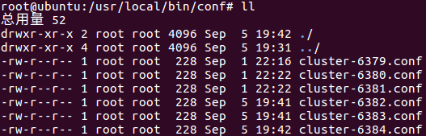


### 2. 启动Redis实例

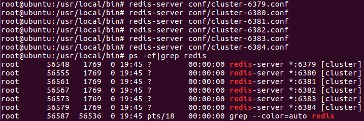

按照步骤1中的配置（cluster-config-file），实例成功启用后会在启动目录创建nodes-xxx.conf文件：

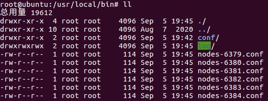


### 3. 创建集群

```
redis-cli --cluster create --cluster-replicas 1 
    192.168.175.128:6379
    192.168.175.128:6380
    192.168.175.128:6381
    192.168.175.128:6382
    192.168.175.128:6383
    192.168.175.128:6384
```

说明：

1.  不能使用127.0.0.1，必须使用主机的真实地址
2.  --cluster-replicas 1：集群中的每个Master具有1个Slave


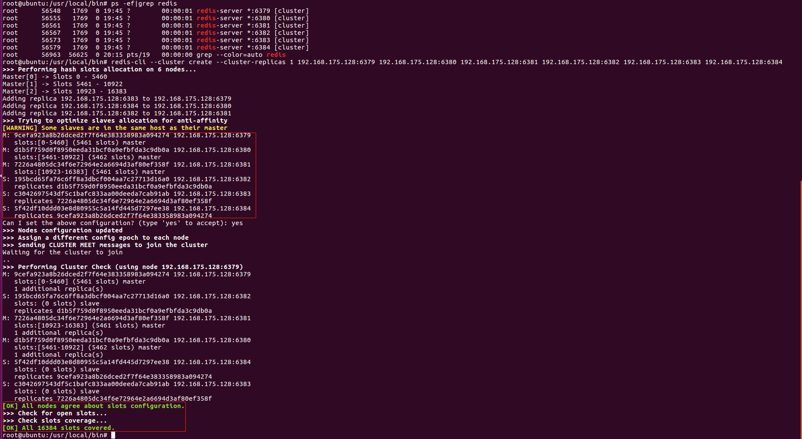

分配情况如上图所示：6397←6383    6380←6384    6381←6382

Redis生成集群方案的时候，会尽量选择不同IP的主机作为Master，会尽量为Master选择不同IP的Slave，总之，就是为了最大限度的提高集群的可靠性。

为了方便演示，本实例将所有Redis实例放在同一个主机，在实际生产中，一般会尽量将Redis实例部署在独立的主机（鸡蛋不能放在一个筐里，否则主机挂了，Redis实例直接全死了，集群就没有意义了）。注意看上图的WARNGING：Redis提醒我们有一些Slave和Master存在于同一个主机。


### 4. 测试集群

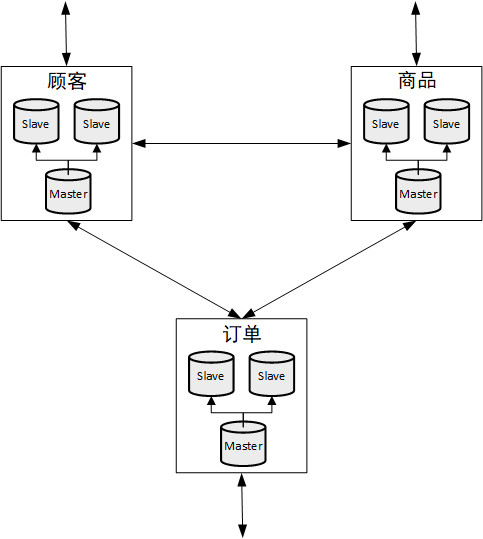

由于Redis集群是无中心化的，因此任何一个节点可以作为集群的入口，节点与节点直接可以互相访问。


通过下面命令能够以集群的方式连接Redis节点：

```
redis-cli -c -p 6379
```


下面是测试过程：

1.  **以集群的方式连接两个Master**

    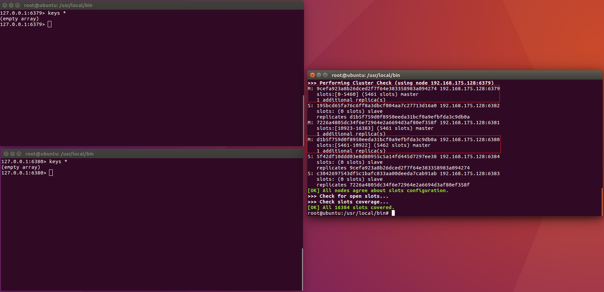

    此时整个集群还没有存入任何数据

    

2.  **选择一个Master插入数据**

    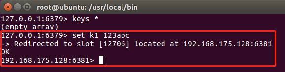

    可以看到一个非常特殊的现象：数据成功插入，但是数据被插入到了6381，客户端连接被重定向到6381

    

3.  **从其他Master查询刚才插入的数据**

    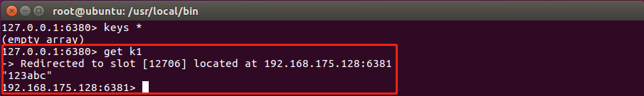

    再次看到特殊的现象：数据查询成功，但是客户端连接被重定向到了6381

    

4.  **查看集群节点信息**

    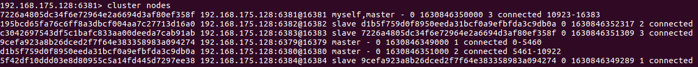

## 理论说明

### slot

上文不少地方都出现了`slot`这个词：（slot，插槽）

1.  创建集群的时候

    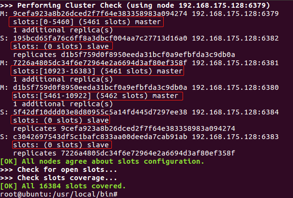

2.  向集群插入数据的时候

    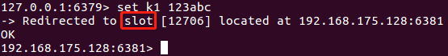

3.  从集群查询数据的时候

    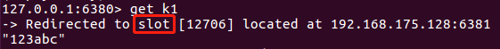


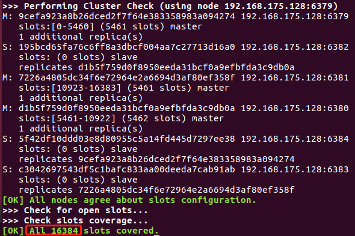

-   一个Redis集群总共有16384个slot
-   集群中的每个Master负责管理一部分slot
-   集群中的每个key都有所属的slot
-   集群使用 CRC16(key)%16384 来计算每个key所属的slot


### 故障恢复

Master发生故障时，Redis集群会自动进行故障迁移：选择Slave晋升为Master

如果负责管理某段slot的Master和Slave全都发生故障：

-   如果redis.conf文件中cluster-require-full-coverage为yes：整个集群的slot停止服务
-   如果redis.conf文件中cluster-require-full-coverage为no：仅这段slot停止服务，其他slot继续服务
