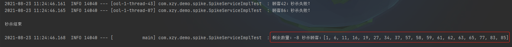
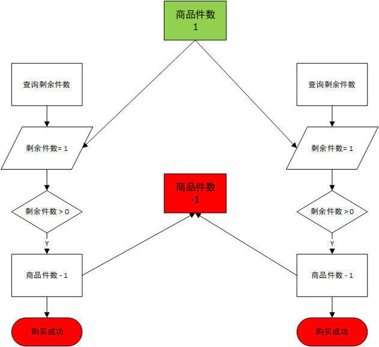
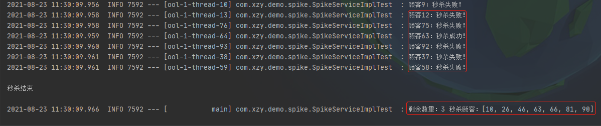
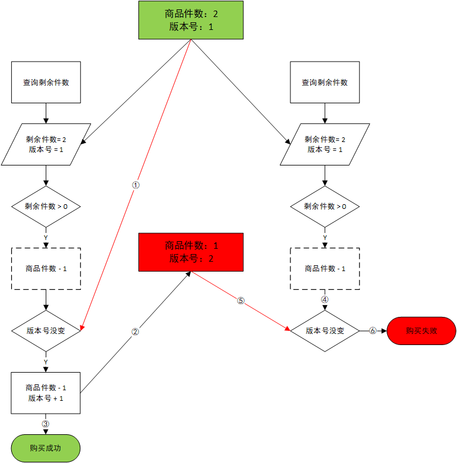
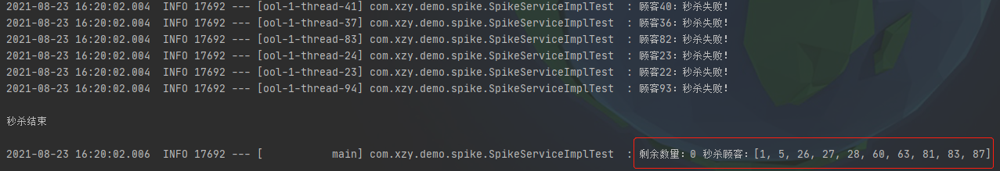

# Redis实战-商品秒杀

---

## 1. 请求超时问题

**描述：**频繁的创建、销毁Redis连接，导致请求超时

**方案：**使用Redis连接池

依赖文件：

```xml
        <!--Redis-->
        <dependency>
            <groupId>org.springframework.boot</groupId>
            <artifactId>spring-boot-starter-data-redis</artifactId>
        </dependency>
        <!--连接池-->
        <dependency>
            <groupId>org.apache.commons</groupId>
            <artifactId>commons-pool2</artifactId>
        </dependency>
```

配置文件：

```yaml
spring:
  redis:
    # Redis服务器地址
    host: 127.0.0.1
    # Redis服务器连接端口号
    port: 6379
    # Redis数据库（默认为0）
    database: 0
    # 超时时间（毫秒）
    timeout: 1800000
    lettuce:
      pool:
        # 连接池最大连接数（负数表示没有限制）
        max-active: 20
        # 连接池最大空闲连接数
        max-idle: 5
        # 连接池最小空闲连接数
        min-idle: 0
        # 最长阻塞时间（负数表示没有限制）
        max-wait: -1
```

实现类：

```java
/**
 * @author xzy
 * @date 2021/8/22 20:03
 * 说明：商品秒杀
 */
@Slf4j
@Service
public class SpikeServiceImpl implements SpikeService {
    /**
     * 秒杀商品key前缀
     */
    private final String SPIKE_COMMODITY_PREFIX = "spike.commodity:";
    /**
     * 秒杀顾客key前缀
     */
    private final String SPIKE_CUSTOMER_PREFIX = "spike.customer:";

    private final RedisTemplate<String, Object> redisTemplate;

    @Autowired
    public SpikeServiceImpl(RedisTemplate<String, Object> redisTemplate) {
        this.redisTemplate = redisTemplate;
    }

    /**
     * 初始化秒杀商品信息
     *
     * @param commodityId - 商品ID
     * @param quantity    - 秒杀数量
     * @return - 操作结果
     */
    @Override
    public String initialize(Long commodityId, Long quantity) {
        // 重置商品数量
        redisTemplate.opsForValue().set(SPIKE_COMMODITY_PREFIX + commodityId, quantity);

        // 重置秒杀顾客
        redisTemplate.delete(SPIKE_CUSTOMER_PREFIX + commodityId);

        return "初始化完成";
    }

    /**
     * 查看秒杀商品当前信息
     *
     * @param commodityId - 商品ID
     * @return - 秒杀商品当前信息
     */
    @Override
    public String info(Long commodityId) {
        Integer remainingQuantity = (Integer) redisTemplate.opsForValue().get(SPIKE_COMMODITY_PREFIX + commodityId);
        Set<Object> customers = redisTemplate.opsForSet().members(SPIKE_CUSTOMER_PREFIX + commodityId);
        return "剩余数量：" + remainingQuantity + " 秒杀顾客：" + customers;
    }

    /**
     * 商品秒杀：存在商品超卖问题
     *
     * @param commodityId - 商品ID
     * @param customerId  - 顾客ID
     * @return - 秒杀结果
     */
    @Override
    public Message spick1(Long commodityId, Long customerId) {

        // 1.检查商品数量
        Integer remainingQuantity = (Integer) redisTemplate.opsForValue().get(SPIKE_COMMODITY_PREFIX + commodityId);
        if (remainingQuantity == null || remainingQuantity < 1) {
            return Message.fail("秒杀失败！");
        }

        // 2.减少商品数量
        redisTemplate.opsForValue().decrement(SPIKE_COMMODITY_PREFIX + commodityId);

        // 3.记录秒杀顾客
        redisTemplate.opsForSet().add(SPIKE_CUSTOMER_PREFIX + commodityId, customerId);

        return Message.ok("秒杀成功！");
    }
}
```

测试类：

```java
@Slf4j
@SpringBootTest
@RunWith(SpringRunner.class)
public class SpikeServiceImplTest {
    @Autowired
    private SpikeService spikeService;

    /**
     * 并发量
     */
    private final Integer CONCURRENT_NUMBER = 100;
    /**
     * 请求量
     */
    private final Integer REQUEST_NUMBER = 100;
    /**
     * 商品数量
     */
    private final Long QUANTITY = 10L;
    /**
     * 线程池
     */
    private final ExecutorService threadPool = Executors.newFixedThreadPool(CONCURRENT_NUMBER);

    /**
     * 超卖
     */
    @Test
    public void spike1Test() throws InterruptedException {
        // 初始化
        log.info(spikeService.initialize(1L, QUANTITY));
        log.info(spikeService.info(1L));

        // 秒杀
        System.out.println("\n秒杀开始\n");
        CountDownLatch countDownLatch = new CountDownLatch(REQUEST_NUMBER);
        for (long i = 0; i < REQUEST_NUMBER; i++) {
            final long customerId = i;
            threadPool.submit(() -> {
                randomSleep();
                log.info("顾客" + customerId + "：" + spikeService.spick1(1L, customerId).getMessage());
                countDownLatch.countDown();
            });
        }

        // 检验商品秒杀情况
        countDownLatch.await();
        System.out.println("\n秒杀结束\n");
        log.info(spikeService.info(1L));
    }

    private void randomSleep() {
        try {
            Thread.sleep(new Random().nextInt(100));
        } catch (InterruptedException e) {
            e.printStackTrace();
        }
    }
}
```

测试结果：解决了超时问题，但出现了超卖问题




## 2. 商品超卖问题

**描述：**没有进行有效的并发控制，导致数据的并发操作出现问题。



**方案**：WATCH + MULTI + EXEC（乐观锁）

实现类：

```java
    /**
     * 商品秒杀：解决商品超卖问题，但存在库存遗留问题
     *
     * @param commodityId - 商品ID
     * @param customerId  - 顾客ID
     * @return - 秒杀结果
     */
    @Override
    public Message spick2(Long commodityId, Long customerId) {

        List<Object> result = redisTemplate.execute(new SessionCallback<List<Object>>() {
            @Override
            public <K, V> List<Object> execute(RedisOperations<K, V> operations) throws DataAccessException {
                // 乐观锁：执行exec操作前，如果监视的key被修改，取消exec操作
                redisTemplate.watch(SPIKE_COMMODITY_PREFIX + commodityId);

                // 1.检查商品数量
                Integer remainingQuantity = (Integer) redisTemplate.opsForValue().get(SPIKE_COMMODITY_PREFIX + commodityId);
                if (remainingQuantity == null || remainingQuantity < 1) {
                    return null;
                }

                // 事务管理
                operations.multi();

                // 2.减少商品数量
                redisTemplate.opsForValue().decrement(SPIKE_COMMODITY_PREFIX + commodityId);

                // 3.记录秒杀顾客
                redisTemplate.opsForSet().add(SPIKE_CUSTOMER_PREFIX + commodityId, customerId);

                return operations.exec();
            }
        });


        return (result == null || result.isEmpty()) ? Message.fail("秒杀失败！") : Message.ok("秒杀成功！");
    }
```

测试结果：解决了超卖问题，但出现了库存遗留问题




## 3. 库存遗留问题

描述：Redis的`WATCH`命令底层是类似于CAS（check-and-set）的乐观锁实现机制。只要监视到数据被修改，就认为当前的操作是不安全的，于是放弃执行当前操作。



方案：使用LUA脚本（Redis能够保证执行Lua脚本时不允许其他Lua脚本或命令执行）

在resource目录下创建lua脚本：

```lua
local commodityId = KEYS[1];
local customerId = KEYS[2];
local remainingQuantity = redis.call("get","spike.commodity:"..commodityId);

-- 校验商品
if (type(remainingQuantity) == "nil") then
    return 2;
end

-- 校验库存
if (tonumber(remainingQuantity) < 1) then
    return 1;
end

-- 出货
redis.call("decr","spike.commodity:"..commodityId);
redis.call("sadd","spike.customer:"..commodityId,customerId);
return 0;
```

实现类：

```java
    /**
     * 商品秒杀：使用Lua脚本解决库存遗留问题
     *
     * @param commodityId - 商品ID
     * @param customerId  - 顾客ID
     * @return - 秒杀结果
     */
    @Override
    public Message spick3(Long commodityId, Long customerId) {
        // 准备Lua脚本
        DefaultRedisScript<Long> luaScript = new DefaultRedisScript<>();
        luaScript.setResultType(Long.class);
        luaScript.setScriptSource(new ResourceScriptSource(new ClassPathResource("spike.lua")));

        // 准备参数
        List<String> keys = new ArrayList<>(2);
        keys.add(commodityId.toString());
        keys.add(customerId.toString());

        // 执行Lua脚本
        Long result = redisTemplate.execute(luaScript, keys, Collections.EMPTY_LIST);

        return (result == null || result.compareTo(0L) == 0) ? Message.ok("秒杀成功！") : Message.fail("秒杀失败！");
    }
```

测试结果：

