# Redis 6

---

## 1. NoSQL 数据库简介

### 1.1 技术的发展

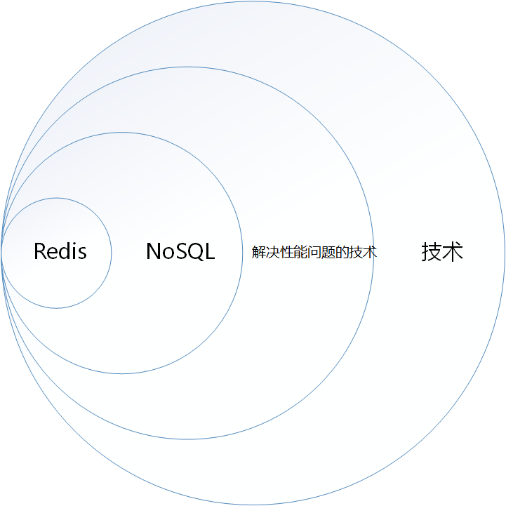

技术的分类：

1.  解决功能问题：Java、JSP、Tomcat、Linux、JDBC
2.  解决拓展问题：Struts、Spring、SpringMVC、JPA、MyBatis
3.  解决性能问题：==NoSQL==、MQ、Java线程、Hadoop

无论何种技术，存在的意义都是解决问题。NoSQL就是一种用来解决性能问题的技术，而Redis就是一种典型的NoSQL技术。

#### 1.1.1 Web1.0时代

Web1.0 时代，系统访问量、数据量有限（早期的访问全部来自PC且互联网用户量不多），单体服务器可以满足需求。


#### 1.1.2 Web2.0时代

Web2.0时代，智能移动设备普及，互联网用户数量剧增，系统访问量、数据量随之大幅提升，单体系统难以支撑，互联网平台面临巨大的挑战。


##### 1.1.2.1 解决CPU及内存压力

服务器集群化、分布式部署，使用负载均衡将客户端请求均匀的发送给各个服务器，缓解单个服务器的CPU和内存压力。

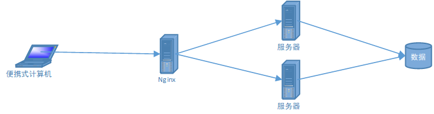

但依然存在问题，例如session共享问题。

>   session共享问题：客户在服务器1登录，服务器1创建了session对象。请求被转发到服务器1的时候可以正常处理，请求被转发到服务器2的时候由于服务器2不存在客户的session对象因此无法处理请求。

解决session问题的方案：

1.  将session存储在cookie：不安全、额外的负载

2.  存在文件服务器或数据库：大量的IO

3.  将session复制到所有服务器：数据冗余

4.  **将session存储到缓存数据库：读取速度快（存储在内存，直接读取，不需要IO）、数据结构简单**

    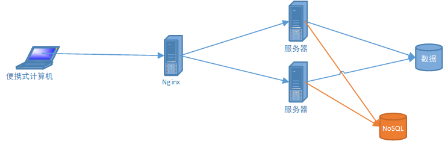

##### 1.1.2.2 解决IO压力

读写分离、分库分表：通过破坏一定的业务逻辑来换取性能

**缓存数据库：减少IO操作，例如将热点数据存储缓存数据库（数据存储在内存，避免IO）**

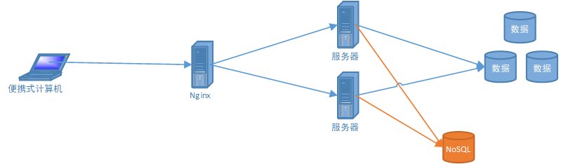

### 1.2 NoSQL数据库

打破了传统关系型数据库以业务逻辑为依据的存储模式，而针对不同数据结构类型改为以性能为依据的存储方式。

#### 1.2.1 NoSQL概述

NoSQL = <font color = red>Not Only SQL</font>，泛指所有非关系数据。NoSQL不依赖业务逻辑存储，而以简单的<font color = red>key-value</font>模式存储，因此大大的增加的数据库的**拓展能力**。

>   理解：假设某个已上线的系统现有3亿用户，如果使用关系型数据库存储用户信息，此时想要往用户表加一个字段，这是非常恐怖的！如果是NoSQL数据库，情况就会好很多。

-   不遵循SQL标准
-   不支持ACID（不支持ACID不意味着不支持事务）
-   性能远超于SQL

#### 1.2.2 适用、不适用场景

适合：

-   高并发读写（电商秒杀）
-   海量数据读写
-   数据高可拓展性

不适合：

-   需求事务支持
-   需要结构化查询

#### 1.2.3 常见NoSQL数据库

1.  Memcache
    -   开源
    -   很早出现的NoSQL数据库
    -   支持的value类型比较单一
    -   数据存储在内存，==不支持持久化==
    -   一般作为缓存数据库辅助持久化数据库
    -   多线程 + 锁
2.  Redis
    -   开源
    
    -   几乎涵盖了Memcache的绝大部分功能
    
    -   支持多种数据结构的value，例如string、list、hash、set、zset
    
    -   数据存储在内存，==支持持久化==（周期性的把更新的数据写入磁盘，或者把修改操作写入记录文件，主要用于备份恢复），在此基础上实现了==Redis主从复制==
    
    -   一般作为缓存数据库辅助持久化数据库
    
    -   单线程 + 多路IO复用
    
        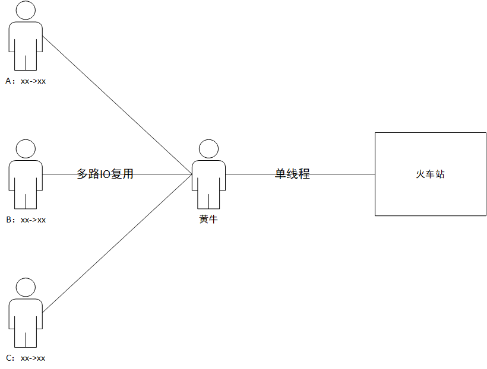
3.  MongoDB
    -   文档型数据库

## 2. Redis 概述、安装

### 2.1 应用场景

-   高速缓存
    -   配合关系型数据库，存储高频热点数据，降低数据库IO
    -   配合分布式结构，实现内存数据共享，如分布式Session
-   数据结构
    -   最新N个数据：通过List实现按照自然时间排序的数据
    -   排行榜：利用zSet（有序集合）
    -   失效性数据，如短信验证码：Expire过期
    -   计数器、秒杀：原子性
    -   去重：利用Set
    -   发布订阅消息系统：pub/sub模式

### 2.2 Redis安装（手动）

#### 2.2.1 安装版本

[官网下载地址](https://redis.io/)

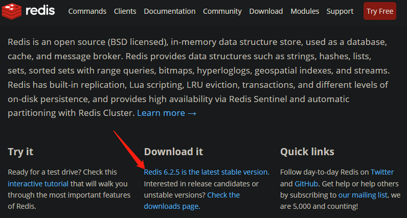

#### 2.2.2 安装步骤

1.  准备工作：下载安装最新版本的gcc编译器

    ```shell
    # 查看当前系统是否安装、安装了什么版本的gcc编译器
    gcc --version
    ```

    ```shell
    # 安装
    yum install centos-release-scl scl-utils-build
    yum install -y devtoolset-8-toolchain
    scl enable devtoolset-8 bash
    ```

2.  上传redis文件至服务器

    

3.  解压文件

    ```shell
    tar -zxvf redis-6.2.5.tar.gz

4.  进入目录

    ```shell
    cd redis-6.2.5
    ```

    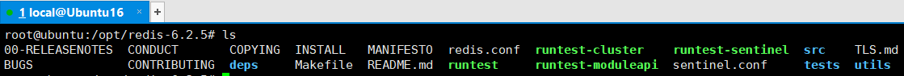

5.  编译

    ```shell
    make
    ```

    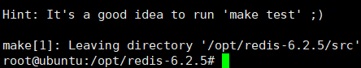

6.  安装

    ```shell
    # 跳过 make test 直接进行安装
    make install
    ```

    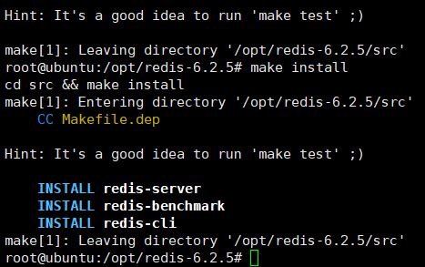

#### 2.2.3 安装目录

/usr/local/bin


-   redis-benchmark：性能测试工具
-   redis-check-aof：用于修复有问题的aof文件
-   redis-check-rdb：用于修复有问题的rdb文件
-   redis-sentinel：redis集群使用
-   ==redic-cli==：客户端，操作入口
-   ==redis-server==：redis服务器启动命令

#### 2.2.4 前台启动（不推荐）

以前台方式启动，命令行窗口关闭则redis服务随着关闭。

```shell
redis-server
```

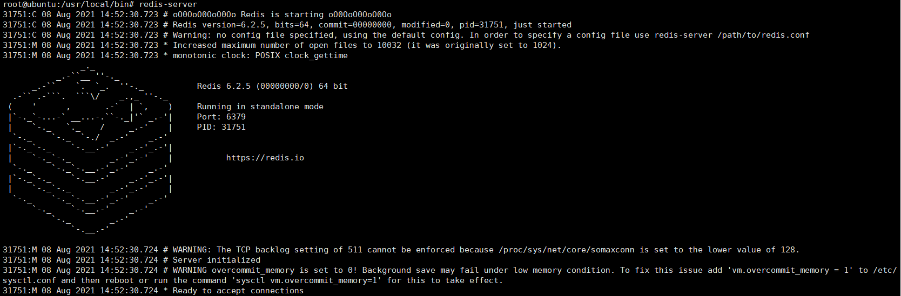

#### 2.2.5 后台启动（推荐）

1.  进入redis解压目录，复制redis配置文件

    ```shell
    cd /opt/redis-6.2.5/
    cp redis.conf /usr/local/bin/my-config.conf
    ```

2.  修改配置文件

    修改配置文件中的daemonize配置项目，将原来的no改为yes

    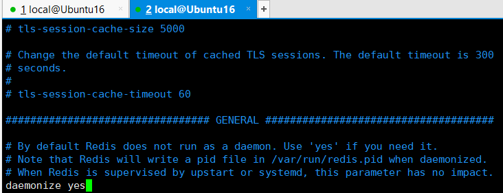

3.  启动Redis

    ```shell
    # 启动redis
    redis-server my-config.conf
    # 查看启动状态
    ps -ef | grep redis
    ```

    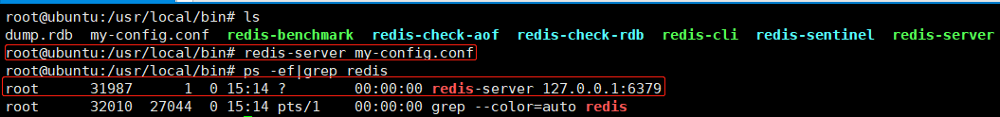

4.  测试验证

    ```shell
    # 客户端连接redis
    redis-cli
    ```

    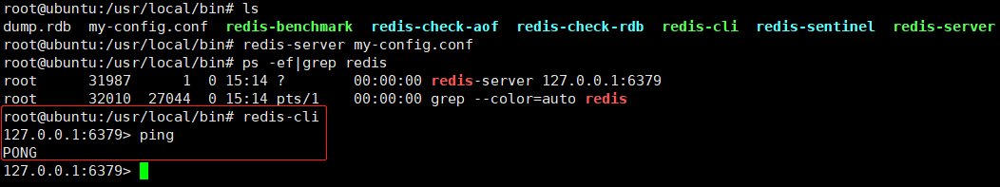

5.  关闭Redis

    方案1：通过客户端，使用shutdown命令

    ```
    # 单实例关闭
    redis-cli shutdown
    
    # 多实例关闭
    redis-cli -p 6379 shutdown
    ```

    方案2：找到redis进程号，使用kill -9 关闭

#### 2.2.6 Redis相关知识

-   默认端口6379

-   默认16个数据库，下标从0开始。默认使用0号数据库，使用 select <dbid> 切换数据库。

    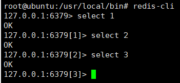

### 2.3 Redis安装（Docker）

教程地址：https://www.runoob.com/docker/docker-install-redis.html

#### 2.3.1 搜索镜像

```
docker search redis
```

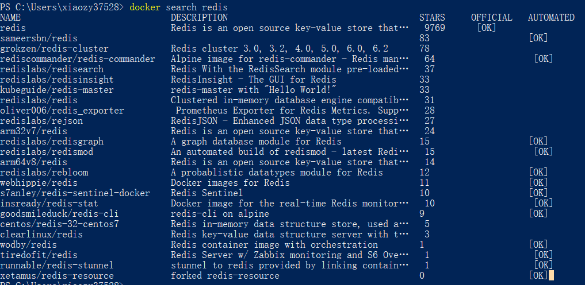

#### 2.3.2 拉取镜像

```
docker pull redis # 拉取最新版本的redis镜像，等用于 docker pull redis:latest
```

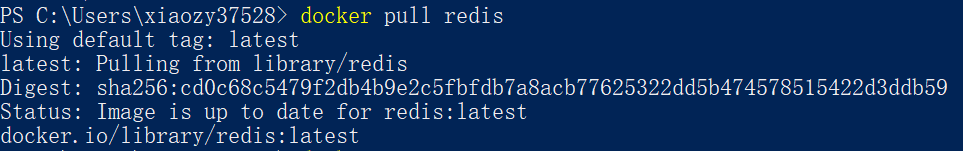

查看本地镜像：

```
docker images
```

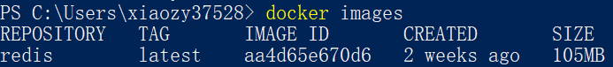

#### 2.3.3 启动容器

```
# A:新建并启动容器
docker run -itd --name redis-test -p 6379:6379 redis
# B:启动容器
docker start 容器ID或容器名
```

查看容器运行信息：

```
docker ps
```

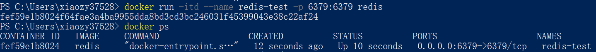

>   参数说明：
>
>   -   -i：以交互模式运行容器（通常与-t一起使用）
>   -   -t：为容器重新分配一个伪输入端口（通常与-i一起使用）
>
>   -   -d：后台启动容器，并返回容器ID，即启动守护式容器
>   -   -name：指定容器名称
>
>   -   -p 本地端口:容器端口：指定端口映射

#### 2.3.4 使用Redis

调用容器的bash：

```
docker exec -it redis-test /bin/bash
```

使用redis-cli：

```
cd /usr/local/bin/
redis-cli
```

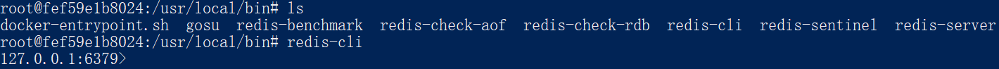

#### 2.3.4 关闭容器

```
docker stop 容器ID或容器名
```

## 3. 五大常用数据类型

Redis官网资料：

-   命令
    -   [Redis命令中心（英文）](https://redis.io/commands)
    -   [Redis命令中心（中文）](http://www.redis.cn/commands.html)
    -   [Redis命令手册（中文）](https://www.redis.net.cn/order/)
-   数据类型
    -   [数据类型（英文）](https://redis.io/topics/data-types-intro)
    -   [数据类型（中文）](http://www.redis.cn/topics/data-types.html)

### 3.1 键（key）

#### 3.1.1 简介

Redis的key值是==二进制安全==的，这意味着可以用任何二进制序列作为key值，从形如”abc”的简单字符串到一个JPEG文件的内容都可以。空字符串也是有效key值。

关于key的几条建议：

-   太长的键值不是个好主意，例如1024字节的键值就不是个好主意，不仅因为消耗内存，而且在数据中查找这类键值的计算成本很高。
-   太短的键值通常也不是好主意，如果你要用”u:1000:pwd”来代替”user:1000:password”，这没有什么问题，但后者更易阅读，并且由此增加的空间消耗相对于key object和value object本身来说很小。当然，没人阻止您一定要用更短的键值节省一丁点儿空间。
-   最好坚持一种模式。例如：”object-type: id: field”就是个不错的注意，像这样”user:1000:password”。我喜欢对多单词的字段名中加上一个点，就像这样：”comment: 1234: reply.to”。

#### 3.1.2 常用命令

##### 查询类

###### <font color = #1AA3FF>KEYS</font> pattern

>   时间复杂度：O(N)
>
>   说明：查找所有匹配给定正则表达式的键
>
>   警告：虽然KEYS的速度非常快，但是如果在一个很大的数据库中使用它依然可能造成性能问题，如果你需要从一个数据集中查找特定的KEY，最好还是用Redis的集合结构SETS来代替。

```
127.0.0.1:6379> KEYS *
1) "k11"
2) "k33"
3) "k1"
4) "k2"
5) "k3"
6) "k22"
127.0.0.1:6379> KEYS *1*
1) "k11"
2) "k1"
```


###### <font color = #1AA3FF>EXISTS</font> key [key ...]

>   时间复杂度：O(1)
>
>   说明：判断指定的key（一个或多个）是否存在
>
>   返回：存在的key的数量

```
127.0.0.1:6379> KEYS *
1) "k4"
2) "k3"
127.0.0.1:6379> EXISTS k3
(integer) 1
127.0.0.1:6379> EXISTS k4
(integer) 1
127.0.0.1:6379> EXISTS k5
(integer) 0
127.0.0.1:6379> EXISTS k3 k4 k4
(integer) 3
127.0.0.1:6379> EXISTS k3 k4 k5
(integer) 2

```


###### <font color = #1AA3FF>TYPE</font> key

>   时间复杂度：O(1)
>
>   说明：查询指定key所存储的value的存储类型。
>
>   返回：`string`, `list`, `set`, `zset` 和 `hash`等不同类型，如果key不存在就返回none

```
127.0.0.1:6379> SET k1 stirng
OK
127.0.0.1:6379> LPUSH k2 1 2 3 4 5 6
(integer) 6
127.0.0.1:6379> SADD k3 a b c
(integer) 3
127.0.0.1:6379> KEYS *
1) "k3"
2) "k2"
3) "k1"
127.0.0.1:6379> TYPE k1
string
127.0.0.1:6379> TYPE k2
list
127.0.0.1:6379> TYPE k3
set
127.0.0.1:6379> TYPE k4
none
```


###### <font color = #1AA3FF>TTL</font> key

>时间复杂度：O(1)
>
>说明：查询指定key的剩余有效时间。2.6版本之后添加了<font color = #1AA3FF>PTTL</font>命令，以毫秒为单位返回key的剩余时间。
>
>返回：
>
>-   2.6及以前版本：-1 key不存在或已经过期
>-   2.8及之后版本：-1 key存在且没有设置过期时间  -2 key不存在或已经过期

```
127.0.0.1:6379> KEYS *
1) "k2"
127.0.0.1:6379> TTL k1    # k1不存在
(integer) -2
127.0.0.1:6379> TTL k2    # k2没有设置过期时间
(integer) -1
127.0.0.1:6379> EXPIRE k2 100
(integer) 1
127.0.0.1:6379> TTL k2    # k2尚未过期
(integer) 96
127.0.0.1:6379> TTL k2    # k2已经过期
(integer) -2
```


##### 操作类

###### <font color = #1AA3FF>DEL</font> key [key …]

>   时间复杂度：O(N)，当删除的key是字符串以外的复杂数据类型时（如`List`、`Set`、`Hash`），删除这个key的时间复杂度是O(1)
>
>   说明：删除指定的一批key，如果删除的key不存在则直接跳过
>
>   返回：被删除的keys的数量

```
127.0.0.1:6379> KEYS *
1) "k1"
2) "k2"
3) "k4"
4) "k3"
127.0.0.1:6379> DEL k1 k2 k5 k6
(integer) 2
127.0.0.1:6379> KEYS *
1) "k4"
2) "k3"
```


###### <font color = #1AA3FF>RENAME</font> oldKey newKey

>   时间复杂度：O(1)
>
>   说明：为指定的key设置新的名称

```
127.0.0.1:6379> keys *
1) "k1"
127.0.0.1:6379> RENAME k1 k2
OK
127.0.0.1:6379> keys *
1) "k2"
127.0.0.1:6379> RENAME k2 k2
OK
127.0.0.1:6379> keys *
1) "k2"
```


###### <font color = #1AA3FF>EXPIRE</font> key seconds

>   时间复杂度：O(1)
>
>   说明：为指定的key设置过期时间（秒），超过时间后该key会被自动删除。在Redis 2.4及以前版本，过期期时间可能不是十分准确，有0-1秒的误差；从Redis 2.6起，过期时间误差缩小到0-1毫秒。2.6.0版本新增了<font color = #1AA3FF>PEXPIRE</font>命令，以毫秒为单位设置key的过期时间。
>
>   返回：1-设置成功 0-设置不成功（key不存在或不能设置过期时间）

-   过期和持久化

    ==Keys的过期时间使用Unix时间戳存储(从Redis 2.6开始以毫秒为单位)，这意味着即使Redis实例不可用，时间也是一直在流逝的。==

    要想过期的工作处理好，计算机必须采用稳定的时间。 如果你将RDB文件在两台时钟不同步的电脑间同步，有趣的事会发生——可能所有的keys装载时就会过期。即使正在运行的实例也会检查计算机的时钟，例如如果你设置了一个key的有效期是1000秒，然后设置你的计算机时间为未来2000秒，这时key会立即失效，而不是等1000秒之后。

-   <font color= red>Redis如何淘汰过期的key？</font>

    Redis的key过期方式有两种：被动发现和主动发现

    当客户端尝试访问过期的key时，它会被发现并删除。显然这样是不够的，因为有些过期的key永远不会被访问，无论如何必须想办法删除这些过期的key，所以Redis会定时随机抽取key，验证过期时间，如果过期则删除。

    主动发现的具体工作流程：（每隔10秒）

    1.  随机抽取20个key验证过期时间
    2.  删除所有已经过期的key
    3.  如果过期的key超过25%，重复步骤1

    观察上述流程可以知道，任何给定的时刻，最多清除1/4的过期key。

-   修改key名

    如果使用RENAME修改key，相关的过期时间会转移到新key上面。如果key原本就存在：假设存在k2，调用RENAME k1 k2命令，此时k1的过期时间会被k2覆盖。

    ```
    127.0.0.1:6379> KEYS *
    1) "k3"
    127.0.0.1:6379> EXPIRE k3 30        # 设置30秒过期时间
    (integer) 1
    127.0.0.1:6379> RENAME k3 k4        # 修改键名
    OK
    127.0.0.1:6379> KEYS *
    1) "k4"
    127.0.0.1:6379> KEYS *
    1) "k4"
    127.0.0.1:6379> KEYS *
    1) "k4"
    127.0.0.1:6379> KEYS *
    1) "k4"
    127.0.0.1:6379> KEYS *
    1) "k4"
    127.0.0.1:6379> KEYS *
    1) "k4"
    127.0.0.1:6379> KEYS *
    1) "k4"
    127.0.0.1:6379> KEYS *
    1) "k4"
    127.0.0.1:6379> KEYS *
    1) "k4"
    127.0.0.1:6379> KEYS *        # 过期自动删除
    (empty array)
    ```

-   刷新过期时间

    重复调用EXPIRE命令可以重新为key设置过期时间

    ```
    127.0.0.1:6379> SET k1 v1
    OK
    127.0.0.1:6379> KEYS *
    1) "k1"
    127.0.0.1:6379> EXPIRE k1 3   # 设置过期时间3秒
    (integer) 1
    127.0.0.1:6379> EXPIRE k1 3
    (integer) 1
    127.0.0.1:6379> EXPIRE k1 3
    (integer) 1
    127.0.0.1:6379> EXPIRE k1 3
    (integer) 1
    127.0.0.1:6379> EXPIRE k1 3
    (integer) 1
    127.0.0.1:6379> EXPIRE k1 3    # 每隔1秒重置过期时间
    (integer) 1
    127.0.0.1:6379> EXPIRE k1 3
    (integer) 1
    127.0.0.1:6379> EXPIRE k1 3
    (integer) 1
    127.0.0.1:6379> EXPIRE k1 3
    (integer) 1
    127.0.0.1:6379> EXPIRE k1 3
    (integer) 1
    127.0.0.1:6379> EXPIRE k1 3
    (integer) 1
    127.0.0.1:6379> KEYS *         # 间隔第一次设置过期时间实际早已超过3秒
    1) "k1"
    ```
    
-   移除过期设置

    通过调用PERSIST命令可以移除key的过期设置。

    ```
    127.0.0.1:6379> SET k1 v1
    OK
    127.0.0.1:6379> KEYS *
    1) "k1"
    127.0.0.1:6379> EXPIRE k1 10    # 设置10s后过期
    (integer) 1
    127.0.0.1:6379> PERSIST k1      # 移除过期设置
    (integer) 1
    127.0.0.1:6379> KEYS *          # 等待15秒后，k1依然存在
    1) "k1"
    127.0.0.1:6379> 
    ```


###### <font color = #1AA3FF>EXPIREAT</font> key timestamp

>   时间复杂度：O(1)
>
>   说明：EXPIREAT命令和EXPIRE命令类似，都用于设置key的生存时间，不同在于EXPIREAT命令接受的参数是UNIX时间戳。2.6.0版本新增了<font color = #1AA3FF>PEXPIREAT</font>命令，以毫秒为单位设置key的过期时间。
>
>   返回：1-设置成功 0-设置不成功（key不存在或不能设置过期时间）

```
127.0.0.1:6379> SET k1 v1
OK
127.0.0.1:6379> EXISTS k1
(integer) 1
127.0.0.1:6379> EXPIREAT k1 1293840000
(integer) 1
127.0.0.1:6379> EXISTS k1
(integer) 0
```


###### <font color = #1AA3FF>PERSIST</font> key

>   时间复杂度：O(1)
>
>   说明：移除设置在给定key上的过期设置
>
>   返回：1-移除成功 0-移除失败（key不存在或没有设置过期时间）


### 3.2 字符串（String）

#### 3.2.1 简介

字符串是一种最基本的Redis值类型。Redis字符串是二进制安全的，这意味着一个Redis字符串能包含任意类型的数据，例如： 一张JPEG格式的图片或者一个序列化的Ruby对象。

一个字符串类型的值最多能存储==512MB==的内容。

#### 3.2.2 常用命令

##### 查询类

###### <font color = #1AA3FF>GET</font> key


###### <font color = #1AA3FF>MGET</font> key [key …]


###### <font color = #1AA3FF>GETSET</font> key value


###### <font color = #1AA3FF>GETRANGE</font> key start end


###### <font color = #1AA3FF>STRLEN</font> key


##### 操作类

###### <font color = #1AA3FF>SET</font> key value [<font color = #1AA3FF>EX</font> seconds] [<font color = #1AA3FF>PX</font> milliseconds] [<font color = #1AA3FF>NX</font>|<font color = #1AA3FF>XX</font>]


###### <font color = #1AA3FF>MSET</font> key value [key value …]


###### <font color = #1AA3FF>SETNX</font> key value


###### <font color = #1AA3FF>MSETNX</font> key value [key value …]


###### <font color = #1AA3FF>SETEX</font> key seconds value


###### <font color = #1AA3FF>PSETEX</font> key milliseconds value


###### <font color = #1AA3FF>INCR</font> key


###### <font color = #1AA3FF>INCRBY</font> key increment


###### <font color = #1AA3FF>DECR</font> key


###### <font color = #1AA3FF>DECR</font> key decrement

#### 3.2.3 数据结构

### 3.3 列表（List）

#### 3.3.1 简介

Redis列表是简单的字符串列表。一个列表最多可以包含2^32^-1个元素（4294967295，每个表超过40亿个元素）。

可以按照顺序将元素插入到列表的头部（左边）或尾部（右边）。LPUSH命令将一个新元素插到列表头部，RPUSH命令将一个新元素插到列表尾部，当对一个key执行某个列表命令时，Redis会自动创建列表，类似的，当对某个key执行列表清空命令时，Redis会自动删除列表。

Redis列表支持以O(1)的时间复杂度操作列表两端的数据，但是操作列表中间的元素需要的时间复杂度为O(n)，当数据量很大的时候操作就会很忙，为此Redis列表提供了异步操作支持（后文介绍）。

#### 3.3.2 常用命令

#### 3.3.3 数据结构

### 3.4 集合（Set）

#### 3.4.1 简介

Redis集合是无序的字符串集合。一个集合最多可以包含2^32^-1个元素（4294967295，每个表超过40亿个元素）。

Redis集合支持以O(1)的时间复杂度进行删除、添加、测试元素是否存在的操作。Redis集合有着不允许相同成员存在的优秀特性。向集合中多次添加同一元素，在集合中最终只会存在一个此元素。实际上这就意味着，在添加元素前，你并不需要事先进行检验此元素是否已经存在的操作。

#### 3.4.2 常用命令

#### 3.4.3 数据结构

### 3.5 哈希（Hash）

#### 3.5.1 简介

Redis Hashes是字符串字段和字符串值之间的映射，所以它们是完美的表示对象的数据类型。一个Hash最多可以包含2^32^-1个key-value键值对（4294967295，每个表超过40亿个元素）。

一个拥有少量（100个左右）字段的Hash只需要很少的空间来存储，所有你可以在一个小型的Redis实例中存储上百万的对象。

#### 3.5.2 常用命令

#### 3.5.3 数据结构

### 3.6 有序集合（ZSet）

#### 3.6.1 简介

Redis有序集合与Redis集合类似，都是不相同的字符串的合集。它们的差别是，每个有序集合的成员都关联着一个==评分==，这个评分用于把有序集合中的成员按照从最低分到最高分排列。

使用有序集合，你可以非常快（**O(log^N^**）地完成添加，删除和更新元素的操作。

#### 3.6.2 常用命令

#### 3.6.3 数据结构
