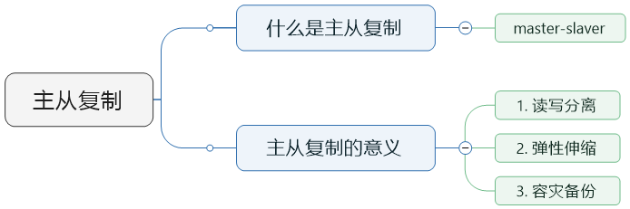
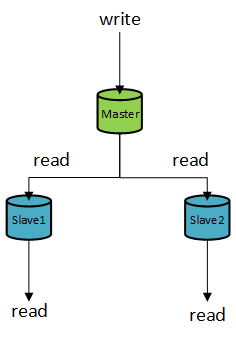
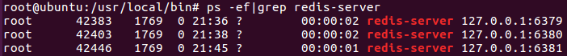
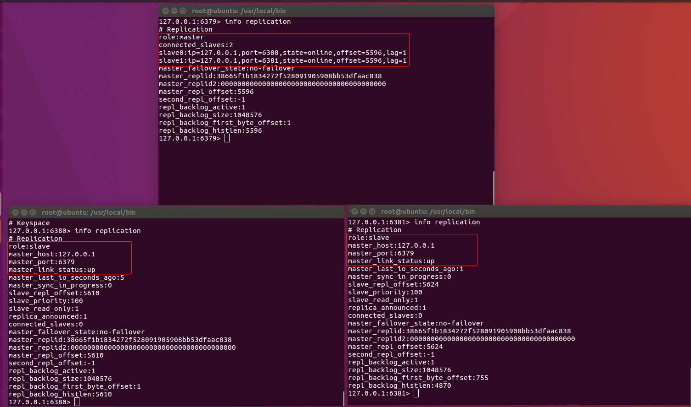
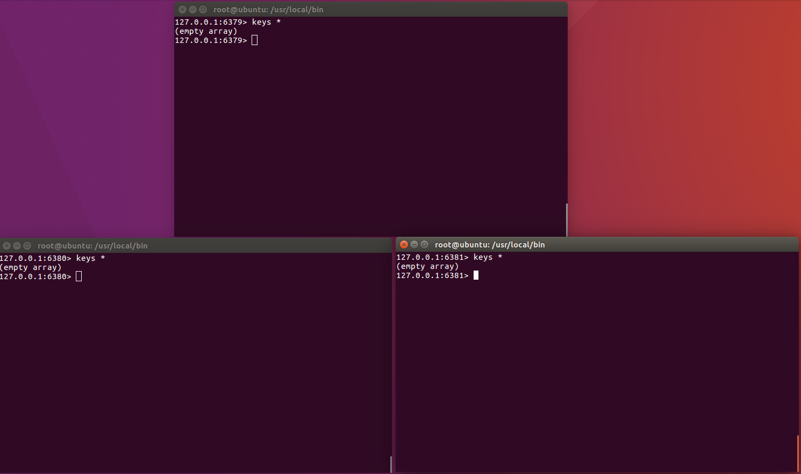
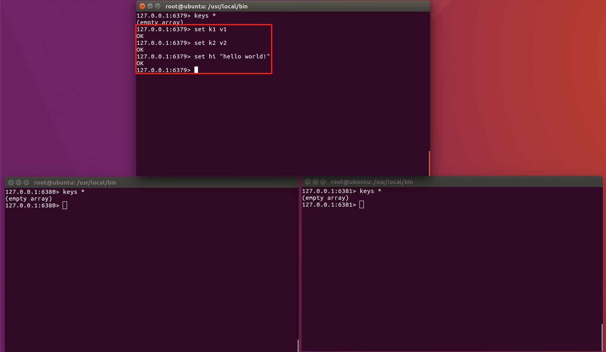
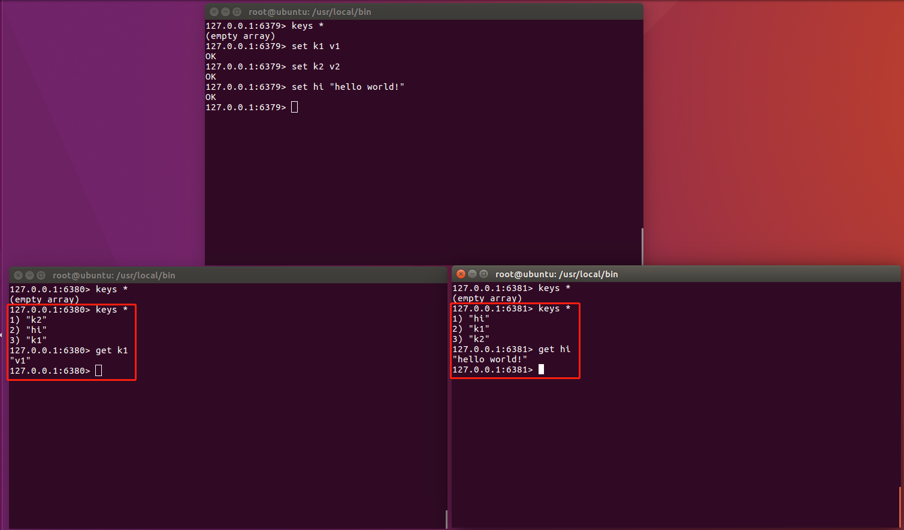

# Redis主从复制





## “一主二从”简单实现



### 1. 准备Master和Slave的配置文件

Master配置文件（master-6379.conf）：

```
include /usr/local/bin/redis.conf            # 引用公共配置文件

port 6379
pidfile /var/run/redis_6379.pid
logfile /usr/local/bin/log/master_6379.log   # 日志文件
dbfilename master_6379.rdb                   # rdb文件
```


Slave 1配置文件（slave-6380.conf）：

```
include /usr/local/bin/redis.conf

port 6380
pidfile /var/run/redis_6380.pid
logfile /usr/local/bin/log/slave_6380.log
dbfilename slave_6380.rdb
```


Slave 2配置文件（slave-6381.conf）：

```
include /usr/local/bin/redis.conf

port 6381
pidfile /var/run/redis_6381.pid
logfile /usr/local/bin/log/slave_6381.log
dbfilename slave_6381.rdb
```


### 2. 启动Master和Slave数据库

```
redis-server master-6379.conf
redis-server slave-6380.conf
redis-server slave-6381.conf
```




### 3. 设置Slave指向的Master

1.  连接Slave

    ```
    redis-cli -p 服务器端口号
    ```

2.  设置Slave指向的Master

    ```
    slaveof Master地址 Master端口号 
    ```

Slave1配置Master：

```
root@ubuntu:/usr/local/bin# redis-cli -p 6380
127.0.0.1:6380> slaveof 127.0.0.1 6379
OK
```

Slave2配置Master：

```
root@ubuntu:/usr/local/bin# redis-cli -p 6381
127.0.0.1:6381> slaveof 127.0.0.1 6379
OK
```


### 4. 测试配置效果

1.  查看Master和Slave是否配置正确

    

2.  查看Master和Slave工作是否正常

    ① 初始时三个库都没有数据

    

    ②往Master插入若干数据

    

    ③数据被同步到Slave

    

    ④无法在Slave插入数据

    
