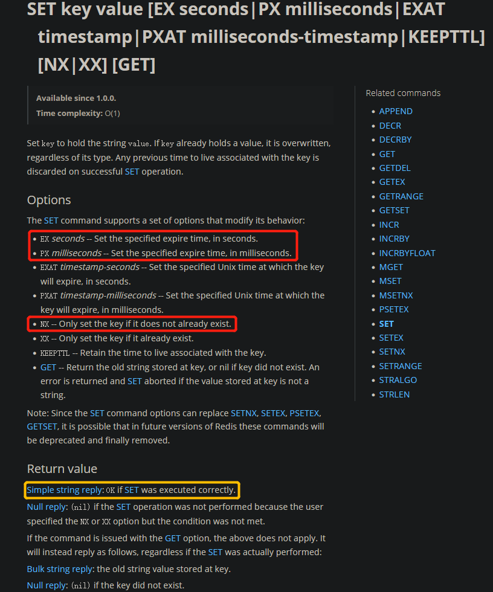

# Redis分布式锁

参考文章：[分布式锁之Redis实现](https://www.jianshu.com/p/47fd7f86c848)

---

在并发编程中，我们通过锁，来避免由于竞争而造成的数据不一致问题。但是Java中的锁，只能在一个JVM进程内起作用。如果在分布式集群环境下呢？

## 一、分布式锁

分布式锁，是一种思想，它的实现方式有很多。比如，我们将沙滩当做分布式锁的组件，那么它看起来应该是这样的：

-   **加锁**

    在沙滩上踩一脚，留下自己的脚印，就对应了加锁操作。其他进程或者线程，看到沙滩上已经有脚印，证明锁已被别人持有，则等待。

-   **解锁**

    把脚印从沙滩上抹去，就是解锁的过程。

-   **锁超时**

    为了避免死锁，我们可以设置一阵风，在单位时间后刮起，将脚印自动抹去。

分布式锁的实现有很多，比如基于数据库、memcached、Redis、系统文件、zookeeper等。它们的核心的理念跟上面的过程大致相同。

## 二、基于Redis的分布式锁

### 1. 加锁、锁超时

在Redis中使用SET命令实现加锁、锁超时：



例如：SET lock_key random_value NX PX 5000

-   `random_value`是客户端生成的唯一标识。客户端解锁前必须先验证该值，避免错误释放其他客户端的锁
-   `NX`代表只在键不存在时，才对键进行设置操作
-   `PX 5000`设置键的过期时间为5000毫秒

这样，如果上面的命令执行成功（返回值为OK），则证明客户端获取到了锁。

### 2. 解锁

解锁的过程就是将Key键删除。但也不能乱删，不能说客户端1的请求将客户端2的锁给删除掉。这时候`random_value`的作用就体现出来。

1.   判断当前key存储的value是否为客户端存储的random_value
2.   如果是的话就删除key

为了保证解锁操作的原子性，我们用LUA脚本完成这一操作：

```lua
if redis.call('get',KEYS[1]) == ARGV[1] then 
   return redis.call('del',KEYS[1]) 
else
   return 0 
end
```

