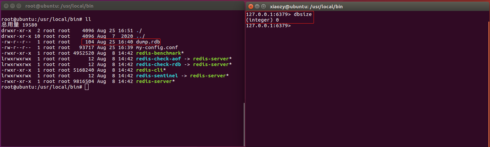
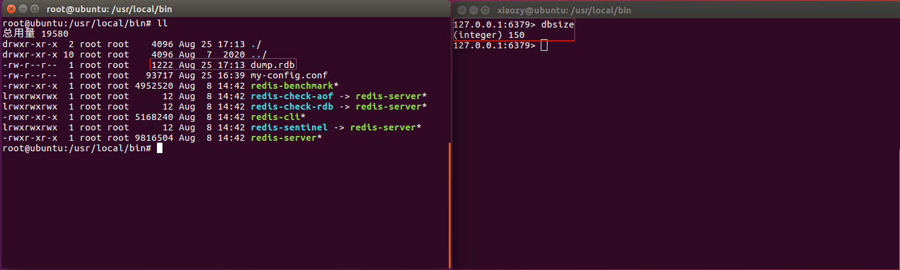
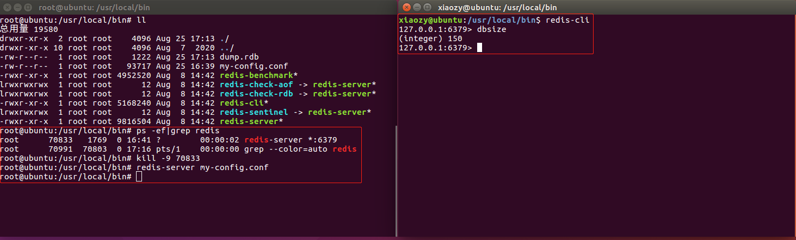
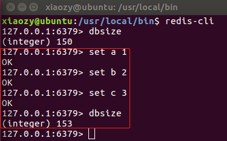
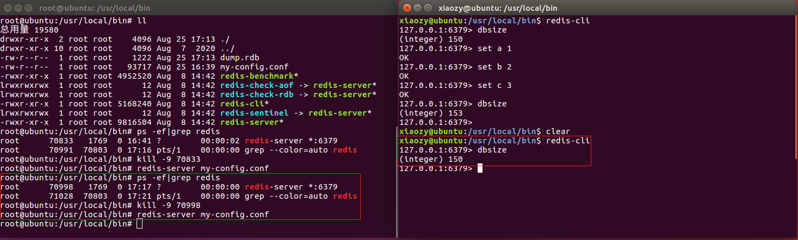

# Redis持久化：RDB和AOF

---

## RDB

### RDB配置信息

打开Redis配置文件，通过搜索“SNAPSHOTTING”，可以找到RDB的相关配置信息：

```yaml
################################ SNAPSHOTTING  ################################
```

#### 1. RDB触发条件

```yaml
# Save the DB to disk.
#
# save <seconds> <changes>
#
# Redis will save the DB if both the given number of seconds and the given
# number of write operations against the DB occurred.
#
# Snapshotting can be completely disabled with a single empty string argument
# as in following example:
#
# save ""
#
# Unless specified otherwise, by default Redis will save the DB:
#   * After 3600 seconds (an hour) if at least 1 key changed
#   * After 300 seconds (5 minutes) if at least 100 keys changed
#   * After 60 seconds if at least 10000 keys changed
#
# You can set these explicitly by uncommenting the three following lines.
#
# save 3600 1
# save 300 100
# save 60 10000
```

Redis触发RDB的条件：在`seconds`秒内，Redis执行<font color = red>写操作</font>的次数达到`changes`次。

允许配置多个触发条件，默认情况下Redis配置了3个触发条件：1次/1小时、100次/5分钟、10000次/分钟


#### 2. RDB异常处理

```yaml
# By default Redis will stop accepting writes if RDB snapshots are enabled
# (at least one save point) and the latest background save failed.
# This will make the user aware (in a hard way) that data is not persisting
# on disk properly, otherwise chances are that no one will notice and some
# disaster will happen.
#
# If the background saving process will start working again Redis will
# automatically allow writes again.
#
# However if you have setup your proper monitoring of the Redis server
# and persistence, you may want to disable this feature so that Redis will
# continue to work as usual even if there are problems with disk,
# permissions, and so forth.
stop-writes-on-bgsave-error yes
```

RDB异常处理：RDB出现异常时Redis如何处理

-   yes：Redis停止接收写操作请求，直到RDB异常被解决。
-   no：Redis照常处理读写操作


#### 3. 数据压缩

```yaml
# Compress string objects using LZF when dump .rdb databases?
# By default compression is enabled as it's almost always a win.
# If you want to save some CPU in the saving child set it to 'no' but
# the dataset will likely be bigger if you have compressible values or keys.
rdbcompression yes
```

String对象压缩：

-   yes：使用LZF压缩String对象
-   no：不对String对象做任何处理，降低RDB子线程的CPU开销，但可能增加 .rdb 文件的大小。


#### 4. rdb文件校验

```yaml
# Since version 5 of RDB a CRC64 checksum is placed at the end of the file.
# This makes the format more resistant to corruption but there is a performance
# hit to pay (around 10%) when saving and loading RDB files, so you can disable it
# for maximum performances.
#
# RDB files created with checksum disabled have a checksum of zero that will
# tell the loading code to skip the check.
rdbchecksum yes
```

rdb文件校验：

-   yes：在rdb文件尾部添加校验数据，能够保证rdb文件的有效性，但会降低保存和加载rdb文件时的性能（10%左右）
-   no：

#### 5. rdb数据校验

```yaml
# Enables or disables full sanitation checks for ziplist and listpack etc when
# loading an RDB or RESTORE payload. This reduces the chances of a assertion or
# crash later on while processing commands.
# Options:
#   no         - Never perform full sanitation
#   yes        - Always perform full sanitation
#   clients    - Perform full sanitation only for user connections.
#                Excludes: RDB files, RESTORE commands received from the master
#                connection, and client connections which have the
#                skip-sanitize-payload ACL flag.
# The default should be 'clients' but since it currently affects cluster
# resharding via MIGRATE, it is temporarily set to 'no' by default.
#
# sanitize-dump-payload no
```

加载rdb文件时进行数据校验：


#### 6. rdb文件名

```yaml
# The filename where to dump the DB
dbfilename dump.rdb
```


#### 7. rdb-del-sync-files no

```yaml
# Remove RDB files used by replication in instances without persistence
# enabled. By default this option is disabled, however there are environments
# where for regulations or other security concerns, RDB files persisted on
# disk by masters in order to feed replicas, or stored on disk by replicas
# in order to load them for the initial synchronization, should be deleted
# ASAP. Note that this option ONLY WORKS in instances that have both AOF
# and RDB persistence disabled, otherwise is completely ignored.
#
# An alternative (and sometimes better) way to obtain the same effect is
# to use diskless replication on both master and replicas instances. However
# in the case of replicas, diskless is not always an option.
rdb-del-sync-files no
```

Note that this option ONLY WORKS in instances that have both AOF and RDB persistence disabled, otherwise is completely ignored.


#### 8. rdb文件存储位置

```yaml
# The working directory.
#
# The DB will be written inside this directory, with the filename specified
# above using the 'dbfilename' configuration directive.
#
# The Append Only File will also be created inside this directory.
#
# Note that you must specify a directory here, not a file name.
dir ./
```

配置rdb文件的存储位置：aof文件将与rdb文件存储在同一个位置。


### RDB使用流程

#### 1. 修改配置文件

```yaml
# 只对RDB触发条件做简单的配置，其余配置项保留Redis默认值
save 3600 1
save 300 10
save 60 100
```


#### 2. 重启Redis

```shell
root@ubuntu:/usr/local/bin# ps -ef|grep redis
root      42620   1769  0 Aug24 ?        00:01:40 redis-server *:6379
root      70827  70803  0 16:40 pts/1    00:00:00 grep --color=auto redis
root@ubuntu:/usr/local/bin# kill 42620
root@ubuntu:/usr/local/bin# redis-server my-config.conf
root@ubuntu:/usr/local/bin# ps -ef|grep redis
root      70833   1769  0 16:41 ?        00:00:00 redis-server *:6379
root      70841  70803  0 16:41 pts/1    00:00:00 grep --color=auto redis
```

注意：重启Redis的时候一定要指定配置文件


#### 3. 测试

重启Redis后：



60秒内向Redis插入150条数据：发现rdb文件已经写入数据

```java
for (int i = 0; i < 150; i++) {
    redisTemplate.opsForValue().set("k" + i, i);
}
```



重启Redis：发现已经将rdb文件中的数据载入内存



连续插入3条数据，然后再次重启Redis：





可以看出，本次重启Redis从rdb文件中加载的数据条数是150条，说明之后插入的3条数据没有保存到rdb文件。这体现出了RDB存在的缺点：**可能丢失最近一次SNAPSHOTTING之后的操作产生的数据。**


## AOF

### AOF配置信息

### AOF使用流程
