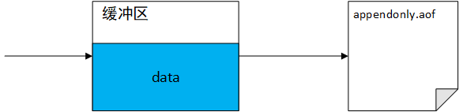

# Redis持久化：RDB和AOF

---

## RDB

### RDB配置信息

打开Redis配置文件，通过搜索“SNAPSHOTTING”，可以找到RDB的相关配置信息：

```yaml
################################ SNAPSHOTTING  ################################
```

#### 1. RDB触发条件

```yaml
# Save the DB to disk.
#
# save <seconds> <changes>
#
# Redis will save the DB if both the given number of seconds and the given
# number of write operations against the DB occurred.
#
# Snapshotting can be completely disabled with a single empty string argument
# as in following example:
#
# save ""
#
# Unless specified otherwise, by default Redis will save the DB:
#   * After 3600 seconds (an hour) if at least 1 key changed
#   * After 300 seconds (5 minutes) if at least 100 keys changed
#   * After 60 seconds if at least 10000 keys changed
#
# You can set these explicitly by uncommenting the three following lines.
#
# save 3600 1
# save 300 100
# save 60 10000
```

Redis触发RDB的条件：在`seconds`秒内，Redis执行<font color = red>写操作</font>的次数达到`changes`次。

允许配置多个触发条件，默认情况下Redis开启RDB并配置了3个触发条件：1次/1小时、100次/5分钟、10000次/分钟。通过配置 `save ""`可以关闭RDB。


#### 2. RDB异常处理

```yaml
# By default Redis will stop accepting writes if RDB snapshots are enabled
# (at least one save point) and the latest background save failed.
# This will make the user aware (in a hard way) that data is not persisting
# on disk properly, otherwise chances are that no one will notice and some
# disaster will happen.
#
# If the background saving process will start working again Redis will
# automatically allow writes again.
#
# However if you have setup your proper monitoring of the Redis server
# and persistence, you may want to disable this feature so that Redis will
# continue to work as usual even if there are problems with disk,
# permissions, and so forth.
stop-writes-on-bgsave-error yes
```

RDB异常处理：RDB出现异常时Redis如何处理

-   yes：Redis停止接收写操作请求，直到RDB异常被解决。
-   no：Redis照常处理读写操作


#### 3. 数据压缩

```yaml
# Compress string objects using LZF when dump .rdb databases?
# By default compression is enabled as it's almost always a win.
# If you want to save some CPU in the saving child set it to 'no' but
# the dataset will likely be bigger if you have compressible values or keys.
rdbcompression yes
```

String对象压缩：

-   yes：使用LZF压缩String对象
-   no：不对String对象做任何处理，降低RDB子线程的CPU开销，但可能增加 .rdb 文件的大小。


#### 4. rdb文件校验

```yaml
# Since version 5 of RDB a CRC64 checksum is placed at the end of the file.
# This makes the format more resistant to corruption but there is a performance
# hit to pay (around 10%) when saving and loading RDB files, so you can disable it
# for maximum performances.
#
# RDB files created with checksum disabled have a checksum of zero that will
# tell the loading code to skip the check.
rdbchecksum yes
```

rdb文件校验：

-   yes：在rdb文件尾部添加校验数据，能够保证rdb文件的有效性，但会降低保存和加载rdb文件时的性能（10%左右）
-   no：

#### 5. rdb数据校验

```yaml
# Enables or disables full sanitation checks for ziplist and listpack etc when
# loading an RDB or RESTORE payload. This reduces the chances of a assertion or
# crash later on while processing commands.
# Options:
#   no         - Never perform full sanitation
#   yes        - Always perform full sanitation
#   clients    - Perform full sanitation only for user connections.
#                Excludes: RDB files, RESTORE commands received from the master
#                connection, and client connections which have the
#                skip-sanitize-payload ACL flag.
# The default should be 'clients' but since it currently affects cluster
# resharding via MIGRATE, it is temporarily set to 'no' by default.
#
# sanitize-dump-payload no
```

加载rdb文件时进行数据校验：


#### 6. rdb文件名

```yaml
# The filename where to dump the DB
dbfilename dump.rdb
```


#### 7. rdb-del-sync-files no

```yaml
# Remove RDB files used by replication in instances without persistence
# enabled. By default this option is disabled, however there are environments
# where for regulations or other security concerns, RDB files persisted on
# disk by masters in order to feed replicas, or stored on disk by replicas
# in order to load them for the initial synchronization, should be deleted
# ASAP. Note that this option ONLY WORKS in instances that have both AOF
# and RDB persistence disabled, otherwise is completely ignored.
#
# An alternative (and sometimes better) way to obtain the same effect is
# to use diskless replication on both master and replicas instances. However
# in the case of replicas, diskless is not always an option.
rdb-del-sync-files no
```

Note that this option ONLY WORKS in instances that have both AOF and RDB persistence disabled, otherwise is completely ignored.


#### 8. rdb文件存储位置

```yaml
# The working directory.
#
# The DB will be written inside this directory, with the filename specified
# above using the 'dbfilename' configuration directive.
#
# The Append Only File will also be created inside this directory.
#
# Note that you must specify a directory here, not a file name.
dir ./
```

配置rdb文件的存储位置：aof文件将与rdb文件存储在同一个位置。


### RDB使用流程

#### 1. 修改配置文件

```yaml
# 只对RDB触发条件做简单的配置，其余配置项保留Redis默认值
save 3600 1
save 300 10
save 60 100
```


#### 2. 重启Redis

```shell
root@ubuntu:/usr/local/bin# ps -ef|grep redis
root      42620   1769  0 Aug24 ?        00:01:40 redis-server *:6379
root      70827  70803  0 16:40 pts/1    00:00:00 grep --color=auto redis
root@ubuntu:/usr/local/bin# kill 42620
root@ubuntu:/usr/local/bin# redis-server my-config.conf
root@ubuntu:/usr/local/bin# ps -ef|grep redis
root      70833   1769  0 16:41 ?        00:00:00 redis-server *:6379
root      70841  70803  0 16:41 pts/1    00:00:00 grep --color=auto redis
```

注意：重启Redis的时候一定要指定配置文件


#### 3. 测试

重启Redis后：


60秒内向Redis插入150条数据：发现rdb文件已经写入数据

```java
for (int i = 0; i < 150; i++) {
    redisTemplate.opsForValue().set("k" + i, i);
}
```


重启Redis：发现已经将rdb文件中的数据载入内存


连续插入3条数据，然后再次重启Redis：


可以看出，本次重启Redis从rdb文件中加载的数据条数是150条，说明之后插入的3条数据没有保存到rdb文件。这体现出了RDB存在的缺点：**可能丢失最近一次SNAPSHOTTING之后的操作产生的数据。另外，如果SNAPSHOTTING指定的过程中Redis发生宕机，本次SNAPSHOTTING的数据也会丢失。**


## AOF

默认情况下，Redis不开启AOF。

### AOF配置信息

打开Redis配置文件，通过搜索“APPEND ONLY MODE”，可以找到AOF的相关配置信息：

```yaml
############################## APPEND ONLY MODE ###############################
```

#### 1. AOF开关

```yaml
# By default Redis asynchronously dumps the dataset on disk. This mode is
# good enough in many applications, but an issue with the Redis process or
# a power outage may result into a few minutes of writes lost (depending on
# the configured save points).
#
# The Append Only File is an alternative persistence mode that provides
# much better durability. For instance using the default data fsync policy
# (see later in the config file) Redis can lose just one second of writes in a
# dramatic event like a server power outage, or a single write if something
# wrong with the Redis process itself happens, but the operating system is
# still running correctly.
#
# AOF and RDB persistence can be enabled at the same time without problems.
# If the AOF is enabled on startup Redis will load the AOF, that is the file
# with the better durability guarantees.
#
# Please check https://redis.io/topics/persistence for more information.

appendonly no
```

该配置项用于启动、关闭AOF功能。

<u>默认情况下，Redis会开启RDB功能，关闭AOF功能</u>。RDB能够满足大多数应用场景，但是遇到突发故障时（例如，断电、宕机）可能会丢失几分钟的数据（取决于具体配置）。与之相比，AOF在可靠性上会更好一些，AOF能够保证遇到突发情况最多丢失一秒钟的数据（取决于具体配置，后文讲详细说明）。

可以同时开启RDB和AOF功能，但是重启Redis时将优先使用aof文件恢复数据，因为aof记录的数据更可靠、更完整。

#### 2. aof文件名

```yaml
# The name of the append only file (default: "appendonly.aof")

appendfilename "appendonly.aof"
```


#### 3. AOF工作模式

```yaml
# The fsync() call tells the Operating System to actually write data on disk
# instead of waiting for more data in the output buffer. Some OS will really flush
# data on disk, some other OS will just try to do it ASAP.
#
# Redis supports three different modes:
#
# no: don't fsync, just let the OS flush the data when it wants. Faster.
# always: fsync after every write to the append only log. Slow, Safest.
# everysec: fsync only one time every second. Compromise.
#
# The default is "everysec", as that's usually the right compromise between
# speed and data safety. It's up to you to understand if you can relax this to
# "no" that will let the operating system flush the output buffer when
# it wants, for better performances (but if you can live with the idea of
# some data loss consider the default persistence mode that's snapshotting),
# or on the contrary, use "always" that's very slow but a bit safer than
# everysec.
#
# More details please check the following article:
# http://antirez.com/post/redis-persistence-demystified.html
#
# If unsure, use "everysec".

# appendfsync always
appendfsync everysec
# appendfsync no
```

[延迟写（delayed write）](..\..\..\..\方法论\延迟写.md): 传统的UNIX实现在内核中设有缓冲区高速缓存或页面高速缓存，大多数磁盘I/O都通过缓冲进行。  当将数据写入文件时，内核通常先将该数据复制到其中一个缓冲区中，如果该缓冲区尚未写满，则  并不将其排入输出队列，而是等待其写满或者当内核需要重用该缓冲区以便存放其他磁盘块数据时，  再将该缓冲排入到输出队列，然后待其到达队首时，才进行实际的I/O操作。这种输出方式就被称为延迟写。

==延迟写减少了磁盘读写次数，但是却降低了文件内容的更新速度，使得欲写到文件中的数据在一段时间内并没有写到磁盘上。当系统发生故障时，这种延迟可能造成文件更新内容的丢失。==



为了保证磁盘上实际文件系统与缓冲区高速缓存中内容的一致性，unix系统提供了三个函数：sync、fsync、fdatasync。其中fsync会通知操作系统讲缓冲区的数据写入文件（即使缓冲区还没满），<font color = red>并且等待操作系统完成写入操作</font>（可能导致较长时间的阻塞）

AOF支持三种工作模式：

1.   no：不主动调用fsync，由操作系统觉得何时将缓冲区中的“append only log”写入磁盘的aof文件。
2.   always：每记录一条“append only log”就调用一次fsync。
3.   everysec：每秒最多调用一次fsync。

| 工作模式 |    性能    |
| :------: | :--------: |
|    no    | 快，不安全 |
|  always  |  慢，安全  |
| everysec |    均衡    |


#### 4. 动态调整工作模式

```yaml
# When the AOF fsync policy is set to always or everysec, and a background
# saving process (a background save or AOF log background rewriting) is
# performing a lot of I/O against the disk, in some Linux configurations
# Redis may block too long on the fsync() call. Note that there is no fix for
# this currently, as even performing fsync in a different thread will block
# our synchronous write(2) call.
#
# In order to mitigate this problem it's possible to use the following option
# that will prevent fsync() from being called in the main process while a
# BGSAVE or BGREWRITEAOF is in progress.
#
# This means that while another child is saving, the durability of Redis is
# the same as "appendfsync none". In practical terms, this means that it is
# possible to lose up to 30 seconds of log in the worst scenario (with the
# default Linux settings).
#
# If you have latency problems turn this to "yes". Otherwise leave it as
# "no" that is the safest pick from the point of view of durability.

no-appendfsync-on-rewrite no
```

如果将AOF的工作状态设置为always或everysec，线程可能因为调用fsync而长时间的阻塞。如果将本配置项设置为yes，Redis会在部分场景（主线程执行BGSAVE或BGREWRITEAOF命令时）暂时停止调用fsync。

>   BGSAVE：创建子线程将数据集写入磁盘
>
>   BGREWRITEAOF：创建子线程执行AOF日志重写


#### 5. 日志重写

```yaml
# Automatic rewrite of the append only file.
# Redis is able to automatically rewrite the log file implicitly calling
# BGREWRITEAOF when the AOF log size grows by the specified percentage.
#
# This is how it works: Redis remembers the size of the AOF file after the
# latest rewrite (if no rewrite has happened since the restart, the size of
# the AOF at startup is used).
#
# This base size is compared to the current size. If the current size is
# bigger than the specified percentage, the rewrite is triggered. Also
# you need to specify a minimal size for the AOF file to be rewritten, this
# is useful to avoid rewriting the AOF file even if the percentage increase
# is reached but it is still pretty small.
#
# Specify a percentage of zero in order to disable the automatic AOF
# rewrite feature.

auto-aof-rewrite-percentage 100
auto-aof-rewrite-min-size 64mb
```

如果当前aof文件大小超过`auto-aof-rewrite-min-size`，且满足下列条件时，Redis将自动进行日志重写：
$$
\frac{当前aof文件大小 - 上次日志重写时aof文件大小}{上次日志重写时aof文件大小} > auto-aof-rewrite-percentage\%
$$


#### 6. 异常处理

```yaml
# An AOF file may be found to be truncated at the end during the Redis
# startup process, when the AOF data gets loaded back into memory.
# This may happen when the system where Redis is running
# crashes, especially when an ext4 filesystem is mounted without the
# data=ordered option (however this can't happen when Redis itself
# crashes or aborts but the operating system still works correctly).
#
# Redis can either exit with an error when this happens, or load as much
# data as possible (the default now) and start if the AOF file is found
# to be truncated at the end. The following option controls this behavior.
#
# If aof-load-truncated is set to yes, a truncated AOF file is loaded and
# the Redis server starts emitting a log to inform the user of the event.
# Otherwise if the option is set to no, the server aborts with an error
# and refuses to start. When the option is set to no, the user requires
# to fix the AOF file using the "redis-check-aof" utility before to restart
# the server.
#
# Note that if the AOF file will be found to be corrupted in the middle
# the server will still exit with an error. This option only applies when
# Redis will try to read more data from the AOF file but not enough bytes
# will be found.
aof-load-truncated yes
```

重启Redis，加载aof文件，发现部分内容损坏：

-   yes：抛出异常
-   no：无视异常，继续向下读取数据


#### 7. aof-use-rdb-preamble

```yaml
# When rewriting the AOF file, Redis is able to use an RDB preamble in the
# AOF file for faster rewrites and recoveries. When this option is turned
# on the rewritten AOF file is composed of two different stanzas:
#
#   [RDB file][AOF tail]
#
# When loading, Redis recognizes that the AOF file starts with the "REDIS"
# string and loads the prefixed RDB file, then continues loading the AOF
# tail.
aof-use-rdb-preamble yes
```


### AOF使用流程

1.   修改配置文件，重启Redis
2.   执行若干操作，重写Redis
3.   验证
