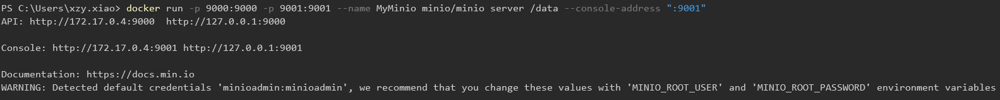
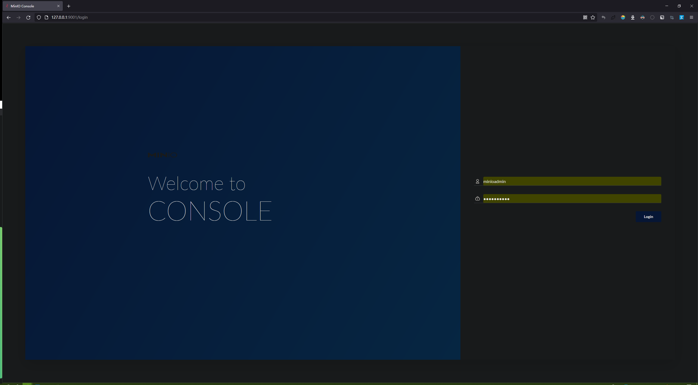
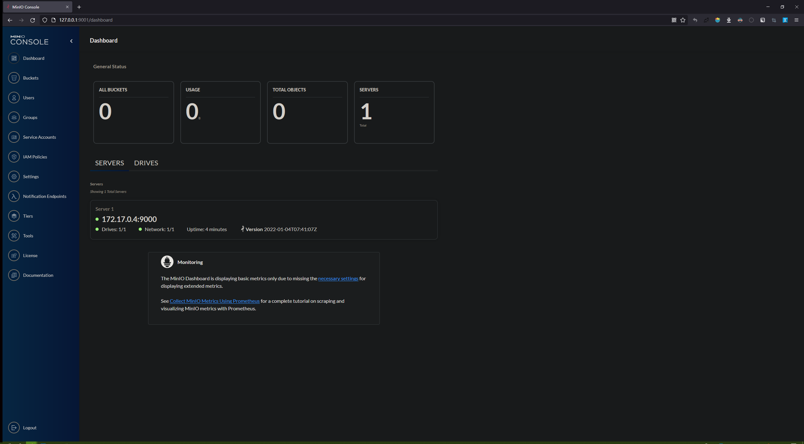
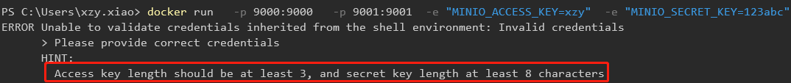
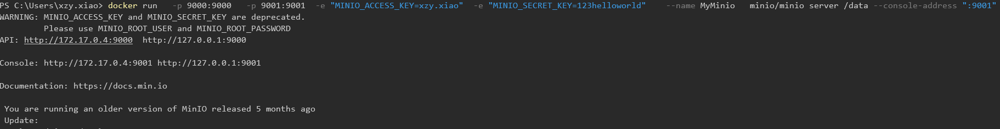
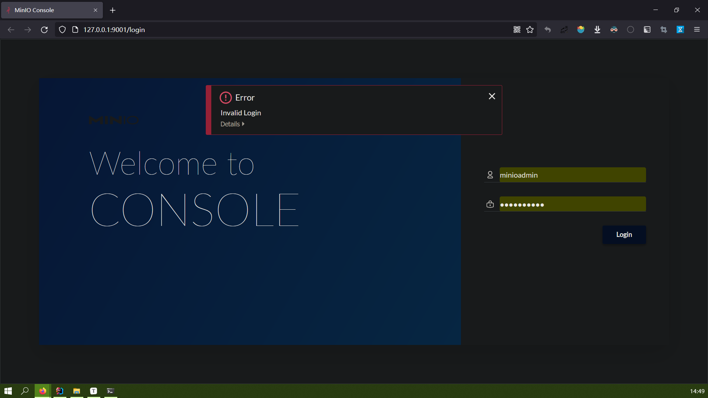
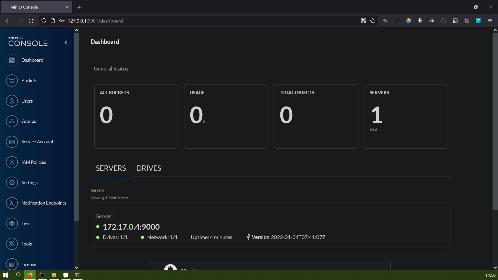

# 基于 Docker 安装 MinIO

---

## 快速启动

MinIO 需要一个持久卷来存储配置和应用数据。不过，如果只是为了快速测试，可以通过简单传递一个目录来启动 MinIO：

```
docekr run 
  -p 9000:9000 
  --name MyMinio 
  minio/minio server /data
```

## 数据持久化

在上面的例子中，MinIO 容器启动后会在**容器自己的文件系统**中创建 `/data `目录用于存储数据，但是**所有的数据会在容器退出时丢失**。要创建具有永久存储的 MinIO 容器，需要在创建容器时将本地持久目录从主机操作系统映射到虚拟配置`~/.minio` 并导出`/data`目录。 为此，请运行以下命令：

```
docekr run 
  -p 9000:9000 
  -v D:\docker\minio\data:/data
  -v D:\docker\minio\config:/root/.minio
  --name MyMinio 
  minio/minio server /data
```

## 控制面板

MinIO Server 自带一个可视化面板。默认情况下，MinIO 使用随机的端口来运行控制面板，但我们可以使用 `--console-address` 来指定IP和端口：

```
docekr run 
  -p 9000:9000 
  -p 9001:9001
  --name MyMinio 
  minio/minio server /data --console-address ":9001"
```

>   创建容器：
>
>   
>
>   在宿主机的浏览器访问 [http://127.0.0.1:9001](http://127.0.0.1:9001)：
>
>   
>
>   登录：通过启动容器时的控制台输出可以看出，默认的账号密码是 minioadmin:minioadmin（后文会说明如何修改这个密码）
>
>   

## 登录凭证

要覆盖 MinIO 自动生成的凭证，可以通过修改环境变量：（MinIO 允许将常规字符串作为 Access 和 Secret）

```
docker run 
  -p 9000:9000 
  -p 9001:9001
  -e "MINIO_ACCESS_KEY=xzy.xiao"
  -e "MINIO_SECRET_KEY=123helloworld"  
  --name MyMinio 
  minio/minio server /data --console-address ":9001"
```

>   **注意**：Access 至少要 3 个字符，Secret 至少要 8 个字符
>
>   
>
>   
>
>   启动容器并设置秘钥：
>
>   
>
>   MinIO 默认的秘钥已经失效：
>
>   
>
>   使用自定义的秘钥，成功登录：
>
>   