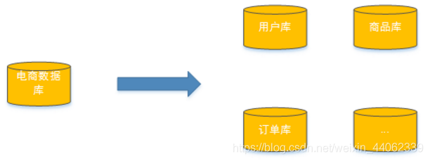
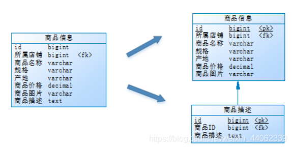

# MySQL - 分库分表

什么是分库分表？分库分表的目的是什么？

分库分表的结果是什么？分库分表会引入什么问题？这些问题该如何解决？

[toc]

随着公司业务快速发展，数据库中的数据量猛增，访问性能也开始变慢了，优化迫在眉睫。分析一下问题出现在哪儿： 关系型数据库本身比较容易成为系统瓶颈，单机存储容量、连接数、处理能力都有限。当单表的数据量达到1000W或100G以后，由于查询维度较多，即使添加从库、优化索引，做很多操作时性能仍下降严重。

方案1：提升硬件

通过提高服务器硬件性能来提高数据库数据处理能力，比如增加存储容量、CPU等。这个方案成本很高，而且如果瓶颈来自MySQL本身，那么提升效果也是有限的。

方案2：分库分表

将数据分散到不同的数据库，通过控制数据量来保证单一数据库的性能，从而保证系统整体性能。如下图：将电商数据库拆分为若干独立的数据库，并且对于大表也拆分为若干小表，通过这种数据库拆分的方法来解决数据库的性能问题。

<mark>分库分表是解决由于数据量过大而导致数据库性能降低问题的一种解决方案。将大库拆成小库，将大表拆成小表，使得单一数据库、单一数据表的数据量变小，从而提升数据库性能。</mark>

在生产中分库分表通常包括：垂直分库、水平分库、垂直分表、水平分表四种方式

## 垂直切分

### 垂直分表

通常在商品列表中是不显示商品详情信息的，如下图：

用户在浏览商品列表时，只有对某商品感兴趣时才会查看该商品的详细描述。因此，商品信息中商品描述字段访问频次较低，且该字段存储空间占用较大，访问单个数据IO时间较长；商品信息中商品名称、商品图片、商品价格等其他字段数据访问频次较高。

由于这两种数据的特性不一样，因此考虑将商品信息表拆分如下：将访问频次低的商品描述信息单独存放在一张表中，访问频次较高的商品基本信息单独放在一张表中。

垂直分表的概念：将一张大表按照字段切分为多张小表，每个表存储原大表中的部分字段。

垂直分表带来的提升：

1.  避免IO争抢，降低锁表的概率，查看商品信息与查看商品描述的用户互不影响
2.  充分发挥热门数据的操作效率，热门数据操作的高效率不会被冷门数据操作的低效率拖累

>   大字段如何拉低数据操作效率：1、由于数据量本身大，需要更长的读取时间；2、跨页——页是数据库存储单位，很多查找及定位操作都是以页为单位，单页内的数据行越多数据库整体性能越好，而大字段占用空间大，导致单页内存储行数少，由此拉低IO效率；3、数据库以行为单位将数据加载到内存中，内存空间有限，行越大，能够加载的行越少，命中率越低，查询效率越低。

一般来说，某业务实体中的各个数据项的访问频次是不一样的，部分数据项可能是占用存储空间比较大的BLOB或是TEXT。例如上例中的商品描述。所以，当表数据量很大时，可以将表按字段切开，将热门字段、冷门字段分开放置在不同库中，这些库可以放在不同的存储设备上，避免IO争抢。垂直切分带来的性能提升主要集中在热门数据的操作效率上，而且磁盘争用情况减少。

垂直分表引入的问题：

问题的解决方案：

### 垂直分库

## 水平切分

### 水平分表

### 水平分库
