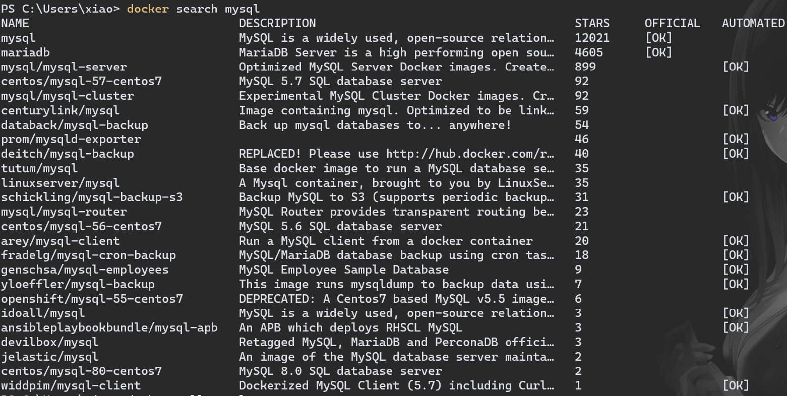
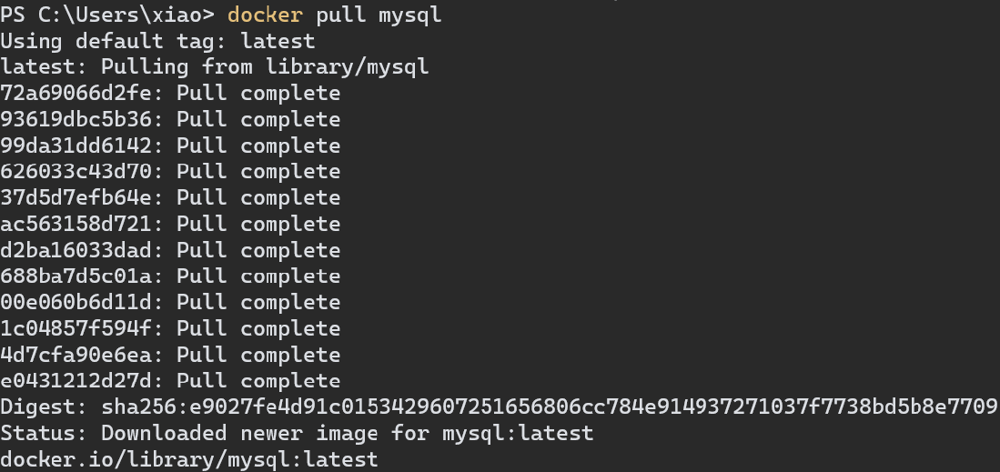
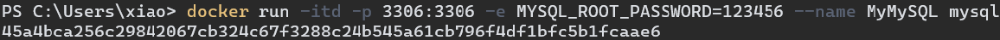
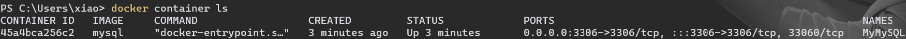
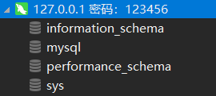

# MySQL 安装

（Win10 + Docker 环境）

1.   检索 MySQL 镜像

     

2.   拉取 MySQL 镜像

     

2.   创建并启动 MySQL 容器

     ```docker
     docker run -itd -p 3306:3306 -e MYSQL_ROOT_PASSWORD=123456 --name MyMySQL mysql
     ```

     

     -   -p 3306:3306：端口映射
     -   -e MYSQL_ROOT_PASSWORD=123456：设置 Mysql root 账号的密码

3.   查看容器是否启动成功

     

4.   查看能够连接 MySQL

     