# MySQL 自增主键一定是连续递增的吗？

[TOC]

## 一、前言

### 1.1 存储引擎与主键自增

在 MySQL 中，不同的存储引擎实现主键自增的方式是不同的，下面分别介绍 InnoDB 和 MyISAM 存储引擎的实现方式。

#### 1.1.1 InnoDB 实现主键自增的方式

在 InnoDB 存储引擎中，主键自增是通过使用自增计数器和锁机制实现的。InnoDB 存储引擎会在==内存==中缓存一个自增计数器，每次插入一行数据时，就会将自增计数器的值加一，并将这个值作为新行的主键值。在并发情况下，InnoDB 存储引擎会使用互斥锁（Mutex）来保证自增计数器的唯一性，从而避免并发插入时出现重复的主键值。

需要注意的是，数据库重启后所有在内容中的计数器和缓存都会被清空，因此 InnoDB 存储引擎需要重新准备自增计数器：从持久化存储中读取表中的最大自增值，并将其加一。

#### 1.1.2 MyISAM 实现主键自增的方式

与 InnoDB 存储引擎不同，MyISAM 存储引擎中，主键自增是通过将自增值保存在==磁盘==上实现的。每次插入一行数据时，MyISAM  存储引擎会读取磁盘上保存的自增值，并将其加一作为新行的主键值。在并发情况下，MyISAM 存储引擎会使用表级锁（Table-level  Lock）来保证自增值的唯一性，从而避免并发插入时出现重复的主键值。

需要注意的是，MyISAM 存储引擎在某些情况下可能会出现自增值重复的情况，例如在进行表维护操作时（如修复表、优化表等）或者在高并发插入数据的情况下。因此，如果需要保证主键的唯一性，建议使用 InnoDB 存储引擎。

### 1.2 自增主键不一定连续递增

在 MySQL 中，自增主键并不一定是连续递增的。自增主键无法连续递增的情况主要包括以下几种：

1.  插入失败：当插入数据时，因为某种原因（如重复键或类型不匹配），插入失败会导致自增主键的编号不连续。
2.  回滚事务：当使用事务时，如果在提交之前回滚事务，则已分配但未使用的自增主键也会被释放，从而导致自增主键编号不连续。
3.  删除数据：当删除表中的某些行时，与这些行相关的自增主键也会被删除，导致自增主键编号不连续。
4.  手动指定主键值：如果在插入数据时手动指定主键值，而不是使用自增主键生成的值，则可能导致自增主键编号不连续。
5.  批量插入数据：当使用批量插入数据的语句（如insert ... select）时，因为每次申请的自增id数量不确定，也可能导致自增主键编号不连续。

需要注意的是，自增主键编号不连续并不会影响数据的正确性和完整性，只是会影响到主键的值是否连续。如果需要保证主键的连续性，可以考虑使用其他方式生成主键，如UUID或时间戳等。

## 二、正文

详细分析导致自增主键不连续递增的各种情况。

### 2.1 特殊场景1：插入失败

准备一张测试表：

```mysql
CREATE TABLE `test_a` (
  `id` int(11) NOT NULL AUTO_INCREMENT, # 自增主键
  `aaa` int(20) DEFAULT NULL,
  `bbb` int(20) DEFAULT NULL,
  `ccc` int(20) DEFAULT NULL,
  PRIMARY KEY (`id`),
  UNIQUE KEY `idx_aaa` (`aaa`) # 唯一索引
) ENGINE=InnoDB DEFAULT CHARSET=utf8mb4;
```

查看初始的自增值：

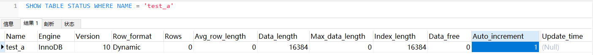

插入一条数据：（成功）

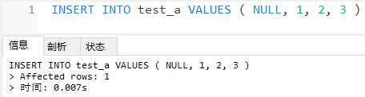

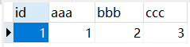


再插入一条数据：（失败）

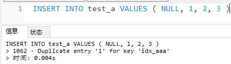

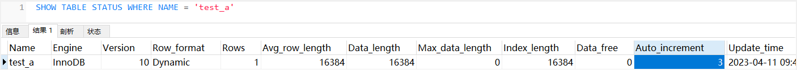

再插入一条数据：（成功）

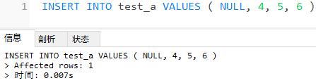

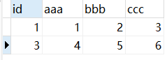

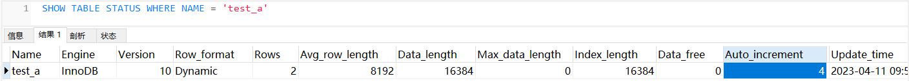

可以发现，在连续多次插入数据时，无论插入是否成功，自增值都会累加。因此，如果在插入过程中存在插入失败的情况，表中自增主键的值就不会连续递增。


### 2.2 特殊场景2：回滚事务

查看表的初始状态：

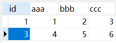

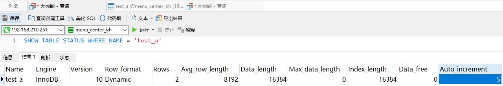

执行语句：

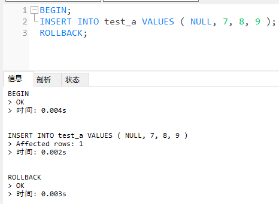

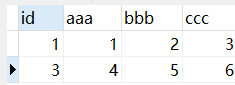

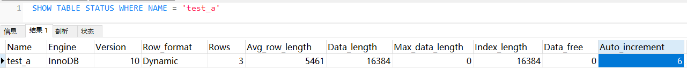

其实可以把回滚看作一种特殊的插入失败，即使没有成功插入数据，但自增值还是继续累加。


### 2.3 特殊场景3：删除数据

这个无需过多解释。


### 2.4 特殊场景4：手动指定主键值

查看表的初始状态：

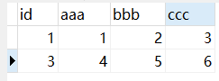

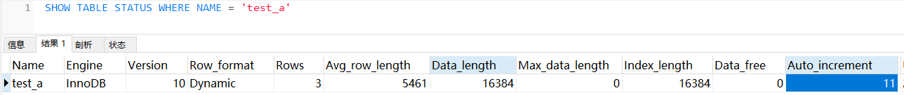

插入一条数据：（手动设置自增主键）

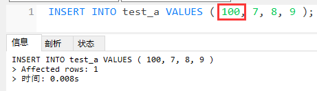

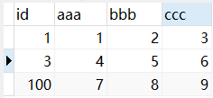


可以看到，如果手动设置的主键值大于当前的自增值，InnoDB 会调整自增值。


### 2.5 特殊场景5：批量插入数据

MySQL 中的批量插入（如 `INSERT ... SELECT` 语句）也有可能导致自增主键不连续。

具体来说，如果在批量插入数据时，源表中的自增主键值与目标表中的自增主键值存在冲突，比如源表中的自增主键值与目标表中的自增主键值相等，那么在插入到目标表中时，就会出现主键冲突的错误，这时就会跳过这条数据的插入，导致自增主键不连续。（上文提到的插入失败的情况）

此外，如果在批量插入数据时，源表中的自增主键值与目标表中的自增主键值之间存在空缺，那么在插入到目标表中时，就会导致目标表中的自增主键值不连续。（上文提到的手动设置主键值的情况）

因此，如果需要在 MySQL 中进行批量插入数据，尤其是涉及到自增主键的表，需要注意避免上述情况的发生，比如在插入数据之前可以手动调整源表中的自增主键值，或者在插入数据时使用合适的插入方式，比如 `INSERT INTO ... ON DUPLICATE KEY UPDATE` 或者 `REPLACE INTO`，以确保自增主键的连续性。
