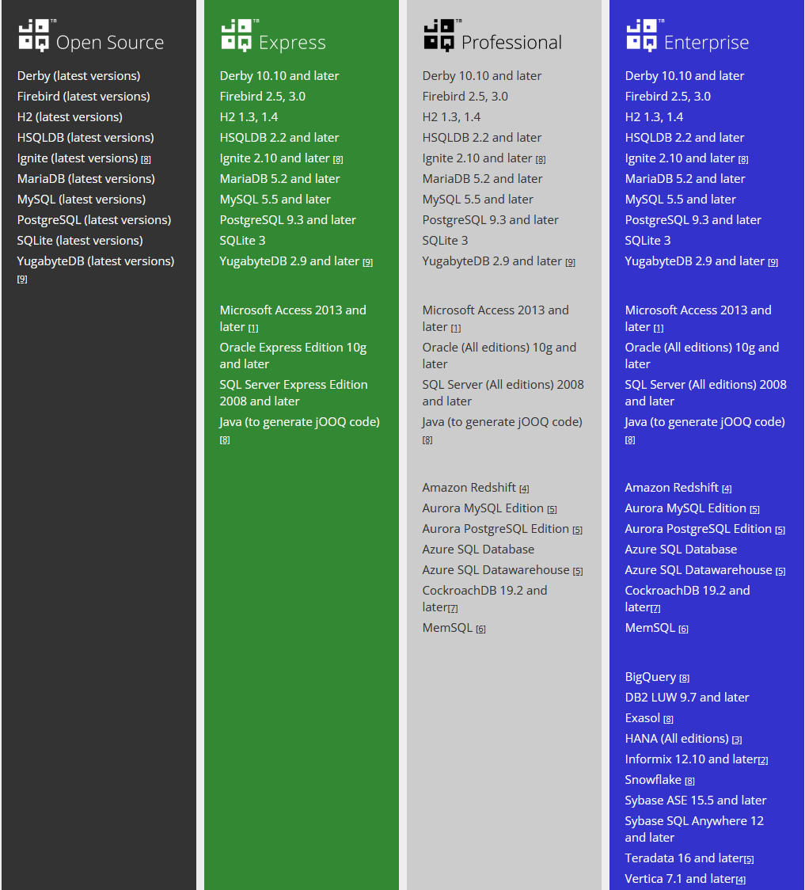

# JOOQ 简介

>    官方文档：https://jooq.diamondfsd.com/learn/section-1-how-to-start.html#jOOQ-%E7%AE%80%E4%BB%8B

JOOQ 是一个 ORM 框架，利用其生成的 Java 代码和流畅的 API，可以快速构建有类型约束的安全的 SQL 语句。

JOOQ 使我们的重心可以放在业务逻辑上，而 Java 与 SQL 的基础交互部分，都可以交给 JOOQ 去处理。JOOQ 分为社区版和商业版，二者主要的区别在于支持的数据库数量不同，开源版只支持部分开源的数据库，例如 MySQL ，但是已经能够满足大部分公司的需求。

JOOQ 的核心优势是可以将数据库表结构映射为 Java 类，包含表的基本描述和所有表字段。通过 JOOQ 提供的 API，配合生成的 Java 代码，可以很方便的进行数据库操作。

生成的 Java 代码字段类型是根据数据库映射成的 Java 类型，在进行设置和查询操作时，因为是 Java 代码，都会有强类型校验，所以对于数据的输入是天然安全的，极大的减少了 SQL 注入的风险

JOOQ 的代码生成策略是根据配置全量生成，任何对于数据库的改动，如果会影响到业务代码，在编译期间就会被发现，可以及时进行修复。