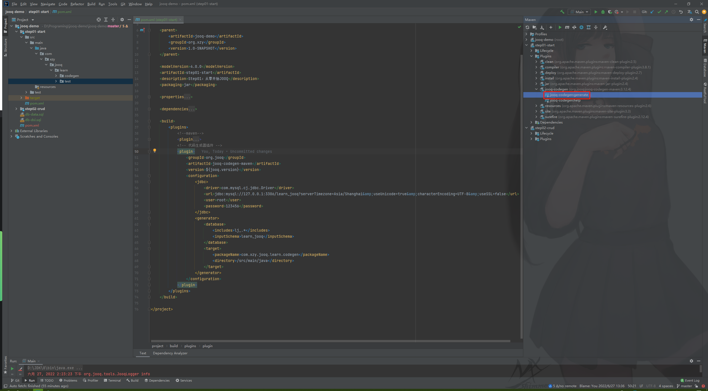
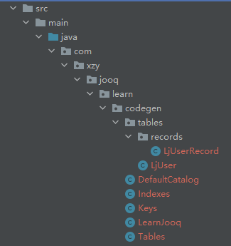

# JOOQ 入门操作

>   官方文档：https://jooq.diamondfsd.com/learn/section-1-how-to-start.html#jOOQ-%E7%AE%80%E4%BB%8B


## 实践


使用 JOOQ 时，一般的开发流程：

1.   创建/更新数据表
2.   配置 JOOQ 插件，通过插件生成 Java 代码
3.   利用生成的代码实现业务逻辑


### 1、测试数据库

```mysql
CREATE TABLE learn_jooq.lj_user
(
    id          int auto_increment NOT NULL,
    real_name   varchar(100)       NULL,
    username    varchar(100)       NULL,
    password    varchar(100)       NULL,
    create_time datetime           NULL,
    update_time datetime           NULL,
    create_by   int                NULL,
    update_by   int                NULL,
    is_deleted  tinyint            NULL,
    CONSTRAINT lj_user_PK PRIMARY KEY (id)
)
    ENGINE = InnoDB
    DEFAULT CHARSET = utf8mb4
    COLLATE = utf8mb4_0900_ai_ci;
```

```sql
INSERT INTO lj_user(id, real_name, username, password, create_time, update_time, create_by, update_by, is_deleted)
VALUES (1, '张三', 'zhangsan', '123abc,', NULL, NULL, 0, 0, 0),
       (2, '李四', 'lisi', '123abc,', NULL, NULL, 0, 0, 0),
       (3, '王五', 'wangwu', '123abc,', NULL, NULL, 0, 0, 0);
```

### 2、Maven 配置

```xml
<?xml version="1.0" encoding="UTF-8"?>
<project xmlns = "http://maven.apache.org/POM/4.0.0"
         xmlns:xsi = "http://www.w3.org/2001/XMLSchema-instance"
         xsi:schemaLocation = "http://maven.apache.org/POM/4.0.0 http://maven.apache.org/xsd/maven-4.0.0.xsd">
    
    <parent>
        <artifactId>jooq-demo</artifactId>
        <groupId>org.xzy</groupId>
        <version>1.0-SNAPSHOT</version>
    </parent>
    
    <modelVersion>4.0.0</modelVersion>
    <artifactId>step01-start</artifactId>
    <description>Step01：从零开始JOOQ</description>
    <packaging>jar</packaging>
    
    <properties>
        <jooq.version>3.12.4</jooq.version>
    </properties>
    
    <dependencies>
        <!--数据库驱动-->
        <dependency>
            <groupId>mysql</groupId>
            <artifactId>mysql-connector-java</artifactId>
            <version>8.0.18</version>
        </dependency>
        <!--JOOQ-->
        <dependency>
            <groupId>org.jooq</groupId>
            <artifactId>jooq</artifactId>
            <version>${jooq.version}</version>
        </dependency>
    </dependencies>
    
    <build>
        <plugins>
            <!--maven-->
            <plugin>
                <groupId>org.apache.maven.plugins</groupId>
                <artifactId>maven-compiler-plugin</artifactId>
                <version>3.8.1</version>
                <configuration>
                    <source>1.8</source>
                    <target>1.8</target>
                    <encoding>UTF-8</encoding>
                </configuration>
            </plugin>
            <!-- 代码生成器插件 -->
            <plugin>
                <groupId>org.jooq</groupId>
                <artifactId>jooq-codegen-maven</artifactId>
                <version>${jooq.version}</version>
                <configuration>
                    <jdbc>
                        <driver>com.mysql.cj.jdbc.Driver</driver>
                        <url>jdbc:mysql://127.0.0.1:3306/learn_jooq?serverTimezone=Asia/Shanghai&amp;useUnicode=true&amp;characterEncoding=UTF-8&amp;useSSL=false</url>
                        <user>root</user>
                        <password>123456</password>
                    </jdbc>
                    <generator>
                        <database>
                            <includes>lj_.*</includes>
                            <inputSchema>learn_jooq</inputSchema>
                        </database>
                        <target>
                            <packageName>com.xzy.jooq.learn.codegen</packageName>
                            <directory>/src/main/java</directory>
                        </target>
                    </generator>
                </configuration>
            </plugin>
        </plugins>
    </build>
    
</project>
```


### 3、代码生成

代码生成的原理就是通过读取数据库的元数据，将其转换为 Java 代码，并将生成的文件存储到配置的位置。建议配置专门的位置来存储 JOOQ 生成的文件，因为 JOOQ 每次生成代码都是全量的，如果和其他业务代码混合在一起，会被生成器误删。


A）通过命令调用 jooq-codegen-maven 插件进行代码生成：

```shell
mvn jooq-codegen:generate
```

B）通过 IDEA 调用 jooq-codegen-maven 插件进行代码生成：




根据配置代码生成器执行完成后，会生成以下目录及文件：



-   codegen：配置插件时指定的存储生成文件的路径
    -   tables：
        -   **LjUser.java**：lj_user 表对应的表述对象，包含：主键、字段、索引、所属 Schema
        -   records：
            -   **LjUserRecord.java**：lj_user 表对应的操作对象，包含：Setter、Getter
    -   **DefaultCatalog.java**：Catalog 对象，记录了各个 Catalog 包含的 Schema 信息
    -   **Indexes.java**：记录了各个 Schema 包含的索引信息
    -   **Keys.java**：记录了各个表的主键、外键的约束信息
    -   **LearnJooq.java**：记录了 learn_jooq 数据库的信息，例如包含哪些表
    -   **Tables.java**：常量类，记录了数据库中有哪些表


### 4、业务逻辑

```java
package com.xzy.jooq.learn.test;

import com.xzy.jooq.learn.codegen.tables.records.LjUserRecord;
import org.jooq.DSLContext;
import org.jooq.Record;
import org.jooq.Result;
import org.jooq.SQLDialect;
import org.jooq.impl.DSL;

import java.sql.Connection;
import java.sql.DriverManager;
import java.sql.SQLException;
import java.util.List;

import static com.xzy.jooq.learn.codegen.tables.LjUser.LJ_USER;

/**
 * 基础查询操作
 *
 * @author xzy.xiao
 * @date 2022/6/27  13:40
 */
public class Main {

    private static final String JDBC_URL = "jdbc:mysql://127.0.0.1:3306/learn_jooq?serverTimezone=Asia/Shanghai&useUnicode=true&characterEncoding=UTF-8&useSSL=false";
    private static final String JDBC_USERNAME = "root";
    private static final String JDBC_PASSWORD = "123456";

    public static void main(String[] args) {

        // 1.获取数据库连接
        try (Connection connection = DriverManager.getConnection(JDBC_URL, JDBC_USERNAME, JDBC_PASSWORD)) {

            // 2.获取 JOOQ 执行器
            DSLContext dslContext = DSL.using(connection, SQLDialect.MYSQL);

            // 3.查询数据
            Result<Record> rawRecords = dslContext.select().from(LJ_USER).fetch();

            // <A> Result 实现了 List 接口
            rawRecords.forEach(
                    rawRecord -> {
                        Integer id = rawRecord.getValue(LJ_USER.ID);
                        String realName = rawRecord.getValue(LJ_USER.REAL_NAME);
                        System.out.printf("id：%d realName：%s\n", id, realName);
                    }
            );

            // <B> 可以通过 Record.into 方法将默认的 Record 对象转换为指定表的 Record 对象
            rawRecords.forEach(
                    rawRecord -> {
                        LjUserRecord user = rawRecord.into(LJ_USER);
                        Integer id = user.getId();
                        String realName = user.getRealName();
                        System.out.printf("id：%d realName：%s\n", id, realName);
                    }
            );

            // <C> 也可以通过 Result.into 方法将默认的 Record 对象转换为指定表的 Record 对象
            Result<LjUserRecord> userRecords = rawRecords.into(LJ_USER);
            userRecords.forEach(user -> {
                Integer id = user.getId();
                String realName = user.getRealName();
                System.out.printf("id：%d realName：%s\n", id, realName);
            });

            // <D> 可以使用 fetchInto 方法直接指定 Record 类型
            Result<LjUserRecord> userRecords2 = dslContext.select().from(LJ_USER).fetchInto(LJ_USER);
            List<LjUserRecord> userRecordList = dslContext.select().from(LJ_USER).fetchInto(LjUserRecord.class);
            System.out.println(userRecords2);
            System.out.println(userRecordList);

        } catch (SQLException e) {
            e.printStackTrace();
        }

    }
}
```


## 总结

-   `org.jooq.Result`

    此接口实现了 List 接口，可以当做一个集合来操作，是一个数据库查询结果集的包装类，除了集合的相关方法，该接口还提供了一些结果集转换，格式化，提取字段等方法。通常我们查询出来的结果都是此接口的实现类，掌握好此接口是 JOOQ 的基础，基本所有的 SQL 查询操作，都会碰到这个接口。


-   `org.jooq.Record`

    此接口主要用于定义数据库表记录，储存的内容是一条表记录的字段和值，每个值会储存对应字段的类型，可以通过通用的 `getValue(Field field)` 取到对应字段的值。

    代码生成器时会基于此接口，为所有数据库表创建对应的实现类 `XxxRecord`。该实现类会为数据库表的所有字段创建对应的 `getXxx()`、`setXxx()`方法，相较于 Record 接口中定义的通用方法，代码的可读性提升了不少。


-   `org.jooq.DSLContext`

    JOOQ 的核心接口之一，可以理解为一个 SQL 执行器，通过静态方法 `DSL.using`，可以获取一个 `DSLContext` 实例，此实例抽象了所有对于 SQL 的操作 API，可以通过其提供的 API 方便的进行 SQL 操作

